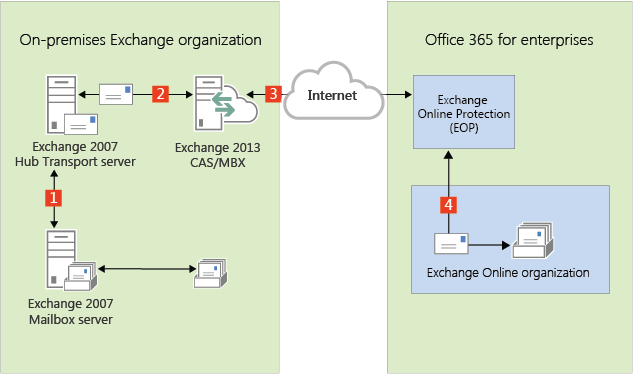
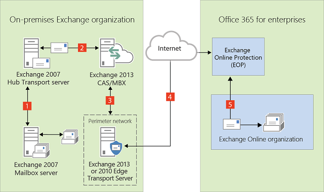

# Edge Transport servers in Exchange 2013/Exchange 2007 hybrid deployments

Edge Transport servers in Microsoft Exchange are deployed in an organization's on-premises perimeter network. They're non-domain-joined computers that handle Internet-facing mail flow and act as an SMTP relay and smart host for Exchange servers in your internal network.
  
Exchange 2013 organizations that want to use Edge Transport servers have the option of deploying either Exchange Server 2013 Edge Transport servers or Exchange 2010 Edge Transport servers running Service Pack 3 (SP3) for Exchange 2010. Use Edge Transport servers if you don't want to expose internal Exchange 2013 Client Access or Mailbox servers directly to the Internet.
  
Learn more about the Exchange 2013 Edge Transport server role at [Overview of the Edge Transport Server Role](http://technet.microsoft.com/library/cfff9f59-afac-447c-8297-afcebe49a52d.aspx).
  
Learn more about the Exchange 2010 Edge Transport server role at [Overview of the Edge Transport Server Role](https://go.microsoft.com/fwlink/p/?linkid=183473).
  
## Edge Transport servers in Exchange 2013-based hybrid deployment organizations

Messages routed between on-premises and Exchange Online organizations in a hybrid deployment require that Microsoft Exchange Online Protection (EOP) service, on behalf of Exchange Online, connects directly to Edge Transport servers that run Exchange 2013 or Exchange 2010 SP3.
  
> [!IMPORTANT]
> If you have other Exchange 2010 Edge Transport servers in other locations that won't handle hybrid transport, they don't need to be upgraded to Exchange 2010 SP3. However, if in the future you want EOP to connect to additional Edge Transport servers for hybrid transport, they must be upgraded with Exchange 2010 SP3 or upgraded to Exchange 2013 Edge Transport servers. 
  
## Adding an Edge Transport server to a hybrid deployment

Deploying an Edge Transport server in your on-premises organization when you configure a hybrid deployment is optional. When configuring your hybrid deployment, the Hybrid Configuration wizard allows you to either select one or more Client Access and Mailbox servers for hybrid mail transport, or to select one or more on-premises Edge Transport servers handle hybrid mail transport with the Exchange Online organization. 
  
When you add an Edge Transport server to your hybrid deployment, it communicates with EOP on behalf of the internal Exchange 2013 Client Access and Mailbox servers. The Edge Transport server acts as a relay between the on-premises Mailbox server and EOP for outbound messaging from the on-premises organization to Exchange Online. The Edge Transport server also acts as a relay between the on-premises Client Access server for inbound messaging from the Exchange Online organization to the on-premises organization. All connection security previously handled by the Client Access server is handled by the Edge Transport server. Recipient lookup, compliance policies, and other message inspection, continue to be done on the Client Access server.
  
### Mail flow without an Edge Transport server

The following process and diagram describes the path messages take between an on-premises organization and Exchange Online when there isn't an Edge Transport server deployed:
  
1. Outbound messages from the on-premises organization to recipients in the Exchange Online organization are sent from a mailbox on an Exchange 2007 Mailbox server to an Exchange 2007 Hub Transport server. 
    
2. The Exchange 2007 Hub Transport server sends the message to the Exchange 2013 Mailbox server.
    
3. The Exchange 2013 Mailbox server sends the message directly to the Exchange Online EOP company.
    
4. EOP delivers the message to the Exchange Online organization. In this example, the Client Access and Mailbox server roles are installed on the same Exchange 2013 server.
    
Messages sent from the Exchange Online organization to recipients in the on-premises organization follow the reverse route.
  
 **Mail flow in a hybrid deployment without an Edge Transport server deployed**
  

  
### Mail flow with an Edge Transport server

The following process describes the path messages take between an on-premises organization and Exchange Online when there is an Edge Transport server deployed. Messages from the on-premises organization to recipients in the Exchange Online organization are sent from the Exchange 2007 Mailbox server:
  
1. Outbound messages from the on-premises organization to recipients in the Exchange Online organization are sent from a mailbox on an Exchange 2007 Mailbox server to an Exchange 2007 Hub Transport server. 
    
2. The Exchange 2007 Hub Transport server sends the message to the Exchange 2013 Mailbox server.
    
3. The Exchange 2013 Mailbox server sends the message to an Exchange 2013 or Exchange 2010 SP3 Edge Transport server.
    
4. The Edge Transport server sends the message to the Exchange Online EOP company.
    
5. EOP delivers the message to the Exchange Online organization. In this example, the Client Access and Mailbox server roles are installed on the same Exchange 2013 server.
    
Messages sent from the Exchange Online organization to recipients in the on-premises organization follow the reverse route.
  
 **Mail flow in a hybrid deployment with an Exchange 2013 or 2010 SP3 Edge Transport server deployed**
  

  

