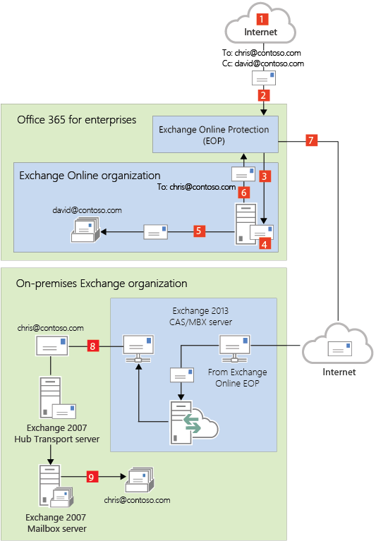
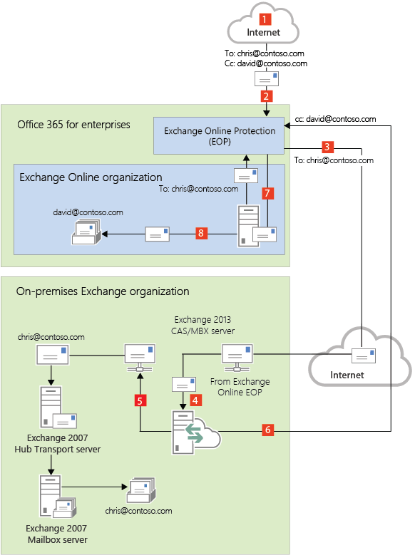
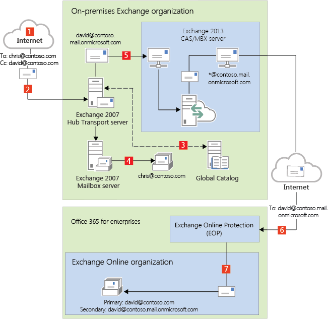
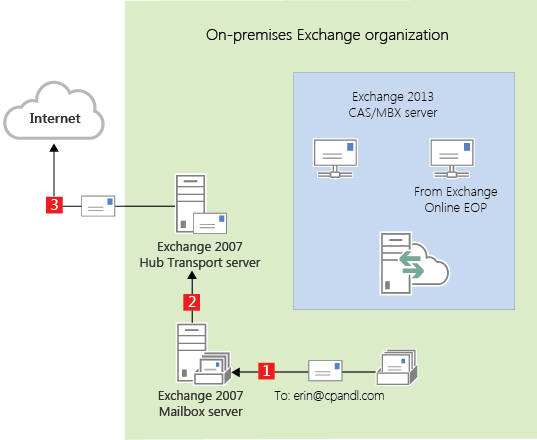
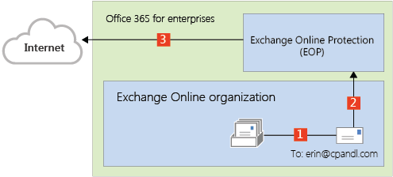
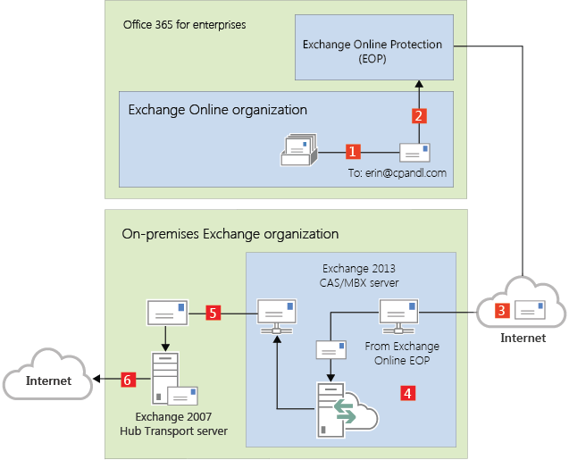

# Transport routing in Exchange 2013/Exchange 2007 hybrid deployments

This topic discusses your routing options for inbound messages from the Internet and outbound messages to the Internet.
  
> [!IMPORTANT]
> Don't place any servers, services, or devices between your on-premises Exchange servers and Office 365 that process or modify SMTP traffic. Secure mail flow between your on-premises Exchange organization and Office 365 depends on information contained in messages sent between the organization. Firewalls that allow SMTP traffic on TCP port 25 through without modification are supported. If a server, service, or device processes a message sent between your on-premises Exchange organization and Office 365, this information is removed. If this happens, the message will no longer be considered internal to your organization and will be subject to anti-spam filtering, transport and journal rules, and other policies that may not apply to it. 
  
> [!NOTE]
> The examples in this topic don't include the addition of Edge Transport servers into the hybrid deployment. The routes messages take between the on-premises organization, the Exchange Online organization, and the Internet don't change with the addition of an Edge Transport server. The routing only changes within the on-premises organization. For more information about adding Edge Transport servers to a hybrid deployment, see [Edge Transport servers in Exchange 2013/Exchange 2007 hybrid deployments](edge-transport-serverrs.md). 
  
## Inbound messages from the Internet

As part of planning and configuring your hybrid deployment, you need to decide whether you want all messages from Internet senders to be routed through Exchange Online or your on-premises organization. All messages from Internet senders will initially be delivered to the organization you select and then routed according to where the recipient's mailbox is located. Whether you choose to have messages routed through Exchange Online or your on-premises organization depends on various factors, including whether you want to apply compliance policies to all messages sent to both organizations, how many mailboxes are in each organization, and so on. 
  
The path messages sent to recipients in your on-premises and Exchange Online organizations take depends on how you decide to configure your MX record in your hybrid deployment. The preferred method is to configure your MX record to point to Exchange Online Protection (EOP) in Office 365 as this configuration provides the most accurate spam filtering. The Hybrid Configuration wizard doesn't configure the routing for inbound Internet messages for either the on-premises or Exchange Online organizations. You must manually configure your MX record if you want to change how your inbound Internet mail is delivered. 
  
- **If you change your MX record to point to the Exchange Online Protection service in Office 365:** This is the recommended configuration for hybrid deployments. All messages sent to any recipient in either organization will be routed through the Exchange Online organization first. A message addressed to a recipient that's located in your on-premises organization will be routed first through your Exchange Online organization and then delivered to the recipient in your on-premises organization. This route is recommended if you have more recipients in your Exchange Online organization than in your on-premises organization and if you would like messages filtered by EOP. This configuration option is required for Exchange Online Protection to provide scanning and blocking for spam. 
    
- **If you decide to keep your MX record pointed to your on-premises organization: ** All messages sent to any recipient in either organization will be routed through your on-premises organization first. A message addressed to a recipient that's located in Exchange Online will be routed first through your on-premises organization and then delivered to the recipient in Exchange Online. This route can be helpful for organizations where you have compliance policies that require messages sent to and from an organization be examined by a journaling solution. If you pick this option, Exchange Online Protection will not be able to effectively scan for spam messages. 
    
For more information, see [Mail flow best practices for Exchange Online and Office 365 (Overview)](http://technet.microsoft.com/library/0e6cd9d5-ad3e-418a-8ea9-3bf33332c491.aspx).
  
Read the section below that matches how you plan to route messages sent from Internet recipients to your on-premises and Exchange Online recipients.
  
### Route incoming Internet messages through the Exchange Online organization

The following steps and diagrams illustrate the inbound message path that occur in your hybrid deployment if you decide to point your MX record to the EOP service in the Office 365 organization. The message path differs depending on whether you choose to enable centralized mail transport.
  
> [!IMPORTANT]
> You may need to purchase EOP licenses for each on-premises mailbox that receives messages that are first delivered to EOP and then routed through the Exchange Online organization. Contact your Microsoft reseller for more information. 
  
When centralized mail transport is disabled (default configuration), incoming Internet messages are routed as follows in a hybrid deployment: 
  
1. An inbound message is sent from an Internet sender to the recipients chris@contoso.com and david@contoso.com. Chris's mailbox is located on an Exchange 2007 Mailbox server in the on-premises organization. David's mailbox is located in Exchange Online. 
    
2. Because the recipients both have contoso.com email addresses, and the MX record for contoso.com points to EOP, the message is delivered to EOP.
    
3. EOP routes the messages for both recipients to Exchange Online.
    
4. Exchange Online scans the messages for viruses and performs a lookup for each recipient. Through the lookup, it determines that Chris's mailbox is located in the on-premises organization while David's mailbox is located in the Exchange Online organization. 
    
5. Exchange Online splits the message into two copies. One copy of the message is delivered to David's mailbox.
    
6. The second copy is sent from Exchange Online back to EOP.
    
7. EOP sends the message to the Exchange 2013 Client Access servers in the on-premises organization.
    
8. The Exchange 2013 Client Access server sends the message through the routing group connector that's configured between the Exchange 2013 server and the Exchange 2007 server to the Exchange 2007 Mailbox server. In this example, the Client Access and Mailbox server roles are installed on the same Exchange 2013 server.
    
 **Route mail through the Exchange Online organization for both on-premises and Exchange Online organizations with centralized mail transport disabled (default configuration)**
  

  
When centralized mail transport is enabled, incoming Internet messages are routed as follows in a hybrid deployment:
  
1. An inbound message is sent from an Internet sender to the recipients chris@contoso.com and david@contoso.com. Chris's mailbox is located on an Exchange 2007 Mailbox server in the on-premises organization. David's mailbox is located in Exchange Online. 
    
2. Because the recipients both have contoso.com email addresses, and the MX record for contoso.com points to EOP, the message is delivered to EOP and scanned for viruses.
    
3. Since centralized mail transport is enabled, EOP routes the messages for both recipients to the on-premises Exchange 2013 Client Access server.
    
4. The Exchange 2013 server performs a lookup for each recipient. Through the lookup, it determines that Chris's mailbox is located in the on-premises organization while David's mailbox is located in the Exchange Online organization. 
    
5. The Exchange 2013 server splits the message into two copies. One copy of the message is delivered to Chris's mailbox in the on-premises Exchange 2007 Mailbox server.
    
6. The second copy is sent from the Exchange 2013 server back to EOP.
    
7. EOP sends the message to Exchange Online.
    
8. Exchange delivers the message to David's mailbox. In this example, the Client Access and Mailbox server roles are installed on the same Exchange 2013 server.
    
 **Route mail through the Exchange Online organization for both on-premises and Exchange Online organizations with centralized mail transport enabled**
  

  
### Route incoming Internet messages through your on-premises organization

The following steps and diagram illustrate the inbound Internet message path that will occur in your hybrid deployment if you decide to keep your MX record pointed to your on-premises organization.
  
1. An inbound message is sent from an Internet sender to the recipients chris@contoso.com and david@contoso.com. Chris's mailbox is located on an Exchange 2007 Mailbox server in the on-premises organization. David's mailbox is located in Exchange Online. 
    
2. Because the recipients both have contoso.com email addresses, and the MX record for contoso.com points to the on-premises organization, the message is delivered to an Exchange 2007 Hub Transport server.
    
3. The Exchange 2007 Mailbox server performs a lookup for each recipient using an on-premises global catalog server. Through the global catalog lookup, it determines that Chris's mailbox is located on the Exchange 2007 Mailbox server while David's mailbox is located in the Exchange Online organization and has a hybrid routing address of david@contoso.mail.onmicrosoft.com. 
    
4. The Exchange 2007 Mailbox server splits the message into two copies. One copy of the message is delivered to Chris's mailbox. 
    
5. The second copy of the message is sent through the routing group connector that's configured between the Exchange 2013 server and the Exchange 2007 server.
    
6. The Exchange 2013 Mailbox server sends the message to EOP using a Send connector configured to use TLS. EOP receives messages sent to the Exchange Online organization.
    
7. EOP sends the message to the Exchange Online organization where the message is scanned for viruses and content-based spam and then delivered to David's mailbox. In this example, the Client Access and Mailbox server roles are installed on the same Exchange 2013 server.
    
 **Route mail through the on-premises organization for both on-premises and Exchange Online organizations**
  

  
## Outbound messages to the Internet

In addition to choosing how inbound messages addressed to recipients to your organizations are routed, you can also choose how outbound messages sent from Exchange Online recipients are routed. When you run the Hybrid Configuration wizard, you can select one of two options:
  
- **Don't enable centralized mail transport** Selected by default in the Hybrid Configuration wizard, this option routes outbound messages sent from the Exchange Online organization directly to the Internet. Use this option if you don't need to apply any on-premises compliance policies or other processing rules to messages that are sent from recipients in the Exchange Online organization. 
    
- **Enable centralized mail transport** Selecting this option routes outbound messages sent from the Exchange Online organization through your on-premises organization. Except for messages sent to other recipients in the same Exchange Online organization, all outbound messages sent from recipients in the Exchange Online organization are sent through the on-premises organization. This enables you to apply compliance rules to these messages and any other processes or requirements that must be applied to all of your recipients, regardless of whether they're located in the Exchange Online organization or the on-premises organization. 
    
    > [!NOTE]
    > Centralized mail transport is only recommended for organizations with specific compliance-related transport needs. Our recommendation for typical Exchange organizations is not to enable centralized mail transport. 
  
Messages sent from on-premises recipients are always sent to directly to Internet recipients using DNS regardless of which of the above choices you select in the Hybrid Configuration wizard.
  
The following steps and diagram illustrate the outbound message path for messages sent from on-premises recipients.
  
1. Chris, who has a mailbox on the on-premises Exchange 2007 Mailbox server, sends a message to an external Internet recipient, erin@cpandl.com. 
    
2. The Exchange 2007 Mailbox server sends the message to the Exchange 2007 Hub Transport server.
    
3. The Exchange 2007 Hub Transport server looks up the MX record for cpandl.com and sends the message to thecpandl.com mail servers located on the Internet.
    
 **Messages from on-premises senders to Internet recipients**
  

  
Read the section below that matches how you plan to route messages sent from recipients in the Exchange Online organization to Internet recipients.
  
### Deliver Internet-bound messages from Exchange Online using DNS (Centralized mail transport disabled)

The following steps and diagram illustrate the outbound message path for messages sent from Exchange Online recipients to an Internet recipient that occur when **Enable centralized mail transport** is not selected in the Hybrid Configuration wizard, which is the default configuration. 
  
1. David, who has a mailbox in the Exchange Online organization, sends a message to an external Internet recipient, erin@cpandl.com.
    
2. Exchange Online scans the message for viruses and sends the message to the Exchange Online EOP service.
    
3. EOP looks up the MX record for cpandl.com and sends the message to the cpandl.com mail servers located on the Internet.
    
 **Mail from Exchange Online senders routed directly to the Internet with centralized mail transport disabled (default configuration)**
  

  
### Route Internet-bound messages from Exchange Online through your on-premises organization (Centralized mail transport enabled)

The following steps and diagram illustrate the outbound message path for messages sent from Exchange Online recipients to an Internet recipient that occur when you select **Enable centralized mail transport** in the Hybrid Configuration wizard. 
  
1. David, who has a mailbox in the Exchange Online organization, sends a message to an external Internet recipient, erin@cpandl.com.
    
2. Exchange Online scans the message for viruses and sends the message to EOP.
    
3. EOP is configured to send all Internet-bound messages to an on-premises server, so the message is routed to an Exchange 2013 Client Access server. The message is sent using TLS.
    
4. An Exchange 2013 Client Access server performs compliance, anti-virus, and any other processes configured by the administrator on David's message. 
    
5. The Exchange 2013 Client Access server forwards the message to the Exchange 2007 Hub Transport server. In this example, the Client Access and Mailbox server roles are installed on the same Exchange 2013 server.
    
6. The Exchange 2007 Hub Transport server looks up the MX record for cpandl.com and sends the message to the cpandl.com mail servers located on the Internet.
    
 **Mail from Exchange Online senders routed through on-premises organization with centralized mail transport enabled**
  

  

