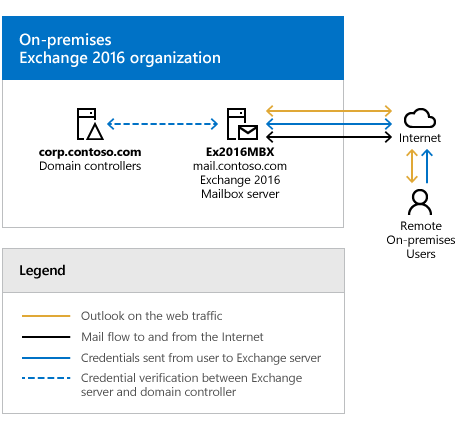

# Exchange Server Hybrid Deployments

 **Summary**: What you need to know to plan an Exchange hybrid deployment.
  
A hybrid deployment offers organizations the ability to extend the feature-rich experience and administrative control they have with their existing on-premises Microsoft Exchange organization to the cloud. A hybrid deployment provides the seamless look and feel of a single Exchange organization between an on-premises Exchange organization and Exchange Online in Microsoft Office 365. In addition, a hybrid deployment can serve as an intermediate step to moving completely to an Exchange Online organization. 
  
## Exchange hybrid deployment features

A hybrid deployment enables the following features:
  
- Secure mail routing between on-premises and Exchange Online organizations.
    
- Mail routing with a shared domain namespace. For example, both on-premises and Exchange Online organizations use the @contoso.com SMTP domain.
    
- A unified global address list (GAL), also called a "shared address book."
    
- Free/busy and calendar sharing between on-premises and Exchange Online organizations.
    
- Centralized control of inbound and outbound mail flow. You can configure all inbound and outbound Exchange Online messages to be routed through the on-premises Exchange organization.
    
- A single Outlook on the web URL for both the on-premises and Exchange Online organizations.
    
- The ability to move existing on-premises mailboxes to the Exchange Online organization. Exchange Online mailboxes can also be moved back to the on-premises organization if needed.
    
- Centralized mailbox management using the on-premises Exchange admin center (EAC).
    
- Message tracking, MailTips, and multi-mailbox search between on-premises and Exchange Online organizations.
    
- Cloud-based message archiving for on-premises Exchange mailboxes. Exchange Online Archiving can be used with a hybrid deployment. Learn more about Exchange Online Archiving at [Archive Features in Exchange Online Archiving](https://technet.microsoft.com/library/archive-features-in-exchange-online-archiving.aspx).
    
## Exchange hybrid deployment considerations

You should consider the following before you implement an Exchange hybrid deployment:
  
- **Hybrid deployment requirements** Before you configure a hybrid deployment, you need to make sure your on-premises organization meets all of the prerequisites required for a successful deployment. For more information, see [Hybrid deployment prerequisites](hybrid-deployment-prerequisites.md).
    
- **Exchange ActiveSync clients** When you move a mailbox from your on-premises Exchange organization to Exchange Online, all of the clients that access the mailbox need to be updated to use Exchange Online; this includes Exchange ActiveSync devices. Most Exchange ActiveSync clients will now be automatically reconfigured when the mailbox is moved to Exchange Online, however some older devices might not update correctly. For more information, see [Exchange ActiveSync device settings with Exchange hybrid deployments](activesync-settings.md).
    
- **Mailbox permissions migration** On-premises mailbox permissions such as Send As, Full Access, Send on Behalf of, and folder permissions, that are explicitly applied on the mailbox are migrated to Exchange Online. Inherited (non-explicit) mailbox permissions and permissions granted to objects that aren't mail enabled in Exchange Online are not migrated. You should ensure all permissions are explicitly granted and all objects are mail enabled prior to migration. Therefore, you have to plan for configuring these permissions in Office 365 if applicable for your organization. In the case of Send As permissions, if the user and the resource attempting to be sent as aren't moved at the same time, you'll need to explicitly add the Send As permission in Exchange Online using the **Add-RecipientPermission** cmdlet. 
    
- **Support for cross-premises mailbox permissions** Exchange hybrid deployments support the use of the Full Access and Send on Behalf Of permissions between mailboxes located in an on-premises Exchange organization and mailboxes located in Office 365. Additional steps are required for Send As permissions. Also, some additional configuration may be required to support cross-premises mailbox permissions depending on the version of Exchange installed in your on-premises organization. For more information, see [Delegate mailbox permissions](permissions.md#DelegatedMbxPerms) in [Permissions in Exchange hybrid deployments](permissions.md) and [Configure Exchange to support delegated mailbox permissions in a hybrid deployment](hybrid-deployment/set-up-delegated-mailbox-permissions.md).
    
    > [!NOTE]
    > As of February 2018 the feature to support Full Access, Send on Behalf and folder rights cross forest is being rolled out and expected to be complete by April 2018. 
  
- **Offboarding** As part of ongoing recipient management, you might have to move Exchange Online mailboxes back to your on-premises environment. 
    
    For more information about how to move mailboxes in an Exchange 2010-based hybrid deployment, see [Move an Exchange Online mailbox to the on-premises organization](http://technet.microsoft.com/library/5ef062b5-92fe-40c2-a020-e956e1d14645.aspx).
    
    For more information about how to move mailboxes in hybrid deployments based on Exchange 2013 or newer, see [Move mailboxes between on-premises and Exchange Online organizations in hybrid deployments](hybrid-deployment/move-mailboxes.md).
    
- **Mailbox forwarding settings** Mailboxes can be set up to automatically forward mail sent to them to another mailbox. While mailbox forwarding is supported in Exchange Online, the forwarding configuration isn't copied to Exchange Online when the mailbox is migrated there. Before you migrate a mailbox to Exchange Online, make sure you export the forwarding configuration for each mailbox. The forwarding configuration is stored in the  `DeliverToMailboxAndForward`,  `ForwardingAddress`, and  `ForwardingSmtpAddress` properties on each mailbox. 
    
## Exchange hybrid deployment components

A hybrid deployment involves several different services and components:
  
- **Exchange servers** At least one Exchange server needs to be configured in your on-premises organization if you want to configure a hybrid deployment. If you're running Exchange 2013 or older, you need to install at least one server running the Mailbox and Client Access roles. If you're running Exchange 2016 or newer, at least one server running the Mailbox role needs to be installed. If needed, Exchange Edge Transport servers can also be installed in a perimeter network and support secure mail flow with Office 365. 
    
    > [!NOTE]
    > We don't support the installation of Exchange servers running the Mailbox or Client Access server roles in a perimeter network. 
  
- **Microsoft Office 365** The Office 365 service includes an Exchange Online organization as a part of its subscription service. Organizations configuring a hybrid deployment need to purchase a license for each mailbox that's migrated to or created in the Exchange Online organization. 
    
- **Hybrid Configuration wizard** Exchange includes the Hybrid Configuration wizard which provides you with a streamlined process to configure a hybrid deployment between on-premises Exchange and Exchange Online organizations. 
    
    Learn more at [Hybrid Configuration wizard](hybrid-configuration-wizard.md).
    
- ** Azure AD authentication system ** The Azure Active Directory (AD) authentication system is a free cloud-based service that acts as the trust broker between your on-premises Exchange 2016 organization and the Exchange Online organization. On-premises organizations configuring a hybrid deployment must have a federation trust with the Azure AD authentication system. The federation trust can either be created manually as part of configuring federated sharing features between an on-premises Exchange organization and other federated Exchange organizations or as part of configuring a hybrid deployment with the Hybrid Configuration wizard. A federation trust with the Azure AD authentication system for your Office 365 tenant is automatically configured when you activate your Office 365 service account. 
    
    Learn more at: [Azure AD authentication system](https://go.microsoft.com/fwlink/p/?linkId=135986)
    
- **Azure Active Directory synchronization** Azure AD synchronization uses Azure AD Connect to replicate on-premises Active Directory information for mail-enabled objects to the Office 365 organization to support the unified global address list (GAL) and user authentication. Organizations configuring a hybrid deployment need to deploy Azure AD Connect on a separate, on-premises server to synchronize your on-premises Active Directory with Office 365. 
    
    Learn more at: [Azure AD Connect - Overview](https://go.microsoft.com/fwlink/p/?linkID=203007)
    
## Hybrid deployment example

Take a look at the following scenario. It's an example topology that provides an overview of a typical Exchange 2016 deployment. Contoso, Ltd. is a single-forest, single-domain organization with two domain controllers and one Exchange 2016 server installed. Remote Contoso users use Outlook on the web to connect to Exchange 2016 over the Internet to check their mailboxes and access their Outlook calendar.
  

  
Let's say that you're the network administrator for Contoso, and you're interested in configuring a hybrid deployment. You deploy and configure a required Azure AD Connect server and you also decide to use the Azure AD Connect password synchronization feature to let users use the same credentials for both their on-premises network account and their Office 365 account. After you complete the hybrid deployment prerequisites and use the Hybrid Configuration wizard to select options for the hybrid deployment, your new topology has the following configuration:
  
- Users will use their the same username and password for logging on to the on-premises and Exchange Online organizations ("single sign-on").
    
- User mailboxes located on-premises and in the Exchange Online organization will use the same email address domain. For example, mailboxes located on-premises and mailboxes located in the Exchange Online organization will both use @contoso.com in user email addresses.
    
- All outbound mail is delivered to the Internet by the on-premises organization. The on-premises organization controls all messaging transport and serves as a relay for the Exchange Online organization ("centralized mail transport").
    
- On-premises and Exchange Online organization users can share calendar free/busy information with each other. Organization relationships configured for both organizations also enable cross-premises message tracking, MailTips, and message search.
    
- On-premises and Exchange Online users use the same URL to connect to their mailboxes over the Internet.
    

  
If you compare Contoso's existing organization configuration and the hybrid deployment configuration, you'll see that configuring a hybrid deployment has added servers and services that support additional communication and features that are shared between the on-premises and Exchange Online organizations. Here's an overview of the changes that a hybrid deployment has made from the initial on-premises Exchange organization.
  
|**Configuration**|**Before hybrid deployment**|**After hybrid deployment**|
|:-----|:-----|:-----|
|Mailbox location    |Mailboxes on-premises only.    |Mailboxes on-premises and in Office 365.    |
|Message transport    |On-premises Mailbox servers handle all inbound and outbound message routing.    |On-premises Mailbox servers handle internal message routing between the on-premises and Office 365 organization.    |
|Outlook on the web    |On-premises Mailbox servers receive all Outlook on the web requests and displays mailbox information.    |On-premises Mailbox servers redirect Outlook on the web requests to either on-premises Exchange 2016 Mailbox servers or provides a link to log on to Office 365.    |
|Unified GAL for both organizations    |Not applicable; single organization only.    |On-premises Active Directory synchronization server replicates Active Directory information for mail-enabled objects to Office 365.    |
|Single-sign on used for both organizations    |Not applicable; single organization only.    |On-premises Active Directory and Office 365 use the same username and password for mailboxes located either on-premises or in Office 365.    |
|Organization relationship established and a federation trust with Azure AD authentication system    |Trust relationship with th Azure AD authentication system and organization relationships with other federated Exchange organizations may be configured.    |Trust relationship with the Azure AD authentication system is required. Organization relationships are established between the on-premises and Office 365.    |
|Free/busy sharing    |Free/busy sharing between on-premises users only.    |Free/busy sharing between both on-premises and Office 365 users.    |
   
## Things to consider before configuring a hybrid deployment

Now that you're a little more familiar with what a hybrid deployment is, you need to carefully consider some important issues. Configuring a hybrid deployment could affect multiple areas in your current network and Exchange organization.
  
### Directory synchronization and single sign-on

Active Directory synchronization between the on-premises and Office 365 organizations, which is performed every three hours by a server running Azure Active Directory Connect, is a requirement for configuring a hybrid deployment. Directory synchronization enables recipients in either organization to see each other in the global address list. It also synchronizes usernames and passwords which enables users to log in with the same credentials in both your on-premises organization and in Office 365. 
  
> [!NOTE]
> If you choose to configure Azure AD Connect with AD FS, usernames and passwords of on-premises users will still be synchronized to Office 365 by default. However, users will authenticate with your on-premises Active Directory via AD FS as their primary method of authentication. In the event AD FS can't connect to your on-premises Active Directory for any reason, clients will attempt to fall back and authenticate against usernames and passwords synchronized to Office 365. 
  
All customers of Azure Active Directory and Office 365 have a limit of 50,000 objects (users, mail-enabled contacts, and groups) by default. This limit determines how many objects you can create in your Office 365 organization. When you verify your first domain, this object limit is automatically increased to 300,000 objects. If you have verified a domain and need to synchronize more than 300,000 objects or you do not have any domains to verify, and need to synchronize more than 50,000 objects, you will need to contact Azure Active Directory Support to request an increase to your object quota limit.
  
 In addition to a server running Azure AD Connect, you'll also need to deploy a web application proxy server if you choose to configure AD FS. This server should be placed in your perimeter network and will act as an intermediary between your internal Azure AD Connect server and the Internet. The web application proxy server needs to accept connections from clients and servers on the Internet using TCP port 443. 
  
### Hybrid deployment management

You manage a hybrid deployment in Exchange 2016 via a single unified management console that allows for managing both your on-premises and Exchange Online organizations. The Exchange admin center (EAC), which replaces the Exchange Management Console and the Exchange Control Panel, allows you to connect and configure features for both organizations. When you run the Hybrid Configuration wizard for the first time, you will be prompted to connect to your Exchange Online organization. You need to use an Office 365 account that is a member of the Organization Management role group to connect the EAC to your Exchange Online organization. 
  
### Certificates

Secure Sockets Layer (SSL) digital certificates play a significant role in configuring a hybrid deployment. They help to secure communications between the on-premises hybrid server and the Exchange Online organization. Certificates are a requirement to configure several types of services. If you're already using digital certificates in your Exchange organization, you may have to modify the certificates to include additional domains or purchase additional certificates from a trusted certificate authority (CA). If you aren't already using certificates, you will need to purchase one or more certificates from a trusted CA. 
  
Learn more at: [Certificate requirements for hybrid deployments](certificate-requirements.md)
  
### Bandwidth

Your network connection to the Internet will directly impact the communication performance between your on-premises organization and the Office 365 organization. This is particularly true when moving mailboxes from your on-premises Exchange 2016 server to the Office 365 organization. The amount of available network bandwidth, in combination with mailbox size and the number of mailboxes moved in parallel, will result in varied times to complete mailbox moves. Additionally, other Office 365 services, such as SharePoint Server 2016 and Skype for Business, may also affect the available bandwidth for messaging services.
  
Before moving mailboxes to Office 365, you should:
  
- Determine the average mailbox size for mailboxes that will be moved to Office 365.
    
- Determine the average connection and throughput speed for your connection to the Internet from your on-premises organization. 
    
- Calculate the average expected transfer speed, and plan your mailbox moves accordingly.
    
Learn more at: [Networking](https://go.microsoft.com/fwlink/p/?LinkId=280178)
  
### Unified Messaging

Unified Messaging (UM) is supported in a hybrid deployment between your on-premises and Office 365 organizations. Your on-premises telephony solution must be able to communicate with Office 365. This may require that you purchase additional hardware and software. 
  
If you want to move mailboxes from your on-premises organization to Office 365, and those mailboxes are configured for UM, you should configure UM in your hybrid deployment prior to moving those mailboxes. If you move mailboxes before you configure UM in your hybrid deployment, those mailboxes will no longer have access to UM functionality.
  
Learn more at: [Set Up Unified Messaging in a Hybrid Deployment](https://go.microsoft.com/fwlink/p/?linkid=842271)
  
### Information Rights Management

Information Rights Management (IRM) enables users to apply Active Directory Rights Management Services (AD RMS) templates to messages that they send. AD RMS templates can help prevent information leakage by allowing users to control who can open a rights-protected message, and what they can do with that message after it's been opened.
  
IRM in a hybrid deployment requires planning, manual configuration of the Office 365 organization, and an understanding of how clients use AD RMS servers depending on whether their mailbox is in the on-premises or Exchange Online organization.
  
Learn more at: [IRM in Exchange hybrid deployments](irm.md)
  
### Mobile devices

Mobile devices are supported in a hybrid deployment. If Exchange ActiveSync is already enabled on your existing servers, they'll continue to redirect requests from mobile devices to mailboxes located on the on-premises Mailbox server. For mobile devices connecting to existing mailboxes that are moved from the on-premises organization to Office 365, Exchange ActiveSync profiles will automatically be updated to connect to Office 365 on most phones. All mobile devices that support Exchange ActiveSync should be compatible with a hybrid deployment.
  
Learn more at: [Mobile Phones](https://go.microsoft.com/fwlink/p/?linkId=206387)
  
### Client requirements

We recommend that your clients use Outlook 2016 or Outlook 2013 for the best experience and performance in the hybrid deployment. Pre-Outlook 2010 clients aren't supported in hybrid deployments or with Office 365.
  
### Licensing for Office 365

To create mailboxes in, or move mailboxes to, Office 365, you need to sign up for Office 365 for enterprises and you must have licenses available. When you sign up for Office 365, you'll receive a specific number of licenses that you can assign to new mailboxes or mailboxes moved from the on-premises organization. Each mailbox in Office 365 must have a license.
  
### Antivirus and anti-spam services

Mailboxes moved to Office 365 are automatically provided with antivirus and anti-spam protection by Exchange Online Protection (EOP), a service provided by Office 365. You may need to purchase additional EOP licenses for your on-premises users if you chose to route all incoming Internet mail through the EOP service. We recommend that you carefully evaluate whether the EOP protection in your Office 365 is also appropriate to meet the antivirus and anti-spam needs of your on-premises organization. If you have protection in place for your on-premises organization, you may need to upgrade or configure your on-premises antivirus and anti-spam solutions for maximum protection across your organization.
  
Learn more at: [Anti-Spam and Anti-Malware Protection](http://technet.microsoft.com/library/93c6c227-7442-4293-b64d-ec8f15c928db.aspx)
  
### Public folders

Public folders are supported in Office 365, and on-premises public folders can be migrated to Office 365. Additionally, public folders in Office 365 can be moved to the on-premises Exchange 2016 organization. Both on-premises and Office 365 users can access public folders located in either organization using Outlook on the web, Outlook 2016, Outlook 2013, or Outlook 2010 SP2 or newer. Existing on-premises public folder configuration and access for on-premises mailboxes doesn't change when you configure a hybrid deployment.
  
Learn more at: [Public Folders](http://technet.microsoft.com/library/94c4fb69-9234-4b34-8c1c-da2a0a11da65.aspx)
  
### Accessibility

For information about keyboard shortcuts that may apply to the procedures in this checklist, see **Keyboard shortcuts in the Exchange admin center**.
  
## Key terminology

The following list provides you with definitions of the core components associated with hybrid deployments in Exchange 2013.
  
 **centralized mail transport**
  
> The hybrid configuration option in which all Exchange Online inbound and outbound Internet messages are routed via the on-premises Exchange organization. This routing option is configured in the Hybrid Configuration wizard. For more information, see [Transport options in Exchange hybrid deployments](transport-options-1.md).
    
 **coexistence domain**
  
> An accepted domain added to the on-premises organization for hybrid mail flow and Autodiscover requests for the Office 365 service. This domain is added as a secondary proxy domain to any email address policies which have  _PrimarySmtpAddress_ templates for domains selected in the Hybrid Configuration wizard. By default, this domain is \<domain\>.mail.onmicrosoft.com. 
    
 ** _HybridConfiguration_ Active Directory object **
  
> The Active Directory object in the on-premises organization that contains the desired hybrid deployment configuration parameters defined by the selections chosen in the Hybrid Configuration wizard. The Hybrid Configuration Engine uses these parameters when configuring on-premises and Exchange Online settings to enable hybrid features. The contents of the  _HybridConfiguration_ object are reset each time the Hybrid Configuration wizard is run. 
    
 **hybrid configuration engine**
  
> The Hybrid Configuration Engine (HCE) runs the core actions necessary for configuring and updating a hybrid deployment. The HCE compares the state of the  _HybridConfiguration_ Active Directory object with current on-premises Exchange and Exchange Online configuration settings and then executes tasks to match the deployment configuration settings to the parameters defined in the  _HybridConfiguration_ Active Directory object. For more information, see [Hybrid Configuration Engine](hybrid-configuration-wizard.md#BKMK_RecommendedToolsAndServices).
    
 **hybrid configuration wizard (HCW)**
  
> An adaptive tool offered in Exchange that guides administrators through configuring a hybrid deployment between their on-premises and Exchange Online organizations. The wizard defines the hybrid deployment configuration parameters in the  _HybridConfiguration_ object and instructs the Hybrid Configuration Engine to run the necessary configuration tasks to enable the defined hybrid features. For more information, see [Hybrid Configuration wizard](hybrid-configuration-wizard.md).
    
 **Exchange 2010-based hybrid deployment**
  
> A hybrid deployment configured using Service Pack 3 (SP3) for Exchange Server 2010 on-premises servers as the connecting endpoint for the Office 365 and Exchange Online services. A hybrid deployment option for on-premises Exchange 2010, Exchange Server 2007, and Exchange Server 2003 organizations.
    
 **Exchange 2013-based hybrid deployment**
  
> A hybrid deployment configured using Exchange 2013 on-premises servers as the connecting endpoint for the Office 365 and Exchange Online services. A hybrid deployment option for on-premises Exchange 2013, Exchange 2010, and Exchange 2007 organizations.
    
 **Exchange 2016-based hybrid deployment**
  
> A hybrid deployment configured using Exchange 2016 on-premises servers as the connecting endpoint for the Office 365 and Exchange Online services. A hybrid deployment option for on-premises Exchange 2016, Exchange 2013, and Exchange 2010 organizations.
    
 **secure mail transport**
  
> An automatically configured feature of a hybrid deployment that enables secure messaging between the on-premises and Exchange Online organizations. Messages are encrypted and authenticated using transport layer security (TLS) with a certificate selected in the Hybrid Configuration wizard. Office 365 tenant is the endpoint for hybrid transport connections originating from the on-premises organization and the source for hybrid transport connections to the on-premises organization from Exchange Online.
    
## Exchange hybrid deployment documentation

The following table contains links to topics that will help you learn about and manage hybrid deployments in Microsoft Exchange.
  
|**Topic**|**Description**|
|:-----|:-----|
|[Hybrid Configuration wizard](hybrid-configuration-wizard.md)   |Learn how the Hybrid Configuration wizard and the Hybrid Configuration Engine configure a hybrid deployment.    |
|[Hybrid deployment prerequisites](hybrid-deployment-prerequisites.md)   |Learn more about hybrid deployment prerequisites, including compatible Exchange Server organizations, Office 365 requirements, and other on-premises configuration requirements.    |
|[Certificate requirements for hybrid deployments](certificate-requirements.md)   |Learn more about the requirements for digital certificates in hybrid deployments.    |
|[Transport options in Exchange hybrid deployments](transport-options-1.md)   |Learn more about the inbound and outbound message transport options in hybrid deployments.    |
|[Transport routing in Exchange hybrid deployments](transport-routing-1.md)   |Learn more about inbound and outbound message routing options in a hybrid deployment.    |
|[Hybrid management in Exchange hybrid deployments](hybrid-management.md)   |Learn more about managing your hybrid deployment with the Exchange admin center and Exchange Management Shell.    |
|[Shared free/busy in Exchange hybrid deployments](shared-free-busy.md)   |Learn more about calendar free/busy sharing between on-premises and Exchange Online organizations in a hybrid deployment.    |
|[Server roles in Exchange hybrid deployments](server-roles-0.md)   |Learn more about how the Exchange server roles function in a hybrid deployment.    |
|[IRM in Exchange hybrid deployments](irm.md)   |Learn more about how Information Rights Management functions in a hybrid deployment.    |
|[Permissions in Exchange hybrid deployments](permissions.md)   |Learn more about how a hybrid deployment uses Role Based Access Control (RBAC) to control permissions.    |
|[Edge Transport servers with hybrid deployments](edge-transport-servers-0.md)   |Learn more about Exchange Edge Transport servers and how they are deployed and operate in a hybrid deployment.    |
|[Single sign-on with hybrid deployments](single-sign-on.md)   |Learn more about how single sign-on using password synchronization and AD FS function in a hybrid deployment.    |
|[Hybrid Deployment procedures](hybrid-deployment/hybrid-deployment.md)   |Explore procedures for creating and modifying hybrid deployments for your Exchange on-premises and Exchange Online organizations.    |
|[Hybrid deployments with Exchange 2013 and Exchange 2010](exchange-2013-and-2010-hybrid/exchange-2013-and-2010-hybrid.md)   |Learn more about Exchange 2013-based hybrid deployments with Exchange 2010 organizations.    |
|[Hybrid deployments with Exchange 2013 and Exchange 2007](exchange-2013-and-2007-hybrid/exchange-2013-and-2007-hybrid.md)   |Learn more about Exchange 2013-based hybrid deployments with Exchange 2007 organizations.    |
   

