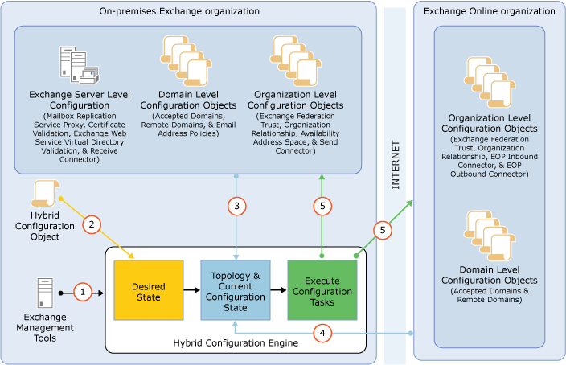

# Hybrid Configuration wizard

This topic gives you an overview of the Exchange hybrid deployment configuration process, hybrid deployment features and options available to you, and the Hybrid Configuration Engine, which executes the core actions necessary for both configuring and updating a hybrid deployment.
  
For more information about hybrid deployments, check out [Exchange Server Hybrid Deployments](exchange-hybrid.md).
  
## Hybrid configuration process
<a name="BKMK_HybridConfigProcess"> </a>

Here's a quick overview of the Hybrid Configuration wizard process. First, the wizard creates the **HybridConfiguration** object in your on-premises Active Directory. This Active Directory object stores the hybrid configuration information for the hybrid deployment and is updated by the Hybrid Configuration wizard. Next, the wizard gathers existing on-premises Exchange and Active Directory topology configuration data, Office 365 tenant and Exchange Online configuration data, defines several organization parameters, and then runs an extensive sequence of configuration tasks in both the on-premises and Exchange Online organizations. 
  
> [!IMPORTANT]
> There are several important considerations and prerequisites that you need to complete before you use the Hybrid Configuration wizard. You need to meet the requirements for hybrid deployments outlined in [Hybrid deployment prerequisites](hybrid-deployment-prerequisites.md). Then you'll be ready to use the Hybrid Configuration wizard to configure your Exchange organization for the hybrid deployment. 
  
The general phases of the hybrid deployment configuration process are:
  
1. **Verifying prerequisites and performing topology checks** The Hybrid Configuration wizard verifies that your on-premises and Exchange Online organizations can support a hybrid deployment. Some of the items that the wizard verifies and checks in the on-premises and Exchange Online organizations are: 
    
  - On-premises Exchange server versions
    
  - Exchange Online version
    
  - Active Directory synchronization presence and configuration
    
  - Federated and accepted domains
    
  - Existing federation trust and organization relationships
    
  - Web Services virtual directories
    
  - Exchange certificates
    
2. **Testing account credentials** Designated on-premises and Office 365 hybrid management accounts access the on-premises and Exchange Online organizations to gather prerequisite verification information and to make organization parameter configuration changes to enable hybrid deployment functionality. The Hybrid Configuration wizard checks that the accounts have the appropriate credentials and can connect to the on-premises and Exchange Online organizations. The hybrid deployment management accounts for both the on-premises and Office 365 organizations need to be members of the Organization Management role group for the Hybrid Configuration wizard to complete these tasks successfully. 
    
3. **Making hybrid deployment configuration changes** After testing the hybrid management accounts, conducting the verification and topology checks, and gathering configuration information that you defined in the wizard process, the Hybrid Configuration wizard makes the configuration changes to create and enable the hybrid deployment. All changes to the hybrid configuration are automatically logged in the hybrid configuration log. By default, the hybrid configuration log is located on the on-premises Mailbox server at  `%UserProfile%\AppData\Roaming\Microsoft\Exchange Hybrid Configuration`. 
    
    > [!IMPORTANT]
    > Inbound mail flow is controlled by your organization's MX record. Inbound Internet email for a hybrid deployment isn't configured by the Hybrid Configuration wizard. 
  
## Hybrid configuration features
<a name="BKMK_HybridConfigFeatures"> </a>

The Hybrid Configuration wizard automatically enables all hybrid deployment features by default each time it runs. If you want to disable specific hybrid configuration features, you need to use the Exchange Management Shell and the **Set-HybridConfiguration** cmdlet. The following hybrid deployment features are enabled by default by the wizard: 
  
- **Free/busy sharing** The free/busy sharing feature enables calendar information to be shared between on-premises and Exchange Online organization users. Free/busy sharing is enabled as part of the federated sharing and organization relationship configuration for the on-premises and Exchange Online organizations. Learn more at [Understanding Federated Delegation](http://technet.microsoft.com/library/09e6732a-4e99-44d0-801d-9463fdc57a9b.aspx).
    
- **MailTips** MailTips are informative messages displayed to users while they're composing a message. By enabling MailTips in the hybrid deployment, on-premises and Exchange Online senders can adjust messages they're composing to avoid undesirable situations or non-delivery reports (NDRs) between the organizations. Learn more at [MailTips](http://technet.microsoft.com/library/9c989167-cc0c-40a6-82ba-383f573bd2d5.aspx).
    
- **Online archiving** Online archiving enables the Exchange Online organization to host user email archives for both on-premises and Exchange Online users. Learn more at [Configure Exchange Online Archiving](https://go.microsoft.com/fwlink/p/?LinkId=266565).
    
- **Outlook on the web redirection** Outlook on the web redirection provides a single, common URL to access both on-premises and Exchange Online mailboxes. Client Access servers automatically redirect Outlook on the web requests to on-premises mailbox servers or provides a link to users for their mailbox in the Exchange Onine organization. 
    
- **Exchange ActiveSync redirection** When you move a mailbox from your on-premises Exchange organization to Exchange Online, all of the clients that access the mailbox need to be updated to use Exchange Online; this includes Exchange ActiveSync devices. Most Exchange ActiveSync clients will now be automatically reconfigured when the mailbox is moved to Exchange Online. For more information, see [Exchange ActiveSync device settings with Exchange hybrid deployments](activesync-settings.md).
    
- **Secure mail** Secure mail enables secure message delivery between the on-premises and Exchange Online organization via Transport Layer Security (TLS) protocol. The on-premises and Exchange Online organizations are mutually authenticated through digital certificate subjects and email headers and rich-text message formatting are preserved across the organizations. 
    
## Hybrid configuration options
<a name="BKMK_HybridConfigOptions"> </a>

The Hybrid Configuration wizard allows you to select specific options in several areas for the hybrid deployment. If you want to update specific hybrid configuration options after initially configuring your hybrid deployment, you can use either the Hybrid Configuration wizard or the Exchange Management Shell to select different configuration options.
  
The table below outlines the main options that the Hybrid Configuration wizard modifies and configures.
  
|**Configuration area**|**Description**|
|:-----|:-----|
|Domains|The wizard adds an accepted domain to the on-premises organization for hybrid mail flow and Autodiscover requests for the cloud organization. This domain, referred to as the coexistence domain, is added as a secondary proxy domain to any email address policies which have  _PrimarySmtpAddress_ templates for domains selected in the Hybrid Configuration wizard. By default, this domain is \<domain\>.mail.onmicrosoft.com. You can view the accepted domain by running the following command in the Exchange Management Shell in Exchange Online.```Get-AcceptedDomain | FL DomainName, IsCoexistenceDomain```|
|Secure mail certificate|The wizard requires you to select a specific certificate issued by a third-party Certificate Authority (CA) that's used to authenticate and secure email messages sent between the on-premises and Exchange Online organizations.|
|Exchange federated sharing|The wizard checks to see if there is an existing OAuth authentication relationship or a federation trust with the Azure Active Directory authentication system for the on-premises organization. If present, existing OAuth authentication or the federation trust is used to support the hybrid deployment. If not present, the wizard configures OAuth authentication or creates a federation trust for the on-premises organization with the Azure AD authentication system, depending on the type of on-premises Exchange configuration. The wizard also adds any domains selected within the Hybrid Configuration wizard to the federation trust if needed.In addition to the OAuth authentication or federation trust configuration, the wizard also creates and configures organizational relationships for both the on-premises and Exchange Online organizations. These organization relationships allow the wizard to enable several hybrid deployment features, including free/busy sharing, Outlook on the web redirection, and MailTips.|
|Mail flow|The wizard allows you to select and configure which Exchange servers to handle secure mail transport between the on-premises and Exchange Online organizations. In Exchange 2010, this is Hub Transport server. In Exchange 2013, this is a Client Access server. In Exchange 2016 and newer, this is a Mailbox server.The wizard configures your on-premises Exchange and Exchange Online organization for hybrid mail routing. By configuring new and existing Send and Receive connectors in the on-premises organization and Inbound and Outbound connectors in Exchange Online, the wizard allows you to choose whether outbound messages delivered to the Internet from the Exchange Online organization will be sent directly to external mail recipients or routed through your on-premises Exchange servers included in the hybrid deployment.> [!IMPORTANT]> Inbound mail flow is controlled by your organization's MX record. Inbound Internet email for a hybrid deployment isn't configured by the Hybrid Configuration wizard.           |
   
## Hybrid Configuration Engine
<a name="BKMK_RecommendedToolsAndServices"> </a>

The Hybrid Configuration Engine runs the core actions necessary for configuring and updating a hybrid deployment. Responsible for processing the  `Update-HybridConfiguration` cmdlet actions, the Hybrid Configuration Engine compares the state of the  _HybridConfiguration_ Active Directory object with current on-premises Exchange and Exchange Online configuration settings and then runs tasks to match the deployment configuration settings to the parameters defined in the  _HybridConfiguration_ Active Directory object. If the current on-premises Exchange and Exchange Online deployment configuration states already match the settings defined in the  _HybridConfiguration_ Active Directory object, no changes are made by the Hybrid Configuration Engine to either the on-premises or Exchange Online organizations. 
  
When updating an existing hybrid deployment, the Hybrid Configuration Engine performs the following steps:
  
1. The  _Update-HybridConfiguration_ cmdlet triggers the Hybrid Configuration Engine to start. 
    
2. The Hybrid Configuration Engine reads the "desired state" stored on the  `HybridConfiguration` Active Directory object. 
    
3. The Hybrid Configuration Engine discovers topology data and current configuration from the on-premises Exchange organization.
    
4. The Hybrid Configuration Engine discovers topology data and current configuration from the Exchange Online organization.
    
5. Based on the desired state, topology data, and current configuration, the Hybrid Configuration Engine establishes the "difference" between the on-premises Exchange and Exchange Online organizations and then executes configuration tasks to establish the desired state. 
    
The following figure shows a summary of how the Hybrid Configuration Engine retrieves and modifies on-premises Exchange server and Exchange Online configuration settings during the hybrid deployment process.
  

  

