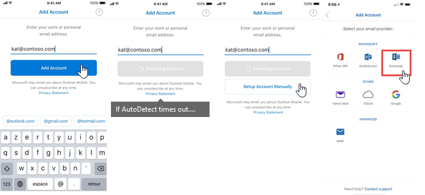
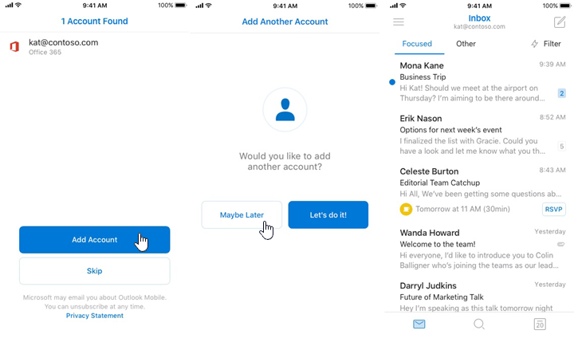

# Account setup with modern authentication in Exchange Online

 **Summary**: How users with modern authentication-enabled accounts can quickly set up their Outlook for iOS and Android accounts in Exchange Online.
  
There are two ways that users in your Exchange Online organization can set up their own Outlook for iOS and Android accounts: AutoDetect and single sign-on. Both methods leverage modern authentication.
  
## AutoDetect

Outlook for iOS and Android offers a solution called AutoDetect that helps end-users quickly setup their accounts. AutoDetect will first determine which type of account a user has, based on the SMTP domain. Account types that are covered by this service include Office 365, Outlook.com, Google, Yahoo, and iCloud. Next, AutoDetect will make the appropriate configurations to the app on the user's device based on that account type. This saves time for users and eliminates the need for manual input of configuration settings like hostname and port number.
  
For modern authentication, which is used by all Office 365 accounts and [on-premises accounts that are part of a hybrid configuration](https://blogs.technet.microsoft.com/exchange/2017/09/27/tap-outlook-mobile-support-for-exchange-on-premises-with-microsoft-enterprise-mobility-security/), AutoDetect queries Exchange Online for a user's account information and then configures Outlook for iOS and Android on the user's device so that the app can connect to Exchange Online. During this process, the only information required from the user is their SMTP address and credentials.
  
The following images show an example of account configuration via AutoDetect:
  

  
In the event that AutoDetect fails for a user, the following images show an alternative account configuration path using manual configuration:
  

  
## Single sign-on

For devices enrolled in Intune Company Portal, Outlook for iOS and Android supports single sign-on via authentication token re-use. If a user is already signed in to another Office 365 app on their device, like Word or Company Portal, Outlook for iOS for Android will detect that token and use it for its own authentication. When such a token is detected, users already enrolled in Outlook for iOS and Android will see their account available as "Found" under **Accounts** on the **Settings** menu. New users will see their account in the initial account setup screen. 
  
The following images show an example of account configuration via single sign-on for a first-time user:
  

  
If a user already has Outlook for iOS and Android, such as for a personal account, but an Office 365 account is detected because they recently enrolled, the single-sign on path will look as follows:
  

  

