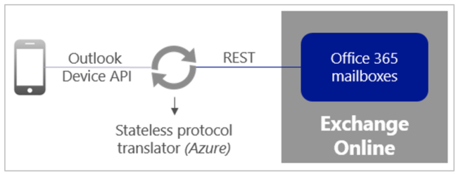
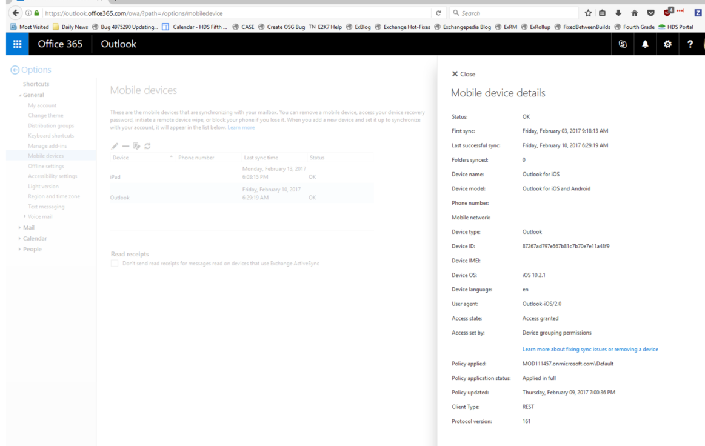

# Outlook for iOS and Android in Exchange Online: FAQ

 **Summary**: This article covers the most common questions asked by customers and administrators about using Outlook for iOS and Android with Exchange Online and Office 365.
  
The Outlook for iOS and Android app is designed to enable users in your organization to do more from their mobile devices, by bringing together email, calendar, contacts, and other files. The following sections highlight the most common questions we receive, across three key areas:
  
- Outlook for iOS and Android architecture and security
    
- Managing and maintaining Outlook for iOS and Android in your Exchange organization after it has been deployed
    
- Common questions from end-users who access information in your Exchange organization with the Outlook for iOS and Android app on their mobile devices
    
## Architecture and security

The following questions are about the overall architecture of Outlook for iOS and Android in Exchange Online, as well as user authentication and other security concerns.
  
### Q: What cloud architecture is utilized by Outlook for iOS and Android for Office 365 accounts?

The Outlook for iOS and Android app is fully powered by the Microsoft Cloud. All Office 365 Enterprise, Business, and Education accounts are supported natively, which means there is no mailbox data cached outside of Office 365. Data simply stays in its current Exchange Online mailbox, and it's protected by TLS-secured connections end-to-end, between Office 365 and the app. Outlook for iOS and Android is now fully delivered through Microsoft services that provide a strong commitment to security, privacy, and compliance.
  

  
Outlook for iOS and Android uses a stateless protocol translator component that is built and run in Azure. This component routes data and translates commands, but it doesn't cache user data. The app is coded with the Outlook device API, a proprietary API that syncs commands and data to and from the app. Exchange Online data is accessed via the publicly available REST APIs. The protocol translator enables communication between Outlook and Exchange Online.
  
### Q: All Office 365 Enterprise, Business, and Education accounts are supposed to be using the Office 365-based architecture and utilize the REST API, but I can still see some users connected via EAS. Why is that?

Upon creating an account within Outlook for iOS and Android for Office 365, the first connection attempted by the app is to the Office 365-based architecture, which uses REST. However, if this first attempt fails, the app fails back to the older AWS-based infrastructure (EAS). Beginning in June of 2017, Office 365 accounts will not be able to fall back to the AWS-based architecture. 
  
Failure is caused by REST being actively blocked by the customer, who is using one of the three controls listed below. Note that customers who are using one of these controls to block REST will need to alter their setup by June 2017 if they want to continue accessing email from Outlook for iOS and Android.
  
1. Client Access rules are in place that block or restrict the REST protocol.
    
2. EWS application policies (EWS controls access to the REST API) are in place that restrict which applications can connect.
    
3. The customer has EWS disabled for the organization or for specific mailboxes.
    
For more information, see [Securing Outlook for iOS and Android in Exchange Online](secure-outlook-for-ios-and-android.md).
  
### Q: Can I add two different Office 365 accounts from different Office 365 regions to Outlook for iOS and Android?

Yes. However, customers with the Office 365 Government plan may only have accounts connected to Outlook for iOS and Android from a single Office 365 region. This means that Office 365 Government customers can't have both a mailbox that is located in European Office 365 datacenters and an Office 365 Government plan mailbox within the same Outlook for iOS and Android app on the same device.
  
### Q: What authentication mechanism is used for Outlook for iOS are Android? Are credentials stored in Office 365?

Active Directory Authentication Library (ADAL)-based authentication is what Outlook for iOS and Android uses to access Exchange Online mailboxes in Office 365. ADAL authentication, used by Office apps on both desktop and mobile devices, involves users signing in directly to Azure Active Directory, which is Office 365's identity provider, instead of providing credentials to Outlook.
  
ADAL-based sign in enables OAuth for Office 365 accounts, and provides Outlook for iOS and Android a secure mechanism to access email without requiring access to user credentials. At sign in, the user authenticates directly with Office 365 and receives an access token in return. The token grants Outlook for iOS and Android access to the appropriate mailbox. OAuth provides Outlook with a secure mechanism to access Office 365 and the Outlook cloud service without needing or storing a user's credentials.
  
For more information, see the Office Blog post [New access and security controls for Outlook for iOS and Android](https://go.microsoft.com/fwlink/p/?LinkId=623595).
  
### Q: Do Outlook for iOS and Android and other Microsoft Office mobile apps support single sign-on?

All Microsoft apps that leverage the Azure Active Directory Authentication Library (ADAL) support single sign-on. In addition, single sign-on is also supported when the apps are used in conjunction with either the Microsoft Authenticator or Microsoft Company Portal apps.
  
Tokens can be shared and re-used by other Microsoft apps (such as Word mobile) under the following scenarios:
  
1. When the apps are signed by the same signing certificate and use the same service endpoint or audience URL (such as the Office 365 URL). In this case, the token is stored in app shared storage.
    
2. When the apps leverage or support single sign-on with a broker app. The tokens are stored within the broker app. Microsoft Authenticator is an example of a broker app. In the broker app scenario, after you attempt to sign in to Outlook for iOS and Android, ADAL will launch the Microsoft Authenticator app, which will make a connection to Azure Active Directory to obtain the token. It will then hold on to the token and re-use it for authentication requests from other apps, for as long as the configured token lifetime allows.
    
For more information, see [How to enable cross-app SSO on iOS using ADAL](https://docs.microsoft.com/azure/active-directory/develop/active-directory-sso-ios).
  
### Q: What is the lifetime of the tokens generated and used by the Active Directory Authentication Library (ADAL) in Outlook for iOS and Android?

Two tokens are generated when a user authenticates through ADAL-enabled apps like Outlook for iOS and Android, the Authenticator app, or the Company Portal app: an access token and a refresh token. The access token is used to access the resource (Exchange message data), while a refresh token is used to obtain a new access or refresh token pair when the current access token expires.
  
By default, the access token lifetime is one hour and the refresh token lifetime is fourteen days. These values can be adjusted; for more information see [Configurable token lifetimes in Azure Active Directory](https://docs.microsoft.com/azure/active-directory/active-directory-configurable-token-lifetimes). Note that if you choose to reduce these lifetimes, you can also reduce the performance of Outlook for iOS and Android, because a smaller lifetime increases the number of times the application must acquire a fresh access token.
  
### Q: What happens to the access token when a user's password is changed?

A previously granted access token is valid until it expires. Upon expiration, the client will attempt to use the refresh token to obtain a new access token, but because the user's password has changed, the refresh token will be invalidated (assuming directory synchronization has occurred between on-premises and Azure Active Directory). The invalidated refresh token will force the user to re-authenticate in order to obtain a new access token and refresh token pair.
  
### Q: Does Outlook for iOS and Android support certificate-based authentication?

Yes, Outlook for iOS and Android supports certificate-based authentication. For more information, see:
  
- [Configuring Active Directory Federation Services (ADFS) with Office 365](https://go.microsoft.com/fwlink/p/?linkid=849806)
    
- [Certificate-based authentication on iOS](https://go.microsoft.com/fwlink/p/?linkid=849807)
    
- [Certificate-based authentication on Android](https://go.microsoft.com/fwlink/p/?linkid=849808)
    
### Q: What does background synchronization enable? I notice that when I launch the app with it enabled, I still have to wait for messages to download, even after I've received new mail notifications for them.

Background synchronization enables new message notifications, badge count updates, and background synchronization of mailbox information for Outlook for iOS and Android. If background synchronization is disabled by the user in iOS or Android settings, then the user must launch the app and keep it in the foreground in order to synchronize mailbox information. 
  
Background synchronization in Outlook for iOS and Android can also be disabled by the following actions:
  
- Force quitting the app (such as by double-tapping the home button and swiping the app to dismiss).
    
- Restarting the mobile device.
    
- Not opening the app for a given period of time. iOS will automatically terminate Outlook.
    
> [!NOTE]
> Apple allows its native Mail app to do background refreshes without any of the above restrictions. Therefore, users may notice a difference in the background synchronization experience between the apps. However, this also results in improved battery life and less data consumption. 
  
### Q: Does each user's instance of Outlook for iOS and Android have a unique device ID in the Office 365-based architecture? How is the device ID generated and is this same device ID used in Intune?

Upon initial account login, Outlook for iOS and Android establishes a connection to the Office 365-based architecture. A unique device ID is generated, and this device ID is what appears in Active Directory device records (which can be retrieved with cmdlets such as  `Get-MobileDevice` in Exchange Online Powershell) and which appears in HTTP request headers. 
  
Intune uses a different device ID. The basic workflow for how Intune assigns a device ID is described in [App-based conditional access with Intune](https://docs.microsoft.com/en-us/intune/deploy-use/restrict-access-to-email-and-o365-services-with-microsoft-intune). In Intune, the device ID is assigned when the device workplace joins for all device-conditional access scenarios. This is an AAD-generated unique ID for the device. Intune uses that unique ID when sending compliance information, and ADAL uses that unique ID when authenticating to services.
  
### Q: Does Outlook for iOS and Android support RMS?

Yes. Outlook for iOS and Android supports reading protected messages. Outlook for iOS and Android works differently than desktop versions of Outlook when it comes to RMS. For desktop versions of Outlook, once a protected message is received and access is attempted, and Outlook verifies that the user can read RM messages, Outlook connects to Exchange to request an encryption key. The Outlook desktop client uses that encryption key to decrypt the message in front of the user (client-side). Mobile clients operate differently. When Outlook for iOS and Android sets up its initial relationship with Exchange, it notifies Exchange that it supports RMS. Exchange decrypts any protected messages before passing them to the client. In other words, decryption is performed server-side. Outlook for iOS and Android doesn't perform any decryption itself.
  
In cases where Outlook for iOS and Android receives protected messages and prompts end-users to use an RM client to open the file, it means that Exchange hasn't decrypted the message, which is due to an issue on the Exchange side.
  
### Q: What ports and end points does Outlook for iOS and Android use?

Outlook for iOS and Android communicates via TCP port 443. The app accesses various end points, depending on the activities of the user. Complete information is available in [Network Requests in Office 365 ProPlus](https://go.microsoft.com/fwlink/p/?linkid=849810).
  
### Q: Does Outlook for iOS and Android support proxy configurations?

Yes, Outlook for iOS and Android supports proxy configurations when the proxy infrastructure meets the following requirements: 
  
- **Supports HTTP protocol without TLS decryption and inspection**. The Office 365-based architecture for Outlook for iOS and Android utilizes certificate pinning to mitigate man-in-the-middle based attacks. 
    
- **Supports and has SOCKS proxy capability enabled**. The Outlook for iOS and Android client utilizes TCP connections to our Office 365-based architecture. The IP ranges for the SOCKS connections are not restricted to a subset of Azure IP ranges, which means that customers cannot define a whitelist range.
    
- **Does not perform authentication**.
    
Outlook for iOS and Android will consume the proxy configuration as defined by the platform operating system. Typically, this configuration information is deployed via a PAC file. The PAC file must be configured to use hostnames instead of protocol and return the SOCKS proxy information given the host URL; no additional custom settings are supported.
  
## Administrating and monitoring Outlook for iOS and Android in your organization

The following questions are about managing and monitoring the Outlook for iOS and Android app within your organization after his has been deployed.
  
### Q: Is it necessary to file an in-app support ticket when I experience an issue with Outlook for iOS and Android?

Yes, if you want to troubleshoot and resolve the issue, or if you want to inform us of a product defect or limitation, you will need to file an in-app support ticket. Only through filing an in-app support ticket can the Outlook app's logs get collected and analyzed by our product engineers.
  
### Q: As an Exchange administrator, is there a way for me to determine if Outlook clients are utilizing the Office 365-based architecture?

Yes, execute the following command from Exchange Online PowerShell:
  
```
Get-MobileDevice | where {$_.DeviceModel -eq "Outlook for iOS and Android"} | FL FriendlyName,DeviceID,DeviceOS,ClientType
```

The  `ClientType` property indicates whether the client is using the Office 365-based architecture (REST) or the AWS-based architecture (EAS). 
  
Alternatively, a user can login to Outlook on the web and, from within **Options**, select **Mobile Devices** to view the details of a mobile device. This would look similar to the following: 
  

  
### Q: As an Exchange administrator, I would like to deploy Outlook for iOS and Android, but in my testing I can't log in. What might be the issue?

Assuming authentication is not the issue, there are three areas you can check:
  
1. Check whether you have Client Access rules in place that block the REST protocol.
    
2. Check whether you have an EWS application policy that restricts which client applications can connect.
    
3. Check whether you have EWS enabled for the account.
    
For more information, see [Securing Outlook for iOS and Android in Exchange Online](secure-outlook-for-ios-and-android.md). If one of the above checks doesn't resolve the issue, please open an in-app support ticket.
  
### Q: Will Outlook for iOS and Android support third-party EMM or MDM solutions?

Outlook for iOS and Android supports Intune for device and applications management. Third-party MDM providers can deploy the Outlook app the same way they would deploy any iOS or Android app, using their existing tools. They can also apply device management controls like device PIN, device encryption, wipe, and more, all of which are important for a secure email experience, but all of which are also completely independent of Outlook for iOS and Android. In order to manage the app itself (such as restricting actions with corporate data like cut, copy, paste, and "save as"), customers will need to use Microsoft Intune. For detailed technical information, please see Intune's [conditional access](https://docs.microsoft.com/en-us/intune-classic/deploy-use/restrict-access-to-email-and-o365-services-with-microsoft-intune) and [MAM](https://docs.microsoft.com/en-us/intune-classic/deploy-use/protect-app-data-using-mobile-app-management-policies-with-microsoft-intune) documentation. 
  
### Q: Is a license required to use Outlook for iOS and Android?

Outlook for iOS and Android is free for consumer usage from the iOS App store and from Google Play. However, commercial users require an Office 365 subscription that includes the Office applications: either Business, Business Premium, Enterprise E3, E5, ProPlus, or the corresponding versions of those plans for Government or Education. If you only have an Exchange Online license (without Office) or an Exchange on-premises (Exchange Server) license, you are not allowed to use the app.
  
## Common questions from end-users

The following questions concern end-users in your organization who are using Outlook for iOS and Android on their devices to access their Exchange mailboxes.
  
### Q: My users enabled the "Save Contacts to Device" advanced settings option. However, they are complaining that not all contacts have synchronized on their iOS devices. Are there limitations with synchronization?

Due to limitations in iOS, contacts only synchronize with the native app when Outlook is in the foreground and is restricted to synchronize only one hundred contacts at a time. iOS also controls when contact synchronization occurs.
  
### Q: Why are the Office mobile apps required to be installed on Android in order to render attachments in Outlook, while iOS devices provide a preview of the attachments within Outlook?

This is due to the differences in the base operating systems. iOS provides native content rendering for known attachment types, which Outlook for iOS uses to provide basic attachment rendering. Android provides nothing similar. Android users have to install the Office apps and/or third-party apps in order to render attachment content.
  
### Q: A new message included an attachment, but while I was offline I couldn't open the attachment. Why is that?

Outlook (like other mobile clients) does not download attachments automatically. This is by design, in order to conserve device space. Attachments are only downloaded at the request of the user. 
  
### Q: A week ago I accessed an attachment in a message, but now that I'm offline I can no longer access that attachment on my iOS device. However, I can access it on my Android device. Why is that?

Outlook for iOS stores attachments in our own database. As a result, every attachment we download to the client takes up a considerable amount of space in our database. To ensure the client is able to provide fast performance and take a small amount of space, we purge data rather aggressively based on usage (attachments will be cached up to seven days).
  
Unlike iOS, Android uses an accessible file system, so when Outlook for Android downloads an attachment, it doesn't go into the database, rather it is stored as a temporary file.
  
### Q: Several meetings on my calendar have attachments that I can access in Outlook for Windows and Mac and from Outlook on the web, but I can't locate these attachments on my appointments for Outlook for iOS and Android. Why is that?

Outlook for iOS and Android currently does not support accessing attachments on calendar appointments, but we are planning to support this in a future update.
  
### Q: Why does data within Outlook for iOS and Android disappear and then re-appear after I toggle the Focused Inbox or the Organize by Thread settings?

Whenever those options are changed, Outlook for iOS and Android performs a soft reset. This wipes the existing data that has been downloaded to the app and requires a re-synchronization.
  
### Q: Can I view organization chart information in Outlook for iOS?

Yes. Outlook for iOS provides your company's organization information as part of a person's contact card details. Your company's reporting structure and a list of colleagues is also provided, to help employees connect with the people and teams they need to work with.
  
The list of people displayed as part of the Other Colleagues list under **Show Organization** is based on common email distribution lists, group memberships, and degrees of separation in the Organization structure defined in Azure Active Directory. 
  
If you do not have organization chart data exposed in the app, consult with your directory administrator. There are two main scenarios to consider:
  
1. Your company has a hybrid topology where an on-premises directory is synchronized with Azure Active Directory. You will need to update Active Directory with the organization chart information, either directly in the directory or via your Human Resources system. Data will be synchronized into AAD automatically and will be accessible via the Global Address List in Exchange Online.
    
2. Your company only leverages Azure Active Directory for directory management. You will need to update Azure Active Directory with the organization chart information, either directly in the directory or via your Human Resources system. This data will be accessible via the Global Address List in Exchange Online.
    
### Q: How much of my mailbox data is synchronized with Outlook for iOS and Android?

Outlook for iOS and Android synchronizes 500 items per folder, with up to 1000 items per folder if the user taps **Load more conversations**. The app periodically trims the items per folder down to 500, in order to ensure optimal app performance.
  

