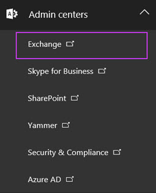
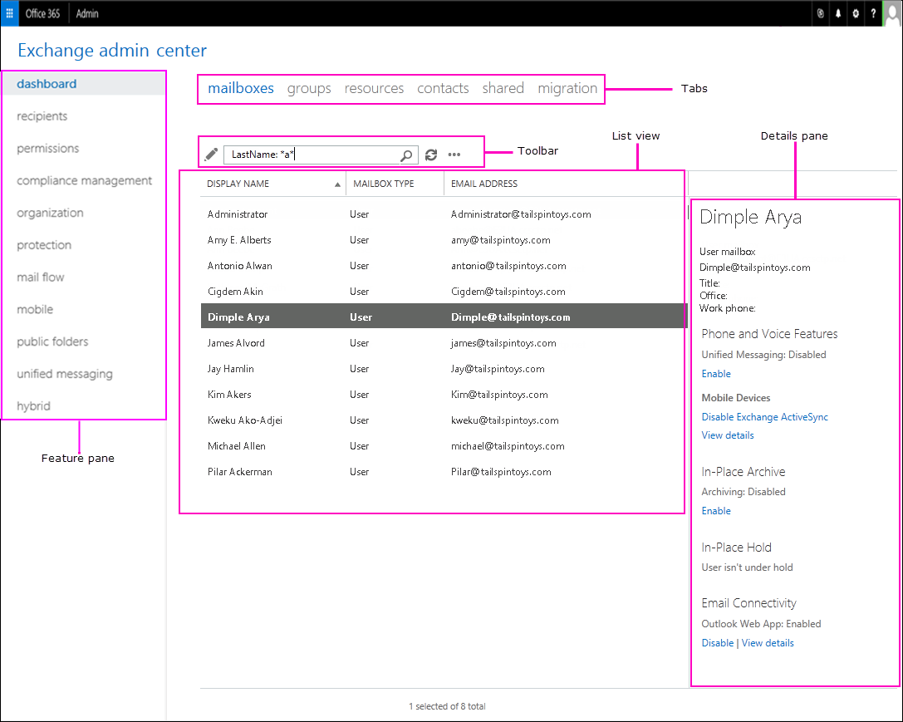

# Exchange admin center in Exchange Online

You use the Exchange admin center to manage email settings for your organization.
  
## Get to the Exchange admin center

You must have [Office 365 admin permissions](https://go.microsoft.com/fwlink/p/?LinkID=255444) to access the Exchange admin center. 
  
1. [Sign in](https://go.microsoft.com/fwlink/p/?LinkID=529144) to Office 365 using your work or school account, and then choose the **Admin** tile. 
    
2. In the Office 365 admin center, choose **Admin centers** \> **Exchange**.
    
    
  
## Exchange admin center features

Here's what the Exchange admin center looks like.
  

  
### Feature pane

Here are the features you'll find in the left-hand navigation.
  
|**Area**|**What you do here**|
|:-----|:-----|
|**Dashboard**   |An overview of the admin center.    |
|**Recipients**   |View and manage your mailboxes, groups, resource mailboxes, contacts, shared mailboxes, and mailbox migrations.    |
|**Permissions**   |Manage administrator roles, user roles, and Outlook Web App policies.    |
|**Compliance management**   |Manage In-Place eDiscovery &amp; Hold, auditing, data loss prevention (DLP), retention policies, retention tags, and journal rules.    |
|**Organization**   |Manage organization sharing and apps for Outlook    |
|**Protection**   |Manage malware filters, connection filters, content filters, outbound spam, and quarantine for your organization.    |
|**Mail flow**   |Manage rules, message tracing, accepted domains, remote domains, and connectors.    |
|**Mobile**   |Manage the mobile devices that you allow to connect to your organization. You can manage mobile device access and mobile device mailbox policies.    |
|**Public folders**   |Manage public folders and public folder mailboxes.    |
|**Unified messaging**   |Manage Unified Messaging (UM) dial plans and UM IP gateways.    |
   
### Tabs

The tabs are your second level of navigation. Each of the feature areas contains various tabs, each representing a complete feature.
  
### Toolbar

When you click most tabs, you'll see a toolbar. The toolbar has icons that perform a specific action. The following table describes the most common icons and their actions. To display the action associated with an icon, simply hover over the icon.
  
|**Icon**|**Name**|**Action**|
|:-----|:-----|:-----|
|             |Add, New    |Create a new object. Some of these icons have an associated down arrow you can click to show additional objects you can create.    For example, in **Recipients** \> **Groups**, clicking the down arrow displays **Distribution group**, **Security group**, and **Dynamic distribution group** as additional options.    |
|             |Edit    |Edit an object.    |
|             |Delete    |Delete an object. Some delete icons have a down arrow you can click to show additional options.    |
|             |Search    |Open a search box in which you can type the search phrase for an object you want to find.    |
|             ||Upgrade a distribution group to an Office 365 group. This icon can be used only for a distribution group.    |
|             |Refresh    |Refresh the list view.    |
|             |More options    |View more actions you can perform for that tab's objects.    For example, in **Recipients** \> **Mailboxes** clicking this icon shows the following options: **Add/Remove columns**, **Deleted mailboxes**, **Export data to a CSV file**, and **Advanced search**.    |
|             |Up arrow and down arrow    |Move an object's priority up or down.     For example, in **Mail flow** \> **Rules** click the up arrow to raise the priority of a rule. You can also use these arrows to navigate the public folder hierarchy.    |
|             |Copy    |Copy an object so you can make changes to it without changing the original object.    For example, in **Permissions** \> **Admin roles**, select a role from the list view, and then click this icon to create a new role group based on an existing one.    |
|             |Remove    |Remove an item from a list.    For example, in the **Public Folder Permissions** dialog box, you can remove users from the list of users allowed to access the public folder by selecting the user and clicking this icon.    |
   
### List view

When you select a tab, in most cases you'll see a list view. The list view in Exchange admin center is designed to remove limitations that existed in Exchange Control Panel.
  
In Exchange Online, the viewable limit from within the Exchange admin center list view is approximately 10,000 objects. In addition, paging is included so you can page to the results. In the **Recipients** list view, you can also configure page size and export the data to a CSV file. 
  
### Details pane

When you select an item from the list view, information about that object is displayed in the details pane.
  
 **To bulk edit several items**: press the CTRL key, select the objects you want to bulk edit, and use the options in the details pane. 
  
### Centers, Me tile, and Help

The Centers tile allows you to change from one admin center to another. The Me tile allows you to sign out of the EAC and sign in as a different user. From the Help  drop-down menu, you can perform the following actions: 
  
- **Help** Click  to view the online help content. 
    
- **Disable Help bubble** The Help bubble displays contextual help for fields when you create or edit and object. You can turn off the Help bubble help or turn it on if it has been disabled. 
    
## Supported browsers

See the following articles:
  
- [Office 365 System Requirements](https://go.microsoft.com/fwlink/p/?LinkID=402699): lists supported browsers for Office 365 and the Exchange admin center.
    
- [Supported Browsers for Outlook Web App](https://go.microsoft.com/fwlink/p/?LinkId=402700).
    
## Related articles

Are you using Exchange Server 2013? See [Exchange admin center in Exchange 2013](http://technet.microsoft.com/library/a9aea11a-6ba3-4f4a-a76e-79072e7cfc7d.aspx).
  
Are you using Exchange Online Protection? See [Exchange admin center in Exchange Online Protection](http://technet.microsoft.com/library/97921f0e-832f-40c7-b56d-414faede5191.aspx).
  

