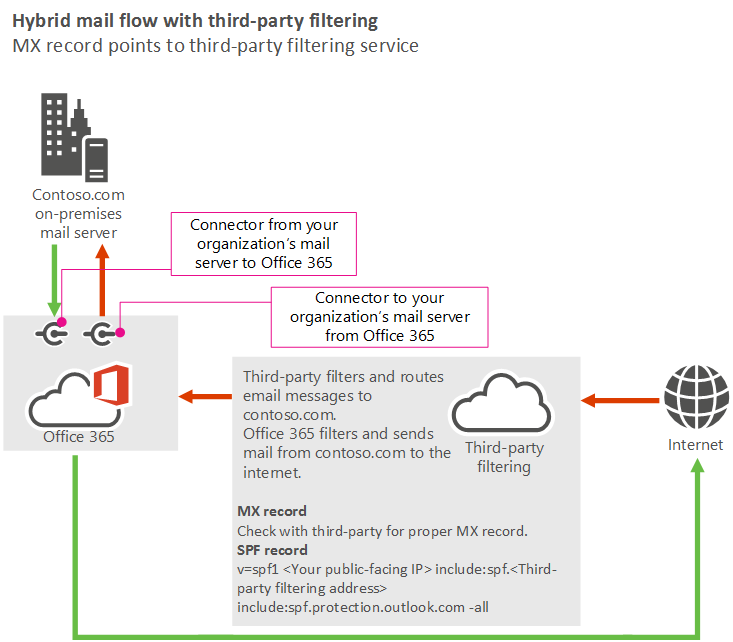

# Manage mail flow using a third-party cloud service with mailboxes on Office 365 and on-prem

 **Summary**: How to manage mail flow with a third-party cloud service in an Exchange hybrid environment (when your Exchange mailboxes are both on premises and in Office 365).
  
This topic covers the most complex mail flow scenario using Office 365.
  
> [!NOTE]
> Examples in this guide use the fictitious organization, Contoso, which owns the domain contoso.com. The IP address of the Contoso mail server is 131.107.21.231, and its third-party provider uses 10.10.10.1 for their IP address. These are just examples. You can adapt these examples to fit your organization's domain name and public-facing IP address where necessary. 
  
## Using a third-party cloud service with mailboxes on Office 365 and on my organization's mail servers
<a name="BKMK_HybridMailFlowWithThirdPartyFiltering"> </a>

### Scenario

- I'm migrating my mailboxes to Office 365, and I want to keep some mailboxes on my organization's on-premises mail server. I want to use a third-party cloud service to filter spam from the Internet. My messages to the Internet must route through Office 365 to prevent my on-premises servers' IP addresses from being added to external block lists.
    
In this scenario, your organization's mail flow setup looks like the following diagram.
  

  
#### Best practices

1. Add your custom domains in Office 365. To prove that you own the domains, follow the instructions in [Add users and domains](https://go.microsoft.com/fwlink/?LinkId=708999).
    
2. [Create user mailboxes in Exchange Online](../recipients-in-exchange-online/create-user-mailboxes.md) or [move all users' mailboxes to Office 365](https://go.microsoft.com/fwlink/?LinkId=524030).
    
3. Update the DNS records for the domains that you added in step 1. (Not sure how to do this? Follow the instructions on [this page](https://go.microsoft.com/fwlink/p/?LinkID=534835).) The following DNS records control mail flow:
    
  - **MX record** - Point your MX record to your third-party service. Follow their guidelines for configuring your MX record. 
    
  - **SPF record** - Because your domain's MX record must point to a third-party service (in other words, you require complex routing), include the third-party service in your SPF record. Follow the third-party provider's guidelines for adding them to your SPF record. Also add Office 365 and the IP addresses of your on-premises servers as valid senders. For example, if contoso.com is your domain name, the third-party cloud service IP address is 10.10.10.1, and your on-premises server IP address is 131.107.21.231, the SPF record for contoso.com should be: 
    
  ```
  v=spf1 ipv4:10.10.10.1 ipv4: 131.107.21.231 include:spf.protection.outlook.com -all
  ```

    Alternatively, depending on the third-party's requirements, you might need to include the domain from the third-party, as shown in the following example: 
    
  ```
  v= ipv4: 131.107.21.231 spf1 include:spf.protection.outlook.com include:third_party_cloud_service.com -all
  ```

## See also
<a name="BKMK_HybridMailFlowWithThirdPartyFiltering"> </a>

[Mail flow best practices for Exchange Online and Office 365 (overview)](mail-flow-best-practices.md)
  
[Manage all mailboxes and mail flow using Office 365](manage-mailboxes-with-office-365.md)
  
[Manage mail flow using a third-party cloud service with Office 365](manage-mail-flow-using-third-party-cloud.md)
  
[Manage mail flow with mailboxes in multiple locations (Office 365 and on-prem)](manage-mail-flow-for-multiple-locations.md)
  
[Troubleshoot Office 365 mail flow](troubleshoot-mail-flow.md)

[Test mail flow by validating your Office 365 connectors](test-mail-flow.md)

