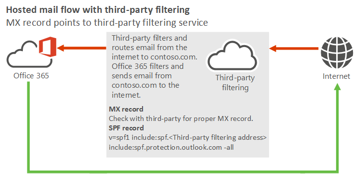
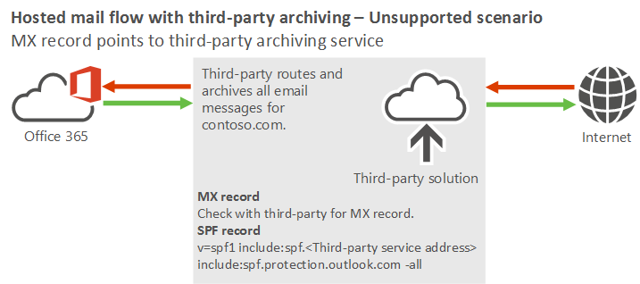

# Manage mail flow using a third-party cloud service with Office 365

 **Summary:** A couple of different scenarios that illustrate how to configure mail flow through a third-party cloud service. 
  
This topic covers the following complex mail flow scenarios using Office 365:
  
[Scenario 1 - MX record points to third-party spam filtering](manage-mail-flow-using-third-party-cloud.md#Scenario1)
  
[Scenario 2 - MX record points to third-party solution without spam filtering](manage-mail-flow-using-third-party-cloud.md#scenario2)
  
> [!NOTE]
> Examples in this topic use the fictitious organization, Contoso, which owns the domain contoso.com. The IP address of the Contoso mail server is 131.107.21.231, and its third-party provider uses 10.10.10.1 for their IP address. These are just examples. You can adapt these examples to fit your organization's domain name and public-facing IP address where necessary. 
  
## Using a third-party cloud service with Office 365
<a name="BKMK_HostedMailFlowWithThirdPartyCloud"> </a>

### Scenario 1 - MX record points to third-party spam filtering
<a name="Scenario1"> </a>

- I plan to use Office 365 to host all my organization's mailboxes. My organization uses a third-party cloud service to filter spam and malware. All email that the Internet sends must be filtered by this third-party cloud service.
    
For this scenario, your organization's mail flow setup looks like the following diagram.
  

  
#### Best practices for using a third-party cloud service with Office 365

1. Add your custom domains in Office 365. To prove that you own the domains, follow the instructions in [Add users and domains](https://go.microsoft.com/fwlink/?LinkId=708999).
    
2. [Create user mailboxes in Exchange Online](../recipients-in-exchange-online/create-user-mailboxes.md) or [move all users' mailboxes to Office 365](https://go.microsoft.com/fwlink/?LinkId=524030).
    
3. Update the DNS records for the domains that you added in step 1. (Not sure how to do this? Follow the instructions on [this page](https://go.microsoft.com/fwlink/p/?LinkID=534835).) The following DNS records control mail flow:
    
  - **MX record** - Your domain's MX record must point to your third-party service provider. Follow their guidelines for how to configure your MX record. 
    
  - **SPF record** - Because your domain's MX record must point to the third-party service (in other words, you require complex routing), your SPF record should include them as well. Please follow the guidelines from your third-party cloud service. However, you should also add Office 365 as a valid sender. 
    
    For example, if contoso.com is your domain and the IP address for the third-party cloud service is 10.10.10.1, the SPF record for contoso.com should be: 
    
  ```
  v=spf1 ipv4: 10.10.10.1  include:spf.protection.outlook.com -all
  ```

    Alternatively, depending on the third-party provider's requirements, you might need to include the domain from the third-party, as shown in the following example: 
    
  ```
  v=spf1 include:spf.protection.outlook.com include:third_party_cloud_service.com -all
  ```

### Scenario 2 (unsupported) - MX record points to third-party solution without spam filtering
<a name="Scenario2"> </a>

- I plan to use Office 365 to host all my organization's mailboxes. My organization must send all email to a third-party service, such as archiving or auditing. However, the third-party service doesn't provide a spam filtering solution.
    
We don't recommend or support this scenario because it causes Office 365 spam filtering not to work properly. If you choose this scenario, your organization's mail flow setup looks like the following diagram.
  

  
#### Best practices for using a third-party cloud service with Office 365

- Don't use this scenario because it isn't currently supported. We recommend that you use archiving and auditing solutions that Office 365 provides.
    
## See also
<a name="BKMK_HostedMailFlowWithThirdPartyCloud"> </a>

[Mail flow best practices for Exchange Online and Office 365 (overview)](mail-flow-best-practices.md)
  
[Manage all mailboxes and mail flow using Office 365](manage-mailboxes-with-office-365.md)
  
[Manage mail flow with mailboxes in multiple locations (Office 365 and on-prem)](manage-mail-flow-for-multiple-locations.md)
  
[Manage mail flow using a third-party cloud service with mailboxes on Office 365 and on-prem](manage-mail-flow-on-office-365-and-on-prem.md)
  
[Troubleshoot Office 365 mail flow](troubleshoot-mail-flow.md)

[Test mail flow by validating your Office 365 connectors](test-mail-flow.md)

