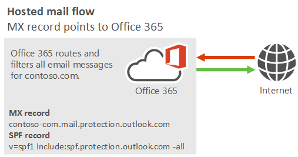
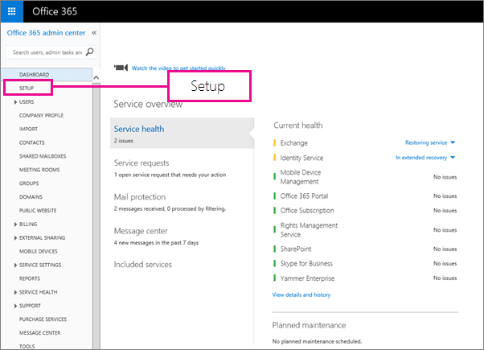

# Manage all mailboxes and mail flow using Office 365

 **Summary**: How to use hosted mail flow with Office 365.
  
For most organizations, we recommend using hosted mail flow because it's the simplest configuration, in which Office 365 manages all mailboxes and filtering. This simple configuration makes it easy to set up and manage mail flow. 
  
## Manage all mailboxes and mail flow using Office 365 (recommended).
<a name="BKMK_HostedMailFlow"> </a>

### Hosted mail flow scenarios

- I'm a new Office 365 customer, and all my users' mailboxes are in Office 365. I want to use all filtering solutions that Office 365 offers.
    
- I'm a new Office 365 customer. I have an existing email service, but I plan to immediately move all existing mailboxes to the cloud. I want to use all filtering solutions that Office 365 offers.
    
For this scenario, your organization's mail flow setup looks like the following diagram:
  

  
#### Best practices for hosted mail flow scenarios

To set up hosted mail flow, we recommend using the Office 365 setup wizard. To get to the Office 365 setup wizard, go to **Setup** in the Office 365 admin center. 
  

  
The Office 365 setup wizard walks you through the following steps.
  
1. Add your custom domains in Office 365. To prove that you own the domains, follow the instructions in [Add users and domains](https://go.microsoft.com/fwlink/?LinkId=708999).
    
2. [Create user mailboxes in Exchange Online](../recipients-in-exchange-online/create-user-mailboxes.md) or [move all users' mailboxes to Office 365](https://go.microsoft.com/fwlink/?LinkId=524030).
    
3. Update the DNS records for the domains that you added in step 1. (Not sure how to do this? Follow the instructions on [this page](https://go.microsoft.com/fwlink/p/?LinkID=534835).) 
    
    The following DNS records control mail flow:
    
  - **MX record** - Point your MX record to Office 365 in the following format: \<domainKey\>-com.mail.protection.outlook.com. 
    
    For example, the domain contoso.com should have the MX record contoso-com.mail.protection.outlook.com.
    
  - **SPF record** - This is a special TXT record in DNS that identifies a service as a valid sender for a particular domain. Because Office 365 is sending all your messages, list only Office 365 as a valid sender for your domain. To do that, add an SPF record for your domain in the following format: 
    
  ```
  v=spf1 include:spf.protection.outlook.com -all
  ```

For a full list of setup instructions, check out [Set up Office 365 for business](https://go.microsoft.com/fwlink/p/?LinkID=522378) or [Deploy Office 365 Enterprise for your organization](https://go.microsoft.com/fwlink/p/?LinkID=703951).
  
## See also
<a name="BKMK_HostedMailFlow"> </a>

[Mail flow best practices for Exchange Online and Office 365 (overview)](mail-flow-best-practices.md)
  
[Manage mail flow using a third-party cloud service with Office 365](manage-mail-flow-using-third-party-cloud.md)
  
[Manage mail flow with mailboxes in multiple locations (Office 365 and on-prem)](manage-mail-flow-for-multiple-locations.md)
  
[Manage mail flow using a third-party cloud service with mailboxes on Office 365 and on-prem](manage-mail-flow-on-office-365-and-on-prem.md)
  
[Troubleshoot Office 365 mail flow](troubleshoot-mail-flow.md)

[Test mail flow by validating your Office 365 connectors](test-mail-flow.md)

