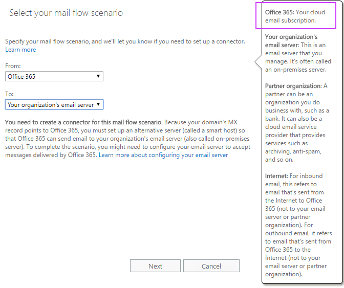
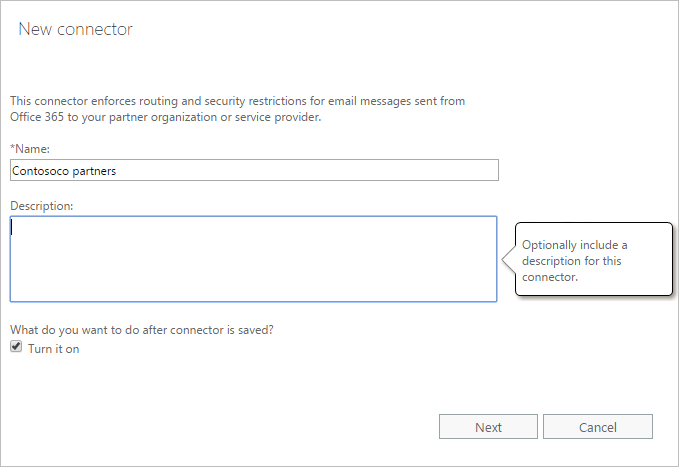
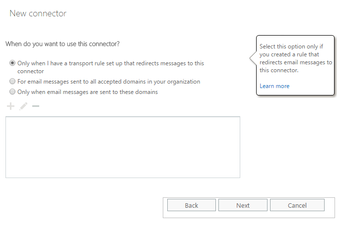
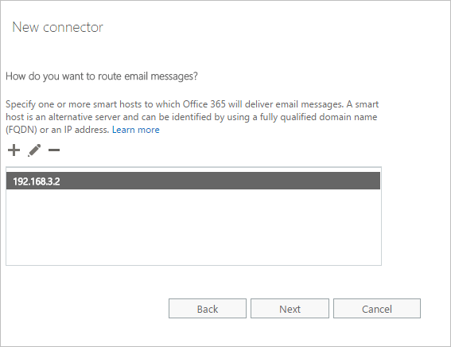
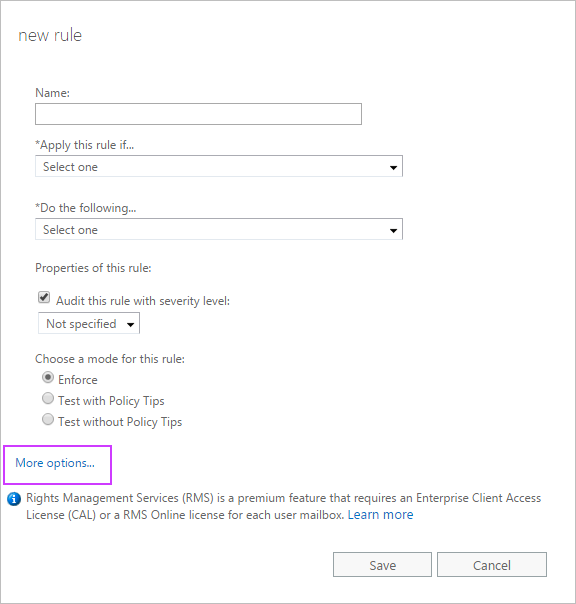
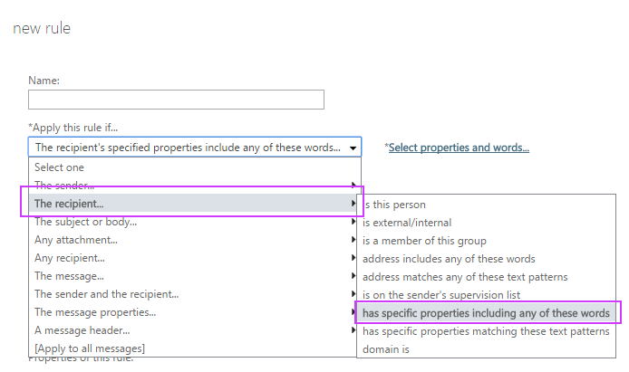

# Scenario: Conditional mail routing

There might be times you need to route mail differently depending on who the mail is sent to or from, where it's being sent, the contents of the message, and so on. For example, if you have multiple sites around the world, you might want to route mail to a specific site. You can do this using connectors and mail flow rules (sometimes called transport rules).
  
When the steps below are completed, a mail flow rule will redirect messages addressed to users whose City property is set to New Orleans to the IP address specified by the Outbound connector.
  
## Step 1: Use the Exchange admin center to create the connector

The first thing we need to do is create an Outbound connector. This connector will be used by the mail flow rule that we'll set up in Step 2. In this connector, you'll select where messages it receives originate (such as a mailbox in your Office 365 organization), the type of organization where the messages will be sent (such as your on-premises servers), the security that should be applied to the connection, and name or IP address of the target server. If you want to learn more about how to create connectors, check out [Configure mail flow using connectors in Office 365](use-connectors-to-configure-mail-flow.md).
  
1. In the EAC, navigate to **mail flow** \> **connectors**. click  to create a new connector. 
    
2. In the **From:** drop-down box, choose Office 365.
    
3. In the **To:** drop-down box, choose either Your organization's email server or Partner organization if you want to connect to a server other than your organizations. 
    
    
  
4. Name the connector and add a description. If you want to turn the connector on immediately, check **Turn it on**. Click **Next**.
    
    
  
5. Choose Only when I have a transport rule… and click **Next**.
    
    
  
6. Specify one or more smart hosts to which Office 365 will deliver email messages.
    
    
  
7. Define your Transport Layer Security (TLS) settings depending on your security needs.
    
    
  
8. Review your new connector configurations and click **Next** to validate the connector. 
    
## Step 2: Use the EAC to create a mail flow rule

Now that we've created a connector, we need to create a mail flow rule that'll send mail to it based on the criteria you define. There are many conditions you can select from to control when messages should be sent to the connector.
  
1. In the EAC, navigate to **mail flow** \> **rules**. Click  and choose **Create a new rule…**.
    
2. In the **new rule** window, name the rule. To ssee all the options available for the rule, click **More options…** at the bottom of the page. 
    
    
  
3. For **\*Apply this rule if…**, select **The recipient…** and **has specific properties including any of these words**. The **select user properties** box appears. Click , and under **User properties:**, choose **City**. **City** is an Active Directory attribute made available for use by the transport rule. Specify the name of the city, such as New Orleans. Click **OK**, and then click **OK** again to close the **select user properties** box. 
    
    
  
    > [!IMPORTANT]
    > Check the accuracy of user attributes in Active Directory to ensure that the mail flow rule works as intended. > Note that outbound connector changes may take time to replicate. 
  
4. For **\*Do the following…**, choose **Redirect the message to…** and then specify **the following connector**. The **select connector** box appears. Choose the Outbound connector you created previously. 
    
    You can choose additional properties for the rule, such as the test mode and when to activate the rule.
    
5.  To save the connector, click **Save**.
    

