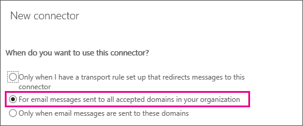

# Set up connectors to route mail between Office 365 and your own email servers

This topic helps you set up the connectors you need for the following two scenarios:
  
- You have your own email servers (also called on-premises servers), and you subscribe to Exchange Online Protection (EOP) for email protection services.
    
- You have (or intend to have) mailboxes in two places; some mailboxes in Office 365, and some of your mailboxes are on your organization email servers (also called on-premises servers).
    
> [!NOTE]
> Before you get started, make sure you check on your specific scenario in [What if I have EOP or Exchange Online and my own email servers?](use-connectors-to-configure-mail-flow.md#WhatifIhave1). 
  
## How do Office 365 connectors work with my own email servers (also called "on-premises servers")?
<a name="HowdoconnectorsinEOP"> </a>

If you have EOP and your own email servers, or if some of your mailboxes are in Office 365 and some are on your email servers, set up connectors to enable mail flow in both directions. You can enable mail flow between Office 365 and any SMTP-based email server, such as Exchange or a third-party email server. 
  
The diagram below shows how connectors in Office 365 (including Exchange Online or EOP) work with your own email servers.
  

  
In this example, John and Bob are both employees at your company. John has a mailbox on an email server that you manage, and Bob has a mailbox in Office 365. John and Bob both exchange mail with Sun, a customer with an Internet mail account:
  
- When email is sent between John and Bob, connectors are needed.
    
- When email is sent between John and Sun, connectors are needed. (All Internet email is delivered via Office 365.)
    
- When email is sent between Bob and Sun, no connector is needed.
    
If you have your own email servers and Office 365, you must set up connectors. Without connectors, email will not flow between Office 365 and your organization's email servers.
  
## How do connectors route mail between Office 365 and my own email server?
<a name="Howdoconnectorsroute"> </a>

You need two connectors to route email between Office 365 and your email servers, as follows:
  
- **A connector from Office 365 to your own email server**
  
When you set up Office 365 to accept all email on behalf of your organization, you will point your domain's MX (mail exchange) record to Office 365. To prepare for this mail delivery scenario, you must set up an alternative server (called a "smart host") so that Office 365 can send email to your organization's email server (also called "on-premises server"). To complete the scenario, you might need to configure your email server to accept messages delivered by Office 365.
    
- **A connector from your own email server to Office 365**
  
When this connector is set up, Office 365 will accept messages from your organization's email server and send the messages to recipients on your behalf. This recipient could be a mailbox for your organization in Office 365, or it could be a recipient on the Internet. To complete this scenario, you'll also need to configure your email server to send email messages directly to Office 365. 
  
This connector enables Office 365 to scan your email for spam and malware, and to enforce compliance requirements such as running data loss prevention policies. When your email server sends all email messages directly to Office 365, your own IP addresses are shielded from being added to a spam block list. To complete the scenario, you might need to configure your email server to send messages to Office 365. 
    
> [!NOTE]
> This scenario requires two connectors: one from Office 365 to your mail servers, and one to manage mail flow in the opposite direction. Before you start, make sure you have all the information you need, and continue with the instructions until you have set up and validated both connectors. 
  
## Overview of the steps
<a name="Overviewofthesteps"> </a>

Here is an overview of the steps:
  
- Complete the prerequisites for your email server environment.
    
- **Part 1:** Configure mail to flow from Office 365 to your email server. 
    
- **Part 2:** Configure mail to flow from your email server to Office 365. 
    
## Prerequisites for your email server environment
<a name="Prereqemailserver"> </a>

Prepare your server environment (also known as your on-premises environment) so that it's ready to connect with Office 365. Follow these steps:
  
1. Make sure that your email server (also called "on-premises mail server") is set up and capable of sending and receiving mail to and from the Internet.
    
2. Check that your on-premises email server has Transport Layer Security (TLS) enabled, with a valid certification authority-signed (CA-signed) certificate. We recommend that the certificate subject name includes the domain name that matches the primary email server in your organization. Buy a CA-signed digital certificate that matches this description, if necessary.
    
3. If you want to use certificates for secure communication between Office 365 and your email server, update the connector your email server uses to receive mail. This connector must recognize the right certificate when Office 365 attempts a connection with your server. If you're using Exchange, see [Receive Connectors](http://technet.microsoft.com/library/17751a60-39fe-433f-84d2-bfc14ff4ba51.aspx) for more information. On the Edge Transport Server or Client Access Server (CAS), configure the default certificate for the Receive connector. Update the  *TlsCertificateName*  parameter on the **Set-ReceiveConnector** cmdlet in the Exchange Management Shell. To learn how to open the Exchange Management Shell in your on-premises Exchange organization, see **Open the Shell**.
    
4. Make a note of the name or IP address of your external-facing email server. If you're using Exchange, this will be the Fully Qualified Domain Name (FQDN) of your Edge Transport server or CAS that will receive email from Office 365.
    
5. Open port 25 on your firewall so that Office 365 can connect to your email servers.
    
6. Make sure your firewall accepts connections from all Office 365 IP addresses. See [Exchange Online Protection IP addresses](http://technet.microsoft.com/library/eb14f38b-7b55-4a47-84a0-4a56a59e4111.aspx) for the published IP address range. 
    
7. Make a note of an email address for each domain in your organization. You'll need this later to test that your connector is working properly.
    
## Part 1: Configure mail to flow from Office 365 to your email server
<a name="Part1configmail"> </a>

There are three steps for this:
  
1. Configure your Office 365 environment.
    
2. Set up a connector from Office 365 to your email server.
    
3. Change your MX record to redirect your mail flow from the Internet to Office 365.
    
### 1. Configure your Office 365 environment
<a name="configO365E"> </a>

Make sure you have completed the following in Office 365:
  
1. To set up connectors, you need permissions assigned before you can begin. To check what permissions you need, see the "Office 365 connectors" entry in the [Feature permissions in EOP](http://technet.microsoft.com/library/34674847-a6b7-4a7e-9eaa-b64f22bc150d.aspx) topic. 
    
2. If you want EOP or Exchange Online to relay email from your email servers to the Internet, either:
    
  - Use a certificate configured with a subject name that matches an accepted domain in Office 365. We recommend that your certificate's common name or subject alternative name matches the primary SMTP domain for your organization. For details about this, see [Prerequisites for your email server environment](set-up-connectors-to-route-mail.md#Prereqemailserver).
    
  - -OR-
    
  - Make sure that all your organization sender domains and subdomains are configured as accepted domains in Office 365.
    
    For more information about defining accepted domains, see [Manage accepted domains in Exchange Online](../../mail-flow-best-practices/manage-accepted-domains/manage-accepted-domains.md) and [Enable mail flow for subdomains in Exchange Online](../../mail-flow-best-practices/manage-accepted-domains/enable-mail-flow-for-subdomains.md). 
    
3. Decide whether you want to use transport rules or domain names to deliver mail from Office 365 to your email servers. Most businesses will choose to deliver mail for all accepted domains. For more information, see [Using a connector with a transport rule](http://technet.microsoft.com/library/8be69d15-9e34-4021-a886-3fb9836b9944.aspx).
    
> [!NOTE]
> You can set up transport rules as described in [Mail flow rule actions in Exchange Online](../../security-and-compliance/mail-flow-rules/mail-flow-rule-actions.md). For example, you might want to use transport rules with connectors if your mail is currently directed via distribution lists to multiple sites. 
  
### 2. Set up a connector from Office 365 to your email server
<a name="configO365E"> </a>

To create a connector in Office 365, click **Admin**, and then click **Exchange** to go to the Exchange admin center. Next, click **mail flow**, and click **connectors**.
  
If any connectors already exist for your organization, you can see them listed here.
  

  
Before you set up a new connector, check any connectors that are already listed here for your organization. For example, if you ran the Exchange [Hybrid Configuration wizard](http://technet.microsoft.com/library/2e6ed294-ee74-4038-8b71-b61786372ba4.aspx), connectors that deliver mail between Office 365 and Exchange Server will be set up already and listed here. You don't need to set them up again, but you can edit them here if you need to. If you don't plan to use the hybrid configuration wizard, or if you're running Exchange Server 2007 or earlier, or if you're running a non-Microsoft SMTP mail server, set up connectors using the wizard.
  
To start the wizard, click the plus symbol **+**. On the first screen, choose the options that are depicted in the following screenshot:
  

  
Click **Next**, and follow the instructions in the wizard. Click the **Help** or **Learn More** links if you need more information. The wizard will guide you through setup. At the end, make sure your connector validates. If the connector does not validate, double-click the message displayed to get more information, and see [About fixing connector validation errors](http://technet.microsoft.com/library/abbae1e7-2cbe-434c-bd9f-ede00cebc170.aspx) for help resolving issues. 
  
### 3. Change your MX record to redirect your mail flow from the Internet to Office 365
<a name="configO365E"> </a>

To redirect email flow to Office 365, change the MX (mail exchange) record for your domain. For instructions on how to do this, see [Add MX record to route email](https://go.microsoft.com/fwlink/?LinkID=529074&amp;clcid=0x409).
  
## Part 2: Configure mail to flow from your email server to Office 365
<a name="Part2configmail"> </a>

There are two steps for this:
  
1. Set up a connector from your email server to Office 365.
    
2. Set up your email server to relay mail to the Internet via Office 365.
    
Once you have completed Part 2, see the instructions at the end to check that your configuration works.
  
### 1. Set up a connector from your email server to Office 365

To create a connector in Office 365, click **Admin**, click **Exchange**, and then to go to the Exchange admin center. Next, click **mail flow**, and click **connectors**. If any connectors already exist for your organization, you can see them listed here.
  
To start the wizard, click the plus symbol **+**. On the first screen, choose the options that are depicted in the following screenshot:
  

  
Click **Next**, and follow the instructions in the wizard. Click the **Help** or **Learn More** links if you need more information. In particular, see [Identifying email from your email server](http://technet.microsoft.com/library/a188a123-540d-4780-8b4c-9adf825c6b33.aspx) for help configuring certificate or IP address settings for this connector. The wizard will guide you through setup. At the end, save your connector. 
  
### 2. Set up your email server to relay mail to the Internet via Office 365

Next, you must prepare your email server to send mail to Office 365. This enables mail flow from your email servers to the Internet via Office 365.
  
On your Exchange server, configure a Send connector to send email via a smart host to Office 365. For instructions on how to do this with Exchange Server, see [Create a Send connector to route outbound email through a smart host ](http://technet.microsoft.com/library/4a9ef08e-bd62-4c6b-8790-d24fb0f8f24b.aspx). For instructions on how to do this with Exchange Server 2010, see [Create an SMTP Send Connector](http://technet.microsoft.com/library/38ae9dc8-f11b-4f57-867a-4d74b453c9a3.aspx).
  
To create the Send connector in Exchange 2013, use the following syntax in the Exchange Management Shell. To learn how to open the Exchange Management Shell in your on-premises Exchange organization, see **Open the Shell**. 
  
```
New-SendConnector -Name <DescriptiveName> -AddressSpaces * -CloudServicesMailEnabled $true -Fqdn <CertificateHostNameValue> -RequireTLS $true -DNSRoutingEnabled $false -SmartHosts  <YourDomain>-com.mail.protection.outlook.com -TlsAuthLevel  CertificateValidation
```

This example creates a new Send Connector with the following properties:
  
- **Name** My company to Office 365 
    
- **FQDN** mail.contoso.com 
    
- **SmartHosts** contoso-com.mail.protection.outlook.com 
    
```
New-SendConnector -Name "My company to Office 365" -AddressSpaces * -CloudServicesMailEnabled $true -Fqdn mail.contoso.com -RequireTLS $true -DNSRoutingEnabled $false -SmartHosts  contoso-com.mail.protection.outlook.com -TlsAuthLevel  CertificateValidation
```

Here is an example **PowerShell** cmdlet to help you configure the Send connector in Exchange Server 2013: 
  
 `New-SendConnector -Name "My company to Office 365" -AddressSpaces * -CloudServicesMailEnabled $true -Fqdn "cert domain name, such as mail.contoso.com" -RequireTLS $true -SmartHosts yourdomain-com.mail.protection.outlook.com -TlsAuthLevel CertificateValidation`
  
## How do I know connectors will route my organization mail correctly?
<a name="HowdoIknowconnectors"> </a>

If you have completed all of these steps correctly, all your mail will now be delivered via Office 365. 
  
To check that this is working:
  
1. Send email from a mailbox on your email server to an Internet mailbox.
    
2. Send email from an Internet mailbox to a mailbox on your email server.
    
Make sure both emails are received.
  
## Change a connector that Office 365 is using for mail flow
<a name="Changeaconnector"> </a>

To change settings for a connector, select the connector you want to edit and then select the edit icon as shown in the following screen shot. 
  

  
The connector wizard opens, and you can make changes to the existing connector settings. While you change the connector settings, Office 365 continues to use the existing connector settings for mail flow. When you save changes to the connector, Office 365 starts using the new settings. 
  
## What happens when I have multiple connectors for the same scenario?
<a name="multipleconnectors"> </a>

Most customers don't need to set up connectors. For those that do, one connector per single mail flow direction is usually enough. But you can also create multiple connectors for a single mail flow direction, such as from Office 365 to your email server (also called on-premises server). 
  
When there are multiple connectors, the first step to resolving mail flow issues is to know which connector Office 365 is using. Office 365 uses the following order to choose a connector to apply to an email:
  
1. Use a connector that exactly matches the recipient domain.
    
2. Use a connector that applies to all accepted domains.
    
3. Use wildcard pattern matching. For example, \*.contoso.com would match mail.contoso.com as well as sales.contoso.com.
    
### Example of how Office 365 applies multiple connectors

In this example, your organization has four accepted domains, contoso.com, sales.contoso.com, fabrikam.com, and contoso.onmicrosoft.com. You have three connectors configured from Office 365 to your organization's email server. For this example, these connectors are known as **Connector 1**, **Connector 2**, and **Connector 3**. 
  
 **Connector 1** is configured for all accepted domains in your organization. The following screen shot shows the connectors wizard screen where you define which domains the connector applies to. In this case, the setting chosen is **For email messages sent to all accepted domains in your organization**.
  

  
 **Connector 2** is set up specifically for your company domain Contoso.com. The following screen shot shows the connectors wizard screen where you define which domains the connector applies to. In this case, the setting chosen is **Only when email messages are sent to these domains**. For **Connector 2**, your company domain Contoso.com is specified. 
  

  
 **Connector 3** is also set up by using the option **Only when email messages are sent to these domains**. But, instead of the specific domain Contoso.com, the connector uses a wildcard: \*.Contoso.com as shown in the following screen shot.
  

  
For each email sent from Office 365 to mailboxes on your email server, Office 365 selects the most specific connector possible. For email sent to: 
  
- john@fabrikam.com, Office 365 selects **Connector 1**. 
    
- john@contoso.com, Office 365 selects **Connector 2**. 
    
- john@sales.contoso.com, Office 365 selects **Connector 3**. 
    
## See also
<a name="multipleconnectors"> </a>

[Configure mail flow using connectors in Office 365](use-connectors-to-configure-mail-flow.md)
  
[Mail flow best practices for Exchange Online and Office 365 (overview)](../../mail-flow-best-practices/mail-flow-best-practices.md)
  
[Validate connectors in Office 365](validate-connectors.md)

[Set up connectors for secure mail flow with a partner organization](set-up-connectors-for-secure-mail-flow-with-a-partner.md)

