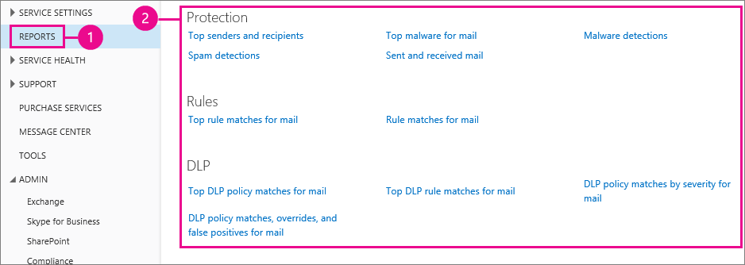
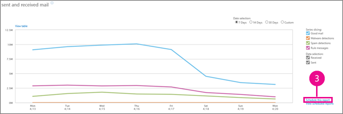
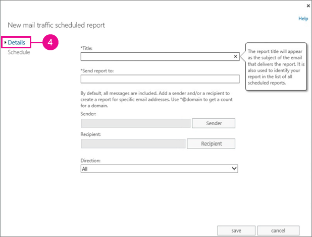
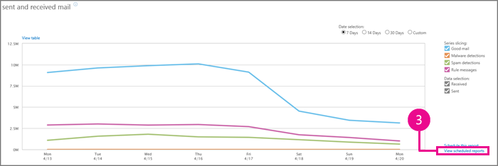
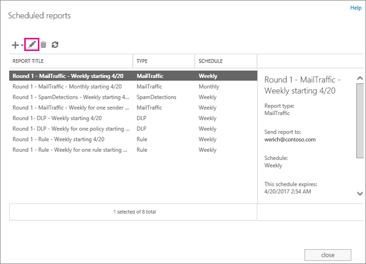
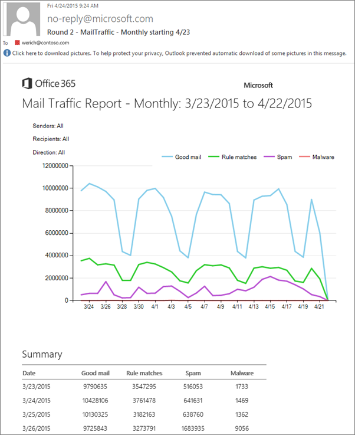
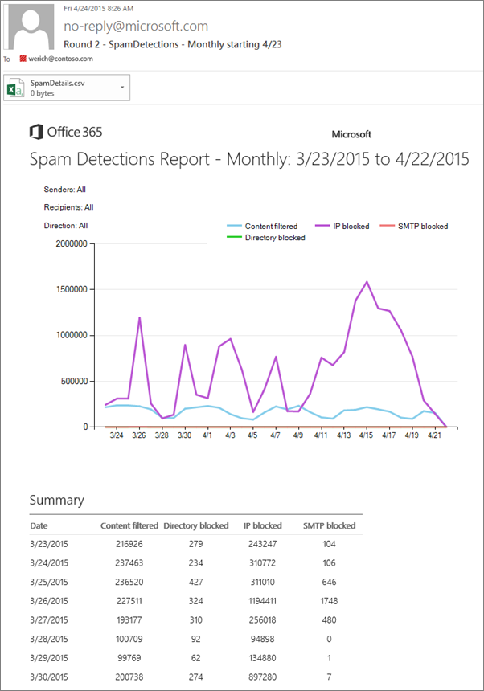
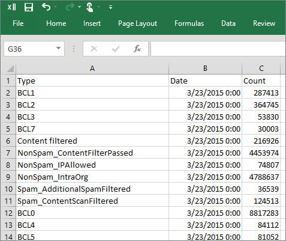
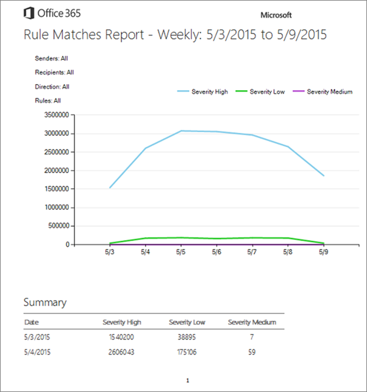
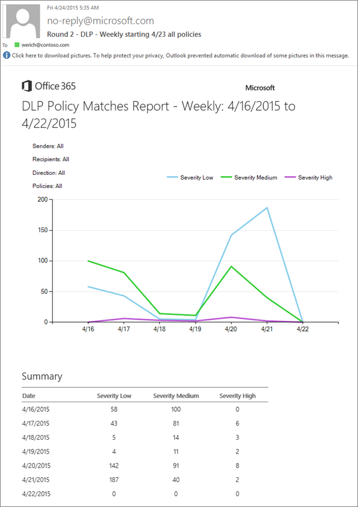

# Customize and schedule mail protection reports in Office 365 to be automatically sent to your inbox

As an Exchange Online or Exchange Online Protection (EOP) admin, you probably want to keep an eye on your organization's mail flow, how much spam and malware is being detected, or how often your rules and policies are being matched. By using mail protection reports, you'll get a quick summary of the messages that Office 365 has delivered or rejected based on spam or malware characteristics, rules, or data loss prevention (DLP) policies. You can choose to either schedule mail protection reports to be sent to your inbox automatically, or you can view them any time in the Office 365 admin center. This article shows you how to schedule reports to be delivered on a weekly or monthly basis, which can be helpful if you need to send the reports to other people or if you want to monitor a specific sender's messages for a while. If your organization has multiple domains, we also show you how to edit your scheduled reports to filter to a specific domain, group, or email address.
  
For a full description of each of the Office 365 mail protection reports and how to view them on demand in the Office 365 admin center, check out [Use mail protection reports in Office 365 to view data about malware, spam, and rule detections](use-mail-protection-reports.md).
  
## What do you want to do?

### Schedule a report to be delivered to your inbox

To schedule delivery of a report, choose the **Schedule this report** link on one of the mail protection report pages. 
  
1. In the Office 365 admin center, go to **REPORTS**.
    
2. Under **Protection**, **Rules** or **DLP** choose the mail protection report that you want to schedule to be delivered to your inbox. For example, choose **Sent and received mail**. 
    
    
  
3. On the **Sent and received mail** page, choose **Schedule this report**.
    
    
  
4. On the **New mail traffic scheduled report** page, use the **Details** tab to customize your report. 
    
    
  
    The following list describes how to use the customizable fields for protection reports.
    
|**Field**|**Description**|
|:-----|:-----|
|**Title** <br/> |Add a descriptive name that will be used as the email subject line when the report is sent to your inbox.  <br/> |
|**Send report to** <br/> |Add a single email address or the distribution list address where you want to the report to be sent.  <br/> |
|**Sender** <br/> |Leave this field blank to track messages from all senders. To customize the report to track messages sent by specific senders, choose **Sender**, and provide either a single email address or distribution list address. If you have multiple domains, you can also add a wildcard address, such as \*@contoso.com, to track all messages sent from a specific domain.  <br/> |
|**Recipient** <br/> |Leave this field blank to track messages delivered to any recipients in your organization. To customize the report to track messages sent to recipients, choose **Recipient**, and provide either a single email address or distribution list address. If you have multiple domains, you can also add a wildcard address, such as \*@contoso.com, to track all messages sent to a specific domain.  <br/> |
|**Direction** <br/> |Leave this field set to **All** to include both sent and received messages in the report. Alternatively, you can choose to only receive a report about messages sent from your organization ( **Outbound**) or messages that are sent to your organization ( **Inbound**).  <br/> |
|**Data or rule selction** <br/> |For **Rules** and **DLP** reports, you can also choose to schedule reports on a specific rule or policy.  <br/> |
   
5. To set how often to send the report and when to start sending it, choose the **Schedule** tab. 
    
    
  
    If you choose to send the report on a weekly basis, the start date determines the day of the week to send the report. For example, if you choose to send the report weekly starting 05/18/2016, the report will be sent every Monday until the expiration date that you specify. If you choose to send the report on a monthly basis, the start date determines the day of the month to send the report. For example, if you choose to send the report monthly starting 05/18/2016, the report will be sent on the 18th of every month until the expiration date that you specify. These dates are just examples. Make sure you choose a current or future start date for your report.
    
    > [!NOTE]
    > If you want to generate a single report as soon as possible, set the start date to today's date and the expiration date to tomorrow's date. The report will be created and sent to the specified inbox within 24 hours. 
  
6. Choose **Save** to finish scheduling the report. 
    
The report will be sent by the end of the date that you selected if you choose a day in the future. If you choose the current date (today), the report might be delivered on the following day (tomorrow).
  
### Customize and view your scheduled reports

To view the list of your previously scheduled reports, choose the **View scheduled reports** link on one of the mail protection report pages. 
  
1. In the Office 365 admin center, go to **REPORTS**.
    
2. Choose any of the mail protection reports, which includes the reports listed under **Protection**, **Rules**, or **DLP**.
    
    
  
3. On the report that you opened, choose **View scheduled reports**, and the **Scheduled reports** page appears. The following image shows where the **View scheduled reports** link is located on the **sent and received mail** summary report. 
    
    
  
4. On the **Scheduled reports** page, you can view details about any of the reports that you previously created by choosing it from the **REPORT TITLE** list. To edit a report, choose it from the list, and then choose **Edit**. Customize the report by using the procedures in steps 4 and 5 in the previous procedure, Note that you can also use the **New** button to schedule a report from the scheduled report list. 
    
    
  
You can also retrieve mail protection reports by using remote PowerShell for Exchange Online or EOP. For example, the following command retrieves the details of spam messages sent by john@contoso between June 13, 2016 and June 15, 2016:
  
```
Get-MailDetailSpamReport -StartDate 06/13/2016 -EndDate 06/15/2016 -SenderAddress john@contoso.com
```

If the predefined mail protection reports in the Office 365 admin center don't provide the data you need, you can use Exchange PowerShell to create one that suits your needs. To get started, see [Exchange Online Protection PowerShell](http://technet.microsoft.com/library/f7918a88-774a-405e-945b-bc2f5ee9f748.aspx). 
  
## Examples of Office 365 mail protection reports

Office 365 uses the account no-reply@microsoft.com to send scheduled reports to the recipients you specified when you scheduled a report. This section shows examples of some of the mail protection reports that those recipients will receive. For a full description of the different items in these reports, see the [Reporting overview](use-mail-protection-reports.md#BKMK_Reportingoverview) section of [Use mail protection reports in Office 365 to view data about malware, spam, and rule detections](use-mail-protection-reports.md).
  
> [!TIP]
> Having problems? Ask for help in the Exchange forums. Visit the forums at [Exchange Server](https://go.microsoft.com/fwlink/p/?linkId=60612),[Exchange Online](https://go.microsoft.com/fwlink/p/?linkId=267542), or [Exchange Online Protection](https://go.microsoft.com/fwlink/p/?linkId=285351). 
  
### Example of mail traffic report

The mail traffic report provides a daily summary mail traffic information, including top senders and recipients. This report tracks good mail, spam, malware, and rule matches for the senders and recipients that you are tracking.
  

  
### Example of spam detections report

The spam detections report provides a breakdown on the overall spam count reported in the mail traffic report. This report tracks the amount of IP blocked, content filtered, SMTP blocked, and directory blocked messages. It also lists the top spam recipients and senders for the recipients and senders that you are tracking.
  

  
The spam detections report also includes a .csv file attachment that provides additional details about why messages were marked as spam or nonspam. The following image is an example of one of those .csv files.
  

  
### Example of rule matches report

Depending on how you set up the report, the rule matches report shows the number of messages that matched any rule (default) or a specific rule if you chose one. The count is separated by rule severity (low, medium, and high). A list of the top ten rules with the most message hits is also included.
  

  
### Example of DLP policy matches report

Depending on how you set up the report, the DLP policy matches report shows the number of messages that matched any DLP policy (default) or matched a specific policy if you chose one. The count is separated by policy severity (low, medium, and high). A list of the top ten policies with the most message hits is also included.
  

  

