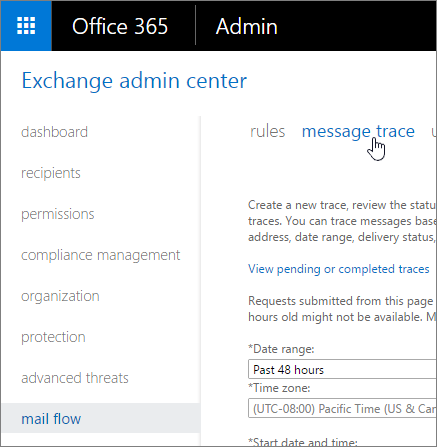

# Run a Message Trace and View Results

As an administrator, you can find out what happened to an email message by running a message trace in the Exchange admin center (EAC). After running the message trace, you can view the results in a list, and then view the details about a specific message. Message trace data is available for the past 90 days. If a message is more than 7 days old, the results can only be viewed in a downloadable .CSV file.
  
For a video walkthrough of message trace and other mail flow troubleshooting tools, see [Find and fix email delivery issues as an Office 365 for business admin](https://support.office.com/article/Find-and-fix-email-delivery-issues-as-an-Office-365-for-business-admin-e7758b99-1896-41db-bf39-51e2dba21de6).
  
## What do you need to know before you begin?

- For information about when data is available and for how long, see the "Reporting and message trace data availability and latency" section in [Reporting and Message Trace in Exchange Online Protection](http://technet.microsoft.com/library/f40253f2-50a1-426e-9979-be74ba74cb61.aspx).
    
- You need to be assigned permissions before you can perform this procedure or procedures. To see what permissions you need, see the "Message trace" entry in the [Feature permissions in Exchange Online](../../permissions-exo/feature-permissions.md) topic. 
    
- For information about keyboard shortcuts that may apply to the procedures in this topic, see **Keyboard shortcuts in the Exchange admin center**.
    
> [!TIP]
> Having problems? Ask for help in the Exchange forums. Visit the forums at [Exchange Server](https://go.microsoft.com/fwlink/p/?linkId=60612),[Exchange Online](https://go.microsoft.com/fwlink/p/?linkId=267542), or [Exchange Online Protection](https://go.microsoft.com/fwlink/p/?linkId=285351). > If you're an Office 365 for business admin, you can [contact Office 365 for business support](https://support.office.com/en-us/article/Contact-Office-365-for-business-support--Admin-Help-32a17ca7-6fa0-4870-8a8d-e25ba4ccfd4b). 
  
## Go to message trace from the Office 365 admin center

1. [Sign in to Office 365](https://support.office.com/article/Where-to-sign-in-to-Office-365-e9eb7d51-5430-4929-91ab-6157c5a050b4) with your work or school account. 
    
2. Select the app launcher icon  in the upper-left and choose **Admin**.
    
3. In the lower-left navigation, expand **Admin** and choose **Exchange**.
    
4. In the Exchange admin center (EAC), go to **mail flow** \> **message trace**
    
    
  
## Run a message trace

1. In the EAC, navigate to **mail flow** \> **message trace**.
    
    
  
2. Depending on what you are searching for, you can enter values in the following fields. None of these fields are required for messages that are less than 7 days old. You can simply click **Search** to retrieve all message trace data over the default time period, which is the past 48 hours. 
    
1. **Date range** Using the drop-down list, select to search for messages sent or received within the past 24 hours, 48 hours, or 7 days. You can also select a custom time frame that includes any range within the past 90 days. For custom searches you can also change the time zone, in Coordinated Universal Time (UTC). 
    
2. **Delivery status** Using the drop-down list, select the status of the message you want to view information about. Leave the default value of **All** to cover all statuses. Other possible values are: 
    
  - **Delivered** The message was successfully delivered to the intended destination. 
    
  - **Failed** The message was not delivered. Either it was attempted and failed or it was not delivered as a result of actions taken by the filtering service. For example, if the message was determined to contain malware. 
    
  - **Pending** Delivery of the message is being attempted or re-attempted. 
    
  - **Expanded** The message was sent to a distribution list and was expanded so the members of the list can be viewed individually. 
    
  - **Unknown** The message delivery status is unknown at this time. When the results of the query are listed, the delivery details fields will not contain any information. 
    
    > [!IMPORTANT]
    > If you are running a message trace for items that are greater than 7 days old, you cannot select **Pending** or **Unknown**. 
  
3. **Message ID** This is the Internet message ID (also known as the Client ID) found in the header of the message with the "Message-ID:" token. Users can provide you with this information in order to investigate specific messages. 
    
    The form of this ID varies depending on the sending mail system. The following is an example: \<08f1e0f6806a47b4ac103961109ae6ef@server.domain\>.
    
    > [!NOTE]
    > Be sure to include the full Message ID string. This may include angle brackets (\<\>). 
  
    This ID should be unique; however, it is dependent on the sending mail system for generation and not all sending mail systems behave the same way. As a result, there's a possibility that you may get results for multiple messages when querying upon a single Message ID.
    
4. **Sender** You can narrow the search for specific senders by clicking the **Add sender** button next to the **Sender** field. In the subsequent dialog box, select one or more senders from your company from the user picker list and then click **Add**. To add senders who aren't on the list, type their email addresses and click **Check names**. In this box, wildcards are supported for email addresses in the format: \*@contoso.com. When specifying a wildcard, other addresses can't be used. When you're done with your selections, click **OK**.
    
5. **Recipient** You can narrow the search for specific recipients by clicking the **Add recipient** button next to the **Recipient** field. In the subsequent dialog box, select one or more recipients from your company from the user picker list and then click **Add**. To add recipients who aren't on the list, type their email addresses and click **Check names**. In this box, wildcards are supported for email addresses in the format: \*@contoso.com. When specifying a wildcard, other addresses can't be used. When you're done with your selections, click **OK**.
    
3. If you're searching for messages that are greater than 7 days old, specify the following parameter values (otherwise you can skip this step):
    
1. **Include message events and routing details with report** We recommend selecting this check box only if you're targeting one or a few specific messages, because including event details will result in a larger report that takes longer to process. 
    
2. **Direction** Using the drop-down list, select whether you want to search for **All** messages (this is the default), **Inbound** messages sent to your organization, or **Outbound** messages sent from your organization. 
    
3. **Original client IP address** Specify the IP address of the sender's client. 
    
4. **Report title** Specify the unique identifier for this report. This will also be used as the subject line text for the email notification. The default is "Message trace report \<day of the week\>, \<current date\> \<current time\>". For example, "Message trace report Thursday, October 17, 2013 7:21:09 AM". 
    
5. **Notification email address** Specify the email address that you want to receive the notification when the message trace completes. This address must reside within your list of accepted domains. 
    
4. Click **Search** to run the message trace. You'll be warned if you're nearing the threshold of the amount of traces you're allowed to run over a 24 hour period. 
    
After running your message trace, depending on whether you're searching for messages that are less than or greater than 7 days old, proceed to one of the next sections to read about how to view your results. 
  
> [!NOTE]
> To search for a different message, you can click the **Clear** button and then specify new search criteria. 
  
## View message trace results for messages that are less than 7 days old

> [!TIP]
> For information about viewing message trace results for messages that are greater than 7 days old, see [View message trace results for messages that are more than 7 days old](run-a-message-trace-and-view-results.md#BKMK_Viewmessagetracefesultsformessagesthataregreaterthan7daysold). 
  
After running the message trace in the EAC, the results will be listed, sorted by date, with the most recent message appearing first. You can sort on any of the listed fields by clicking their headers. Clicking a column header a second time will reverse the sort order. When viewing message trace results, the following information is provided about each message:
  
- **Date** The date and time at which the message was received by the service, using the configured UTC time zone. 
    
- **Sender** The email address of the sender in the form  *alias*  @  *domain*  . 
    
- **Recipient** The email address of the recipient or recipients. For messages sent to more than one recipient, there is one line per recipient. If the recipient is a distribution list, the distribution list will be the first recipient, and then each member of the distribution list will be included on a separate line so that you can check the status for all recipients. 
    
- **Subject** The subject line text of the message. If necessary, this is truncated to the first 256 characters. 
    
- **Status** This field specifies whether the message was **Delivered** to the recipient or the intended destination, **Failed** to be delivered to the recipient (either because it failed to reach its destination or because it was filtered), is **Pending** delivery (it is either in the process of being delivered or the delivery was deferred but is being re-attempted), was **Expanded** (there was no delivery because the message was sent to a distribution list (DL) that was expanded to the recipients of the DL), or has a status of **None** (there is no status of delivery for the message to the recipient because the message was either rejected or redirected to a different recipient). 
    
> [!NOTE]
> The message trace can display a maximum of 500 entries. By default, the user interface displays 50 entries per page, and you can navigate through the pages. You can also change the entry size of each page up to 500. 
  
### View details about a specific message that is less than 7 days old

After you review the list of items returned by running the message trace in the EAC, you can double-click an individual message to view the following additional details about the message:
  
- **Message size** The size of the message, including attachments, in kilobytes (KB), or, if the message size is greater than 999 KBs, in megabytes (MB). 
    
- **Message ID** This is the Internet message ID (also known as the Client ID) found in the header of the message with the "Message-ID:" token. The form of this varies depending on the sending mail system. The following is an example:  *\<08f1e0f6806a47b4ac103961109ae6ef*  @  *server*  .  *domain*  \>. 
    
    This ID should be unique, however, it is dependent on the sending mail system for generation and not all sending mail systems behave the same way. As a result, there is a possibility that you may get results for multiple messages when querying upon a single Message ID.
    
    This is given as output so that trace entries and the messages in question can be co-related.
    
- **To IP** The IP address or addresses to which the service attempted to deliver the message. If there are multiple recipients, these are displayed. For inbound messages sent to Exchange Online, this value is blank. 
    
- **From IP** The IP address of the computer that sent the message. For outbound messages sent from Exchange Online, this value is blank. 
    
In the events section, the following fields provide information about the events that occurred to the message as it passed through the messaging pipeline: 
  
- **Date** The date and time that the event occurred. 
    
- **Event** This field briefly informs you of what happened, for example if the message was received by the service, if it was delivered or failed to be delivered to the intended recipient, and so on. The following are examples of events that may be listed: 
    
  - **RECEIVE** The message was received by the service. 
    
  - **SEND** The message was sent by the service. 
    
  - **FAIL** The message failed to be delivered. 
    
  - **DELIVER** The message was delivered to a mailbox. 
    
  - **EXPAND** The message was sent to a distribution group that was expanded. 
    
  - **TRANSFER** Recipients were moved to a bifurcated message because of content conversion, message recipient limits, or agents. 
    
  - **DEFER** The message delivery was postponed and may be re-attempted later. 
    
  - **RESOLVED** The message was redirected to a new recipient address based on an Active Directory look up. When this happens, the original recipient address is listed in a separate row in the message trace along with the final delivery status for the message. 
    
    > [!TIP]
    > Additional events may appear; for more information about these, see the "Event types in the message tracking log" section in [Message Tracking](http://technet.microsoft.com/library/bada2ea7-6d7c-4630-b7f1-67f56818f0ff.aspx). 
  
- **Action** This field shows the action that was performed if the message was filtered due to a malware or spam detection or a rule match. For example, it will let you know if the message was deleted or if it was sent to the quarantine. 
    
- **Detail** This field provides detailed information that elaborates on what happened. For example, it may inform you which specific transport rule was matched, and what happened to the message as a result of that match. It can also inform you which specific malware was detected in which specific attachment, or why a message was detected as spam. If the message was successfully delivered, it can tell you the IP address to which it was delivered. 
    
## View message trace results for messages that are more than 7 days old

> [!TIP]
> For information about viewing message trace results for messages that are less than 7 days old, see [View message trace results for messages that are less than 7 days old](run-a-message-trace-and-view-results.md#BKMK_Viewmessagetracefesultsformessagesthatarelessthan7daysold). 
  
If you run a message trace for items that are greater than 7 days old, when you click **Search** a message should appear letting you know that the message was successfully submitted, and that an email notification will be sent to the supplied email address when the trace has completed. (If the message trace is processed and data that matches your search criteria is successfully retrieved, this notification message will include information about the trace and a link to the downloadable .CSV file. If no data was found that matched the search criteria you specified, you'll be asked to submit a new request with changed criteria in order to obtain valid results.) 
  
In the EAC, you can click **View pending or completed traces** in order to view a list of traces that were run for items that are greater than 7 days old. In the resulting UI, the list of traces is sorted based on the date and time that they were submitted, with the most recent submissions appearing first. In addition to the report title, the date and time the trace was submitted, and the number of messages in the report, the following status values are listed: 
  
- **Not started** The trace was submitted but is not yet running. At this point, you have the option to cancel the trace. 
    
- **Cancelled** The trace was submitted but was cancelled. 
    
- **In progress** The trace is running and you cannot cancel the trace or download the results. 
    
- **Completed** The trace has completed and you can click **Download this report** to retrieve the results in a .CSV file. Note that if your message trace results exceed 5000 messages for a summary report, it will be truncated to the first 5000 messages. If your message trace results exceed 3000 messages for a detailed report, it will be truncated to the first 3000 messages. If you do not see all the results that you need, we recommend that break your search out into multiple queries. 
    
When you select a specific message trace, additional information appears in the right pane. Depending on what search criteria you specified, this may include details such as the date range for which the trace was run, and the sender and intended recipients of the message.
  
> [!NOTE]
> Message traces containing data that is more than 7 days old are automatically deleted in the EAC after 10 days. They can't be manually deleted. 
  
### View report details about a specific message that is more than 7 days old

When you download and view a message trace report, either from the **View pending or completed traces** UI in the EAC or from a notification email, its contents depend on whether you have selected the **Include message events and routing details with report** option. 
  
> [!IMPORTANT]
> In order to view the downloaded message trace report, you must have the "View-Only Recipients" RBAC role assigned to your role group. By default, the following role groups have this role assigned: Compliance Management, Help Desk, Hygiene Management, Organization Management, View-Only Organization Management. 
  
#### Viewing a message trace report without routing details

If you didn't include routing details when running the message trace, the following information is included in the .CSV file, which you can open in an application such as Microsoft Excel:
  
- **origin_timestamp** The date and time at which the message was received by the service, using the configured UTC time zone. 
    
- **sender_address** The email address of the sender in the form  *alias*  @  *domain*  . 
    
- **Recipient_status** The status of the delivery of the message to the recipient. If the message was sent to multiple recipients, it will show all the recipients and the corresponding status against each, in the format: \<  *email address*  \>##\<  *status*  \>. For example, a status of: 
    
  - **##Receive, Send** means that the message was received by the service and sent to the intended destination. 
    
  - **##Receive, Fail** means that the message was received by the service but failed to be delivered to the intended destination. 
    
  - **##Receive, Deliver** means that the message was received by the service and delivered to the recipient's mailbox. 
    
- **message_subject** The subject line text of the message. If necessary, this is truncated to the first 256 characters. 
    
- **total_bytes** The size of the message, including attachments, in bytes. 
    
- **message_id** This is the Internet message ID (also known as the Client ID) found in the header of the message with the "Message-ID:" token. The form of this varies depending on the sending mail system. The following is an example: \<  *08f1e0f6806a47b4ac103961109ae6ef*  @  *server*  .  *domain*  \>. 
    
    This ID should be unique, however, it is dependent on the sending mail system for generation and not all sending mail systems behave the same way. As a result, there is a possibility that you may get results for multiple messages when querying upon a single Message ID.
    
    This is given as output so that trace entries and the messages in question can be co-related.
    
- **network_message_id** This is a unique message ID value that persists across copies of the message that may be created due to bifurcation or distribution group expansion. An example value is 1341ac7b13fb42ab4d4408cf7f55890f. 
    
- **original_client_ip** The IP address of the sender's client. 
    
- **directionality** This field denotes whether the message was sent inbound (1) to your organization, or whether it was sent outbound (2) from your organization. 
    
- **connector_id** The name of the source or destination Send connector or Receive connector. For example,  *ServerName*  \  *ConnectorName*  or  *ConnectorName*  . 
    
- **delivery_priority** Denotes whether the message was sent with **High**, **Low**, or **Normal** priority. 
    
#### View a message trace report with routing details

If you included routing details when running the message trace, all information from the message tracking logs is included in the .CSV file, which you can open in an application such as Microsoft Excel. Some of the values included in this report are described in the prior section, while other values that may be useful for investigative purposes are described in the "Fields in the message tracking log files" section in the [Message Tracking](http://technet.microsoft.com/library/bada2ea7-6d7c-4630-b7f1-67f56818f0ff.aspx) topic. 
  
#### The custom_data field

Additionally, the **custom_data** field may contain values that are specific to the filtering service. The custom_data field in an AGENTINFO event is used by a variety of different agents to log details from the agent's processing of the message. Some of the message data protection related agents are described below. 
  
 **Spam Filter Agent (S:SFA)**
  
A string beginning with S:SFA is an entry from the spam filter agent and provides the following key details:
  
|||
|:-----|:-----|
|**Log Information**   |**Description**   |
|SFV=NSPM    |The message was marked as non-spam and was sent to the intended recipients.    |
|SFV=SPM    |The message was marked as spam by the content filter.    |
|SFV=BLK    |Filtering was skipped and the message was blocked because it originated from a blocked sender.    |
|SFV=SKS    |The message was marked as spam prior to being processed by the content filter. This includes messages where the message matched a Transport rule to automatically mark it as spam and bypass all additional filtering.    |
|SCL= \< *number*  \>    |For more information about the different SCL values and what they mean, see [Spam Confidence Levels](http://technet.microsoft.com/library/34681000-0022-4b92-b38a-e32b3ed96bf6.aspx).    |
|PCL= \< *number*  \>    |The Phishing Confidence Level (PCL) value of the message. These can be interpreted the same way as the SCL values documented in [Spam Confidence Levels](http://technet.microsoft.com/library/34681000-0022-4b92-b38a-e32b3ed96bf6.aspx).    |
|DI=SB    |The sender of the message was blocked.    |
|DI=SQ    |The message was quarantined.    |
|DI=SD    |The message was deleted.    |
|DI=SJ    |The message was sent to the recipient's Junk Email folder.    |
|DI=SN    |The message was routed through the higher risk delivery pool. For more information, see [Higher risk delivery pool for Outbound Messages](http://technet.microsoft.com/library/ac11edd9-2da3-462d-8ea3-bbf9dbc6f948.aspx).    |
|DI=SO    |The message was routed through the normal outbound delivery pool.    |
|SFS=[a]|SFS=[b]    |This denotes that spam rules were matched.    |
|IPV=CAL    |The message was allowed through the spam filters because the IP address was specified in an IP Allow list in the connection filter.    |
|H=[helostring]    |The HELO or EHLO string of the connecting mail server.    |
|PTR=[ReverseDNS]    |The PTR record of the sending IP address, also known as the reverse DNS address.    |
   
When a message is filtered for spam, a sample custom_data entry would look similar to the following:
  
S:SFA=SUM|SFV=SPM|IPV=CAL|SRV=BULK|SFS=470454002|SFS=349001|SCL=9|SCORE=-1|LIST=0|DI=SN|RD=ftmail.inc.com|H=ftmail.inc.com|CIP=98.129.140.74|SFP=1501|ASF=1|CTRY=US|CLTCTRY=|LANG=en|LAT=287|LAT=260|LAT=18;
  
 **Malware Filter Agent (S:AMA)**
  
A string beginning with S:AMA is an entry from the anti-malware agent and provides the following key details:
  
|||
|:-----|:-----|
|**Log Information**   |**Description**   |
|AMA=SUM|v=1|    or    AMA=EV|v=1    |The message was determined to contain malware. SUM denotes that the malware could've been detected by any number of engines. EV denotes that the malware was detected by a specific engine. When malware is detected by an engine this triggers the subsequent actions.    |
|Action=r    |The message was replaced.    |
|Action=p    |The message was bypassed.    |
|Action=d    |The message was deferred.    |
|Action=s    |The message was deleted.    |
|Action=st    |The message was bypassed.    |
|Action=sy    |The message was bypassed.    |
|Action=ni    |The message was rejected.    |
|Action=ne    |The message was rejected.    |
|Action=b    |The message was blocked.    |
|Name=\< *malware*  \>    |The name of the malware that was detected.    |
|File=\< *filename*  \>    |The name of the file that contained the malware.    |
   
When a message contains malware, a sample custom_data entry would look similar to the following:
  
S:AMA=SUM|v=1|action=b|error=|atch=1;S:AMA=EV|engine=M|v=1|sig=1.155.974.0|name=DOS/Test_File|file=filename;S:AMA=EV|engine=A|v=1|sig=201307282038|name=Test_File|file=filename
  
 **Transport Rule Agent (S:TRA)**
  
A string beginning with S:TRA is an entry from the transport rule agent and provides the following key details:
  
|||
|:-----|:-----|
|**Log Information**   |**Description**   |
|ETR|ruleId=[guid]    |The rule ID that was matched.    |
|St=[datetime]    |The date and time (in UTC) when the rule match occurred.    |
|Action=[ActionDefinition]    |The action that was applied. For a list of available actions, see [Mail flow rule actions in Exchange Online](../../security-and-compliance/mail-flow-rules/mail-flow-rule-actions.md).    |
|Mode=Enforce    | The mode of the rule. Possible values are:    **Enforce:** All actions on the rule will be enforced.    **Test with Policy Tips:** Any Policy Tip actions will be sent, but other enforcement actions will not be acted on.    **Test without Policy Tips:** Actions will be listed in a log file, but senders will not be notified in any way, and enforcement actions will not be acted on.    |
   
When a message matches a transport rule, a sample custom_data entry would look similar to the following:
  
S:TRA=ETR|ruleId=19a25eb2-3e43-4896-ad9e-47b6c359779d|st=7/17/2013 12:31:25 AM|action=ApplyHtmlDisclaimer|sev=1|mode=Enforce
  
## For more information

[Message Trace FAQ](message-trace-faq.md) presents messaging questions that a user may have, along with possible answers. It also describes how to use the message trace tool in order to get those answers and troubleshoot specific mail delivery issues. 
  
[Can I run a message trace via remote Windows PowerShell rather than the user interface?](message-trace-faq.md#CanIrunamessagetraceviaremoteWindowsPowerShell) gives information about the remote Windows PowerShell cmdlets that you can use to run a message trace. 
  

