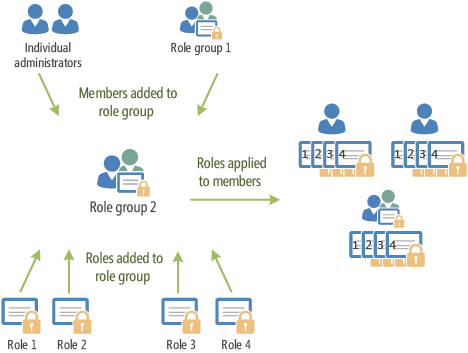

# Permissions in Exchange Online

Exchange Online in Office 365 includes a large set of predefined permissions, based on the Role Based Access Control (RBAC) permissions model, which you can use right away to easily grant permissions to your administrators and users. You can use the permissions features in Exchange Online so that you can get your new organization up and running quickly. 
  
RBAC is also the permissions model that's used in Microsoft Exchange Server 2013. Most of the links in this topic refer to topics that reference Exchange 2013. The concepts in those topics also apply to Exchange Online.
  
For information about permissions across Office 365, see [Permissions in Office 365](https://go.microsoft.com/fwlink/p/?LinkId=263762)
  
> [!NOTE]
> Several RBAC features and concepts aren't discussed in this topic because they're advanced features. If the functionality discussed in this topic doesn't meet your needs, and you want to further customize your permissions model, see [Understanding Role Based Access Control](http://technet.microsoft.com/library/fd268867-2ae5-441b-8103-7a7583eb2bbe.aspx). 
  
## Role-based permissions

In Exchange Online, the permissions that you grant to administrators and users are based on management roles. A management role defines the set of tasks that an administrator or user can perform. For example, a management role called  `Mail Recipients` defines the tasks that someone can perform on a set of mailboxes, contacts, and distribution groups. When a management role is assigned to an administrator or user, that person is granted the permissions provided by the management role. 
  
Administrative roles and end-user roles are the two types of management roles. Following is a brief description of each type:
  
- **Administrative roles** These roles contain permissions that can be assigned to administrators or specialist users using role groups that manage a part of the Exchange Online organization, such as recipients, compliance management, or Unified Messaging. 
    
- **End-user roles** These roles, which are assigned using role assignment policies, enable users to manage aspects of their own mailbox and distribution groups that they own. End-user roles begin with the prefix  `My`.
    
Management roles give permissions to perform tasks to administrators and users by making cmdlets available to those who are assigned the roles. Because the Exchange admin center (EAC) and the Exchange Management Shell use cmdlets to manage Exchange Online, granting access to a cmdlet gives the administrator or user permission to perform the task in each of the Exchange Online management interfaces.
  
Exchange Online includes approximately 45 roles that you can use to grant permissions. For a list of roles, see [Built-in Management Roles](http://technet.microsoft.com/library/023f379a-40f6-43ef-b388-979f6dd85ec5.aspx).
  
> [!NOTE]
> Some management roles many be available only to on-premises Exchange Server installations and won't be available in Exchange Online. 
  
## Role groups and role assignment policies

Management roles grant permissions to perform tasks in Exchange Online, but you need an easy way to assign them to administrators and users. Exchange Online provides you with the following to help you make assignments:
  
- **Role groups** Role groups enable you to grant permissions to administrators and specialist users. 
    
- **Role assignment policies** Role assignment policies enable you to grant permissions to end users to change settings on their own mailbox or distribution groups that they own. 
    
The following sections provide more information about role groups and role assignment policies.
  
### Role groups

Every administrator who manages Exchange Online must be assigned at least one or more roles. Administrators might have more than one role because they may perform job functions that span multiple areas in Exchange Online. For example, one administrator might manage both recipients and Unified Messaging features in the Exchange Online organization. In this case, that administrator might be assigned both the  `Mail Recipients` and  `Unified Messaging` roles. 
  
To make it easier to assign multiple roles to an administrator, Exchange Online includes role groups. When a role is assigned to a role group, the permissions granted by the role are granted to all the members of the role group. This enables you to assign many roles to many role group members at once. Role groups typically encompass broader management areas, such as recipient management. They're used only with administrative roles, and not end-user roles. Role group members can be Exchange Online users and other role groups.
  
> [!NOTE]
> It's possible to assign a role directly to a user without using a role group. However, that method of role assignment is an advanced procedure and isn't covered in this topic. We recommend that you use role groups to manage permissions. 
  
The following figure shows the relationship between users, role groups, and roles.
  
 **Roles, role groups, and role group members**
  

  
Exchange Online includes several built-in role groups, each one providing permissions to manage specific areas in Exchange Online. Some role groups may overlap with other role groups. The following table lists each role group with a description of its use.
  
**Built-in role groups**

|**Role group**|**Description**|
|:-----|:-----|
|Company Administrators ( **TenantAdmins_** _\<unique value\>_)    |The Company Administrators role group is a special role group that ties together the Global administrators Office 365 role and the Organization Management Role Exchange Online role group. The Company Administrators role group doesn't have any roles assigned to it. However, it's a member of the Organization Management role group and inherits the permission provided by that role group.    This role group can't be managed in Exchange Online. You can add members to this role group by adding users to the Global administrator Office 365 role.    |
|Discovery Management    |Administrators or users who are members of the Discovery Management role group can perform searches of mailboxes in the Exchange Online organization for data that meets specific criteria and can also configure legal holds on mailboxes.    |
|Help Desk    |The Help Desk role group, by default, enables members to view and modify the Microsoft Outlook Web App options of any user in the organization. These options might include modifying the user's display name, address, and phone number. They don't include options that aren't available in Outlook Web App options, such as modifying the size of a mailbox or configuring the mailbox database on which a mailbox is located.    |
|Help Desk Administrators ( **HelpdeskAdmins_** _\<unique value\>_)    |The Help Desk Administrators role group doesn't have any roles assigned to it. However, it's a member of the View-Only Organization Management role group and inherits the permissions provided by that role group.    This role group can't be managed in Exchange Online. You can add members to this role group by adding users to the Password administrator Office 365 role.    |
|Organization Management    |Administrators who are members of the Organization Management role group have administrative access to the entire Exchange Online organization and can perform almost any task against any Exchange Online object, with some exceptions, such as the  `Discovery Management` role.    > [!IMPORTANT]> Because the Organization Management role group is a powerful role, only users that perform organizational-level administrative tasks that can potentially impact the entire Exchange Online organization should be members of this role group.           |
|Recipient Management    |Administrators who are members of the Recipient Management role group have administrative access to create or modify Exchange Online recipients within the Exchange Online organization.    |
|Records Management    |Users who are members of the Records Management role group can configure compliance features, such as retention policy tags, message classifications, and transport rules.    |
|UM Management    |Administrators who are members of the UM Management role group can manage features in the Exchange Online organization such as UM properties on mailboxes, UM prompts, and UM auto attendant configuration.    |
|View-Only Organization Management    |Administrators who are members of the View Only Organization Management role group can view the properties of any object in the Exchange Online organization.    |
   
If you work in a small organization that has only a few administrators, you might need to add those administrators to the Organization Management role group only, and you may never need to use the other role groups. If you work in a larger organization, you might have administrators who perform specific tasks administering Exchange Online, such as recipient or organization-wide Unified Messaging configuration. In those cases, you might add one administrator to the Recipient Management role group, and another administrator to the UM Management role group. Those administrators can then manage their specific areas of exExchangeOnline, but they won't have permissions to manage areas they're not responsible for.
  
If the built-in role groups in Exchange Online don't match the job function of your administrators, you can create role groups and add roles to them. For more information, see **Work with role groups** later in this topic. 
  
### Role assignment policies

Exchange Online provides role assignment policies so that you can control what settings your users can configure on their own mailboxes and on distribution groups they own. These settings include their display name, contact information, voice mail settings, and distribution group membership.
  
Your Exchange Online organization can have multiple role assignment policies that provide different levels of permissions for the different types of users in your organizations. Some users can be allowed to change their address or create distribution groups, while others can't, depending on the role assignment policy associated with their mailbox. Role assignment policies are added directly to mailboxes, and each mailbox can only be associated with one role assignment policy at a time. 
  
Of the role assignment policies in your organization, one is marked as default. The default role assignment policy is associated with new mailboxes that aren't explicitly assigned a specific role assignment policy when they're created. The default role assignment policy should contain the permissions that should be applied to the majority of your mailboxes. 
  
Permissions are added to role assignment policies using end-user roles. End-user roles begin with  `My` and grant permissions for users to manage only their mailbox or distribution groups they own. They can't be used to manage any other mailbox. Only end-user roles can be assigned to role assignment policies. 
  
When an end-user role is assigned to a role assignment policy, all of the mailboxes associated with that role assignment policy receive the permissions granted by the role. This enables you to add or remove permissions to sets of users without having to configure individual mailboxes. The following figure shows:
  
- End-user roles are assigned to role assignment policies. Role assignment policies can share the same end-user roles.
    
- Role assignment policies are associated with mailboxes. Each mailbox can only be associated with one role assignment policy.
    
- After a mailbox is associated with a role assignment policy, the end-user roles are applied to that mailbox. The permissions granted by the roles are granted to the user of the mailbox.
    
 **Roles, role assignment policies, and mailboxes**
  

  
The Default Role Assignment Policy role assignment policy is included with Exchange Online. As the name implies, it's the default role assignment policy. If you want to change the permissions provided by this role assignment policy, or if you want to create role assignment policies, see [Work with role assignment policies](#CustomRAP.md) later in this topic. 
  
## Office 365 permissions in Exchange Online

When you create a user in Office 365, you can choose whether to assign various administrative roles, such as Global administrator, Service administrator, Password administrator, and so on, to the user. Some, but not all, Office 365 roles grant the user administrative permissions in Exchange Online. 
  
> [!NOTE]
> The user that was used to create your Office 365 tenant is automatically assigned to the Global administrator Office 365 role. 
  
The following table lists the Office 365 roles and the Exchange Online role group they correspond to.
  
|**Office 365 role**|**Exchange Online role group**|
|:-----|:-----|
|Global administrator    |Organization Management    **Note**: The Global administrator role and the Organization Management role group are tied together using a special Company Administrator role group. The Company Administrator role group is managed internally by Exchange Online and can't be modified directly.    |
|Billing administrator    |No corresponding Exchange Online role group.    |
|Password administrator    |Help Desk administrator.    |
|Service administrator    |No corresponding Exchange Online role group.    |
|User management administrator    |No corresponding Exchange Online role group.    |
   
For a description of the Exchange Online role groups, see the table "Built-in role groups" in [Role groups](#RoleGroupsOverview.md).
  
When you add a user to either the Global administrator or Password administrator Office 365 roles, the user is granted the rights provided by the respective Exchange Online role group. Other Office 365 roles don't have a corresponding Exchange Online role group and won't grant administrative permissions in Exchange Online. For more information about assigning an Office 365 role to a user, see [Assigning admin roles](https://go.microsoft.com/fwlink/p/?LinkId=293670).
  
Users can be granted administrative rights in Exchange Online without adding them to Office 365 roles. This is done by adding the user as a member of an Exchange Online role group. When a user is added directly to an Exchange Online role group, they'll receive the permissions granted by that role group in Exchange Online. However, they won't be granted any permissions to other Office 365 components. They'll have administrative permissions only in Exchange Online. Users can be added to any of the role groups listed in the "Built-in role groups table" in [Role groups](#RoleGroupsOverview.md) with the exception of the Company Administrator and Help Desk Administrators role groups. For more information about adding a user directly to an Exchange Online role group, see [Work with role groups](#CustomRoleGroup.md).
  
## Work with role groups

To manage your permissions using role groups in Exchange Online, we recommend that you use the EAC. When you use the EAC to manage role groups, you can add and remove roles and members, create role groups, and copy role groups with a few clicks of your mouse. The EAC provides simple dialog boxes, such as the **new role group** dialog box, shown in the following figure, to perform these tasks. 
  
 **New role group dialog box in the EAC**
  

  
Exchange Online includes several role groups that separate permissions into specific administrative areas. If these existing role groups provide the permissions your administrators need to manage your Exchange Online organization, you need only add your administrators as members of the appropriate role groups. After you add administrators to a role group, they can administer the features that relate to that role group. To add or remove members to or from a role group, open the role group in the EAC, and then add or remove members from the membership list. For a list of built-in role groups, see the table "Built-in role groups" in [Role groups](#RoleGroupsOverview.md).
  
> [!IMPORTANT]
> If an administrator is a member of more than one role group, Exchange Online grants the administrator all of the permissions provided by the role groups he or she is a member of. 
  
If none of the role groups included with Exchange Online have the permissions you need, you can use the EAC to create a role group and add the roles that have the permissions you need. For your new role group, you will:
  
1. Choose a name for your role group.
    
2. Select the roles you want to add to the role group.
    
3. Add members to the role group.
    
4. Save the role group.
    
After you create the role group, you manage it like any other role group. 
  
If there's an existing role group that has some, but not all, of the permissions you need, you can copy it and then make changes to create a role group. You can copy an existing role group and make changes to it, without affecting the original role group. As part of copying the role group, you can add a new name and description, add and remove roles to and from the new role group, and add new members. When you create or copy a role group, you use the same dialog box that's shown in the preceding figure.
  
Existing role groups can also be modified. You can add and remove roles from existing role groups, and add and remove members from it at the same time, using an EAC dialog box similar to the one in the preceding figure. By adding and removing roles to and from role groups, you turn on and off administrative features for members of that role group. 
  
> [!NOTE]
> Although you can change which roles are assigned to built-in role groups, we recommend that you copy built-in role groups, modify the role group copy, and then add members to the role group copy. > The Company Administrator and Help Desk administrator role groups can't be copied or changed. 
  
[Role-based permissions](#RoleBased.md)
  
## Work with role assignment policies

To manage the permissions that you grant end users to manage their own mailbox in Exchange Online, we recommend that you use the EAC. When you use the EAC to manage end-user permissions, you can add roles, remove roles, and create role assignment policies with a few clicks of your mouse. The EAC provides simple dialog boxes, such as the **role assignment policy** dialog box, shown in the following figure, to perform these tasks. 
  
 **Role assignment policy dialog box in the EAC**
  

  
Exchange Online includes a role assignment policy named Default Role Assignment Policy. This role assignment policy enables users whose mailboxes are associated with it to do the following:
  
- Join or leave distribution groups that allow members to manage their own membership.
    
- View and modify basic mailbox settings on their own mailbox, such as Inbox rules, spelling behavior, junk mail settings, and Microsoft ActiveSync devices.
    
- Modify their contact information, such as work address and phone number, mobile phone number, and pager number.
    
- Create, modify, or view text message settings.
    
- View or modify voice mail settings.
    
- View and modify their marketplace apps.
    
- Create team mailboxes and connect them to Microsoft SharePoint lists.
    
- Create, modify, or view email subscription settings, such as message format and protocol defaults.
    
If you want to add or remove permissions from the Default Role Assignment Policy or any other role assignment policy, you can use the EAC. The dialog box you use is similar to the one in the preceding figure. When you open the role assignment policy in the EAC, select the check box next to the roles you want to assign to it or clear the check box next to the roles you want to remove. The change you make to the role assignment policy is applied to every mailbox associated with it.
  
If you want to assign different end-user permissions to the various types of users in your organization, you can create role assignment policies. When you create a role assignment policy, you see a dialog box similar to the one in the preceding figure. You can specify a new name for the role assignment policy, and then select the roles you want to assign to the role assignment policy. After you create a role assignment policy, you can associate it with mailboxes using the EAC.
  
If you want to change which role assignment policy is the default, you must use the Exchange Management Shell. When you change the default role assignment policy, any mailboxes that are created will be associated with the new default role assignment policy if one wasn't explicitly specified. The role assignment policy associated with existing mailboxes doesn't change when you select a new default role assignment policy.
  
> [!NOTE]
> If you select a check box for a role that has child roles, the check boxes for the child roles are also selected. If you clear the check box for a role with child roles, the check boxes for the child roles are also cleared. 
  
## Permissions documentation

The following table contains links to topics that will help you learn about and manage permissions in Exchange Online.
  
|**Topic**|**Description**|
|:-----|:-----|
|[Understanding Role Based Access Control](http://technet.microsoft.com/library/fd268867-2ae5-441b-8103-7a7583eb2bbe.aspx)   |Learn about each of the components that make up RBAC and how you can create advanced permissions models if role groups and management roles aren't enough.    |
|[Manage Role Groups](http://technet.microsoft.com/library/ab9b7a3b-bf67-4ba1-bde5-8e6ac174b82c.aspx)   |Configure permissions for Exchange Online administrators and specialist users using role groups.    |
|[Manage Role Group Members](http://technet.microsoft.com/library/c064729d-7cda-47fc-b105-acf4b300d430.aspx)   |Add members to and from role groups. By adding and removing members to and from role groups, you configure who's able to administer Exchange Online features.    |
|[Manage Role Assignment Policies](http://technet.microsoft.com/library/f93d502e-5df4-4ba0-b68d-01a17ccffb4d.aspx)   |Configure which features end-users have access to on their mailboxes using role assignment policies, and change which role assignment policy is the default assignment policy.    |
|[Change the Assignment Policy on a Mailbox](http://technet.microsoft.com/library/011690a5-233a-4c03-8842-92276f899a89.aspx)   |Configure which role assignment policy is applied to one or more mailboxes.    |
|[View Effective Permissions](http://technet.microsoft.com/library/ae6cb7cf-f998-44a6-a69a-02ad736c8260.aspx)   |View who has permissions to administer Exchange Online features.    |
|[Feature permissions in Exchange Online](feature-permissions.md)   |Learn more about the permissions required to manage Exchange Online features and services.    |
   

