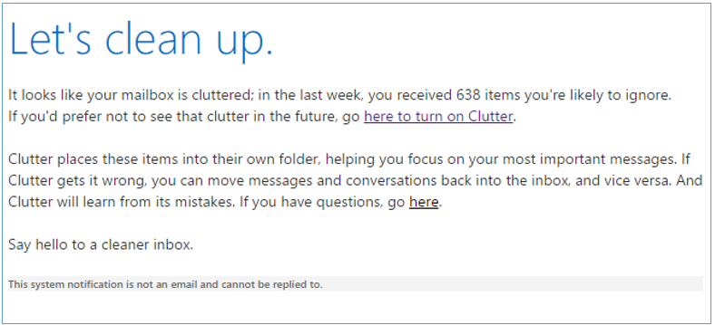
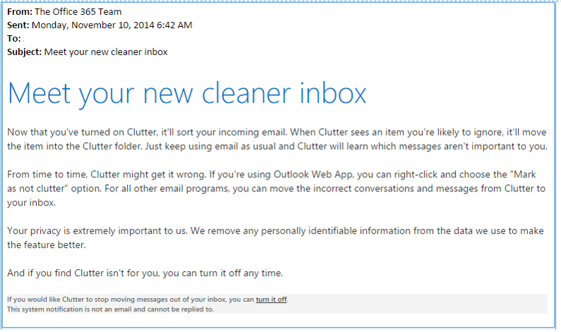
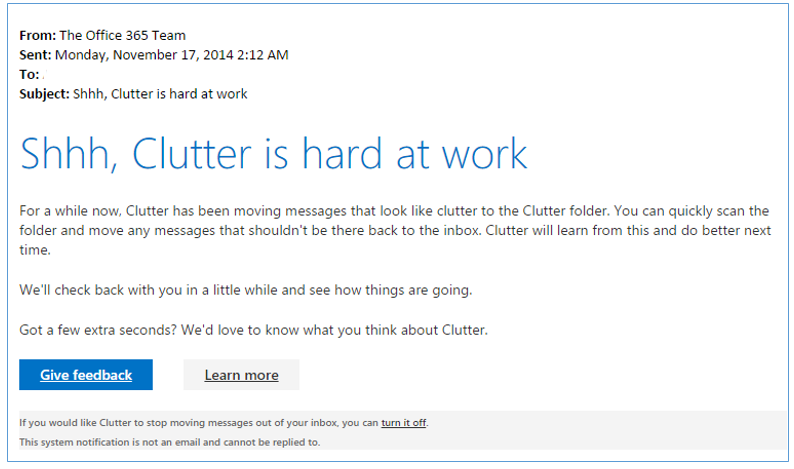

# Clutter notifications in Outlook

Clutter is a feature in Office 365 designed to help users focus on the most important messages in their Inbox by moving lower priority messages into a new Clutter folder.
  
## Clutter Notifications

 Clutter is enabled by users in their O365 **Settings** options. This article contains information for O365 administrators about notifications from Clutter to end-users. 
  
These notifications are an integral part of the Clutter feature and therefore can't be suspended by administrators. Clutter is a user election, similar to someone opting to use Conversation view, and the notifications help the user understand the state of Clutter across all clients. There is no central reporting available at this time. For information on how to change the branding of the notifications see [Change the branding of Clutter notifications](change-clutter-notification-branding.md).
  
> [!NOTE]
> For information on how end users can enable and begin using Clutter, see [Use Clutter to sort low priority messages in Outlook Web App](https://go.microsoft.com/fwlink/p/?LinkId=528411). 
  
 **Invitation to use Clutter**
  
Before users enable Clutter, they may receive a Clutter invitation in their Inbox. The invitation lets the user know that the feature is available and covers the benefits of using Clutter.
  
Clutter is always running in the background, as Exchange looks at a user's mailbox and tries to train itself to identify low-priority messages. The invitation that a user receives provides a link to turn Clutter "on" (or enable Clutter), meaning the user now allows Clutter to automatically move low-priority message from their Inbox to a dedicated folder.
  
To determine whether or not a user receives an invitation to enable Clutter, there are several criteria, including:
  
- Has Exchange looked at enough information in a user's mailbox to determine the parameters for Clutter?
    
- Sufficient email: Does the user receive at least 3 clutter messages and at least 3 non-clutter messages?
    
- Watermark current : Is the state of training reflective of the user's current state?
    
- Supported classification version: Is the version for which training is complete still supported?
    
- True positive rate: Are at least 85% of true clutter messages classified as clutter?
    
- False positive rate: Are less than 20% of messages classified as clutter actually non-clutter?
    
An example of the invitation notification is as follows:
  

  
Around the time that an invitation is sent, a new folder called **Clutter** is created and added to their Favorites. The same invitation message will appear as the first message inside the **Clutter** folder. 
  
 **Cleaning up**
  
To make sure the user understands that the new feature is on, Clutter will send another notification to their Inbox, describing how Clutter works and how to correct Clutter when it incorrectly moves a message to the **Clutter** folder. Clutter is a "learning" feature, which means that after the user provides information to Clutter by manually moving low-priority messages to the **Clutter** folder, Clutter will be able to identify similar messages and move them automatically. 
  
 If the user finds that Clutter isn't what they need, this notification also provides a link for turning Clutter off. In newer clients, there are specific controls to control Clutter, but these are unavailable in older clients. 
  

  
 **Hard at work**
  
During the first three weeks of Clutter usage, the following notification is sent periodically for two reasons. First, it reminds the user to inspect the **Clutter** folder and make sure that Clutter is filtering messages correctly. Second, this notification provides a way for the user to provide feedback on Clutter. Additionally, there are links that provide more information about the feature and that turn Clutter off. 
  

  

