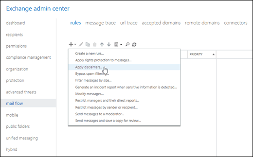

# Organization-wide message disclaimers, signatures, footers, or headers in Office 365

 **Summary**: Learn how admins can apply an organization-wide signature (disclaimer) to all outbound messages in Office 365.
  
You can add an HTML or plain text legal disclaimer, disclosure statement, signature, or other information to the top or bottom of email messages that enter or leave your organization. To do this, you create a mail flow rule (also known as a transport rule) that adds the required information to messages.
  
 **Notes**:
  
- If you want the information to be added only to outgoing messages, you need to add a corresponding condition (for example, recipients located outside the organization). By default, mail flow rules are applied to incoming and outgoing messages.
    
- To avoid multiple disclaimers being added in an email conversation, add an exception that looks for unique text in your disclaimer. This ensures that the disclaimer is only added to the original message.
    
- Test the disclaimer. When you create the mail flow rule, you have the option to start using it immediately ( **Enforce**), or to test it first and view the results in the messaging log. We recommend testing all mail flow rules prior to setting them to **Enforce**.
    
For examples and information about how to scope and format disclaimers, signatures, and other additions to email messages, see [Organization-wide disclaimers, signatures, footers, or headers in Exchange 2016](http://technet.microsoft.com/library/e45e33c9-e53b-427c-ada5-70901bc399b8.aspx).
  
## What do you need to know before you begin?

- Estimated time to complete each procedure: 15 minutes.
    
- For information about how to access the Exchange admin center (EAC), see [Exchange admin center in Exchange Online](../../exchange-admin-center.md). To learn how to use Windows PowerShell to connect to Exchange Online, see [Connect to Exchange Online PowerShell](https://go.microsoft.com/fwlink/p/?linkid=396554). 
    
- You need to be assigned permissions before you can perform this procedure or procedures. To see what permissions you need, see the "Mail flow" entry in the [Feature permissions in Exchange Online](../../permissions-exo/feature-permissions.md) topic. 
    
- For information about keyboard shortcuts that may apply to the procedures in this topic, see **Keyboard shortcuts in the Exchange admin center**.
    
> [!TIP]
> Having problems? Ask for help in the Exchange forums. Visit the forums at [Exchange Server](https://go.microsoft.com/fwlink/p/?linkId=60612),[Exchange Online](https://go.microsoft.com/fwlink/p/?linkId=267542), or [Exchange Online Protection](https://go.microsoft.com/fwlink/p/?linkId=285351). 
  
## What do you want to do?

### Use the EAC to add a disclaimer or other email header or footer

1. Open the EAC and go to **Mail flow** \> **Rules**.
    
2. Click **Add**, and then click **Apply disclaimers**.
    
    
  
3. In the **New rule** window that appears, enter a unique name the rule. 
    
4. In the **Apply this rule if** box, select the conditions for displaying the disclaimer. For example, select **The recipient is located** condition, and then select **Outside the organization**. If you want this rule to apply to every message that enters or leaves your organization, select **[Apply to all messages]**.
    
5. Next to the **Do the following** box, select **Enter text** to enter the text of your disclaimer. For information about what can be added, see [Formatting your disclaimer](http://technet.microsoft.com/library/e45e33c9-e53b-427c-ada5-70901bc399b8.aspx#FormatDisclaimer).
    
6. Click **Select one**, and select one of the [Fallback options if the disclaimer can't be added](http://technet.microsoft.com/library/e45e33c9-e53b-427c-ada5-70901bc399b8.aspx#FallbackOptions).
    
7. Specify the audit severity level to assign the severity level that appears in the message log.
    
8. Select the mode for the rule. Select **Enforce** to turn on the disclaimer immediately, or select **Test without Policy Tips** to put a message in the message tracking log instead of adding the disclaimer. 
    
9. If you have additional conditions or exceptions that you want to add, select **More options** at the bottom of the page, which will show additional settings. For example, to add the exception that prevents multiple disclaimers being added in an email conversation, select **Add exception** and then select **The subject or body** \> **Subject or body matches these text patterns**, and then specify the words or phrases in your disclaimer. Or, to put your disclaimer at the top of the email message instead of the bottom, in **Do the following**, select **Apply a disclaimer to the message** \> **prepend a disclaimer**.
    
10. When you're finished, click **Save**.
    
For more examples of how to scope your disclaimer, see [Scoping your disclaimer](http://technet.microsoft.com/library/e45e33c9-e53b-427c-ada5-70901bc399b8.aspx#Scoping).
  
### Use Exchange Online PowerShell to add a disclaimer or other email header or footer

Use the [New-TransportRule](http://technet.microsoft.com/library/eb3546bf-ca37-474e-9c22-962fe95af276.aspx) cmdlet to create the disclaimer rule. For detailed parameter information, see [Mail flow rule conditions and exceptions (predicates) in Exchange Online](conditions-and-exceptions.md) or [Mail flow rule conditions and exceptions (predicates) in Exchange Online Protection](http://technet.microsoft.com/library/04edeaba-afd4-4207-b2cb-51bcc44e483c.aspx).
  
This example creates a new mail flow rule that adds a disclaimer with an image to the end of all email messages that are sent outside the organization.
  
```
New-TransportRule -Name "External Disclaimer" -SentToScope NotInOrganization -ApplyHtmlDisclaimerText "<h3>Disclaimer Title</h3><p>This is the disclaimer text.</p>"
```

This example creates a new mail flow rule that adds an advertisement for one month to the beginning of all outgoing messages.
  
```
New-TransportRule -Name "March Special" -Enabled $true -SentToScope NotInOrganization -ApplyHtmlDisclaimerLocation Prepend -ActivationDate '03/1/2017' -ExpiryDate '03/31/2017'-ApplyHtmlDisclaimerText "<table align=center width=200 border=1 bordercolor=blue bgcolor=green cellpadding=10 cellspacing=0><tr><td nowrap><a href=http://www.contoso.com/marchspecials.htm>Click to see March specials</a></td></tr></table>"
```

For more examples of how to scope your disclaimer, see [Scoping your disclaimer](http://technet.microsoft.com/library/e45e33c9-e53b-427c-ada5-70901bc399b8.aspx#Scoping).
  
### How do you know this worked?

To verify that you've successfully created a disclaimer, and that the disclaimer works as expected, do the following steps:
  
- Send yourself both a plain text email and an HTML email that match the conditions and exceptions you defined, and verify that the text appears as you intended.
    
- If you added an exception to avoid adding the disclaimer to successive messages in a conversation, forward your test messages to yourself to make sure that they don't get an extra copy of the disclaimer.
    
- Send yourself some messages that should not get the disclaimer and verify that the disclaimer is not included.
    
## For more information

After you configure a disclaimer or email header or footer, see [Manage mail flow rules](manage-mail-flow-rules.md) for information about how to view, modify, enable, disable, or remove a rule. 
  

