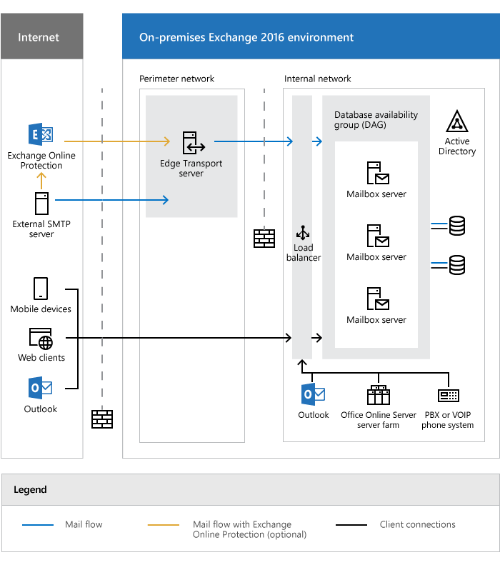
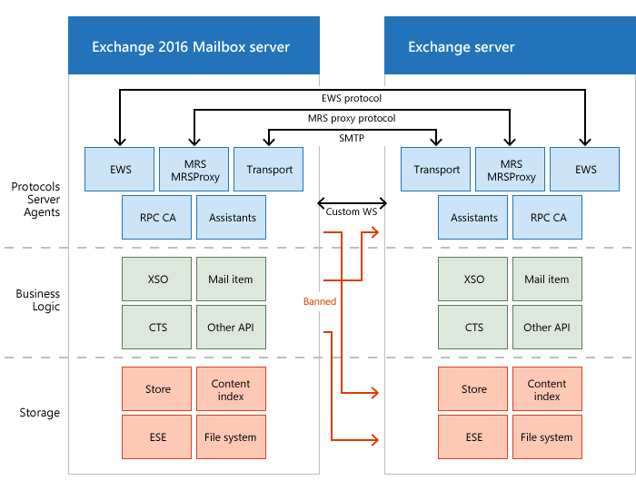
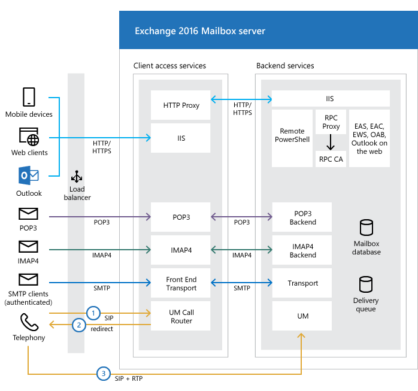

# Exchange 2016 architecture

 **Summary**: Learn about the architecture of Exchange 2016

Exchange Server 2016 uses a single building block architecture that provides email services for deployments at all sizes, from small organizations to the largest multi-national corporations. This architecture is describe in the following diagram.

Individual components are described in the following sections.

## Server communication architecture

Communication between Exchange 2016 servers and past and future versions of Exchange occurs at the protocol layer. Cross-layer communication isn't allowed. This communication architecture is summarized as "every server is an island". This architecture has the following benefits:

- Reduced inter-server communications.

- Version-aware communications.

- Isolated failures.

- Integrated design inside each server.

Protocol layer communication between Exchange 2016 servers is shown in the following diagram.

## Server role architecture

Exchange 2016 uses Mailbox servers and Edge Transport servers. These server roles are described in the following sections.

### Mailbox servers

- Mailbox servers contain the transport services that are used to route mail. For more information, see [Mail flow and the transport pipeline](../mail-flow/mail-flow.md)

- Mailbox servers contain mailbox databases that process, render, and store data. For more information, see [Manage mailbox databases in Exchange 2016](mailbox-servers/manage-databases.md).

- Mailbox servers contain the client access services that accept client connections for all protocols. These frontend services are responsible for routing or *proxying* connections to the corresponding backend services on a Mailbox server. Clients don't connect directly to the backend services. For more information, see the [Client access protocol architecture](http://technet.microsoft.com/library/0dac9f83-efd2-4a2d-940a-c03310bf9c6a.aspx#ClientAccessProtocol) section later in this topic.

- Mailbox servers contain the Unified Messaging (UM) services that provide voice mail and other telephony features to mailboxes.

- You manage Mailbox servers by using the Exchange admin center (EAC) and the Exchange Management Shell. For more information, see [Exchange admin center in Exchange 2016](client-access/exchange-admin-center.md) and [Using PowerShell with Exchange 2016 (Exchange Management Shell)](http://technet.microsoft.com/library/925ad66f-2f05-4269-9923-c353d9c19312.aspx).

### Edge Transport servers

- Edge Transport servers handle all external mail flow for the Exchange organization.

- Edge Transport servers are typically installed in the perimeter network, and are subscribed to the internal Exchange organization. The EdgeSync synchronization process makes recipient and other configuration information available to the Edge Transport server as mail enters and leaves the Exchange organization.

- Edge Transport servers provide antispam and mail flow rules as mail enters and leaves your Exchange organization. For more information, see [Antispam protection in Exchange 2016](../antispam-and-antimalware/antispam-protection/antispam-protection.md)

- You manage Edge Transport servers by using the Exchange Management Shell. For more information, see [Using PowerShell with Exchange 2016 (Exchange Management Shell)](http://technet.microsoft.com/library/925ad66f-2f05-4269-9923-c353d9c19312.aspx).

For more information about Edge Transport servers, see [Edge Transport servers](edge-transport-servers/edge-transport-servers.md).

## High availability architecture

The high availability features in Exchange 2016 are described in the following sections.

### Mailbox high availability

A database availability group (DAG) is the fundamental element of the high availability and site resilience framework that's built into Exchange 2016. A DAG is a group of Mailbox servers that host a set of databases and provides automatic, database-level recovery from database, network, and server failures. And DAGs in Exchange 2016 have been improved compared to Exchange 2013. For more information about DAGs, see [Database availability groups](../high-availability/database-availability-groups/database-availability-groups.md).

### Transport high availability

- The Transport service makes redundant copies of all messages in transit. This feature is known as *shadow redundancy*.

- The transport service makes redundant copies of all delivered messages. This feature is known as *Safety Net*.

- In Exchange 2016, a DAG represents a transport high availability boundary. You can achieve site resilience by spanning a DAG across multiple Active Directory sites.

- In Exchange 2016, transport high availability is more than a best effort for message redundancy, because redundancy doesn't depend on supported features of the sending mail server. Therefore, you can say that Exchange 2016 attempts to guarantee message redundancy by keeping multiple copies of messages during and after delivery.

For more information, see [Transport high availability](../mail-flow/transport-high-availability/transport-high-availability.md).

## Client access protocol architecture

The client access services on Exchange 2016 Mailbox servers are responsible for accepting all forms of client connections. The client access (frontend) services proxy these connections to the backend services on the destination Mailbox server (the local server or a remote Mailbox server that holds the active copy of the user's mailbox). Clients don't directly connect to the backend services. This communication is shown in the following diagram.

The protocol that's used by a client determines the protocol that's used to proxy the request to the backend services on the destination Mailbox server. For example, if the client connected using HTTP, the Mailbox server uses HTTP to proxy the request to the destination Mailbox server (secured via SSL using a self-signed certificate). If the client used IMAP or POP, then the protocol that's used is IMAP or POP.

Telephony requests are different than other client connections. Instead of proxying the request, the Mailbox server *redirects* the request to the Mailbox server that holds the active copy of the user's mailbox. Telephony devices are required to establish their SIP and RTP sessions directly with the Unified Messaging services on the destination Mailbox server.

## Exchange 2016 architecture changes

- **Server role consolidation**: In previous versions of Exchange, you could install the Client Access server role and the Mailbox server role on separate computers. In Exchange 2016, the Client Access server role is automatically installed as part of the Mailbox server role, and the Client Access server role isn't available as a separate installation option. This change reflects the philosophy of Exchange server role co-location that's been a recommended best practice since Exchange 2010. A multi-role Exchange server architecture gives you the following tangible benefits:

  - All Exchange servers in your environment (with the likely exception of any Edge Transport servers) can be exactly the same—the same hardware, the same configuration, etc. This uniformity simplifies hardware purchasing, and also maintenance and management of the Exchange servers.

  - You'll likely need fewer physical Exchange servers. This results in lower ongoing maintenance costs, fewer Exchange server licenses, and reduced rack, floor space, and power requirements.

  - Scalability is improved, because you're distributing the workload across a greater number of physical machines. During a failure, the load on the remaining Exchange multi-role servers increases only incrementally, which ensures the other functions on the Exchange servers aren't adversely affected.

  - Resiliency is improved, because a multi-role Exchange server can survive a greater number of Client Access role (or service) failures and still provide service.

- **Search improvements**: The local search instance is now able to read data from the local mailbox database copy. As a result, passive search instances no longer need to coordinate with their active counterparts to perform index updates, and bandwidth requirements between the active copy and a passive copy have been reduced by 40% compared to previous versions of Exchange. Also, search is now able to perform multiple asynchronous disk reads prior to a user completing a search term. This populates the cache with relevant information, and provides sub-second search query latency for online clients like Outlook on the web.

- **Office Online Server Preview for Outlook on the web document preview**: In previous versions of Exchange, Outlook Web App included WebReady Document Viewing for the built-in preview of Office and PDF documents. In Exchange 2016, Outlook on the web uses Office Online Server Preview to provide rich preview and editing capabilities for documents. While this provides a consistent document experience with other products like SharePoint and Skype for Business, it does require you to deploy Office Online Server Preview in your on-premises environment if you don't already have it. For more information, see [Install Office Online Server in an Exchange 2016 organization](../plan-and-deploy/install-office-online-server.md).

- **MAPI over HTTP is the default for Outlook connections**: MAPI over HTTP was introduced in Exchange 2013 Service Pack 1, and offers improvements over the traditional Outlook Anywhere (RPC over HTTP) connection method. In Exchange 2016, MAPI over HTTP is enabled by default, and offers additional controls, such as the ability to enable or disable MAPI over HTTP per user, and whether to advertise it to external clients. For more information, see [MAPI over HTTP in Exchange 2016](../clients/mapi-over-http/mapi-over-http.md).

