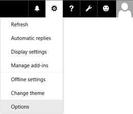
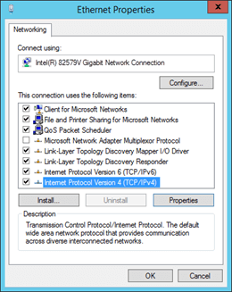
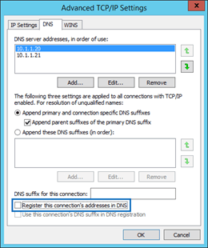
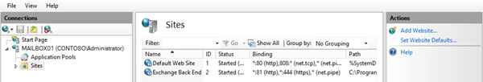
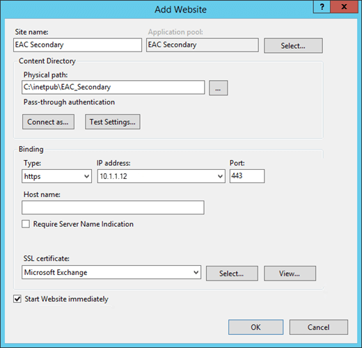
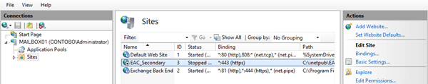
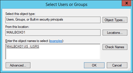

# Turn off access to the Exchange admin center

Learn how to disable access to the Exchange admin center on an Exchange 2016 server.
  
In Exchange Server 2016, the Exchange admin center is the primary management interface for Exchange. For more information, see [Exchange admin center in Exchange 2016](eac.md). By default, access to the EAC isn't restricted, and access to Outlook on the web (formally known as Outlook Web App) on an on an Internet-facing Exchange server also gives access to the EAC. You still need valid credentials to sign in to the EAC, but organizations may want to restrict access to the EAC for client connections from the Internet.
  
In Exchange 2016, the EAC virtual directory is named ECP, and is managed by the *- **ECPVirtualDirectory** cmdlets. When you set the  _AdminEnabled_ parameter to the value  `$false` on the EAC virtual directory, you disable access to the EAC for internal and external client connections, without affecting access to the **Settings** > **Options** page in Outlook on the web. 
  

  
But, this configuration introduces a new problem: access to the EAC is completely disabled on the server, even for administrators on the internal network. To fix this issue, you have two choices:
  
- Configure a second Exchange 2016 server that's only accessible from the internal network to handle internal EAC connections.
    
- On the existing Exchange 2016, create a new Internet Information Services (IIS) web site with new virtual directories for the EAC and Outlook on the web that's only accessible from the internal network.
    
    **Note**: You need to configure the EAC **and** Outlook Web App in the new web site, because the EAC requires the Outlook Web App authentication module from the same web site. 
    
## What do you need to know before you begin?

- Estimated time to complete each procedure: 5 minutes.
    
- You need to be assigned permissions before you can perform this procedure or procedures. To see what permissions you need, see the "Exchange admin center connectivity" entry in the [Exchange infrastructure and PowerShell permissions](../../permissions/feature-permissions/infrastructure-perms.md) topic. 
    
- For information about keyboard shortcuts that may apply to the procedures in this topic, see [Keyboard shortcuts in the Exchange admin center](../../about-documentation/eac-keyboard-shortcuts.md).
    
> [!TIP]
> Having problems? Ask for help in the Exchange forums. Visit the forums at: [Exchange Server](https://go.microsoft.com/fwlink/p/?linkId=60612), [Exchange Online](https://go.microsoft.com/fwlink/p/?linkId=267542), or [Exchange Online Protection](https://go.microsoft.com/fwlink/p/?linkId=285351). 
  
## How do you do this?

### Step 1: Use the Exchange Management Shell to disable access to the EAC

Remember, this step disables access to the EAC on the server for internal and external connections, but still allows users to access their own **Settings** > **Options** page in Outlook on the web. 
  
To disable access to the EAC on an Exchange server, use the following syntax:
  
```
Set-ECPVirtualDirectory -Identity "<Server>\ecp (Default Web Site)" -AdminEnabled $false
```

This example turns disables access to the EAC on the server named MBX01.
  
```
Set-ECPVirtualDirectory -Identity "MBX01\ecp (Default Web Site)" -AdminEnabled $false
```

#### How do you know this step worked?

To verify that you've disabled access to the EAC on the server, replace  _\<Server\>_ with the name of your Exchange server, and run the following command to verify the value of the **AdminEnabled** property: 
  
```
Get-ECPVirtualDirectory -Identity "MBX01\ecp (Default Web Site)" | Format-List AdminEnabled
```

When you open https://<servername>/ecp or from the internal network, your own **Settings** > **Options** page in Outlook on the web opens instead of the EAC. 
  
### Step 2: Give access to the EAC on the internal network

Choose either of the following options.
  
#### Option 1: Configure a second Exchange 2016 server that's only accessible from the internal network

The default value of the **AdminEnabled** property is  `True` on the default EAC virtual directory. To confirm this value on the second server, replace  _\<Server\>_ with the name of the server, and run the following command: 
  
```
Get-ECPVirtualDirectory -Identity "<Server>\ecp (Default Web Site)" | Format-List AdminEnabled
```

If the value is  `False`, replace  _\<Server\>_ with the name of the server, and run the following command: 
  
```
Set-ECPVirtualDirectory -Identity "<Server>\ecp (Default Web Site)" -AdminEnabled $true
```

#### Option 2: Create a new web site on the existing Exchange 2016 server, and configure the EAC and Outlook Web App in the new web site for the internal network

The required steps are:
  
1. Add a second IP address to the Exchange server.
    
2. Create a new web site in IIS that uses the second IP address, and assign file and folder permissions.
    
3. Copy the contents of the default web sites to the new web site.
    
4. Create new EAC and Outlook on the web virtual directories for the new web site.
    
5. Restart IIS for the changes to take effect.
    
> [!IMPORTANT]
> When you install an Exchange 2016 Cumulative Update (CU), the CU won't update files in the new web site and virtual directories. After you apply the CU, you need to completely remove the new web site, virtual directories, and content in the folders and then re-create the new web site, virtual directories, and content in the folders. 
  
#### Step 2a: Add a second IP address to the Exchange server

You can add a second network adapter and assign the IP address to the second network adapter, or you can assign a second IP address to the existing network adapter.
  
The steps to assign a second IP address to the existing network adapter are described below.
  
1. Open the properties of the network adapter. For example:
    
1. From a Command Prompt window, the Exchange Management Shell, or the Run dialog, run  `ncpa.cpl`.
    
2. Right-click on the network adapter, and then choose **Properties**.
    

  
2. In the properties of the network adapter, select **Internet Protocol Version 4 (TCP/IPv4)**, and then click **Properties**.
    
3. In the **Internet Protocol Version 4 (TCP/IPv4) Properties** window that opens, on the **General** tab, click **Advanced**.
    
4. In the **Advanced TCP/IP Settings** window that opens, on the **IP Settings** tab, in the **IP addresses** section, click **Add** and enter the IP address. 
    
  
 **Note**: If you add a second network adapter, in the **Advanced TCP/IP Settings** window, on the **DNS** tab, un-check **Register this connection's address in DNS**.
  

  
#### Step 2b: Create a new web site in IIS that uses the second IP address, and assign file and folder permissions

1. Open IIS Manager on the Exchange server. An easy way to do this in Windows Server 2012 or later is to press Windows key + Q, type inetmgr, and select **Internet Information Services (IIS) Manager** in the results. 
    
2. In the **Connections** pane, expand the server, select **Sites**, and in the **Actions** pane, click **Add Website**.
    
  
3. In the **Add Website** window that appears, configure the following settings: 
    
  - **Site name** `EAC_Secondary`
    
  - **Physical path** `C:\inetpub\EAC_Secondary`
    
  - **Binding**
    
  - **Type** https 
    
  - **IP address** Select the second IP address that you added in the previous step. 
    
  - **Port** 443 
    
  - **SSL certificate** Choose the certificate that you want to use (for example, the default Exchange certificate named Microsoft Exchange). 
    
    When you're finished, click **OK**.
    
  
4. Create  `ecp` and  `owa` folders in  `C:\inetpub\EAC_Secondary`.
    
1. In IIS Manager, select the  `EAC_Secondary` web site, and in the **Actions** pane, click **Explore**.
    
  
2. In the File Explorer window that opens, create the following folders in  `C:\inetpub\EAC_Secondary`:
    
  -  `ecp`
    
  -  `owa`
    
    When you're finished, close File Explorer.
    
5. Assign **Read &amp; Execute** permissions to the local security group named **IIS_IUSRS** on the  `C:\inetpub\EAC_Secondary` folder. 
    
1. In IIS Manger, select the  `EAC_Secondary` web site, and in the **Actions** pane, click **Edit Permissions**.
    
2. In the **EAC_Secondary Properties** window that opens, click the **Security** tab, and then click **Edit**.
    
3. In the **Permissions for EAC_Secondary** window that opens, click **Add**.
    
4. In the **Select Users, Computers, Service Accounts or Groups** window that opens, perform the following steps: 
    
1. Click **Locations**, and in the **Locations** dialog box that opens, select the local server, and then click **OK**.
    
2. In the **Enter the object names to select** field, type IIS_IUSRS, click **Check Names**, and then click **OK**.
    

  
5. Back on the **Permissions for EAC_Secondary** window, select **IIS_IUSRS**, and in the **Allow** column, select **Read &amp; Execute** (which automatically selects the **List Folder Contents** and **Read** permissions), and then click **OK** twice. 
    
#### Step 2c: Copy the contents of the default web sites to the new web site

- Copy all files and folders from the Default Web Site ( `C:\inetpub\wwwroot`) to  `C:\inetpub\EAC_Secondary`. You can skip the following files that can't be copied:
    
  -  `MacCertification.asmx`
    
  -  `MobileDeviceCertification.asmx`
    
  -  `decomission.asmx`
    
  -  `editissuancelicense.asmx`
    
- Copy all files and folders from  `%ExchangeInstallPath%FrontEnd\HttpProxy\ecp` to  `C:\inetpub\EAC_Secondary\ecp`.
    
- Copy all files and folders from  `%ExchangeInstallPath%FrontEnd\HttpProxy\owa` to  `C:\inetpub\EAC_Secondary\owa`.
    
#### Step 2d: Use the Exchange Management Shell to create new EAC and Outlook on the web virtual directories for the new web site

To learn how to open the Exchange Management Shell in your on-premises Exchange organization, see **Open the Exchange Management Shell**.
  
Replace  _\<Server\>_ with the name of your server, and run the following commands to create the new EAC and Outlook on the web virtual directories for the new web site. 
  
```
New-EcpVirtualDirectory -Server <Server> -Role ClientAccess -WebSiteName EAC_Secondary -Path "C:\inetpub\EAC_Secondary\ecp"
```

```
New-OwaVirtualDirectory -Server <Server> -Role ClientAccess -WebSiteName EAC_Secondary -Path "C:\inetpub\EAC_Secondary\owa"
```

#### Step 2e: Restart IIS

1. In IIS Manager, in the **Connections** pane, select the server. 
    
2. In the **Actions** pane, click **Restart**.
    
 **Note**: To restart IIS from the command line, open an elevated command prompt (a Command Prompt window that you opened by selecting **Run as administrator**) and run the following command:
  
```
iisreset.exe /noforce
```

## How do you know this task worked?

To verify that you have successfully disabled access to the EAC on an Exchange server, perform the following steps:
  
1. Test your organization's internal and external URL for Outlook on the web. For example, if the external URL is https://mail.contoso.com/owa, and the internal URL is https://mbx01.contoso.com/owa use the following procedures to verify your configuration:
    
  - Verify that internal and external users can open their mailboxes by using Outlook on the web, including the **Settings** > **Options** page. 
    
  - Verify that https://mail.contoso.com/ecp and https://mbx01.contoso.com/ecp return either of the following results:
    
  - **404 - website not found**
    
  - The user is redirected to their **Settings** > **Options** page in Outlook on the web. 
    
2. Verify that administrators can access the EAC on the internal network based on your configuration selection:
    
  - **Second Exchange server** If the second Exchange server is named MBX02, verify that https://mbx02.contoso.com/ecp opens the EAC. 
    
  - **New EAC web site on the existing Exchange server** If the IP address of the new EAC web site is 10.1.1.12, verify that https://10.1.1.12/ecp opens the EAC. 
    

