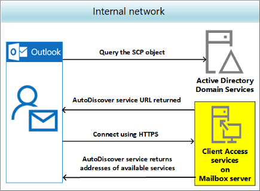

# Autodiscover service

 **Summary**: Learn about the Autodiscover service in Exchange 2016, which lets client applications and users configure themselves with minimal input.
  
The Autodiscover service minimizes user configuration and deployment steps by providing clients access to Exchange features. For Exchange Web Services (EWS) clients, Autodiscover is typically used to find the EWS endpoint URL. However, Autodiscover can also provide information to configure clients that use other protocols. Autodiscover works for client applications that are inside or outside firewalls and in resource forest and multiple forest scenarios.
  
Exchange 2016 introduced changes to services previously handled by the multiple servers. The Mailbox server now provides Client Access services, so you can't configure a standalone Client Access server like you could in previous versions of Exchange. Autodiscover service in Exchange 2016 is possible because:
  
- Exchange creates a virtual directory named `autodiscover` under the default web site in Internet Information Services (IIS). 
    
- Active Directory stores and provides authoritative URLs for domain-joined computers.
    
- Client Access services on Exchange 2016 Mailbox servers provide authentication and proxy services for internal and external client connections.
    
- Outlook configures services with only the user name and password.
    
> [!NOTE]
>  If you are a user looking for help with connecting your Outlook client to your Exchange server, see [Outlook email setup](https://go.microsoft.com/fwlink/p/?linkId=843935). 
  
## Autodiscover services and Active Directory

Exchange stores in Active Directory the configuration of Exchange servers in the organization as well as information about your users' mailboxes. Before you install Exchange Server 2016, you need to prepare your Active Directory forest and its domains. If you aren't familiar with Exchange 2016 forests or domains, see [3. Prepare Active Directory domains](../../plan-and-deploy/prepare-ad-and-domains.md#Step3).
  
Exchange automatically creates at installation the virtual directory `autodiscover` in IIS, the frontend Client Access services web site that clients connect to. This allows Outlook to discover the Exchange mailbox settings so that users don't have to deal with manually configuring advanced settings. 
  

  
The SCP object is also created in Active Directory at the same time as the Autodiscover service virtual directory. The SCP stores and provides authoritative URLs of the Autodiscover service for domain-joined computers.
  
 You need to update the SCP object to point to the Exchange 2016 server. This is necessary because Exchange 2016 servers provide additional Autodiscover information to clients to improve the discovery process. You can use the **Set-ClientAccessService** cmdlet to update the SCP object. For more information, see [Set-ClientAccessService](http://technet.microsoft.com/library/59440ef8-8ea4-4168-9b75-8f4d7aa6652d.aspx).
  
> [!IMPORTANT]
> You need to be assigned permissions before you can run the **Set-ClientAccessService** cmdlet. To find the permissions required to run any cmdlet or parameter in your organization, see [Find the permissions required to run any Exchange cmdlet](http://technet.microsoft.com/library/5bcc46d3-8a07-4e9f-b1b0-e4cb0b0afc12.aspx). 
  
Autodiscover makes it easy to retrieve the information that you need to connect to mailboxes on Exchange servers. SCP objects locate those Autodiscover servers or endpoints appropriate for the user you're retrieving settings for. And SCP objects in AD DS provide an easy way for domain-joined clients to look up Autodiscover servers.
  
Exchange publishes two types of SCP objects for the Autodiscover service:
  
- **SCP pointers**: Contains information that points to specific LDAP servers that should be used to locate Autodiscover SCP objects for the user's domain. SCP pointers are stamped with the following GUID: 67661d7F-8FC4-4fa7-BFAC-E1D7794C1F68.
    
- **SCP URLs**: Contains URLs for Autodiscover endpoints. SCP URLs are stamped with the following GUID: 77378F46-2C66-4aa9-A6A6-3E7A48B19596
    
The SCP object contains the authoritative list of Autodiscover service URLs for the forest. To learn more about locating Autodiscover service endpoints, see [Generate a list of Autodiscover endpoints](https://go.microsoft.com/fwlink/p/?linkId=843957).
  
Client connectivity in Exchange 2016 is like Exchange 2013 and differs from Exchange 2010. In Exchange 2016, MAPI over HTTP is enabled by default, when previously Outlook clients used Outlook Anywhere (RPC over HTTP). Exchange 2016 requires fewer name spaces for site-resilient solutions than Exchange 2010, reducing to two from the previously required seven namespaces. To read more about namespace and Exchange 2016, see the blog [Namespace Planning in Exchange 2016](https://go.microsoft.com/fwlink/p/?linkId=843937).
  
Depending on whether you configured the Autodiscover service on a separate site, the Autodiscover service URL will be either of the following values, where `//<SMTP-address-domain>` is the primary SMTP domain address: 
  
- `https://<SMTP-address-domain>/autodiscover/autodiscover.xml`
    
- `https://autodiscover.<smtp-address-domain>/autodiscover/autodiscover.xml`
    
For example, if the user's email address is tony@contoso.com, the primary SMTP domain address is contoso.com.
  
Client applications use the Autodiscover service when the application starts for the first time. For example when an Exchange Web Services (EWS) application starts for the first time, the application configures itself using the Autodiscover service. For a user's computer joined to the contoso.com domain and in the Longview regional Active Directory site, the application generates the list of these Autodiscover service endpoints:
  
****

|**Endpoint**|**Generated by**|
|:-----|:-----|
|https://longview.econtoso.com/autodiscover/autodiscover.xml    |SCP results    |
|https://email.contoso.com/autodiscover/autodiscover.xml    |SCP results    |
|https://newark.contoso.com/autodiscover/autodiscovfer.xml    |SCP results    |
|https://contoso.com/autodiscover/autodiscover.exc    |Derived from email address    |
|https://autodiscover.contoso.com/autodiscover/autodiscover    |Derived from email address    |
   
For more information about SCP objects, see [Publishing Services in Active Directory](https://go.microsoft.com/fwlink/p/?linkId=845325)
  
## Autodiscover in DNS

Exchange introduced namespace requirements for Autodiscover in Exchange 2010, certificates required several of them. In a server resilience scenario, this needed all of these.
  
- Primary datacenter IP namespace
    
- Secondary datacenter IP namespace
    
- Primary Outlook Web App failback namespace
    
- Secondary Outlook Web App failback namespace
    
- Transport namespace ( for SMTP)
    
- Primary datacenter RPC Client Access namespace
    
- Secondary datacenter RPC Client Access namespace
    
Exchange 2016 simplifies this server resiliency scenario, reducing the five namespaces to two. This is because Exchange no longer needs the RPC Client Access namespaces and Client Access services proxy requests to the Mailbox server that is hosting the active Mailbox database. A Mailbox server in one Active Directory site can proxy a session to a another Active Directory site's Mailbox server.
  
What this means is that unique namespaces are no longer required for *each* datacenter. For example, instead of mail.contoso.com and mail2.contoso.com, you only need a single namespace, mail.contoso.com, for the datacenter pair. Additionally, failback namespaces are no longer needed in Database Availability Groups (DAG) activation scenarios. To learn more about namespaces, see [Exchange Server 2016 Database Availability Groups](https://go.microsoft.com/fwlink/p/?linkId=846392).
  
Autodiscover is simple to set up for your domain because it only requires that you create a CNAME resource record in your external (public) DNS. CNAME records let you hide the implementation details of your network from the clients that connect to it. Used internally in your network, CNAME records allow users to use the simpler URI mail.domain.com instead of host.examplemachinename.domain.com.
  
 A CNAME or canonical name record is the DNS equivalent to a Windows shortcut or an Apple Mac alias. A CNAME record is an alias for an Address (A) record that maps an IP address to the target server. If, for example, your domain is contoso.com, you create a CNAME record for autodiscover.contoso.com. The name in the CNAME record must match a name in a certificate. CNAME records work only for hostnames. CNAMEs work externally, but they don't replace the URL in the browser bar. When the certificate is checked against the URL, you get a failure with a warning, but you can still access the service. 
  
A typical CNAME record looks like this:
  
- Name: autodiscover
    
- TTL: 3600
    
- RR Type: CNAME
    
- Target: The externally accessible FQDN of the Mailbox server (for example, mail.contoso.com)
    
In this example, autodiscover.contoso.com resolves to mail.contoso.com. For more information, see [Step 4: Configure external URLs](../../plan-and-deploy/post-installation-tasks/configure-mail-flow-and-client-access.md#ConfigExternalURL).
  
We recommend that you create an Autodiscover CNAME record for every domain on your account, including domain aliases and accepted domains. You need to create either a CNAME or SRV record where your domain is hosted. Only then can you synchronize your offline address book, show free/busy information and enable the Out of office feature in Outlook.
  
Service (SRV) resource records let you specify the location of the servers for a specific service, protocol, and DNS domain. For example, if you have two Web servers in your domain, you can create SRV resource records indicating which hosts serve as Web servers. Resolvers can then retrieve all the SRV resource records for the Web servers.
  
A typical SRV record looks like this:
  
- Service: _autodiscover
    
- Protocol: ._tcp
    
- Port Number: 443
    
- Host: mail.contoso.com
    
- Priority: 0
    
- Weight: 0
    
In this example, the Outlook server namespace is mail.contoso.com.
  
Read more about CNAME and SRV records in the Outlook team blog, [Namespace planning in Exchange 2016](https://go.microsoft.com/fwlink/p/?linkId=843937) . 
  
## Autodiscover services in Outlook

With only the user credentials, the Outlook client can authenticate to Active Directory and search for the Autodiscover SCP objects. After the client obtains and enumerates the instances of the Autodiscover service, the client connects to the Client Access (frontend) services on the first Mailbox server in the enumerated list. The client then collects the profile information in the form of XML data that's needed to connect to the user's mailbox and available Exchange features.
  
> [!NOTE]
> Depending on your DNS provider's requirements, you may need to add the fully qualified domain name (FQDN) as your hostname. In that case, if your domain is contoso.com, then your hostname would be autodiscover.contoso.com, not autodiscover.com. 
  
You need to set up a special DNS record for your domain name that points to the server providing Autodiscover services so that Exchange accounts function correctly in Outlook. For external access, or using DNS, the client locates the Autodiscover service on the Internet by using the primary SMTP domain address from the user's email address.
  
The Autodiscover service uses one of these four methods to configure the email client. The first two work for small, single SMTP namespace organizations. The last two serve multiple-SMTP namespaces.
  
- Connect to: https://contoso.com/AutoDiscover/AutoDiscover.xml
    
- Connect to: https://autodiscover.contoso.com/AutoDiscover/AutoDiscover.xml
    
- Autodiscover redirect URL for redirection: http://autodiscover.contoso.com/autodiscover/autodiscover.xml
    
- Search for DNS SRV record
    
Some of the hostnames and URLs can be configured by using the Exchange admin center (EAC) and the Exchange Management Shell, while others require that you use PowerShell. You can learn more about that in [Configure mail flow and client access](../../plan-and-deploy/post-installation-tasks/configure-mail-flow-and-client-access.md).
  
Through the Autodiscover service, Outlook finds a new connection point made up of the user's mailbox. That is, Autodiscover uses the identification made up of a GUID, plus @, and the domain portion of the user's primary SMTP address. The Autodiscover service returns the following information to the client:
  
- User's display name
    
- Separate connection settings for internal and external connectivity
    
- Location of the user's mailbox (the Mailbox server that currently holds the active copy of the mailbox)
    
- URLs for various Outlook features that govern functionality such as free/busy information, Unified Messaging (UM), and the offline address book (OAB)
    
- Outlook Anywhere server settings
    
You'll need to make sure that you have configured the correct external URLs for the virtual directories of the following services. The examples in the table that follows show values required for the contoso.com email domain. In addition, you may need to set IIS Authentication Methods. You can learn more about that in [Setting Up Standard Authentication Methods for Outlook Web App](http://technet.microsoft.com/library/f4ae771b-de25-47e4-963f-4b1e43f8b3d4.aspx).
  
<table style="text-align: left; width: 100%;" border="1"
 cellpadding="2" cellspacing="2">
  <tbody>
    <tr>
      <th>Service</th>
      <th>Exchange Management Shell</th>
      <th>Modifies</th>
    </tr>
    <tr>
      <td><a
 href="https://technet.microsoft.com/en-us/library/bb124707">Offline
Address Book</a></td>
      <td><code>Get-OabVirtualDirectory |
Set-OabVirtualDirectory
–ExternalURL https://mail.companycontoso.com/oab</code></td>
      <td>OAB virtual directories used in IIS</td>
    </tr>
    <tr>
      <td><a
 href="https://technet.microsoft.com/en-us/library/aa997233.aspx">Exchange
Web Services</a></td>
      <td><code>Get-WebServicesVirtualDirectory |
Set-WebServicesVirtualDirectory –ExternalURL
https://mail.companycontoso.com/ews/exchange.asmx</code></td>
      <td>Exchange Web Servicesvirtual directories in IIS</td>
    </tr>
    <tr>
      <td><a
 href="https://technet.microsoft.com/en-us/library/bb123545">Outlook
Anywhere (RPC over HTTP)</a></td>
      <td><code>Get-OutlookAnywhere | Set-OutlookAnywhere
–ExternalHostname mail.contoso.com –ExternalClientsRequireSsl $true</code></td>
      <td>Outlook Anywhere virtual directories in IIS</td>
    </tr>
    <tr>
      <td><a
 href="https://technet.microsoft.com/en-us/library/dn595082">Messaging
Application Programming Interface (MAPI) over HTTP</a> (Exchange
2013 SP1 or later)</td>
      <td><code>Get-MapiVirtualDirectory |
Set-MapiVirtualDirectory –ExternalURL
https://mail.companycontoso.com/mapi Set-OrganizationConfig
-MapiHttpEnabled $true</code></td>
      <td>MAPI virtual directories in IIS</td>
    </tr>
  </tbody>
</table>

   
Click the Service name in the preceding table for more information about how to obtain or reconfigure these URLs.
  
When a user's Exchange information changes, Outlook uses the Autodiscover service to automatically reconfigure the user's profile. For example, if a user's mailbox is moved. or the client can't connect to the user's mailbox or to available Exchange features, Outlook will contact the Autodiscover service and automatically update the user's profile to include the information that's required to connect to the mailbox and Exchange features.
  
## Other clients

 Autodiscover service the preferred method to locate all services in Skype for Business Server 2015 . When a connection is successful, the Autodiscover service returns all the Web Services URLs for the user's home pool, including the Mobility Service (known as Mcx by the virtual directory created for the service in IIS), Lync Web App and Web scheduler URLs. However, both the internal Mobility Service URL and the external Mobility Service URL is associated with the external Web Services FQDN. Therefore, regardless of whether a mobile device is internal or external to the network, the device always connects to the Mobility Service externally through reverse proxy. The Autodiscover service also returns references to Internal/UCWA, External/UCWA and UCWA. These entries refer to the Unified Communications Web API (UCWA) web component. 
  
## Configure Autodiscover services

Autodiscover works for client applications inside and outside firewalls and in resource forest and multiple forest scenarios. For EWS clients, Autodiscover is typically used to find the EWS endpoint URL, but Autodiscover can also provide information to configure clients that use other protocols.
  
When you install Exchange 2016, a self-signed certificate that's created and signed by the Exchange server is automatically installed on the server. However, you can also create additional self-signed certificates that you can use for other services.
  
Creating a certificate request is the first step in installing a new certificate on an Exchange 2016 server to configure Transport Layer Security (TLS) encryption for one or more Exchange services. You use a certificate request (also known as a certificate signing request or CSR) to obtain a certificate from a certification authority (CA). For more information, see the following topics:
  
- [Digital certificates and encryption in Exchange 2016](certificates.md)
    
- [Create an Exchange 2016 certificate request for a certification authority](create-ca-certificate-requests.md)
    
> [!NOTE]
> You can confirm your Autodiscover service by using the [Microsoft Remote Connectivity Analyzer](https://testconnectivity.microsoft.com/). When the connectivity is successful, also select and run the Outlook Connectivity test. If that fails, you may need to configure the external URLs in Exchange. The results from the Microsoft Remote Connectivity Analyzer should explain why connectivity failed. Generally, a connectivity failure means that you don't have the correct external URLs configured for the virtual directories of the various Outlook services. 
  
## Manage Autodiscover services

In deployments where clients connect to multiple Exchange servers, the Autodiscover SCP object is created for the (frontend) Client Access services on each Mailbox server. The SCP object contains the ServiceBindingInfo attribute with the FQDN of the Exchange server that the client connects to in the form of `https://<ExchangeServer>/autodiscover/autodiscover.xml` (for example, `https://cas01/autodiscover/autodiscover.xml)`.
  
You can run the Exchange ActiveSync Autodiscover and Outlook Autodiscover tests in the Microsoft Remote Connectivity Analyzer. If the user is using a local wireless network to connect to Exchange Online, the user should run both tests to make sure that the local network allows for connections to the ActiveSync endpoints.
  
You can get help for planning and deploying Autodiscover services as part of your Exchange 2016 deployment in [Deploying Exchange 2016](../../plan-and-deploy/plan-and-deploy.md#Deployment).
  
