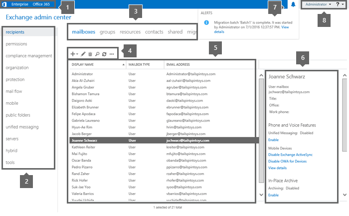
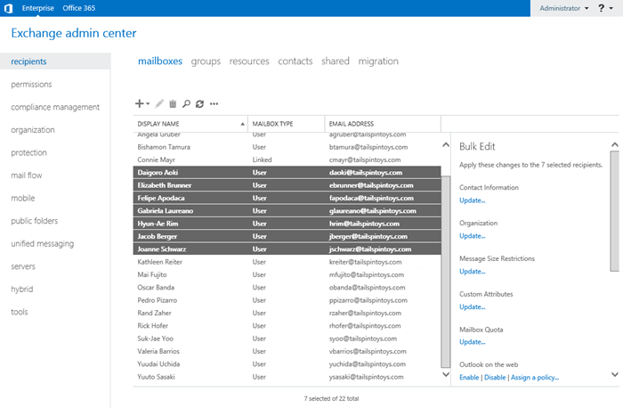

# Exchange admin center in Exchange 2016

 **Summary**: Learn about the Exchange admin center, the web-based management console that's available in Exchange 2016.
  
The Exchange admin center (EAC) is the web-based management console in Exchange Server 2016 that's optimized for on-premises, online, and hybrid Exchange deployments. The EAC was introduced in Exchange Server 2013, and replaces the Exchange Management Console (EMC) and the Exchange Control Panel (ECP), which were the two management interfaces in Exchange Server 2010.
  
Looking for the Exchange Online version of this topic? See [Exchange Administration Center in Exchange Online](http://technet.microsoft.com/library/ace44f6b-4084-4f9c-89b3-e0317962472b.aspx).
  
Looking for the Exchange Online Protection version of this topic? See [Exchange Administration Center](http://technet.microsoft.com/library/97921f0e-832f-40c7-b56d-414faede5191.aspx).
  
## Accessing the EAC
<a name="access"> </a>

The URL of the EAC is controlled by the Internet Information Services (IIS) virtual directory named ECP in the Client Access (frontend) services on the Mailbox server. Yes, the virtual directory is named ECP, not EAC.
  
- **Internal URL**: By default, this value contains the fully-qualified domain name (FQDN) of the Exchange server in the format  `https://<ServerFQDN>/ecp`. For example,  `https://mailbox01.contoso.com/ecp`. To access the EAC in a web browser on the Exchange server itself, you can use the value  `https://localhost/ecp`.
    
- **External URL**: By default, this value is unconfigured. Before you can connect to the EAC from the Internet, you need to configure the following settings:
    
  - The external URL value on the ECP virtual directory. For more information, see [Step 4: Configure external URLs](../../plan-and-deploy/post-installation-tasks/configure-mail-flow-and-client-access.md#ConfigExternalURL).
    
  - A corresponding record in your public DNS.
    
  - A TLS certificate that contains or matches the host name entry. Very likely, this will be a subject alternative name (SAN) certificate or a wildcard certificate, because most of the client services are all available under the same website on the Exchange server. For more information, see [Certificate requirements for Exchange services](certificates.md#CertRequirements).
    
    After you configure the settings, a common external URL value for the EAC would resemble  `https://mail.contoso.com/ecp`.
    
    **Note**: External users who connect to Outlook on the web (formerly known as Outlook Web App) also need access to the EAC to access their own **Options** page. You can disable external administrator access to the EAC while still allowing users to access their **Options** page in Outlook on the web. For more information, see [Turn off access to the Exchange admin center](disable-exchange-admin-center-access.md).
    
The easiest way to find the internal and external URL values for the EAC (without using **Servers** \> **Virtual directories** in the EAC itself) is by using the **Get-EcpVirtualDirectory** cmdlet in the Exchange Management Shell. To learn how to open the Exchange Management Shell in your on-premises Exchange organization, see **Open the Exchange Management Shell**.
  
These examples show you how to find the internal and external URL values for the EAC virtual directories in your organization:
  
- To find the values on all Exchange servers in your organization, run the following command:
    
  ```
  Get-EcpVirtualDirectory | Format-List Server,Name,*Url
  ```

- To find the values on the server named Mailbox01, run the following command:
    
  ```
  Get-EcpVirtualDirectory | Format-List Name,*Url
  ```

- To find the value for the virtual directory named "ecp (Default Web Site)" on the server named Mailbox01, run the following command.
    
  ```
  Get-EcpVirtualDirectory -Identity "Mailbox01\ecp (Default Web Site)" | Format-List *Url
  ```

For more information, see [Get-EcpVirtualDirectory](http://technet.microsoft.com/library/afa04216-965d-4a6c-949c-170f916e8f4c.aspx).
  
If you're in a coexistence environment with Exchange 2010, the location of your mailbox controls the default behavior for opening the EAC or ECP:
  
- If your mailbox is located on the Exchange 2010 Mailbox server, you get the Exchange 2010 ECP by default. You can access the EAC by adding the Exchange version to the URL (which is 15 for both Exchange 2013 and Exchange 2016). For example, to access the EAC through the Client Access (frontend) services on the Mailbox server named Mailbox01, use the following URL:  `https://Mailbox01/ecp/?ExchClientVer=15`.
    
- If your mailbox is located on an Exchange 2016 Mailbox server, and you want to access the ECP on the Exchange 2010 Client Access server named CAS01, use the following URL:  `https://CAS01/ecp/?ExchClientVer=14`.
    
## Common user interface elements in the EAC
<a name="common"> </a>

The section describes the user interface elements that are common across the EAC.
  

  
### 1: Cross-premises navigation

The cross-premises navigation allows you to easily switch between your Exchange Online and on-premises Exchange deployments. If you don't have an Exchange Online organization, the **Office 365** link takes you to a page that compares plans and pricing for Office 365 services. 
  
### 2: Feature pane

The feature pane is the first level of navigation for most of the tasks that you'll perform in the EAC, and is organized by the following feature areas:
  
- **Recipients**: Manage mailboxes, groups, resource mailboxes (room and equipment mailboxes), contacts, shared mailboxes, and mailbox migrations and moves. For more information, see the following topics:
    
  - [Create user mailboxes in Exchange 2016](../../recipients/create-user-mailboxes.md) and [Manage user mailboxes](../../recipients/user-mailboxes/user-mailboxes.md)
    
  - [Manage distribution groups](../../recipients/distribution-groups.md) and [Manage dynamic distribution groups](../../recipients/dynamic-distribution-groups/dynamic-distribution-groups.md)
    
  - [Create and manage room mailboxes](../../recipients/room-mailboxes.md)
    
  - [Manage mail contacts](../../recipients/mail-contacts.md) and [Manage mail users](../../recipients/mail-users.md)
    
  - [Create shared mailboxes in the Exchange admin center](../../collaboration/shared-mailboxes/create-shared-mailboxes.md)
    
- **Permissions**: Manage role-based access control (RBAC) administrator roles, user roles, and Outlook on the web policies. For more information, see the following topics.
    
  - [Manage role groups](../../permissions/role-groups.md) , [Manage role group members](../../permissions/role-group-members.md), and [Manage role assignment policies](../../permissions/role-assignment-policies.md).
    
  - [Outlook on the web mailbox policies](http://technet.microsoft.com/library/213b8b7a-1c29-49ee-8c98-d0364ddf4f9d.aspx)
    
- **Compliance management**: This is where you'll manage In-Place eDiscovery, In-Place Hold, auditing (mailbox audit logging and administrator audit logging), data loss prevention (DLP), retention policies, retention tags, and journal rules. For more information, see the following topics:
    
  - [In-Place eDiscovery in Exchange 2016](../../policy-and-compliance/ediscovery/ediscovery.md) and [In-Place Hold and Litigation Hold in Exchange 2016](../../policy-and-compliance/holds/holds.md)
    
  - [Mailbox audit logging in Exchange 2016](../../policy-and-compliance/mailbox-audit-logging/mailbox-audit-logging.md) and [Administrator audit logging in Exchange 2016](../../policy-and-compliance/admin-audit-logging/admin-audit-logging.md)
    
  - [Data loss prevention in Exchange 2016](../../policy-and-compliance/data-loss-prevention/data-loss-prevention.md)
    
  - [Retention policies](../../policy-and-compliance/mrm/retention-tags-and-retention-policies.md#Policies) and [Retention tags](../../policy-and-compliance/mrm/retention-tags-and-retention-policies.md#RT).
    
  - [Journaling in Exchange 2016](../../policy-and-compliance/journaling/journaling.md)
    
- **Organization**: Manage federated sharing, Outlook Apps, and address lists. For more information, see the following topics:
    
  - [Sharing](http://technet.microsoft.com/library/09e6732a-4e99-44d0-801d-9463fdc57a9b.aspx)
    
  - [Install or Remove Apps for Outlook for Your Organization](http://technet.microsoft.com/library/112f3ef7-9943-4a1e-8a42-e08e8e9f67f4.aspx)
    
  - [Address lists in Exchange 2016](../../email-addresses-and-address-books/address-lists/address-lists.md)
    
- **Protection**: Manage antimalware protection for your organization. For more information, see [Antimalware protection in Exchange 2016](../../antispam-and-antimalware/antimalware-protection/antimalware-protection.md).
    
- **Mail flow**: Manage mail flow rules (also known as transport rules), delivery reports, accepted domains, remote domains, email address policies, Receive connectors, and Send connectors. For more information, see the following topics:
    
  - [Mail flow rules in Exchange 2016](../../policy-and-compliance/mail-flow-rules/mail-flow-rules.md)
    
  - [Track messages with delivery reports](../../mail-flow/transport-logs/track-messages-with-delivery-reports.md)
    
  - [Address lists in Exchange 2016](../../email-addresses-and-address-books/address-lists/address-lists.md)
    
  - [Accepted domains in Exchange 2016](../../mail-flow/accepted-domains/accepted-domains.md)
    
  - [Remote Domains](http://technet.microsoft.com/library/10fb7d62-4d78-40a3-82db-d62bcd27ba42.aspx)
    
  - [Email address policies in Exchange 2016](../../email-addresses-and-address-books/email-address-policies/email-address-policies.md)
    
  - [Receive connectors](../../mail-flow/connectors/receive-connectors.md)
    
  - [Send connectors](../../mail-flow/connectors/send-connectors.md)
    
- **Mobile**: Manage the mobile devices that you allow to connect to your organization. You can manage mobile device access and mobile device mailbox policies. For more information, see the following topics:
    
  - [Mobile devices](../../clients/exchange-activesync/mobile-devices.md)
    
  - [Mobile device mailbox policies](../../clients/exchange-activesync/mobile-device-mailbox-policies.md)
    
- **Public folders**: Manage public folders and public folder mailboxes. For more information, see [Public folders](../../collaboration/public-folders/public-folders.md).
    
- **Unified Messaging**: Manage UM dial plans and UM IP gateways. For more information, see the following topics:
    
  - [UM Dial Plans](http://technet.microsoft.com/library/ed7afc03-94af-4b23-8745-6a61f203c149.aspx)
    
  - [UM IP Gateways](http://technet.microsoft.com/library/991d77e0-3995-44ab-bedf-52ff7a0301ab.aspx)
    
- **Servers**: View and manage server-specific settings, databases, database availability groups (DAGs), virtual directories, and certificates. For more information, see the following topics:
    
  - [POP3 and IMAP4 in Exchange 2016](../../clients/pop3-and-imap4/pop3-and-imap4.md)
    
  - [Configure the Startup Mode on a Client Access Server](http://technet.microsoft.com/library/71cc9061-9e3c-4b4a-8dbe-f590ca5bcee8.aspx) and [Configure the Startup Mode on a Mailbox Server](http://technet.microsoft.com/library/4457d6a0-52bd-4269-8cb5-d34d7fe9bfc3.aspx)
    
  - [Message retry, resubmit, and expiration intervals](../../mail-flow/queues/message-intervals.md)
    
  - [Configure message tracking](../../mail-flow/transport-logs/configure-message-tracking.md) , [Configure connectivity logging in Exchange 2016](../../mail-flow/transport-logs/configure-connectivity-logging.md), and [Protocol logging](../../mail-flow/connectors/protocol-logging.md)
    
  - [Manage Outlook Anywhere](http://technet.microsoft.com/library/9026d461-ec6a-4ef5-ba9d-de33030858f3.aspx#managing)
    
  - [Managing mailbox database copies](http://technet.microsoft.com/library/06df16b4-f209-4d3a-8c68-0805c745f9b2.aspx)
    
  - [Managing database availability groups](http://technet.microsoft.com/library/4abde67b-4995-4a57-894f-ba76aa72341c.aspx)
    
  - [Virtual Directory Management](http://technet.microsoft.com/library/1af30fd5-621c-4acb-b6df-d8fa64d719ba.aspx)
    
  - [Certificate procedures in Exchange 2016](certificate-procedures.md)
    
- **Hybrid**: Set up and configure a Hybrid organization.
    
- **Tools**: Check your Exchange server with the Office 365 Best Practices Analyzer. For more information, see [About the Office 365 Best Practices Analyzer for Exchange Server](https://go.microsoft.com/p/?linkid=9839202).
    
### 3: Tabs

The tabs are your second level of navigation. Typically, each feature pane contains multiple tabs that represent complete features. However, the **Tools** and **Hybrid** panes each contain only one tab: the **Checks** tab to install and run the Office 365 Best Practices Analyzer, or the **Setup** tab that allows you to run the Hybrid Configuration Wizard, or modify the settings of your existing hybrid deployment. 
  
### 4: Toolbar

When you click most tabs, you'll see a toolbar. The toolbar has icons that perform specific actions. The following table describes the most common icons and their actions. To see the action that's associated with an icon (the icon's title), simply hover over the icon.
  
|**Icon**|**Name**|**Action**|
|:-----|:-----|:-----|
|           <br/> |Add, New  <br/> |Create a new object.  <br/>  Some of these icons have an associated down arrow you can click to show additional objects you can create. For example, in **Recipients** \> **Mailboxes**, clicking the down arrow displays **User mailbox** and **Linked mailbox** as additional options.  <br/> |
|           <br/> |Edit  <br/> |Edit an object.  <br/> |
|           <br/> |Delete  <br/> |Delete an object. Some delete icons have a down arrow you can click to show additional options.  <br/> |
|           <br/> |Search  <br/> |Open a search box so you can enter text for an object that you want to find you want to find in a long list of objects. Check out [Advanced search](http://technet.microsoft.com/library/cf4251f9-e4ec-44d7-97c2-c5cdd67ce60c.aspx) for more search options.  <br/> |
|           <br/> |Refresh  <br/> |Refresh the list view.  <br/> |
|           <br/> |More options  <br/> |View more actions you can perform for that tab's objects.  <br/> For example, in **Recipients** \> **Mailboxes** clicking this icon shows the following options: **Disable**, **Add/Remove columns**, **Export data to a CSV file**, **Connect a mailbox**, and **Advanced search**.  <br/> |
|           <br/>            <br/> |Up arrow and down arrow  <br/> |Move an object up or down in the list, when the order is important.  <br/> For example, in **Mail flow** \> **Email address policies** click the up arrow to move the policy higher in the list, which increases the priority of the policy by specifying which policy is applied first.  <br/> You can also use these arrows to navigate the public folder hierarchy and to move rules up or down in the list view.  <br/> |
|           <br/> |Copy  <br/> |Copy an object so you can make changes to it without changing the original object.  <br/> For example, in **Permissions** \> **Admin roles**, select a role from the list view, and then click this icon to create a new role group based on an existing one.  <br/> |
|           <br/> |Remove  <br/> |Remove an item from a list.  <br/>  For example, in the **Public Folder Permissions** dialog box, you can remove users from the list of users allowed to access the public folder by selecting the user and clicking this icon.  <br/> |
   
### 5: List view

Tabs that contain many objects display those objects in a list view. The viewable limit in the EAC list view is approximately 20,000 objects. Paging is included so you can skip to the results that you want to see. In the **Recipients** list view, you can also configure page size and export the data to a CSV file. 
  
### 6: Details pane

When you select an object from the list view, more information about that object is displayed in the details pane. For some object types, the details pane includes quick management tasks. For example, if you navigate to **Recipients** \> **Mailboxes** and select a mailbox from the list view, the details pane (among other options) displays an option to enable or disable the archive for that mailbox. 
  
Some object types also allow you to bulk edit multiple objects in the details pane. You can select multiple objects in the list view by selecting an object, holding the Shift key, and selecting an object farther down in the list, or by holding down the CTRL key as you select each object. If bulk edit is available for the object types that you selected, you'll see the available options in the details pane. For example, at **Recipients** \> **Mailboxes**, when you select multiple mailboxes of the same type, the title of the details pane changes to **Bulk Edit**, and you can update contact and organization information, custom attributes, mailbox quotas, Outlook on the web settings, and more.
  

  
### 7: Notifications

The EAC includes a notification viewer that displays information about:
  
- Expiring and expired certificates.
    
- The status of mailbox moves and migrations (also known as Mailbox Replication Service tasks or MRS tasks). You can also use the notification viewer to opt-in to receive email notifications about these tasks.
    
- Exporting mailbox content to .pst files.
    
To show or hide the notification viewer, click the icon ().
  
Notifications are alerts that are sent to the arbitration mailbox named  `FederatedEmail.4c1f4d8b-8179-4148-93bf-00a95fa1e042`. The EAC checks this mailbox for alerts every 30 seconds. Notifications remain in the arbitration mailbox until they are removed by the component that sent them, or until they expire (they should be removed by the Managed Folder Assistant after 30 days).
  
You can also use the **Get-Notification** cmdlet in the Exchange Management Shell to view more details about notifications, and the **Set-Notification** cmdlet to request notification emails for future alerts. 
  
### 8: Me tile and Help

The  *Me tile*  allows you to sign out of the EAC and sign in as a different user by clicking on the drop-down menu that's next to your account name. 
  
Click the help icon () to view the help content for the tab that you're currently on. If you click on the drop-down menu that's next to the help icon, you can perform the following additional actions:
  
- **Disable Help bubble**: The Help bubble displays contextual help for fields when you create or edit objects in the EAC. From here, you can globally turn off or turn on the Help bubble for all fields in the EAC.
    
- **Performance console**: The Performance console displays many counters that relate to the performance of the EAC.
    
- **Copyright** and **Privacy**: Click these links to read the copyright and privacy information for Exchange 2016.
    
## Supported browsers
<a name="SB"> </a>

The levels of support for operating system and browser combinations that you can use to access the EAC are described in the following tables.
  
 **Notes**:
  
- The levels of support for the EAC are:
    
  - **Supported**: All functionality and features are supported and have been fully tested.
    
  - **Unsupported**: The browser and operating system combination isn't supported, **or** hasn't been tested. For more information about supported versions of Internet Explorer on Windows, see [Internet Explorer Support Announcement](https://go.microsoft.com/fwlink/p/?LinkId=823717).
    
  - **n/a**: The browser and operating system combination isn't possible. For example, an older browser on a newer operating system, or vice-versa.
    
- Operating system and browser combinations that aren't listed are unsupported. This includes iOS, Android, and Windows Phone.
    
- Third-party plug-ins might cause issues with the EAC for supported browsers.
    
**Client operating systems**

|||||||
|:-----|:-----|:-----|:-----|:-----|:-----|
|Web browser  <br/> |Windows 7  <br/> |Windows 8.1  <br/> |Windows 10  <br/> |Mac OS X  <br/> |Linux  <br/> |
|Internet Explorer 9  <br/> |Unsupported  <br/> |n/a  <br/> |n/a  <br/> |n/a  <br/> |n/a  <br/> |
|Internet Explorer 10  <br/> |Unsupported  <br/> |n/a  <br/> |n/a  <br/> |n/a  <br/> |n/a  <br/> |
|Internet Explorer 11  <br/> |Supported  <br/> |Supported  <br/> |Supported  <br/> |n/a  <br/> |n/a  <br/> |
|Microsoft Edge  <br/> |n/a  <br/> |n/a  <br/> |Supported  <br/> |n/a  <br/> |n/a  <br/> |
|Mozilla Firefox latest version or one previous  <br/> |Supported  <br/> |Supported  <br/> |Supported  <br/> |Supported  <br/> |Supported  <br/> |
|Apple Safari 6 or later versions  <br/> |n/a  <br/> |n/a  <br/> |n/a  <br/> |Supported  <br/> |n/a  <br/> |
|Google Chrome latest version or one previous  <br/> |Supported  <br/> |Supported  <br/> |Supported  <br/> |Supported  <br/> |Supported  <br/> |
   
**Windows Server operating systems**

||||||
|:-----|:-----|:-----|:-----|:-----|
|Web browser  <br/> |Windows Server 2008 R2  <br/> |Windows Server 2012  <br/> |Windows Server 2012 R2  <br/> |Windows Server 2016  <br/> |
|Internet Explorer 9  <br/> |Unsupported  <br/> |n/a  <br/> |n/a  <br/> |n/a  <br/> |
|Internet Explorer 10  <br/> |Unsupported  <br/> |Supported  <br/> |n/a  <br/> |n/a  <br/> |
|Internet Explorer 11  <br/> |Supported  <br/> |n/a  <br/> |Supported  <br/> |Supported  <br/> |
   

