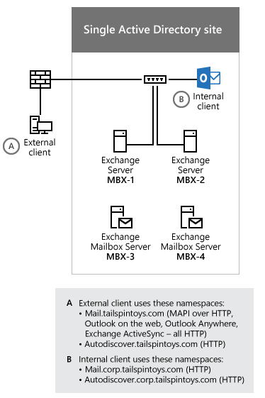
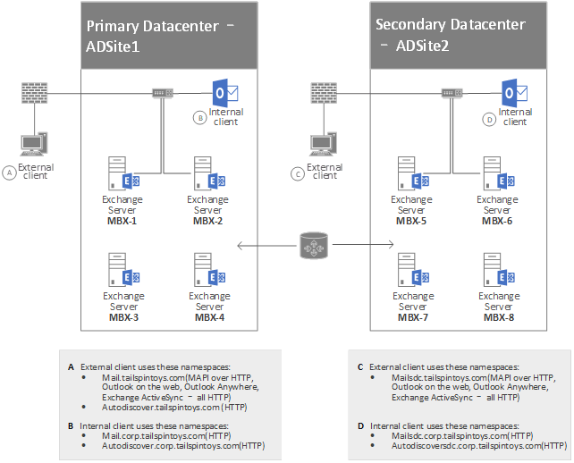

# Configure Kerberos authentication for load-balanced Client Access services

 **Summary:** How to use Kerberos authentication with load-balanced Exchange 2016 servers running Client Access services. 
  
In order for you to use Kerberos authentication with load-balanced Mailbox servers running Client Access services, you have to complete the configuration steps described in this article.
  
## Create the alternate service account credential in Active Directory Domain Services
<a name="CreateAltService"> </a>

All Exchange servers that run Client Access services that share the same namespaces and URLs must use the same alternate service account credentials. In general, it's sufficient to have a single account for a forest for each version of Exchange.  *alternate service account credential*  or  *ASA credential*  . 
  
> [!IMPORTANT]
> Exchange 2010 and Exchange 2016 can't share the same ASA credential. If your ASA credential was created for Exchange 2010, you have to create a new one for Exchange 2016. 
  
> [!IMPORTANT]
> While CNAME records are supported for shared namespaces, Microsoft recommends using A records. This ensures that the client correctly issues a Kerberos ticket request based on the shared name, and not the server FQDN. 
  
When you set up the ASA credential, keep these guidelines in mind:
  
- **Account type**: We recommend that you create a computer account instead of a user account. A computer account doesn't allow interactive logon and may have simpler security policies than a user account. If you create a computer account, the password doesn't expire, but we recommend you update the password periodically anyway. You can use local group policy to specify a maximum age for the computer account and scripts to periodically delete computer accounts that do not meet current policies. Your local security policy also determines when you have to change the password. Although we recommend you use a computer account, you can create a user account.
    
- **Account name**: There are no requirements for the name of the account. You can use any name that conforms to your naming scheme.
    
- **Account group**: The account you use for the ASA credential doesn't need special security privileges. If you are using a computer account then the account needs only to be a member of the Domain Computers security group. If you are using a user account then the account needs only to be a member of the Domain Users security group.
    
- **Account password**: The password you provide when you create the account will be used. So when you create the account, you should use a complex password and ensure that the password conforms to your organization's password requirements.
    
### To create the ASA credential as a computer account

1. On a domain-joined computer, run Windows PowerShell or the Exchange Management Shell.
    
    Use the **Import-Module** cmdlet to import the Active Directory module. 
    
  ```
  Import-Module ActiveDirectory
  ```

2. Use the **New-ADComputer** cmdlet to create a new Active Directory computer account using this cmdlet syntax: 
    
  ```
  New-ADComputer [-Name] <string> [-AccountPassword <SecureString>] [-AllowReversiblePasswordEncryption <System.Nullable[boolean]>] [-Description <string>] [-Enabled <System.Nullable[bool]>]
  ```

    **Example:**
    
  ```
  New-ADComputer -Name EXCH2016ASA -AccountPassword (Read-Host 'Enter password' -AsSecureString) -Description 'Alternate Service Account credentials for Exchange' -Enabled:$True -SamAccountName EXCH2016ASA
  ```

    Where  _EXCH2016ASA_ is the name of the account, the description  _Alternate Service Account credentials for Exchange_ is whatever you want it to be, and the value for the  _SamAccountName_ parameter, in this case  _EXCH2016ASA_, has to be unique in your directory.
    
3. Use the **Set-ADComputer** cmdlet to enable the AES 256 encryption cipher support used by Kerberos using this cmdlet syntax: 
    
  ```
  Set-ADComputer [-Name] <string> [-add @{<attributename>="<value>"]
  ```

    **Example:**
    
  ```
  Set-ADComputer EXCH2016ASA -add @{"msDS-SupportedEncryptionTypes"="28"}
  ```

    Where  _EXCH2016ASA_ is the name of the account and the attribute to be modified is  _msDS-SupportedEncryptionTypes_ with a decimal value of 28, which enables the following ciphers: RC4-HMAC, AES128-CTS-HMAC-SHA1-96, AES256-CTS-HMAC-SHA1-96. 
    
For more information about these cmdlets, see [Import-Module](https://technet.microsoft.com/library/hh849725.aspx) and [New-ADComputer](https://technet.microsoft.com/library/ee617245.aspx).
  
## Cross-forest scenarios
<a name="crossforestscenarios"> </a>

If you have a cross-forest or resource-forest deployment, and you have users that are outside the Active Directory forest that contains Exchange, you must configure forest trust relationships between the forests. Also, for each forest in the deployment, you have to set up a routing rule that enables trust between all name suffixes within the forest and across forests. For more information about managing cross-forest trusts, see [Managing forest trusts](https://technet.microsoft.com/library/cc772440.aspx).
  
## Identify the Service Principal Names to associate with the ASA credential
<a name="identifytheserviceprincipalnames"> </a>

After you create the ASA credential, you have to associate Exchange Service Principal Names (SPNs) with the ASA credential. The list of Exchange SPNs may vary with your configuration, but should include at least the following:
  
- **http/**: Use this SPN for Outlook Anywhere, MAPI over HTTP, Exchange Web Services, Autodiscover, and Offline Address Book.
    
The SPN values must match the service name on the network load balancer instead of on individual servers. To help plan which SPN values you should use, consider the following scenarios:
  
- [Single Active Directory site](kerberos-auth-for-load-balanced-client-access.md#singleADsite)
    
- [Multiple Active Directory sites](kerberos-auth-for-load-balanced-client-access.md#multipleADsite)
    
In each of these scenarios, assume that the load-balanced, fully-qualified domain names (FQDNs) have been deployed for the internal URLs, external URLs, and the autodiscover internal URI used by members running Client Access services.
  
### Single Active Directory site
<a name="singleADsite"> </a>

If you have a single Active Directory site, your environment may resemble the one in the following figure:
  

  
Based on the FQDNs that are used by the internal Outlook clients in the preceding figure, you have to associate the following SPNs with the ASA credential:
  
- http/mail.corp.tailspintoys.com
    
- http/autodiscover.corp.tailspintoys.com
    
### Multiple Active Directory sites
<a name="multipleADsite"> </a>

If you have multiple Active Directory sites, your environment may resemble the one in the following figure:
  

  
Based on the FQDNs that are used by the Outlook clients in the preceding figure, you would have to associate the following SPNs with the ASA credential that is used by the Mailbox servers running Client Access services in ADSite 1:
  
- http/mail.corp.tailspintoys.com
    
- http/autodiscover.corp.tailspintoys.com
    
You would also have to associate the following SPNs with the ASA credential that is used by the Mailbox servers running Client Access services in ADSite 2:
  
- http/mailsdc.corp.tailspintoys.com
    
- http/autodiscoversdc.corp.tailspintoys.com
    
## Configure and then verify configuration of the ASA credential on each server running Client Access services
<a name="deploytheASAcredential"> </a>

After you've created the account, you have to verify that the account has replicated to all AD DS domain controllers. Specifically, the account must be present on each server running Client Access services that will use the ASA credential. Next, you configure the account as the ASA credential on each server running Client Access services in your deployment.
  
You configure the ASA credential by using the Exchange Management Shell as described in one of these procedures:
  
- Deploy the ASA credential to the first Exchange 2016 server running Client Access services
    
- Deploy the ASA credential to subsequent Exchange 2016 servers running Client Access services
    
The only supported method for deploying the ASA credential is to use the RollAlternateServiceAcountPassword.ps1 script. For more information, see [Using the RollAlternateserviceAccountCredential.ps1 Script in the Shell](http://technet.microsoft.com/library/6ac55aae-472a-4ed6-83df-2d0e7b48e05c.aspx). After the script has run, we recommend that you verify that all the targeted servers have been updated correctly.
  
### Deploy the ASA Credential to the first Exchange 2016 server running Client Access services
<a name="DeployASACred"> </a>

1. Open the Exchange Management Shell on an Exchange 2016 server.
    
2. Change directories to  _\<Exchange 2016 installation directory\>_\V15\Scripts.
    
3. Run the following command to deploy the ASA credential to the first Exchange 2016 server running Client Access services:
    
  ```
  .\RollAlternateServiceAccountPassword.ps1 -ToSpecificServer cas-1.corp.tailspintoys.com -GenerateNewPasswordFor tailspin\EXCH2016ASA$
  ```

4. When you're asked if you want to change the password for the alternate service account, answer **Yes**.
    
The following is an example of the output that's shown when you run the RollAlternateServiceAccountPassword.ps1 script.
  
```
========== Starting at 01/12/2016 10:17:47 ==========
Creating a new session for implicit remoting of "Get-ExchangeServer" command...
Destination servers that will be updated:
Name                                                        PSComputerName
----                                                        --------------
cas-1                                                   cas-1.corp.tailspintoys.com
Credentials that will be pushed to every server in the specified scope (recent first):
UserName                                                                                                        
Password
--------                                                                                                        
--------
tailspin\EXCH2016ASA$                                                                             
System.Security.SecureString
Prior to pushing new credentials, all existing credentials that are invalid or no longer work will be removed from  the destination servers.
Pushing credentials to server mbx-1
Setting a new password on Alternate Serice Account in Active Directory
Password change
Do you want to change password for tailspin\EXCH2016ASA$ in Active Directory at this time?
[Y] Yes  [N] No  [S] Suspend  [?] Help (default is "Y"): y
Preparing to update Active Directory with a new password for tailspin\EXCH2016ASA$ ...
Resetting a password in the Active Directory for tailspin\EXCH2016ASA$ ...
New password was successfully set to Active Directory.
Retrieving the current Alternate Service Account configuration from servers in scope
Alternate Service Account properties:
StructuralObjectClass QualifiedUserName Last Pwd Update       SPNs
--------------------- ----------------- ---------------       ----
computer              tailspin\EXCH2016ASA$   1/12/2016 10:19:53 AM
Per-server Alternate Service Account configuration as of the time of script completion:
   Array: {mail.corp.tailspintoys.com}
Identity  AlternateServiceAccountConfiguration
--------  ------------------------------------
cas-1 Latest: 1/12/2016 10:19:22 AM, tailspin\EXCH2016ASA$
          ...
========== Finished at 01/12/2016 10:20:00 ==========
        THE SCRIPT HAS SUCCEEDED
```

### Deploy the ASA credential to another Exchange 2016 server running Client Access services
<a name="DeployASACred"> </a>

1. Open the Exchange Management Shell on an Exchange 2016 server.
    
2. Change directories to  _\<Exchange 2016 installation directory\>_\V15\Scripts.
    
3. Run the following command to deploy the ASA credential to another Exchange 2016 server running Client Access services:
    
  ```
  .\RollAlternateServiceAccountPassword.ps1 -ToSpecificServer cas-2.corp.tailspintoys.com -CopyFrom cas-1.corp.tailspintoys.com
  ```

4. Repeat Step 3 for each server running Client Access services that you want to deploy the ASA credential to.
    
The following is an example of the output that's shown when you run the RollAlternateServiceAccountPassword.ps1 script.
  
```
========== Starting at 01/12/2016 10:34:35 ==========
Destination servers that will be updated:
Name                                                        PSComputerName
----                                                        --------------
cas-2                                                   cas-2.corp.tailspintoys.com
Credentials that will be pushed to every server in the specified scope (recent first):
UserName                                                                                                        
Password
--------                                                                                                        
--------
tailspin\EXCH2016ASA$                                                                             
System.Security.SecureString
Prior to pushing new credentials, all existing credentials will be removed from the destination servers.
Pushing credentials to server mbx-2
Retrieving the current Alternate Service Account configuration from servers in scope
Alternate Service Account properties:
StructuralObjectClass QualifiedUserName Last Pwd Update       SPNs
--------------------- ----------------- ---------------       ----
computer              tailspin\EXCH2016ASA$   1/12/2016 10:19:53 AM
Per-server Alternate Service Account configuration as of the time of script completion:
   Array: cas-2.corp.tailspintoys.com
Identity  AlternateServiceAccountConfiguration
--------  ------------------------------------
cas-2 Latest: 1/12/2016 10:37:59 AM, tailspin\EXCH2016ASA$
          ...
========== Finished at 01/12/2016 10:38:13 ==========
        THE SCRIPT HAS SUCCEEDED
```

### Verify the deployment of the ASA credential
<a name="DeployASACred"> </a>

- Open the Exchange Management Shell on an Exchange 2016 server.
    
- Run the following command to check the settings on the server running Client Access services:
    
  ```
  Get-ClientAccessServer CAS-3 -IncludeAlternateServiceAccountCredentialStatus | Format-List Name, AlternateServiceAccountConfiguration
  ```

- Repeat Step 2 on each server running Client Access services for which you want to verify the deployment of the ASA credential.
    
The following is an example of the output that's shown when you run the Get-ClientAccessServer command above and no previous ASA credential was set.
  
```
Name                                 : CAS-1
AlternateServiceAccountConfiguration : Latest: 1/12/2016 10:19:22 AM, tailspin\EXCH2016ASA$
                                       Previous: <Not set>
	                                       ...
```

The following is an example of the output that's shown when you run the Get-ClientAccessServer command above and an ASA credential was previously set. The previous ASA credential and the date and time it was set are returned.
  
```
Name                                 : CAS-3
AlternateServiceAccountConfiguration : Latest: 1/12/2016 10:19:22 AM, tailspin\EXCH2016ASA$
                                       Previous: 7/15/2015 12:58:35 PM, tailspin\oldSharedServiceAccountName$
 	                                       ...
```

## Associate Service Principal Names (SPNs) with the ASA credential
<a name="associateSPN"> </a>

> [!IMPORTANT]
> Don't associate SPNs with an ASA credential until you have deployed that credential to at least one Exchange 2016 Server, as described earlier in [Deploy the ASA Credential to the first Exchange 2016 server running Client Access services](kerberos-auth-for-load-balanced-client-access.md#DeployASACred). Otherwise, you will experience Kerberos authentication errors. 
  
Before you associate the SPNs with the ASA credential, you have to verify that the target SPNs aren't already associated with a different account in the forest. The ASA credential must be the only account in the forest with which these SPNs are associated. You can verify that no other account in the forest is associated with the SPNs by running the **setspn** command from the command line. 
  
### Verify an SPN is not already associated with an account in a forest by running the setspn command

1. Press **Start**. In the **Search** box, type **Command Prompt**, then in the list of results, select **Command Prompt**.
    
2. At the command prompt, type the following command:
    
  ```
  setspn -F -Q <SPN>
  ```

    Where \<SPN\> is the SPN you want to associate with the ASA credential. For example:
    
  ```
  setspn -F -Q http/mail.corp.tailspintoys.com
  ```

    The command should return nothing. If it returns something, another account is already associated with the SPN. Repeat this step one time for each SPN that you want to associate with the ASA credential.
    
### Associate an SPN with an ASA credential by using the setspn command

1. Press **Start**. In the **Search** box, type **Command Prompt**, and then select **Command Prompt** in the list of results. 
    
2. At the command prompt, type the following command:
    
  ```
  setspn -S <SPN> <Account>$
  ```

    Where \<SPN\> is the SPN you want to associate with the ASA credential and \<Account\> is the account associated with the ASA credential. For example:
    
  ```
  setspn -S http/mail.corp.tailspintoys.com tailspin\EXCH2016ASAXCH2016ASA$
  ```

    Run this command one time for each SPN that you want to associate with the ASA credential.
    
### Verify you associated the SPNs with the ASA credentials by using the setspn command

1. Press **Start**. In the **Search** box, type **Command Prompt**, and then select **Command Prompt** in the list of results. 
    
2. At the command prompt, type the following command:
    
  ```
  setspn -L <Account>$
  ```

    Where \<Account\> is the account associated with the ASA credential. For example:
    
  ```
  setspn -L tailspin\EXCH2016ASAXCH2016ASA$
  ```

    You have to run this command only one time.
    
## Enable Kerberos authentication for Outlook clients
<a name="associateSPN"> </a>

1. Open the Exchange Management Shell on an Exchange 2016 server.
    
2. To enable Kerberos authentication for Outlook Anywhere clients, run the following command on your Exchange 2016 server that is running Client Access services:
    
  ```
  Get-OutlookAnywhere -Server CAS-1 | Set-OutlookAnywhere -InternalClientAuthenticationMethod  Negotiate
  ```

3. To enable Kerberos authentication for MAPI over HTTP clients, run the following on your Exchange 2016 server that is running Client Access services:
    
  ```
  Get-MapiVirtualDirectory -Server CAS-1 | Set-MapiVirtualDirectory -IISAuthenticationMethods Ntlm, Negotiate
  ```

4. Repeat steps 2 and 3 for each Exchange 2016 server that is running Client Access services for whichyou want to enable Kerberos authentication.
    
### Verify Exchange client Kerberos authentication
<a name="Validateauthentication"> </a>

After you've successfully configured Kerberos and the ASA credential, verify that clients can authenticate successfully, as described in these tasks.
  
#### Verify that the Microsoft Exchange Service Host service is running

The Microsoft Exchange Service Host service (MSExchangeServiceHost) on the server that is running Client Access services is responsible for managing the ASA credential. If MSExchangeServiceHost isn't running, Kerberos authentication isn't possible. By default, the service is configured to automatically start when the computer starts.
  
### To verify the Microsoft Exchange Service Host service is started

1. Click **Start**, type **services.msc**, and then select **services.msc** from the list. 
    
2. In the **Services** window, locate the **Microsoft Exchange Service Host** service in the list of services. 
    
3. The status of the service should be **Running**. If the status is not **Running**, right-click the service, and then click **Start**.
    
#### Verify Kerberos from the server running Client Access services

When you configured the ASA credential on each server running Client Access services, you ran the **set-ClientAccessServer** cmdlet. After you run this cmdlet, you can use the logs to verify successful Kerberos connections. 
  
### Verify that Kerberos is working correctly by using the HttpProxy log file

1. In a text editor, browse to the folder where the HttpProxy log is stored. By default, the log is stored in the following folder:
    
    %ExchangeInstallPath%\Logging\HttpProxy\RpcHttp
    
2. Open the most recent log file, and then look for the word **Negotiate**. The line in the log file will look something like the following example:
    
  ```
  2014-02-19T13:30:49.219Z,e19d08f4-e04c-42da-a6be-b7484b396db0,15,0,775,22,,RpcHttp,mail.corp.tailspintoys.com,/rpc/rpcproxy.dll,,Negotiate,True,tailspin\Wendy,tailspintoys.com,MailboxGuid~ad44b1e0-e44f-4a16-9396-3a437f594f88,MSRPC,192.168.1.77,EXCH1,200,200,,RPC_OUT_DATA,Proxy,exch2.tailspintoys.com,15.00.0775.000,IntraForest,MailboxGuidWithDomain,,,,76,462,1,,1,1,,0,,0,,0,0,16272.3359,0,0,3,0,23,0,25,0,16280,1,16274,16230,16233,16234,16282,?ad44b1e0-e44f-4a16-9396-3a437f594f88@tailspintoys.com:6001,,BeginRequest=2014-02-19T13:30:32.946Z;BeginGetRequestStream=2014-02-19T13:30:32.946Z;OnRequestStreamReady=2014-02-19T13:30:32.946Z;BeginGetResponse=2014-02-19T13:30:32.946Z;OnResponseReady=2014-02-19T13:30:32.977Z;EndGetResponse=2014-02-19T13:30:32.977Z;,PossibleException=IOException;
  ```

    If you see that the **AuthenticationType** value is **Negotiate**, the server is successfully creating Kerberos authenticated connections.
    
## Maintain the ASA credential
<a name="maintainASAcredential"> </a>

If you have to refresh the password on the ASA credential periodically, use the steps for configuring the ASA credential in this article. Consider setting up a scheduled task to perform regular password maintenance. Be sure to monitor the scheduled task to ensure timely password rollovers and prevent possible authentication outages.
  
## Turn Kerberos authentication off
<a name="turnKerberosoff"> </a>

To configure your servers that are running Client Access services to stop using Kerberos, disassociate or remove the SPNs from the ASA credential. If the SPNs are removed, Kerberos authentication won't be tried by your clients, and clients that are configured to use Negotiate authentication will use NTLM instead. Clients that are configured to use only Kerberos will be unable to connect. After the SPNs are removed, you should also delete the account.
  
### To remove the ASA credential

1. Open the Exchange Management Shell on an Exchange 2016 server and run the following command:
    
  ```
  Set-ClientAccessServer CAS-1 -RemoveAlternateServiceAccountCredentials
  ```

2. Although you don't have to do this immediately, you should eventually restart all client computers to clear the Kerberos ticket cache from the computer.
    

