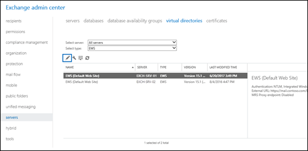
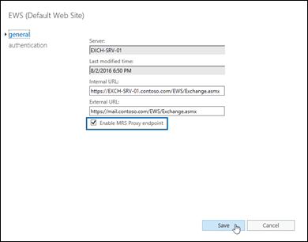
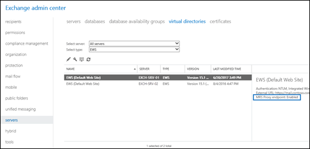

# Enable the MRS Proxy endpoint for remote moves

 **Summary**: Learn how administrators can enable the MRS Proxy endpoint that's required for on-premises Exchange 2016 mailbox moves between Active Directory forests or Office 365.
  
The Mailbox Replication service (MRS) has a proxy endpoint that's required for cross-forest mailbox moves and remote move migrations between your on-premises Exchange organization and Office 365. You enable the MRS proxy endpoint in the Exchange Web Services (EWS) virtual directory settings in the Client Access (frontend) services on Exchange 2016 Mailbox servers.
  
Where you enable the MRS Proxy endpoint depends on the type and direction of the mailbox move:
  
- **Cross-forest enterprise moves** For cross-forest moves that are initiated from the target forest (known as a pull move type), you need to enable the MRS Proxy endpoint on Mailbox servers in the source forest. For cross-forest moves that are initiated from the source forest (known as a push move type), you need to enable the MRS Proxy endpoint on Mailbox servers in the target forest. 
    
- **Remote move migrations between an on-premises Exchange organization and Office 365**. For both onboarding and offboarding remote move migrations, you need to enable the MRS Proxy endpoint on Mailbox servers in your on-premises Exchange organization.
    
 **Note**: If you use theExchange admin center (EAC) to move mailboxes, cross-forest moves and onboarding remote move migrations are pull move types, because you initiate the request from the target environment. Offboarding remote move migrations are push move types because you initiate the request from the source environment.
  
## What do you need to know before you begin?

- Estimated time to complete: 2 minutes per server.
    
- You need to be assigned permissions before you can perform this procedure or procedures. To see what permissions you need, see the "Exchange Web Services permissions" section in the [Clients and mobile devices permissions](../../permissions/feature-permissions/clients-and-mobile-devices.md) topic. 
    
- If you've deployed multiple Mailbox servers in your Exchange organization, you should enable the MRS Proxy endpoint in the Client Access services on each Mailbox server. If you add additional Mailbox servers, be sure to enable the MRS Proxy endpoint on the new servers. Cross-forest moves and remote move migrations can fail if the MRS Proxy endpoint isn't enabled on all Mailbox servers.
    
- If you don't perform cross-forest moves or remote move migrations, keep MRS Proxy endpoints disabled in the Client Access services on Mailbox servers to reduce the attack surface of your organization.
    
- For information about keyboard shortcuts that may apply to the procedures in this topic, see [Keyboard shortcuts in the Exchange admin center](../../about-documentation/keyboard-shortcuts-in-eac.md).
    
> [!TIP]
> Having problems? Ask for help in the Exchange forums. Visit the forums at: [Exchange Server](https://go.microsoft.com/fwlink/p/?linkId=60612), [Exchange Online](https://go.microsoft.com/fwlink/p/?linkId=267542), or [Exchange Online Protection](https://go.microsoft.com/fwlink/p/?linkId=285351).. 
  
## Use the EAC to enable the MRS Proxy endpoint

1. In the EAC, go to **Recipients** > **Servers** > **Virtual Directories**.
    
2. Select the EWS virtual directory that you want to configure.
    
  - You can use the **Select server** drop down list to filter the Exchange servers by name. 
    
  - To only display EWS virtual directories, select **EWS** in the **Select type** drop down list. 
    
    After you've selected the EWS virtual directory that you want to configure, click **Edit**.
    
  
3. On the properties page that opens, on the **General** tab, select the **Enable MRS Proxy endpoint** check box, and then click **Save**.
    
  
## Use the Exchange Management Shell to enable the MRS Proxy endpoint

To enable the MRS Proxy endpoint, use this syntax:
  
```
Set-WebServicesVirtualDirectory -Identity "[<Server>\]EWS (Default Web Site)" -MRSProxyEnabled $true
```

This example enables the MRS Proxy endpoint in Client Access services on the Mailbox server named EXCH-SRV-01.
  
```
Set-WebServicesVirtualDirectory -Identity "EXCH-SRV-01\EWS (Default Web Site)" -MRSProxyEnabled $true
```

This example enables the MRS Proxy endpoint in Client Access services on all Mailbox servers in your Exchange organization.
  
```
Get-WebServicesVirtualDirectory | Set-WebServicesVirtualDirectory -MRSProxyEnabled $true
```

For detailed syntax and parameter information, see [Set-WebServicesVirtualDirectory](http://technet.microsoft.com/library/35871cc3-6e8f-48bc-86ed-8703c0e178f3.aspx).
  
## How do you know this worked?

To verify that you've successfully enabled the MRS Proxy endpoint, do any of these steps:
  
- In the EAC, got to **Recipients** > **Servers** > **Virtual Directories** > select the EWS virtual directory, and verify in the details pane that the MRS Proxy endpoint is enabled. 
    
  
- Run this command in the Exchange Management Shell, and verify that the **MRSProxyEnabled** property for the EWS virtual directory has the value  `True`:
    
  ```
  Get-WebServicesVirtualDirectory | Format-Table -Auto Identity,MRSProxyEnabled
  ```

- Use the **Test-MigrationServerAvailability** cmdlet in the Exchange Management Shell to test communication with the remote servers that hosts the mailboxes that you want to move (or the servers in your on-premises Exchange organization for offboarding remote move migrations from Office 365). 
    
    Replace  _\<EmailAddress\>_ with the email address of one of the mailboxes that you want to move, and run this command in the Exchange Management Shell: 
    
  ```
  Test-MigrationServerAvailability -ExchangeRemoteMove -Autodiscover -EmailAddress <EmailAddress> -Credentials (Get-Credential)
  ```

    To run this command successfully, the MRS Proxy endpoint must be enabled.
    
    For detailed syntax and parameter information, see [Test-MigrationServerAvailability](http://technet.microsoft.com/library/a0959dbe-94ae-4f2e-8e2c-e5d5bd5e1521.aspx).
    

