# Use AD FS claims-based authentication with Outlook on the web

 **Summary**: Learn how to configure AD FS claims-based authentication to connect to Outlook on the web and the Exchange admin center in Exchange 2016.
  
Installing and configuring Active Directory Federation Services (AD FS) in Exchange Server 2016 organizations allows clients to use AD FS claims-based authentication to connect to Outlook on the web (formerly known as Outlook Web App) and the Exchange admin center (EAC). Claims-based identity is another approach to authentication that removes authentication management from the application, and makes it easier for you to manage accounts by centralizing authentication. When claims-based authentication is enabled, Outlook on the web and the EAC aren't responsible for authenticating users, storing user accounts and passwords, looking up user identity details, or integrating with other identity systems. Centralizing authentication helps make it easier to upgrade authentication methods in the future.
  
AD FS claims-based authentication replaces the traditional authentication methods that are available for Outlook on the web and the EAC. For example:
  
- Active Directory client certificate authentication
    
- Basic authentication
    
- Digest authentication
    
- Forms authentication
    
- Windows authentication
    
Setting up AD FS claims-based authentication for Outlook on the web and the EAC in Exchange 2016 involves the following additional servers:
  
- A Windows Server 2012 or later domain controller (Active Directory Domain Services server role).
    
- A Windows Server 2012 or later AD FS server (Active Directory Federation Services server role). Windows Server 2012 uses AD FS 2.1, and Windows Server 2012 R2 uses AD FS 3.0. You need to be a member of the Domain Admins, Enterprise Admins, or local Administrators security group to install AD FS, and to create the required relying party trusts and claim rules on the AD FS server.
    
- Optionally, a Windows Server 2012 R2 or later Web Application Proxy server (Remote Access server role, Web Application Proxy role service).
    
  - Web Application Proxy is a reverse proxy server for web applications that are inside the corporate network. Web Application Proxy allows users on many devices to access published web applications from outside the corporate network. For more information, see [Installing and Configuring Web Application Proxy for Publishing Internal Applications](https://go.microsoft.com/fwlink/p/?LinkId=392705).
    
  - Although Web Application Proxy is typically recommended when AD FS is accessible to external clients, offline access in Outlook on the web isn't supported when using AD FS authentication through Web Application Proxy.
    
  - Installing Web Application Proxy on a Windows Server 2012 R2 server requires local administrator permissions.
    
  - You need to deploy and configure the AD FS server before you configure the Web Application Proxy server, and you can't install Web Application Proxy on the same server where AD FS is installed.
    
## What do you need to know before you begin?

- Estimated time to complete this procedure: 45 minutes.
    
- The procedures in this topic are based on Windows Server 2012 R2.
    
- Outlook on the web for devices doesn't support AD FS claims-based authentication.
    
- For the procedures in the Exchange organization, you need to have Organization Management permissions.
    
- For information about keyboard shortcuts that may apply to the procedures in this topic, see [Keyboard shortcuts in the Exchange admin center](../../about-documentation/exchange-admin-center-keyboard-shortcuts.md).
    
> [!TIP]
> Having problems? Ask for help in the Exchange forums. Visit the forums at: [Exchange Server](https://go.microsoft.com/fwlink/p/?linkId=60612), [Exchange Online](https://go.microsoft.com/fwlink/p/?linkId=267542), or [Exchange Online Protection](https://go.microsoft.com/fwlink/p/?linkId=285351).
  
## Step 1: Review the certificate requirements for AD FS
<a name="CertRequirements"> </a>

AD FS requires two basic types of certificates:
  
- A service communication Secure Sockets Layer (SSL) certificate for encrypted web services traffic between the AD FS server, clients, Exchange servers, and the optional Web Application Proxy server. We recommend that you use a certificate that's issued by an internal or commercial certification authority (CA), because all clients need to trust this certificate.
    
- A token-signing certificate for encrypted communication and authentication between the AD FS server, Active Directory domain controllers, and Exchange servers. We recommend that you use the default self-signed AD FS token signing certificate.
    
For more information about creating and importing SSL certificates in Windows, see [Server Certificates](https://go.microsoft.com/fwlink/p/?LinkId=392703).
  
Here's a summary of the certificates that we'll be using in this scenario:
  
****

|**Common name (CN) in the certificate (in the Subject, Subject Alternative Name, or a wildcard certificate match)**|**Type**|**Required on servers**|**Comments**|
|:-----|:-----|:-----|:-----|
| `adfs.contoso.com` <br/> |Issued by a CA  <br/> |AD FS server  <br/> Web Application Proxy server  <br/> |This is the host name that's visible to clients, so clients need to trust the issuer of this certificate.  <br/> |
| `ADFS Signing - adfs.contoso.com` <br/> |Self-signed  <br/> |AD FS server  <br/> Exchange servers  <br/> Web Application Proxy server  <br/> |The default self-signed certificate is automatically copied over during the configuration of the optional Web Application Proxy server, but you'll need to manually import it into the Trusted Root Certificate store on all Exchange servers in your organization.  <br/> By default, the self-signed token-signing certificates are valid for one year. The AD FS server is configured to automatically renew (replace) its self-signed certificates before they expire, but you'll need to re-import the certificate on the Exchange servers.  <br/> You can increase the default certificate expiration period by running this command in Windows PowerShell on the AD FS server: `Set-AdfsProperties -CertificateDuration <Days>` (the default value is 365). For more information, see [Set-AdfsProperties](https://go.microsoft.com/fwlink/p/?linkid=838466).  <br/> To export the certificate from the AD FS Management console, select **Service** \> **Certificates** \> right-click on the token-signing certificate \> select **View Certificate** \> click the **Details** tab \> click **Copy to File**.  <br/> |
| `mail.contoso.com` <br/> |Issued by a CA  <br/> |Exchange servers  <br/> Web Application Proxy server  <br/> |This is the typical certificate that's used to encrypt external client connections to Outlook on the web (and likely other Exchange IIS services). For more information, see [Certificate requirements for Exchange services](../../architecture/client-access/certificates.md#CertRequirements).  <br/> |
   
For more information, see the "Certificate requirements" section in [Review the requirements for deploying AD FS](https://go.microsoft.com/fwlink/p/?LinkId=392699).
  
> [!NOTE]
> Secure Sockets Layer (SSL) is being replaced by Transport Layer Security (TLS) as the protocol that's used to encrypt data sent between computer systems. They're so closely related that the terms "SSL" and "TLS" (without versions) are often used interchangeably. Because of this similarity, references to "SSL" in Exchange topics, the Exchange admin center, and the Exchange Management Shell have often been used to encompass both the SSL and TLS protocols. Typically, "SSL" refers to the actual SSL protocol only when a version is also provided (for example, SSL 3.0). To find out why you should disable the SSL protocol and switch to TLS, check out [Protecting you against the SSL 3.0 vulnerability](https://blogs.office.com/2014/10/29/protecting-ssl-3-0-vulnerability/).
  
## Step 2: Deploy an AD FS server
<a name="DeployADFS"> </a>

You can use Server Manager or Windows PowerShell to install the Active Directory Federation Services role service on the target server.
  
To use Server Manager to install AD FS, follow these steps:
  
1. On the target server, open **Server Manager**, click **Manage**, and then select **Add Roles and Features**.

    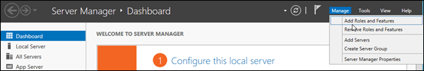
  
2. The **Add Roles and Features Wizard** opens. You'll start on the **Before you begin** page unless you previously selected **Skip this page by default**. Click **Next**.

    
  
3. On the **Select installation type** page, verify that **Role-based or feature-based installation** is selected, and then click **Next**.

    
  
4. On the **Select destination server** page, verify the server selection, and then click **Next**.

    
  
5. On the **Select server roles** page, select **Active Directory Federation Services** from the list, and then click **Next**.

    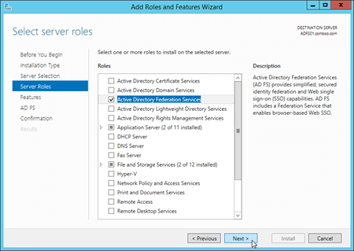
  
6. On the **Select features** page, click **Next** (accept the default feature selections).

    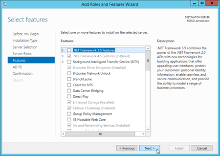
  
7. On the **Active Directory Federation Services (AD FS)** page, click **Next**.

    
  
8. **Windows Server 2012 only**: On the **Select role services** page, click **Next** (accept the default role service selections).
    
9. On the **Confirm installation selections** page, click **Install**.

    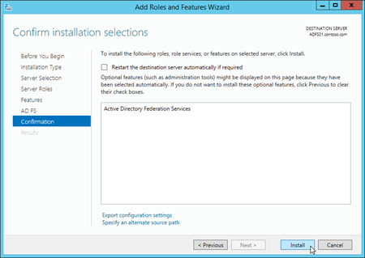
  
10. On the **Installation progress** page, you can watch the progress bar to verify that the installation was successful. When the installation is finished, leave the wizard open so you can click **Configure the federation service on this server** in [Step 3b: Configure the AD FS server](ad-fs-claims-based-auth.md#ConfigureADFS).

    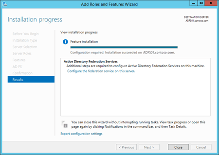
  
To use Windows PowerShell to install AD FS, run the following command:
  
```
Install-WindowsFeature ADFS-Federation -IncludeManagementTools
```

## Step 3: Configure and test the AD FS server
<a name="DeployADFS"> </a>

You can also refer to this checklist to help you configure AD FS: [Checklist: Setting Up a Federation Server](https://go.microsoft.com/fwlink/p/?LinkId=392700).
  
### Step 3a: Create a gMSA on a domain controller
<a name="CreateGMSA"> </a>

Before you configure the AD FS server, you need to create a group Managed Service Account (gMSA) on a Windows Server 2012 or later domain controller. You do this in an elevated Windows PowerShell window on the domain controller (a Windows PowerShell window you open by selecting **Run as administrator**).
  
1. Run the following command:
    
  ```
  Add-KdsRootKey -EffectiveTime (Get-Date).AddHours(-10)
  ```

    If the command is successful, a GUID value is returned. For example:
    
    `Guid`
    
    `----`
    
    `2570034b-ab50-461d-eb80-04e73ecf142b`
    
2. To create a new gMSA account for the AD FS server, use the following syntax:
    
  ```
  New-ADServiceAccount -Name <AccountName> -DnsHostName <FederationServiceName> -ServicePrincipalNames http/<FederationServiceName>
  ```

    This example creates a new gMSA account named FSgMSA for the Federation Service named adfs.contoso.com. The Federation Service name is the value that's visible to clients.
    
  ```
  New-ADServiceAccount -Name FSgMSA -DnsHostName adfs.contoso.com -ServicePrincipalNames http/adfs.contoso.com
  ```

### Step 3b: Configure the AD FS server
<a name="ConfigureADFS"> </a>

To configure the AD FS server, you can use Server Manager or Windows PowerShell.
  
To use Server Manager, following these steps:
  
1. If you left the **Add Roles and Features Wizard** open on the AD FS server from [Step 2: Deploy an AD FS server](ad-fs-claims-based-auth.md#DeployADFS), you can click the **Configure the federation service on this server** link on the **Installation progress** page.

    
  
    If you closed the **Add Roles and Features Wizard** or you used Windows PowerShell to install AD FS, you can get to the same place in Server Manager by clicking **Notifications**, and then clicking **Configure the federation service on this server** in the **Post-deployment Configuration** warning.

    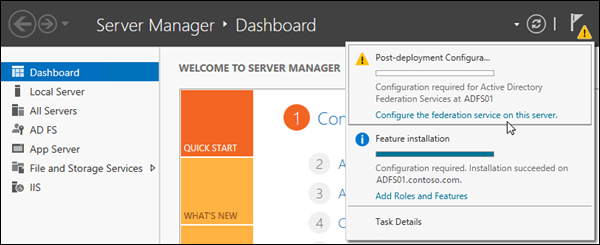
  
2. The **Active Directory Federation Services Wizard** opens. On the **Welcome** page, verify **Create the first federation server in a federation server farm** is selected, and then click **Next**.

    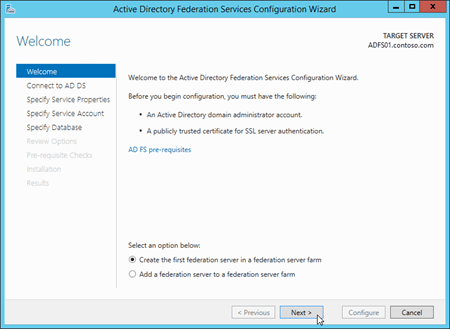
  
3. On the **Connect to Active Directory Federation Services** page, select a domain administrator account in the domain where the AD FS server resides (your current credentials are selected by default). If you need to select a different user, click **Change**. When you're finished, click **Next**.

    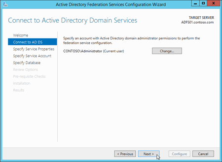
  
4. On the **Specify Service Properties** page, configure the following settings: 
    
  - **SSL Certificate**: Import or select the SSL certificate that contains the federation service name that you configured in [Step 3a: Create a gMSA on a domain controller](ad-fs-claims-based-auth.md#CreateGMSA) (for example `adfs.contoso.com`). When you import a certificate that isn't already installed on the server, you need to import a .pfx file (likely, a password-protected file that contains the certificate's private key). The common name (CN) value in the certificate's Subject field is displayed here.
    
  - **Federation Service Name**: This field is automatically populated based on the type of SSL certificate that you select or import:
    
  - **Single subject certificate**: The CN value of the certificate's Subject field is displayed, and you can't change it (for example, `adfs.contoso.com`).
    
  - **SAN certificate**: If the certificate contains the required federation service name, that value is displayed (for example, `adfs.contoso.com`). You can use the drop down list to see other CN values in the certificate.
    
  - **Wildcard certificate**: The CN value of the certificate's Subject field is displayed (for example, `*.contoso.com`), but you need to change it to the required federation service name (for example, `adfs.contoso.com`).
    
    **Note**: If the certificate you select doesn't contain the required federation service name (the **Federation Service Name** field doesn't contain the required value), you'll receive the following error: 
    
    `The federation service name does not match any of the subject names found in the certificate.`
    
  - **Federation Service Display Name**: Enter the name of your organization. For example, Contoso, Ltd..
    
    When you're finished, click **Next**.

    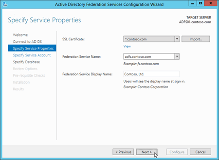
  
5. On the **Specify Service Account** page, configure the following settings: 
    
  - Select **Use an existing domain user account or group Managed Service Account**.
    
  - **Account Name**: Click **Select** and enter the gMSA account that you created in [Step 3a: Create a gMSA on a domain controller](ad-fs-claims-based-auth.md#CreateGMSA) (for example, `FSgMSA`). Note that after you select it, the value that's displayed is `<Domain>\<gMSAAccountName>$` (for example, `CONTOSO\FSgMSA$`).
    
    When you're finished, click **Next**.

    
  
6. On the **Specify Configuration Database** page, verify that **Create a database on this server using Windows Internal Database** is selected, and then click **Next**.

    
  
7. On the **Review Options** page, verify your selections. You can click **View Script** button to copy the Windows PowerShell equivalent of the selections that you made for future use. When you're finished, click **Next**.

    
  
8. On the **Pre-requisite Checks** page, verify that all the prerequisite checks were successfully completed, and then click **Configure**.

    
  
9. On the **Results** page, review the results, verify that the configuration completed successfully. You can click **Next steps required for completing your federation service deployment** if you want to read about the next steps (for example, configuring DNS). When you're finished, click **Close**.

    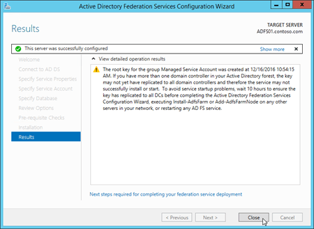
  
To use Windows PowerShell to configure AD FS, follow these steps:
  
1. Run the following command on the AD FS server to find the thumbprint value of the installed certificate that contains `adfs.contoso.com`:
    
  ```
  Set-Location Cert:\LocalMachine\My; Get-ChildItem | Format-List FriendlyName,Subject,Thumbprint
  ```

2. Run the following command:
    
  ```
  Import-Module ADFS
  ```

3. Use the following syntax:
    
  ```
  Install-AdfsFarm -CertificateThumbprint <ThumbprintValue> -FederationServiceName <FederationServiceName> -FederationServiceDisplayName <FederationServiceDisplayName> -GroupServiceAccountIdentifier <gMSA>
  ```

This example configures AD FS with the following settings:
    
- **adfs.contoso.com certificate thumbprint**: The `*.contoso.com` certificate that has the thumbprint value `5AE82C737900B29C2BAC3AB6D8C44D249EE05609`.
    
- **Federation service name**: `adfs.contoso.com`
    
- **Federation service display name**: `Contoso, Ltd.`
    
- **Federation gMSA SAM account name and domain**: For example, for the gMSA account named `FSgMSA` in the `contoso.com` domain, the required value is `contoso\FSgMSA$`.
    
```
Install-AdfsFarm -CertificateThumbprint 5AE82C737900B29C2BAC3AB6D8C44D249EE05609 -FederationServiceName adfs.contoso.com -FederationServiceDisplayName "Contoso, Ltd." -GroupServiceAccountIdentifier "contoso\FSgMSA`$"
```

 **Notes**:
  
- When you create the gMSA, the `$` is automatically appended to the **Name** value to create the **SamAccountName** value, which is required here.
    
- The escape character (```) is required for the `$` in the **SamAccountName**.
    
For details and syntax, see [Install-AdfsFarm](https://go.microsoft.com/fwlink/p/?LinkId=392704).
  
### Step 3c: Test the AD FS server
<a name="ConfigureADFS"> </a>

After you configure AD FS, you can verify the installation on the AD FS server by successfully opening the URL of the federation metadata in a web browser. The URL uses the syntax `https://<FederationServiceName>/federationmetadata/2007-06/federationmetadata.xml`. For example, `https://adfs.contoso.com/federationmetadata/2007-06/federationmetadata.xml`.
  
## Step 4: Create a relying party trust and custom claim rules in AD FS for Outlook on the web and the EAC
<a name="ADFSRPT"> </a>

- On the Exchange server, Outlook on the web uses the virtual directory named `owa` and the EAC uses the virtual directory named `ecp`.
    
- The trailing slash (`/`) that's used in the Outlook on the web and EAC URL values is intentional. It's important that the AD FS relying party trusts and Exchange Audience URI's **are identical**. They **both must have** or **both must omit** the trailing slashes in their URLs. The examples in this section contain the trailing slashes after the owa and ecp URLs (`owa/` and `ecp/`).
    
- In organizations with multiple Active Directory sites that use separate namespaces (for example, `eu.contoso.com` and `na.contoso.com`), you need to configure relying party trusts for each namespace for both Outlook on the web and the EAC.
    
### Step 4a: Create relying party trusts in AD FS for Outlook on the web and the EAC

To create the relying party trusts on the AD FS server, you can use the AD FS Management console or Windows PowerShell.
  
To use the AD FS Management console to create the relying party trusts, follow these steps:
  
 **Note**: You need to go through these steps twice: once for Outlook on the web, and once for the EAC. The only difference is the values that you enter in steps 5 and 8 (the **Specify Display Name** and **Configure URL** pages in the wizard).
  
1. In **Server Manager**, click **Tools**, and then select **AD FS Management**.

    
  
2. In the AD FS Management console, expand **Trust Relationships** and then select **Relying Party Trusts**. In the **Actions** pane, select **Add Relying Party Trust**.

    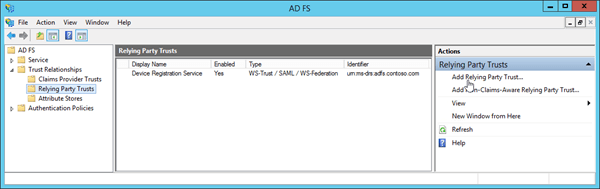
  
3. The **Add Relying Party Trust Wizard** opens. On the **Welcome** page, click **Start**.

    
  
4. On the **Select Data Source** page, select **Enter data about the relying party manually**, and then click **Next**.

    
  
5. On the **Specify Display Name** page, configure the following settings: 
    
  - **For Outlook on the web**:
    
  - **Display Name**: Type Outlook on the web.
    
  - **Notes**: Enter a description. For example, This is a trust for https://mail.contoso.com/owa/.
    
    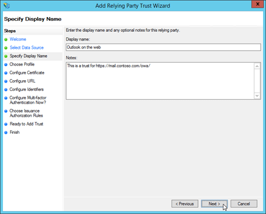
  
  - **For the EAC**:
    
  - **Display Name**: Type EAC.
    
  - **Notes**: Enter a description. For example, This is a trust for https://mail.contoso.com/ecp/.
    
    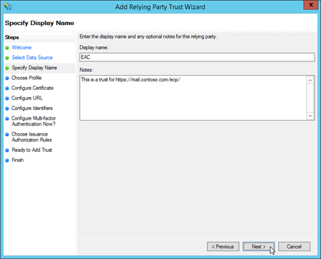
  
    When you're finished, click **Next**.
    
6. On the **Choose Profile** page, verify **AD FS profile** is selected, and then click **Next**.

    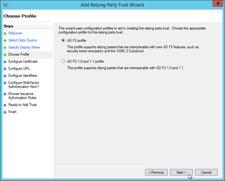
  
7. On the **Configure Certificate** page, click **Next** (don't specify an optional token encryption certificate).

    
  
8. On the **Configure URL** page, select **Enable support for the WS-Federation Passive protocol**, and in **Relying party WS-Federation Passive protocol URL**, enter the following information:
    
  - **Outlook on the web**: Type your external Outlook on the web URL (for example, https://mail.contoso.com/owa/).

    
  
  - **EAC**: Type your external EAC URL (for example, https://mail.contoso.com/ecp/).
    
    When you're finished, click **Next**.

    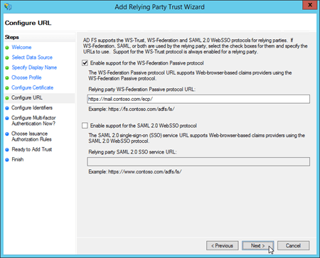
  
9. On the **Configure Identifiers** page, click **Next** (the URL from the previous step is listed in **Relying party trust identifiers**).

    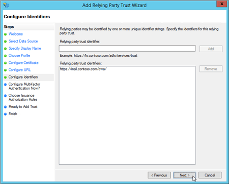
  
10. On the **Configure Multi-factor Authentication Now?** page, verify that **I do not want to configure multi-factor authentication settings for this relying party trust at this time** is selected, and then click **Next**.

    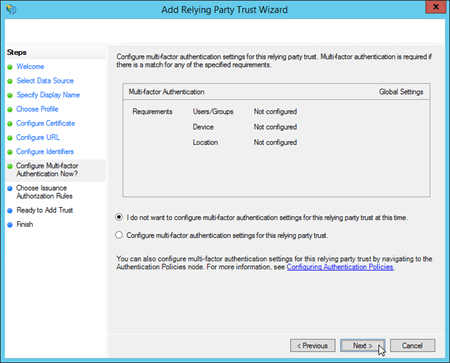
  
11. On the **Choose Issuance Authorization Rules** page, verify **Permit all users to access this relying party** is selected, and then click **Next**.

    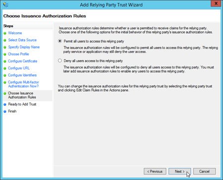
  
12. On the **Ready to Add Trust** page, review the settings, and then click **Next** to save your relying party trust information.

    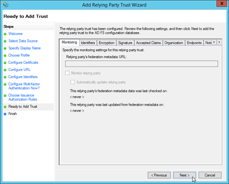
  
13. On the **Finish** page, uncheck **Open the Edit Claim Rules dialog for this relying party trust when the wizard closes**, and then click **Close**.

    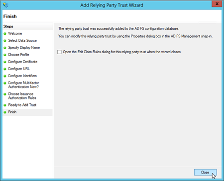
  
To use Windows PowerShell prompt to create the relying party trusts, follow these steps:
  
1. In an elevated Windows PowerShell window, run the following command:
    
  ```
  Import-Module ADFS
  ```

2. Use the following syntax:
    
  ```
  Add-AdfsRelyingPartyTrust -Name <"Outlook on the web" | EAC> -Notes "This is a trust for <OotwURL | EACURL>" -Identifier <OotwURL |  EACURL> -WSFedEndpoint <OotwURL |  EACURL> -IssuanceAuthorizationRules '@RuleTemplate = "AllowAllAuthzRule"  => issue(Type = "http://schemas.microsoft.com/authorization/claims/permit", Value = "true");' -IssueOAuthRefreshTokensTo NoDevice
  ```

This example creates a relying party trust for Outlook on the web using the following values:
    
  - **Name**: Outlook on the web 
    
  - **Notes**: This is a trust for https://mail.contoso.com/owa/ 
    
  - **Identifier**: https://mail.contoso.com/owa/ 
    
  - **WSFedEndpoint**: https://mail.contoso.com/owa/ 
    
  ```
  Add-AdfsRelyingPartyTrust -Name "Outlook on the web" -Notes "This is a trust for https://mail.contoso.com/owa/" -Identifier https://mail.contoso.com/owa/ -WSFedEndpoint https://mail.contoso.com/owa/ -IssuanceAuthorizationRules '@RuleTemplate = "AllowAllAuthzRule"  => issue(Type = "http://schemas.microsoft.com/authorization/claims/permit", Value = "true");' -IssueOAuthRefreshTokensTo NoDevice
  ```

This example creates a relying party trust for the EAC using the following values:
    
  - **Name**: EAC 
    
  - **Notes**: This is a trust for https://mail.contoso.com/ecp/ 
    
  - **Identifier**: https://mail.contoso.com/ecp/ 
    
  - **WSFedEndpoint**: https://mail.contoso.com/ecp/ 
    
  ```
  Add-AdfsRelyingPartyTrust -Name EAC -Notes "This is a trust for https://mail.contoso.com/ecp/" -Identifier https://mail.contoso.com/ecp/ -WSFedEndpoint https://mail.contoso.com/ecp/ -IssuanceAuthorizationRules '@RuleTemplate = "AllowAllAuthzRule"  => issue(Type = "http://schemas.microsoft.com/authorization/claims/permit", Value = "true");' -IssueOAuthRefreshTokensTo NoDevice
  ```

### Step 4b: Create custom claim rules in AD FS for Outlook on the web and the EAC

For both Outlook on the web and the EAC, you need to create two claim rules:
  
- Active Directory user SID
    
- Active Directory UPN
    
To create the claim rules on the AD FS server, you can use the AD FS Management console or Windows PowerShell.
  
To use the AD FS Management console to create the claim rules, follow these steps:
  
 **Note**: You need to go through these steps twice: once for Outlook on the web, and once for EAC. The only difference is the relying party trust that you select in the first step. All other values in the procedure are identical.
  
To add the required claims rules:
  
1. In the AD FS Management console, expand **Trust Relationships** select **Relying Party Trusts**, and then select the Outlook on the web or EAC relying party trust. In the **Actions** pane, select **Edit Claim Rules**.

    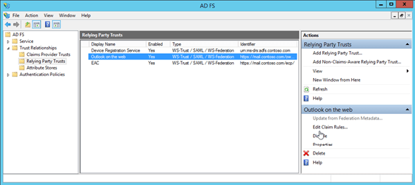
  
2. In the **Edit Claim Rules for \<RuleName\>** window that opens, verify that the **Issuance Transform Rules** tab is selected, and then click **Add Rule**.

    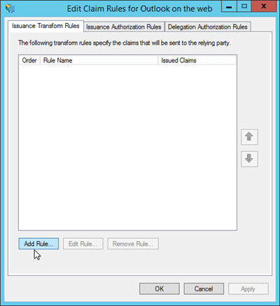
  
3. The **Add Transform Claim Rule Wizard** opens. On the **Select Rule Template** page, click the **Claim rule template** drop down, and then select **Send Claims Using a Custom Rule**. When you're finished, click **Next**.

    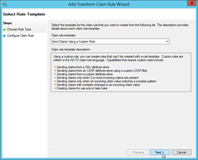
  
4. On the **Configure Rule** page, enter the following information: 
    
  - **Claim rule name**: Enter a descriptive name for the claim rule. For example, ActiveDirectoryUserSID.
    
  - **Custom rule**: Copy and paste the following text:
    
      ```
      c:[Type == "http://schemas.microsoft.com/ws/2008/06/identity/claims/windowsaccountname", Issuer == "AD AUTHORITY"] => issue(store = "Active Directory", types = ("http://schemas.microsoft.com/ws/2008/06/identity/claims/primarysid"), query = ";objectSID;{0}", param = c.Value);
      ```

    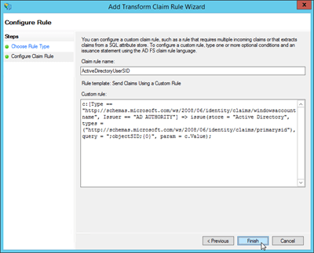
  
    When you're finished, click **Finish**.
    
5. Back on the **Edit Claim Rules for \<RuleName\>** window, verify that the **Issuance Transform Rules** tab is selected, and then click **Add Rule**.

    
  
6. The **Add Transform Claim Rule Wizard** opens. On the **Select Rule Template** page, click the **Claim rule template** drop down, and then select **Send Claims Using a Custom Rule**. When you're finished, click **Next**.
 
   
  
7. On the **Configure Rule** page, enter the following information: 
    
  - **Claim rule name**: Enter a descriptive name for the claim rule. For example, ActiveDirectoryUPN.
    
  - **Custom rule**: Copy and paste the following text:
    
      ```
      c:[Type == "http://schemas.microsoft.com/ws/2008/06/identity/claims/windowsaccountname", Issuer == "AD AUTHORITY"] => issue(store = "Active Directory", types = ("http://schemas.xmlsoap.org/ws/2005/05/identity/claims/upn"), query = ";userPrincipalName;{0}", param = c.Value);
      ```

    
  
    When you're finished, click **Finish**.
    
8. Back on the **Edit Claim Rules for \<RuleName\>** window, click **OK**.

    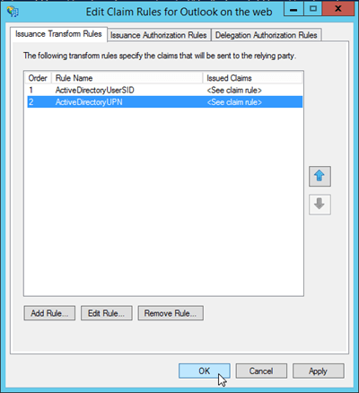
  
To use Windows PowerShell to create the custom claim rules, follow these steps:
  
1. Open an elevated Windows PowerShell window, and run the following command:
    
    ```
    Import-Module ADFS
    ```

2. Use the following syntax:
    
    ```
    Set-AdfsRelyingPartyTrust -TargetName <OotwRelyingPartyTrust | EACRelyingPartyTrust> -IssuanceTransformRules '@RuleName = "ActiveDirectoryUserSID" c:[Type == "http://schemas.microsoft.com/ws/2008/06/identity/claims/windowsaccountname", Issuer == "AD AUTHORITY"] => issue(store = "Active Directory", types = ("http://schemas.microsoft.com/ws/2008/06/identity/claims/primarysid"), query = ";objectSID;{0}", param = c.Value);   @RuleName = "ActiveDirectoryUPN" c:[Type == "http://schemas.microsoft.com/ws/2008/06/identity/claims/windowsaccountname", Issuer == "AD AUTHORITY"] => issue(store = "Active Directory", types = ("http://schemas.xmlsoap.org/ws/2005/05/identity/claims/upn"), query = ";userPrincipalName;{0}", param = c.Value);'
    ```

To create the custom claim rules in the existing relying party trust named Outlook on the web, run the following command:
    
  ```
  Set-AdfsRelyingPartyTrust -TargetName "Outlook on the web" -IssuanceTransformRules '@RuleName = "ActiveDirectoryUserSID" c:[Type == "http://schemas.microsoft.com/ws/2008/06/identity/claims/windowsaccountname", Issuer == "AD AUTHORITY"] => issue(store = "Active Directory", types = ("http://schemas.microsoft.com/ws/2008/06/identity/claims/primarysid"), query = ";objectSID;{0}", param = c.Value);   @RuleName = "ActiveDirectoryUPN" c:[Type == "http://schemas.microsoft.com/ws/2008/06/identity/claims/windowsaccountname", Issuer == "AD AUTHORITY"] => issue(store = "Active Directory", types = ("http://schemas.xmlsoap.org/ws/2005/05/identity/claims/upn"), query = ";userPrincipalName;{0}", param = c.Value);'
  ```

To create the custom claim rules in the existing relying party trust named EAC, run the following command:
    
  ```
  Set-AdfsRelyingPartyTrust -TargetName EAC -IssuanceTransformRules '@RuleName = "ActiveDirectoryUserSID" c:[Type == "http://schemas.microsoft.com/ws/2008/06/identity/claims/windowsaccountname", Issuer == "AD AUTHORITY"] => issue(store = "Active Directory", types = ("http://schemas.microsoft.com/ws/2008/06/identity/claims/primarysid"), query = ";objectSID;{0}", param = c.Value);   @RuleName = "ActiveDirectoryUPN" c:[Type == "http://schemas.microsoft.com/ws/2008/06/identity/claims/windowsaccountname", Issuer == "AD AUTHORITY"] => issue(store = "Active Directory", types = ("http://schemas.xmlsoap.org/ws/2005/05/identity/claims/upn"), query = ";userPrincipalName;{0}", param = c.Value);'
  ```

## Step 5: (Optional) Deploy and configure a Windows Server 2012 R2 Web Application Proxy server
<a name="ADFSRPT"> </a>

The steps in this section are required only if you want to publish Outlook on the web and the EAC using Web Application Proxy, and you want Web Application Proxy perform the AD FS authentication. Remember:
  
- You can't use offline access in Outlook on the web if you use AD FS authentication through Web Application Proxy.
    
- You can't install Web Application Proxy on the same server where AD FS is installed.
    
If you aren't going to use Web Application Proxy, skip to Step 6.
  
### Step 5a: Install Web Application Proxy
<a name="DeployWAP"> </a>

To use Server Manager to install Web Application Proxy, follow these steps:
  
1. On the target server, open **Server Manager**, click **Manage**, and then select **Add Roles and Features**.

    
  
2. The **Add Roles and Features Wizard** opens. You'll start on the **Before you begin** page unless you previously selected **Skip this page by default**. Click **Next**.

    
  
3. On the **Select installation type** page, verify that **Role-based or feature-based installation** is selected, and then click **Next**.

    
  
4. On the **Select destination server** page, verify the server selection, and then click **Next**.

    
  
5. On the **Select server roles** page, select **Remote Access** in the list of roles, and then click **Next**.

    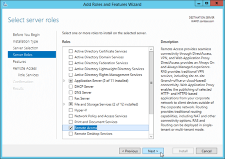
  
6. On the **Features** page, click **Next** (accept the default feature selections).

    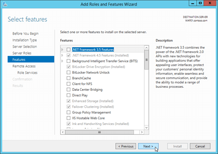
  
7. On the **Remote Access** page, read the information, and then click **Next**.

    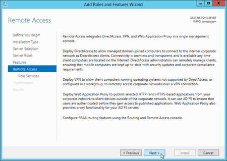
  
8. On the **Select role services** page, select **Web Application Proxy**. In the add features dialog box that opens, click **Add Features** to accept the default values and close the dialog box. Back on the **Select role services** page, click **Next**.

    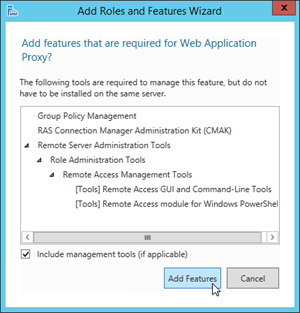
  
    
  
9. On the **Confirm installation selections** page, click **Install**.

    
  
10. On the **Installation progress** page, watch the progress bar to verify that the installation was successful. When the installation is finished, leave the wizard open so you can click **Open the Web Application Proxy Wizard** in the next step (5b).

    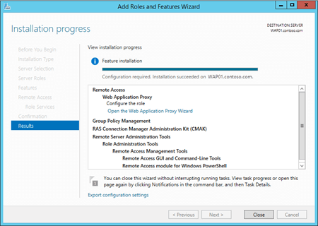
  
To use Windows PowerShell to install Web Application Proxy, run the following command:
  
```
Install-WindowsFeature Web-Application-Proxy -IncludeManagementTools
```

### Step 5b: Configure the Web Application Proxy server
<a name="ConfigureWAP"> </a>

After you deploy the Web Application Proxy server, you need to configure the following Web Application Proxy settings:
  
- **Federation service name**: For example, `adfs.contoso.com`.
    
- **Federation service trust credential**: The username and password of a local administrator account on the AD FS server.
    
- **AD FS Proxy Certificate**: A certificate that's installed on the Web Application Proxy server that identifies the server to clients as a proxy for the Federation Service, and therefore contains the federation service name (for example, `adfs.contoso.com`). Also, the federation service name must be accessible to the Web Application Proxy server (resolvable in DNS).
    
You can use Server Manager or Windows PowerShell to configure the Web Application Proxy server.
  
To use Server Manager to configure Web Application Proxy, follow these steps:
  
1. If you left the **Add Roles and Features Wizard** open on the Web Application Proxy server from the previous step, you can click the **Open the Web Application Proxy Wizard** link on the **Installation progress** page.

    
  
    If you closed the **Add Roles and Features Wizard** or you used Windows PowerShell to install Web Application Proxy, you can get to the same place by clicking **Notifications**, and then clicking **Open the Web Application Proxy Wizard** in the **Post-deployment Configuration** warning.

    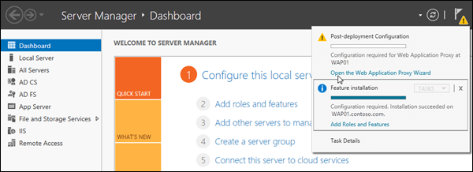
  
2. The **Web Application Proxy Configuration Wizard** opens. On the **Welcome** page, click **Next**.

    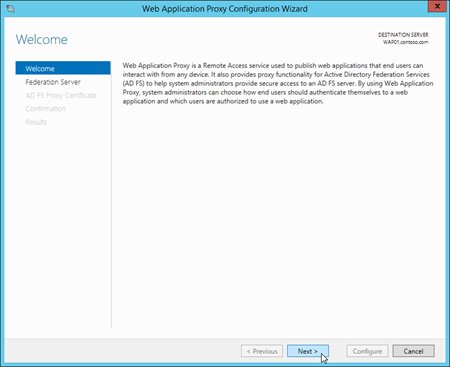
  
3. On the **Federation Server** page, enter the following information: 
    
  - **Federation service name**: For example, `adfs.contoso.com`.
    
  - **User name** and **Password**: Type the credentials of a local administrator account on the AD FS server.
    
    When you're finished, click **Next**.

    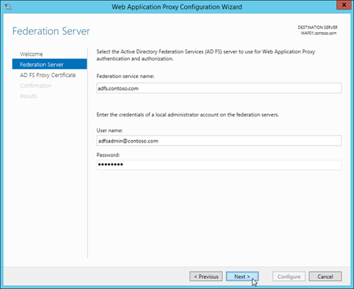
  
4. On the **AD FS Proxy Certificate** page, select an installed certificate that contains the federation service name (for example `adfs.contoso.com`). You can select a certificate in the drop down list, and then click **View** \> **Details** to see more information about the certificate. When you're finished, click **Next**.

    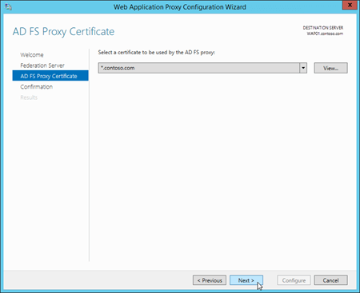
  
5. On the **Confirmation** page, review the settings. You can copy the Windows PowerShell command to automate additional installations (in particular, the certificate thumbprint value). When you're finished, click **Configure**.

    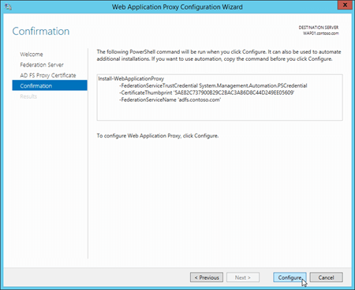
  
6. On the **Results** page, verify that the configuration was successful, and then click **Close**.

    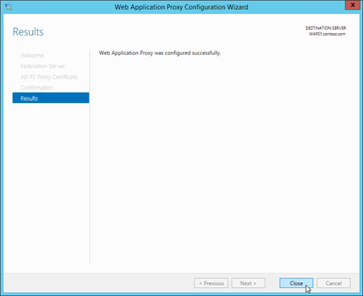
  
To use Windows PowerShell to configure Web Application Proxy, follow these steps:
  
1. Run the following command on the Web Application Proxy server to find the thumbprint value of the installed certificate that contains `adfs.contoso.com`:
    
    ```
    Set-Location Cert:\LocalMachine\My; Get-ChildItem | Format-List FriendlyName,Subject,Thumbprint
    ```

2. Run the following command, and enter the username and password of a local administrator account on the AD FS server.
    
    ```
    $ADFSServerCred = Get-Credential
    ```

3. Use the following syntax:
    
    ```
    Install-WebApplicationProxy -FederationServiceName <FederationServiceName> -FederationServiceTrustCredential $ADFSServerCred -CertificateThumprint <ADFSCertThumbprint>
    ```

    This example configure the Web Application Proxy server with the following settings:
    
    - **Federation service name**: `adfs.contoso.com`
    
    - **AD FS SSL certificate thumbprint**: The `*.contoso.com` certificate that has the thumbprint value `5AE82C737900B29C2BAC3AB6D8C44D249EE05609`.
    
    ```
    Install-WebApplicationProxy -FederationServiceName adfs.contoso.com -FederationServiceTrustCredential $ADFSServerCred -CertificateThumprint 5AE82C737900B29C2BAC3AB6D8C44D249EE05609
    ```

### Step 5c: Publish the claims relying party trusts for Outlook on the web and the EAC in Web Application Proxy
<a name="WAPPublish"> </a>

To publish the relying party trusts in Web Application Proxy, you can use the Remote Access Management console or Windows PowerShell.
  
To use the Remote Access Management console, follow these steps:
  
 **Note**: You need to go through these steps twice: once for Outlook on the web, and once for EAC. The required settings are described in the procedure.
  
1. Open the Remote Access Management console on the Web Application Proxy server: in Server Manager, click **Tools** \> **Remote Access Management**.
    
2. In the Remote Access Management console, under **Configuration**, click **Web Application Proxy**, and then in the **Tasks** pane, click **Publish**.

    
  
3. The **Publish New Application Wizard** opens. On the **Welcome** page, click **Next**.

    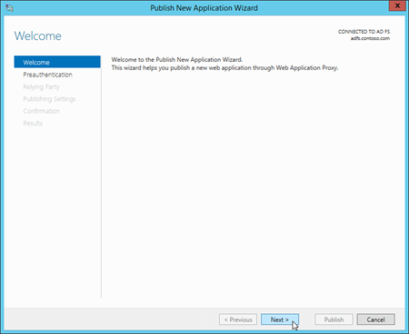
  
4. On the **Preauthentication** page, verify **Active Directory Federation Services (AD FS)** is selected, and then click **Next**.

    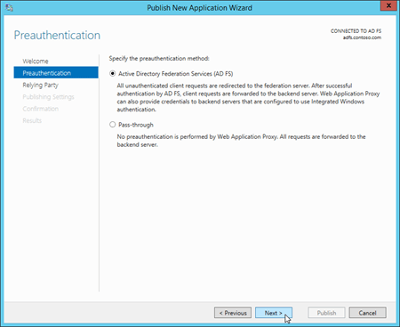
  
5. On the **Relying Party** page, select the relying party that you created on the AD FS server in [Step 4: Create a relying party trust and custom claim rules in AD FS for Outlook on the web and the EAC](ad-fs-claims-based-auth.md#ADFSRPT):

    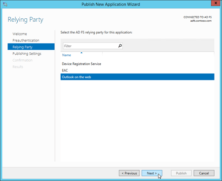
  
  - **For Outlook on the web**: Select Outlook on the web.
    
  - **For the EAC**: Select EAC.
    
    When you're finished, click **Next**.
    
6. On the **Publishing Settings** page, enter the following information: 
    
  - **For Outlook on the web**
    
    - **Name**: For example, `Outlook on the web`. This name is only visible in the Remote Access Management console.
    
    - **External URL**: For example, `https://mail.contoso.com/owa/`.
    
    - **External certificate**: Select an installed certificate that contains the host name of the external URL for Outlook on the web (for example, `mail.contoso.com`). You can select a certificate in the drop down list, and then click **View** \> **Details** to see more information about the certificate.
    
    - **Backend server URL**: This value is automatically populated by the **External URL**. You only need to change it if the backend server URL is different from the external URL. For example, `https://server01.contoso.com/owa/`. Note that the paths in the external URL and backend server URL must match (`/owa/`), but the host name values can be different (for example, `mail.contoso.com` and `server01.contoso.com`).
    
    
  
  - **For the EAC**
    
    - **Name**: For example, `EAC`. This name is only visible in the Remote Access Management console.
    
    - **External URL**: The external URL for the EAC. For example, https://mail.contoso.com/ecp/.
    
    - **External certificate**: Select an installed certificate that contains the host name of the external URL for the EAC (for example, `mail.contoso.com`). The certificate is likely a wildcard certificate or SAN certificate. You can select a certificate in the drop down list, and then click **View** \> **Details** to see more information about the certificate.
    
    - **Backend server URL**: This value is automatically populated by the **External URL**. You only need to change it if the backend server URL is different from the external URL. For example, `https://server01.contoso.com/ecp/`. Note that the paths in the external URL and backend server URL must match (`/ecp/`), but the host name values can be different (for example, `mail.contoso.com` and `server01.contoso.com`).
    
    When you're finished, click **Next**.

    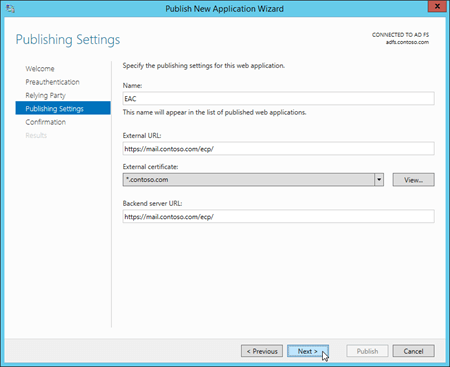
  
7. On the **Confirmation** page, review the settings. You can copy the Windows PowerShell command to automate additional installations (in particular, the certificate thumbprint value). When you're finished, click **Publish**.

    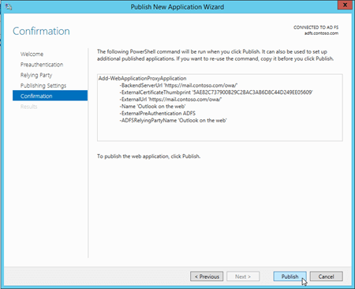
  
8. On the **Results** page, verify that the application published successfully, and then click **Close**.

    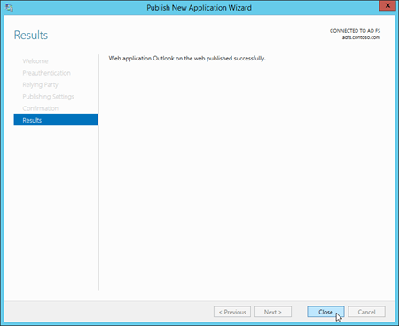
  
To use Windows PowerShell to publish the relying party trusts, follow these steps:
  
1. Run the following command on the Web Application Proxy server to find the thumbprint of the installed certificate that contains the host name of the Outlook on the web and EAC URLs (for example, `mail.contoso.com`):
    
    ```
    Set-Location Cert:\LocalMachine\My; Get-ChildItem | Format-List FriendlyName,Subject,Thumbprint
    ```

2. Use the following syntax:
    
    ```
    Add-WebApplicationProxyApplication -ExternalPreAuthentication ADFS -ADFSRelyingPartyName <OotwRelyingParty | EACRelyingParty> -Name "<Outlook on the web  | EAC>" -ExternalUrl <OotwURL | EACURL> -ExternalCertificateThumbprint <Thumbprint> -BackendServerUrl <OotwURL | EACURL>
    ```

    This example publishes Outlook on the web in Web Application Proxy with the following settings:
    
    - **AD FS relying party**: Outlook on the web
    
    - **Name**: Outlook on the web
    
    - **External URL**: https://mail.contoso.com/owa/
    
    - **External certificate thumbprint**: The `*.contoso.com` certificate that has the thumbprint value `5AE82C737900B29C2BAC3AB6D8C44D249EE05609`.
    
    - **Backend server URL**: https://mail.contoso.com/owa/
    
    ```
    Add-WebApplicationProxyApplication -ExternalPreAuthentication ADFS -ADFSRelyingPartyName "Outlook on the web" -Name "Outlook on the web" -ExternalUrl https://mail.contoso.com/owa/ -ExternalCertificateThumbprint 5AE82C737900B29C2BAC3AB6D8C44D249EE056093 -BackendServerUrl https://mail.contoso.com/owa/
    ```

    This example publishes the EAC in Web Application Proxy with the following settings:
    
    - **Name**: EAC
    
    - **External URL**: https://external.contoso.com/ecp/
    
    - **External certificate thumbprint**: The `*.contoso.com` certificate that has the thumbprint value `5AE82C737900B29C2BAC3AB6D8C44D249EE05609`.
    
    - **Backend server URL**: https://mail.contoso.com/ecp/
    
    ```
    Add-WebApplicationProxyApplication -ExternalPreAuthentication ADFS -ADFSRelyingPartyName EAC -Name EAC -ExternalUrl https://external.contoso.com/ecp/ -ExternalCertificateThumbprint 5AE82C737900B29C2BAC3AB6D8C44D249EE05609 -BackendServerUrl https://mail.contoso.com/ecp/
    ```

 **Note**: All AD FS endpoints that you want to publish through Web Application Proxy need to be proxy enabled. You do this in the AD FS Management console at **Service** \> **Endpoints** (verify that **Proxy Enabled** is **Yes** for the specified endpoint).
  
## Step 6: Configure the Exchange organization to use AD FS authentication
<a name="ConfigExchangeOrg"> </a>

To configure the Exchange organization to use AD FS authentication, you need to use the Exchange Management Shell. To learn how to open the Exchange Management Shell in your on-premises Exchange organization, see **Open the Exchange Management Shell**.
  
1. Run the following command to find the thumbprint value of the imported AD FS token signing certificate:
    
    ```
    Set-Location Cert:\LocalMachine\Root; Get-ChildItem | Sort-Object Subject
    ```

    Look for the Subject value `CN=ADFS Signing - <FederationServiceName>` (for example, `CN=ADFS Signing - adfs.contoso.com`).
    
    You can confirm this thumbprint value on the AD FS server in an elevated Windows PowerShell window by running the command `Import-Module ADFS`, and then running the command `Get-AdfsCertificate -CertificateType Token-Signing`.
    
2. Use the following syntax:
    
    ```
    Set-OrganizationConfig -AdfsIssuer https://<FederationServiceName>/adfs/ls/ -AdfsAudienceUris "<OotwURL>","<EACURL>" -AdfsSignCertificateThumbprint "<Thumbprint>"
    ```

    This example uses the following values:
    
    - **AD FS URL**: `https://adfs.contoso.com/adfs/ls/`
    
    - **Outlook on the web URL**: `https://mail.contoso.com/owa/`
    
    - **EAC URL**: `https://mail.contoso.com/ecp/`
    
    - **AD FS token-signing certificate thumbprint**: The `ADFS Signing - adfs.contoso.com` certificate that has the thumbprint value `88970C64278A15D642934DC2961D9CCA5E28DA6B`.
    
    ```
    Set-OrganizationConfig -AdfsIssuer https://adfs.contoso.com/adfs/ls/ -AdfsAudienceUris "https://mail.contoso.com/owa/","https://mail.contoso.com/ecp/" -AdfsSignCertificateThumbprint "88970C64278A15D642934DC2961D9CCA5E28DA6B"
    ```

    **Note**: The _AdfsEncryptCertificateThumbprint_ parameter isn't supported in these scenarios.
    
## Step 7: Configure AD FS authentication on the Outlook on the web and EAC virtual directories
<a name="ConfigExchangeVDirs"> </a>

For the Outlook on the web and EAC virtual directories, you need to configure AD FS authentication as the only available authentication method by disabling all other authentication methods.
  
- You need to configure the EAC virtual directory before you configure the Outlook on the web virtual directory.
    
- You'll likely want to configure AD FS authentication only on Internet-facing Exchange servers that clients use to connect to Outlook on the web and the EAC.
    
- By default, only Basic and Forms authentication are enabled for the Outlook on the web and EAC virtual directories.
    
To use the Exchange Management Shell to configure an EAC or Outlook on the web virtual directory to only accept AD FS authentication, use the following syntax:
  
```
Set-EcpVirtualDirectory -Identity <VirtualDirectoryIdentity> -AdfsAuthentication $true -BasicAuthentication $false -DigestAuthentication $false -FormsAuthentication $false -OAuthAuthentication $false -WindowsAuthentication $false
```

This example configures the EAC virtual directory in the default web site on the server named Mailbox01:
  
```
Set-EcpVirtualDirectory -Identity "Mailbox01\ecp (Default Web Site)" -AdfsAuthentication $true -BasicAuthentication $false -DigestAuthentication $false -FormsAuthentication $false -OAuthAuthentication $false -WindowsAuthentication $false
```

This example configures the Outlook on the web virtual directory in the default we site on the server named Mailbox01:
  
```
Set-OwaVirtualDirectory -Identity "Mailbox01\owa (Default Web Site)" -AdfsAuthentication $true -BasicAuthentication $false -DigestAuthentication $false -FormsAuthentication $false -OAuthAuthentication $false -WindowsAuthentication $false
```

 **Note**: To configure all EAC and Outlook on the web virtual directories on every Exchange server in your organization, run the following commands:
  
```
Get-EcpVirtualDirectory | Set-EcpVirtualDirectory -AdfsAuthentication $true -BasicAuthentication $false -DigestAuthentication $false -FormsAuthentication $false -OAuthAuthentication $false -WindowsAuthentication $false
```

```
Get-OwaVirtualDirectory | Set-OwaVirtualDirectory -AdfsAuthentication $true -BasicAuthentication $false -DigestAuthentication $false -FormsAuthentication $false -OAuthAuthentication $false -WindowsAuthentication $false 
```

## Step 8: Restart IIS on the Exchange server
<a name="RestartIIS"> </a>

1. Open IIS Manager on the Exchange server. An easy way to do this in Windows Server 2012 or later is to press Windows key + Q, type inetmgr, and select **Internet Information Services (IIS) Manager** in the results.
    
2. In IIS Manager, select the server.
    
3. In the **Actions** pane, click **Restart**.
    
    
  
**Note**: To perform this procedure on the command line, open an elevated command prompt on the Exchange server (a Command Prompt window you open by selecting **Run as administrator**) and run the following command:
  
```
iisreset /noforce
```

## How do you know this worked?
<a name="Test"> </a>

To test the AD FS claims for Outlook on the web:
  
1. In a web browser, open Outlook on the web (for example, https://mail.contoso.com/owa).
    
2. If you get a certificate error in the web browser, just continue on to the Outlook on the web web site. You should be redirected to the AD FS sign-in page or the AD FS prompt for credentials.
    
3. Type your user name (domain\user) and password, and then click **Sign in**.
    
4. Outlook on the web will load in the window.
    
To test the AD FS claims for EAC:
  
1. In a web browser, open EAC (for example, https://mail.contoso.com/ecp).
    
2. If you get a certificate error in the web browser, just continue on to the EAC web site. You should be redirected to the AD FS sign-in page or the AD FS prompt for credentials.
    
3. Type your user name (domain\user) and password, and then click **Sign in**.
    
4. EAC will load in the window.
    
## Additional considerations
<a name="MoreInfo"> </a>

 **Multifactor authentication**
  
Deploying and configuring AD FS for claims-based authentication allows Outlook on the web and the EAC to support multifactor authentication, such as certificate-based authentication, authentication or security tokens, and fingerprint authentication. Multifactor authentication requires two of these three authentication factors:
  
- Something only the user knows (for example, the password, PIN, or pattern).
    
- Something only the user has (for example, an ATM card, security token, smart card, or mobile phone).
    
- Something only the user is (for example, a biometric characteristic, such as a fingerprint).
    
For example, a password and a security code that's sent to a mobile phone, or a PIN and a fingerprint.
  
For details on multifactor authentication in Windows Server 2012 R2, see [Overview: Manage Risk with Additional Multi-Factor Authentication for Sensitive Applications](https://go.microsoft.com/fwlink/p/?LinkId=392707) and [Walkthrough Guide: Manage Risk with Additional Multi-Factor Authentication for Sensitive Applications](https://go.microsoft.com/fwlink/p/?LinkId=392708).
  
On the AD FS server, the federation service functions as a security token service, and provides the security tokens that are used with claims. The federation service issues tokens based on the credentials that are presented. After the account store verifies a user's credentials, the claims for the user are generated according to the rules of the trust policy and then added to a security token that is issued to the client. For more information about claims, see [Understanding Claims](https://go.microsoft.com/fwlink/p/?LinkId=392709).
  
 **Co-existence with other versions of Exchange**
  
You can use AD FS authentication for Outlook on the web and the EAC when you have more than one version of Exchange deployed in your organization. This scenario is supported only if all clients are connecting through or Exchange 2016 servers, **and** all of those servers have been configured for AD FS authentication.
  
Users with mailboxes on Exchange 2010 servers can access their mailboxes through an Exchange 2016 server that's configured for AD FS authentication. The initial client connection to the or Exchange 2016 server uses AD FS authentication. However, the proxied connection to Exchange 2010 uses Kerberos. There's no supported way to configure Exchange 2010 for direct AD FS authentication.
  

