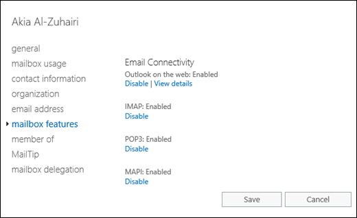
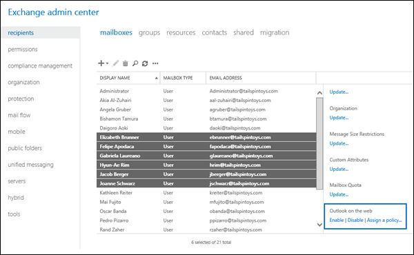

# Enable or disable Outlook on the web access to mailboxes in Exchange 2016

Learn how administrators can enable or disable Outlook on the web (formerly known as Outlook Web App) access to specific mailboxes in Exchange 2016.
  
Administrators can use the Exchange admin center (EAC) or the Exchange Management Shell to enable or disable Outlook on the web access to a mailbox. By default, users can access their mailboxes by using Outlook on the web. When you disable Outlook on the web access to mailboxes, users can still access their mailboxes by using Outlook or other email clients.
  
For additional management tasks related to user access to mailboxes, see these topics:
  
- [Enable or disable Exchange ActiveSync access to mailboxes in Exchange 2016](../../clients/exchange-activesync/activesync-mailbox-access.md)
    
- [Enable or disable POP3 or IMAP4 access to mailboxes in Exchange 2016](../../clients/pop3-and-imap4/configure-mailbox-access.md)
    
- [Enable or disable MAPI access to mailboxes in Exchange 2016](../../clients/mapi-mailbox-access.md)
    
## What do you need to know before you begin?

- Estimated time to complete: 5 minutes.
    
- For more information about accessing and using the EAC, see [Exchange admin center in Exchange 2016](../../architecture/client-access/exchange-admin-center.md).
    
- To learn how to open the Exchange Management Shell in your on-premises Exchange organization, see **Open the Exchange Management Shell**.
    
- You need to be assigned permissions before you can perform this procedure or procedures. To see what permissions you need, see the "Client Access user settings" entry in the [Clients and mobile devices permissions](../../permissions/feature-permissions/client-and-mobile-device-permissions.md) topic. 
    
- For information about keyboard shortcuts that may apply to the procedures in this topic, see [Keyboard shortcuts in the Exchange admin center](../../about-documentation/eac-keyboard-shortcuts.md).
    
> [!TIP]
> Having problems? Ask for help in the Exchange forums. Visit the forums at: [Exchange Server](https://go.microsoft.com/fwlink/p/?linkId=60612), [Exchange Online](https://go.microsoft.com/fwlink/p/?linkId=267542), or [Exchange Online Protection](https://go.microsoft.com/fwlink/p/?linkId=285351).. 
  
## Enable or disable Outlook on the web access to a single mailbox

### Use the EAC to Enable or disable Outlook on the web access to a single mailbox

1. In the EAC, go to **Recipients** \> **Mailboxes**.
    
2. In the list of mailboxes, find the mailbox that you want to modify. You can:
    
  - Scroll through the list of mailboxes.
    
  - Click **Search** and enter part of the user's name, email address, or alias. 
    
  - Click **More options** \> **Advanced search** to find the mailbox. 
    
    Once you've found the mailbox that you want to modify, select it, and then click **Edit**.
    
3. On the mailbox properties page that opens, click **Mailbox features**.
    
4. In the **Email Connectivity** section, configure one of these settings: 
    
  - If you see **Outlook on the web: Enabled**, click **Disable** to disable it, and then click **Yes** in the warning message that appears. 
    
  - If you see **Outlook on the web: Disabled**, click **Enable** to enable it. 
    

  
    When you're finished, click **Save**.
    
### Use the Exchange Management Shell to enable or disable Outlook on the web access to a mailbox

To enable or disable Outlook on the web access to a single mailbox, use this syntax:
  
```
Set-CasMailbox -Identity <MailboxIdentity> -OWAEnabled <$true | $false>
```

This example disables Outlook on the web access to the mailbox named Yan Li.
  
```
Set-CasMailbox -Identity "Yan Li" -OWAEnabled $false
```

This example enables Outlook on the web access to the mailbox named Elly Nkya.
  
```
Set-CasMailbox -Identity "Elly Nkya" -OWAEnabled $true
```

For detailed syntax and parameter information, see [Set-CASMailbox](http://technet.microsoft.com/library/ff7d4dc5-755e-4005-a0a3-631eed3f9b3b.aspx).
  
## Enable or disable Outlook on the web access to multiple mailboxes

### Use the EAC to enable or disable Outlook on the web access to multiple mailboxes

1. In the EAC, go to **Recipients** \> **Mailboxes**.
    
2. In the list of mailboxes, find the mailboxes that you want to modify. You can:
    
  - Scroll through the list of mailboxes.
    
  - Click **Search** and enter part of the user's name, email address, or alias. 
    
  - Click **More options** \> **Advanced search** to find the mailbox. 
    
3. In the list of mailboxes, select multiple mailboxes of the same type (for example, **User**) from the list. For example:
    
  - Select a mailbox, hold down the Shift key, and select another mailbox that's farther down in the list.
    
  - Hold down the CTRL key as you select each mailbox.
    
    After you select multiple mailboxes of the same type, the title of the details pane changes to **Bulk Edit**.
    
4. In the details pane, scroll down to **Outlook on the web**, click **Enable** or **Disable**, and then click **OK** in the warning message that appears. 
    
  
### Use the Exchange Management Shell to enable or disable Outlook on the web access to multiple mailboxes

You can use the **Get-Mailbox**, **Get-User** or **Get-Content** cmdlets to identify the mailboxes that you want to modify. For example: 
  
- Use the  _OrganizationalUnit_ parameter to filter the mailboxes by organizational unit (OU). 
    
- Use the  _Filter_ parameter to create OPATH filters that identify the mailboxes. For more information, see [Filterable Properties for the -Filter Parameter](http://technet.microsoft.com/library/b02b0005-2fb6-4bc2-8815-305259fa5432.aspx).
    
- Use a text file to specify the mailboxes. The text file contains one mailbox (email address, name, or other unique identifier) on each line like this:
    
  ```
  ebrunner@tailspintoys.com
  fapodaca@tailspintoys.com
  glaureano@tailspintoys.com
  hrim@tailspintoys.com
  ```

This example disables Outlook on the web access to all user mailboxes in the North America\Finance OU.
  
```
$NAFinance = Get-Mailbox -OrganizationalUnit "OU=Marketing,OU=North America,DC=contoso,DC=com" -Filter {RecipientTypeDetails -eq 'UserMailbox'} -ResultSize Unlimited; $NAFinance | foreach  {Set-CasMailbox  $_.Identity -OWAEnabled $false}
```

This example disables Outlook on the web access to all user mailboxes in the Engineering department in Washington state.
  
```
Get-User -Filter {RecipientType -eq 'UserMailbox' -and Department -like 'Engineering*' -and StateOrProvince -eq 'WA'} | Set-CasMailbox -OWAEnabled $false
```

This example uses the text file C:\My Documents\Accounts.txt to disable Outlook on the web access to the specified mailboxes.
  
```
Get-Content "C:\My Documents\Accounts.txt" | foreach {Set-CasMailbox $_ -OWAEnabled $false}
```

For detailed syntax and parameter information, see [Get-Mailbox](http://technet.microsoft.com/library/8a5a6eb9-4a75-47f9-ae3b-a3ba251cf9a8.aspx) and [Get-User](http://technet.microsoft.com/library/2a33c9e6-33da-438c-912d-28ce3f4c9afb.aspx).
  
## How do you know this worked?

To verify that you've successfully enabled or disabled Outlook on the web access to a mailbox, do any of these steps:
  
- In the EAC, go to **Recipients** \> **Mailboxes** \> select the mailbox \> click **Edit** \> **Mailbox features** and verify the **Outlook on the web** value in the **Email Connectivity** section. 
    
  
- In the Exchange Management Shell, replace  _\<MailboxIdentity\>_ with the identity of the mailbox (for example, name, alias, or email address), and run this command: 
    
  ```
  Get-CasMailbox -Identity "<MailboxIdentity>"
  ```

- Use the same filter that you used to identify the mailboxes, but use the **Get-CasMailbox** cmdlet instead of **Set-CasMailbox**. For example: 
    
  ```
  Get-User -Filter {RecipientType -eq 'UserMailbox' -and Department -like 'Engineering*' -and StateOrProvince -eq 'WA'} | Get-CasMailbox
  ```

- In the Exchange Management Shell, run this command to show all mailboxes where Outlook on the web access is disabled:
    
  ```
  Get-CasMailbox -ResultSize unlimited -Filter {OWAEnabled -eq $false}
  ```


