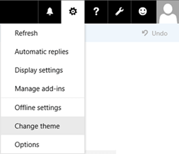
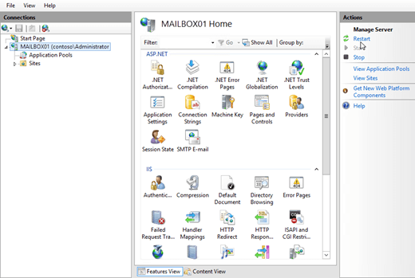

# Create a theme for Outlook on the web in Exchange 2016

Learn how to create a custom theme for Outlook on the web in Exchange 2016.
  
A theme defines the colors, fonts, and images that are displayed to users in Outlook on the web (formerly known as Outlook Web App) in Exchange Server 2016. Each theme is a collection of files that are stored on the Exchange server. The built-in themes are described in the [Default Outlook on the web themes in Exchange 2016](owa-themes.md#DefaultThemes) section at the end of this topic. 
  
The basic steps to create a new theme for Outlook on the web are:
  
1. Copy the folders and files of an existing theme, and rename the copied folders and files.
    
2. Configure the display name and sort order of the new theme.
    
3. Customize the new theme.
    
4. (Optional) Set the new theme as the default, and prevent users from selecting themes.
    
5. Restart IIS for the changes to take affect.
    
If you use multiple Exchange servers for Outlook on the web client connections, you need to copy the new theme to each server. You should also create a backup copy of the new theme so you can copy the files back after you reinstall or upgrade the Exchange server.
  
After you create a theme, you may also want to customize elements that are common to all themes. For more information, see [Customize the Outlook on the web sign-in, language selection, and error pages in Exchange 2016](customize-owa.md).
  
## What do you need to know before you begin?

- Estimated time to complete this task: 45 minutes.
    
- You need to be assigned permissions before you can perform this procedure or procedures. To see what permissions you need, see the "Outlook on the web virtual directories" entry in the [Clients and mobile devices permissions](../../permissions/feature-permissions/client-and-mobile-device-permissions.md) topic. The account you use also needs to be a member of the local Administrators group on the Exchange server. 
    
- The light version of Outlook on the web doesn't support themes.
    
- To replace an existing color with a new color, you need the HTML RGB value of the new color. You can find HTML RGB values at [Color Table](https://go.microsoft.com/fwlink/p/?LinkId=280679). If you can't find the color there, you can use an image editing tool or an HTML color codes web site to determine its HTML RGB value.
    
- Don't delete the folder  `%ExchangeInstallPath%ClientAccess\OWA\prem\<ExchangeVersion>\resources\themes\base`, or any files in it.
    
- If you decide to directly edit an existing theme (not a copy of the theme), make a backup copy of the original files before you modify them.
    
- For information about keyboard shortcuts that may apply to the procedures in this topic, see [Keyboard shortcuts in the Exchange admin center](../../about-documentation/eac-keyboard-shortcuts.md).
    
> [!TIP]
> Having problems? Ask for help in the Exchange forums. Visit the forums at: [Exchange Server](https://go.microsoft.com/fwlink/p/?linkId=60612), [Exchange Online](https://go.microsoft.com/fwlink/p/?linkId=267542), or [Exchange Online Protection](https://go.microsoft.com/fwlink/p/?linkId=285351). 
  
## Step 1: Use File Explorer to copy the folders and files of an existing theme, and rename the copied folders and files

You can inspect the built-in themes by opening a mailbox in Outlook on the web, selecting **Settings**, and then selecting **Change theme**.
  

  
You can use the information in the [Default Outlook on the web themes in Exchange 2016](owa-themes.md#DefaultThemes) section at the end of this topic to match the display name of the theme in Outlook on the web to the name of the theme folder on the Exchange server. 
  
The theme files and folders are stored in the following locations:
  
-  `%ExchangeInstallPath%ClientAccess\OWA\prem\<ExchangeVersion>\resources\themes\` contains the theme folder that holds the header image, theme preview image, and theme description text. 
    
-  `%ExchangeInstallPath%ClientAccess\OWA\prem\<ExchangeVersion>\resources\styles\` contains the  `_fabric.color.variables.theme.<ThemeFolderName>.less` and  `fabric.color.theme.<ThemeFolderName>.css` files that define the colors that are used in the theme. 
    
    **Note**: The  _\<ExchangeVersion\>_ subfolder uses the syntax 15.1.  _nnn_. _nn_, and indicates the Exchange Cumulative Update (CU) that's installed.
    
After you've identified the theme that's closest to what you want (for example, with or without a header image), you need to copy the theme folder and the corresponding files, and then rename the copied folders and files
  
1. In File Explorer, browse to  `%ExchangeInstallPath%ClientAccess\OWA\prem\<ExchangeVersion>\resources\themes`.
    
2. Select an existing theme folder in the  `\themes` folder, copy it, and then paste it back into the  `\themes` folder. This results in a new folder named  `<ThemeFolderName> - Copy`.
    
    **Note**: An easy way to copy and paste the theme folder is to select the folder, press the Control key + C, and then press the Control key + V.
    
3. Rename the new theme folder that you created in the previous step. For example,  `fourthcoffee`.
    
    **Note**: An easy way to rename the folder is to select it, and then press the F2 key.
    
4. In File Explorer, browse to  `%ExchangeInstallPath%ClientAccess\OWA\prem\<ExchangeVersion>\resources\styles\`.
    
5. Locate the files named  `_fabric.color.variables.theme.<ThemeFolderName>.less` and  `fabric.color.theme.<ThemeFolderName>.css` that correspond to the theme folder you copied in step 2. Select each file, copy it, and paste it back into the  `\styles` folder. This results in new files named  `_fabric.color.variables.theme.<ThemeFolderName> - Copy.less` and  `fabric.color.theme.<ThemeFolderName> - Copy.css`.
    
6. Rename the new files that you created in the previous step. The  _\<ThemeFolderName\>_ value must match the folder name from step 3. For example,  `_fabric.color.variables.theme.fourthcoffee.less` and  `fabric.color.theme.fourthcoffee.css`.
    
## Step 2: Use Notepad to configure the display name and sort order of the new theme

You need to configure a unique display name and sort order for the new theme, because the new theme has the same display name and sort order as the theme you copied. The theme's display name appears in the **Change theme** panel in Outlook on the web. The sort order determines where the theme appears in the list of themes. 
  
1. Use Notepad to open the file named  `themeinfo.xml` in the new theme folder  `%ExchangeInstallPath%ClientAccess\OWA\prem\<ExchangeVersion>\resources\themes\<NewThemeFolder>` that you created in Step 1. The contents of the file look like this: 
    
     `<theme displayname="__<CopiedThemeName>__" sortorder="<CopiedThemeSortOrder>" />`
    
2. Change the  `<theme displayname="__<CopiedThemeName>__"` value to the value you want. For example  `displayname = "Fourth Coffee Corporate Theme"`.
    
    **Note**: The theme display name value  `"__<ThemeName>__"` is a code string that's localized into different languages. The text value that you specify for the new theme isn't localized into different languages. 
    
3. Change the  `sortorder="<CopiedThemeSortOrder>"` integer value to the unique value you want. A lower value appears earlier in the list of themes. You can use the information in the [Default Outlook on the web themes in Exchange 2016](owa-themes.md#DefaultThemes) section at the end of this topic to find the sort order values for the built-in themes. The Default theme has  `sortorder="0"`, and appears first in the list.
    
  - If you want to insert your new theme among the list of built-in themes, change the number to a unique value that isn't already in use. For example, if you want your new theme to appear second in the list, you can use the value  `sortorder="5"`.
    
  - If you want to  *replace*  the position of a built-in theme in the list, set the number to the same value as built-in theme, and then change the sort order for the built-in theme. For example, if you want your new theme to appear first in the list, you need to set your new theme to  `sortorder="0"`. But, you also need to open the  `themeinfo.xml` file in the  `\base` folder (the Default theme) to change the value  `sortorder="0"` to something else (for example,  `sortorder="5")`.
    
4. When you're finished, save and close the  `themeinfo.xml` file. 
    
## Step 3: Customize the new theme

### Image files

Theme image files are stored in the following folders in  `%ExchangeInstallPath%ClientAccess\OWA\prem\<ExchangeVersion>\resources\themes\<ThemeFolderName>`:
  
-  `\images\0` These files are used in left-to-right languages. 
    
-  `\images\rtl` These files are used in right-to-left languages. Depending on the image, the file might be exactly the same as the left-to-right version, or it might be reversed (right-to-left instead of left-to-right). 
    
The image files that exist in these folders are described in the following table:
  
|**File name**|**Dimensions (width x height in pixels)**|**Bit depth**|**Description**|
|:-----|:-----|:-----|:-----|
|headerbgmaing2.png  <br/> |2000 x 50  <br/> |32  <br/> |The header image for themes that use a static header image. The size of the file varies.  <br/>  If the theme doesn't use a static header image, the file is 1 x 1, and the size is 2815 bytes.  <br/> |
|headerbgmaing2.gif  <br/> |2000 x 50  <br/> |24  <br/> |The header image for themes that use an animated header image. The size of the file varies.  <br/>  If the theme doesn't use an animated header image, the file is 1 x 1, and the size is 43 bytes.  <br/> |
|themepreview.png  <br/> |64 x 64  <br/> |24 or 8  <br/> |The small square image that represents the theme in the **Change theme** panel in Outlook on the web.  <br/> For the Default theme and the Black theme, this file 1 x 1, and the preview image is a black square.  <br/> |
   
You can edit the existing image file, or replace the file with a new file that has the same name and dimensions.
  
### Colors

Theme colors are defined in the following files in the  `%ExchangeInstallPath%ClientAccess\OWA\prem\<ExchangeVersion>\resources\styles` folder: 
  
-  `fabric.color.theme.<ThemeFolderName>.css`
    
-  `_fabric.color.variables.<ThemeFolderName>.less`
    
If you change a color value, you need to change all references to the color in both files.
  
## Step 4: (Optional) Set the default theme and prevent users from selecting a theme

Setting a new default theme only affects users who haven't manually selected their theme. To force all users to use the default theme, you also need to disable theme selection in Outlook on the web. These settings affect all users who connect to Outlook on the web through the Exchange server.
  
To set the default theme and prevent users from changing their theme in Outlook on the web, use the following syntax:
  
```
Set-OwaVirtualDirectory -Identity <VirtualDirectoryIdentity> -DefaultTheme <ThemeFolderName> -ThemeSelectionEnabled $false
```

This example configures the theme folder named  `fourthcoffee` as the default theme in Outlook on the web for the default website on the server named Mailbox01. 
  
```
Set-OwaVirtualDirectory -Identity "Mailbox01\owa (Default Web Site)" -DefaultTheme fourthcoffee -ThemeSelectionEnabled $false
```

 **Notes**:
  
- By default, the value of the  _DefaultTheme_ parameter is blank (  `$null`). This value indicates that no default theme is specified, and the theme named Default is used if the user hasn't manually selected a theme.
    
- Exchange doesn't validate the value that you specify for the  _DefaultTheme_ parameter. Make sure that the theme exists. 
    
- To specify a default theme for specific users that overrides the default theme setting on the Outlook on the web virtual directory, use the  _DefaultTheme_ parameter on the **Set-OwaMailboxPolicy** cmdlet. 
    
## Step 5: Restart IIS

You need to restart Internet Information Services (IIS) for the changes to take effect.
  
1. Open IIS Manager on the Exchange server. An easy way to do this in Windows Server 2012 or later is to press Windows key + Q, type inetmgr, and select **Internet Information Services (IIS) Manager** in the results. 
    
2. In IIS Manager, select the server.
    
3. In the **Actions** pane, click **Restart**.
    

  
 **Note**: To perform this procedure on the command line, open an elevated command prompt on the Exchange server (a Command Prompt window you open by selecting **Run as administrator**) and run the following command:
  
```
iisreset /noforce
```

## How do you know this worked?

To verify that you've successfully created an Outlook on the web theme, perform the following steps:
  
1. Open a mailbox in Outlook on the web. On the Exchange server, you can test your theme by opening the URL https://localhost/owa or https://127.0.0.1/owa.
    
2. Depending on the settings you configured, verify the new theme is used by default, or verify that you can see and select the new theme at **Settings** > **Change theme**.
    
3. If you don't see your changes after you restart IIS, clear your browsing history (delete temporary Internet files), and refresh the browser window.
    
## Default Outlook on the web themes in Exchange 2016
<a name="DefaultThemes"> </a>

The built-in Outlook on the web themes are located in the folder  `%ExchangeInstallPath%ClientAccess\OWA\prem\<ExchangeVersion>\resources\themes`, and are described in the following table.
  
****

|**Folder name**|**Display name in Outlook on the web**|**Sort order in Outlook on the web (lower listed first)**|**Header image type**|
|:-----|:-----|:-----|:-----|
|angular  <br/> |Angular 80's  <br/> |110  <br/> |Static  <br/> |
|balloons  <br/> |Balloons  <br/> |240  <br/> |Static  <br/> |
|base  <br/> |Default  <br/> |0  <br/> |None  <br/> |
|beach  <br/> |Beach Sunset  <br/> |40  <br/> |Animated  <br/> |
|black  <br/> |Black  <br/> |670  <br/> |None  <br/> |
|blueberry  <br/> |Blueberry  <br/> |600  <br/> |None  <br/> |
|blueprint  <br/> |Blueprint  <br/> |120  <br/> |Static  <br/> |
|bricks  <br/> |Bricks  <br/> |20  <br/> |Static  <br/> |
|cats  <br/> |Cats  <br/> |300  <br/> |Static  <br/> |
|chevron  <br/> |Chevron  <br/> |80  <br/> |Static  <br/> |
|circuit  <br/> |Circuit  <br/> |130  <br/> |Static  <br/> |
|comic  <br/> |Comic Book  <br/> |170  <br/> |Static  <br/> |
|contrast  <br/> |Contrast  <br/> |500  <br/> |None  <br/> |
|cordovan  <br/> |Cordovan  <br/> |650  <br/> |None  <br/> |
|crayon  <br/> |Crayon  <br/> |140  <br/> |Static  <br/> |
|cubes  <br/> |3D Cubes  <br/> |190  <br/> |Static  <br/> |
|cubism  <br/> |Cubism  <br/> |310  <br/> |Static  <br/> |
|darkcordovan  <br/> |Dark Cordovan  <br/> |660  <br/> |None  <br/> |
|darkorange  <br/> |Dark Orange  <br/> |620  <br/> |None  <br/> |
|diamonds  <br/> |Floating Diamonds  <br/> |160  <br/> |Static  <br/> |
|far  <br/> |Far, Far Away  <br/> |150  <br/> |Animated  <br/> |
|grape  <br/> |Grape  <br/> |610  <br/> |None  <br/> |
|jelly  <br/> |Jelly Fish  <br/> |70  <br/> |Animated  <br/> |
|lightblue  <br/> |Light Blue  <br/> |530  <br/> |None  <br/> |
|lightgreen  <br/> |Light Green  <br/> |540  <br/> |None  <br/> |
|lite  <br/> |Lite  <br/> |510  <br/> |None  <br/> |
|mediumdarkblue  <br/> |Dark Blue  <br/> |640  <br/> |None  <br/> |
|minimal  <br/> |Minimal  <br/> |520  <br/> |None  <br/> |
|modern  <br/> |20th Century Modern  <br/> |280  <br/> |Static  <br/> |
|mountain  <br/> |Mountain Peak  <br/> |50  <br/> |Static  <br/> |
|orange  <br/> |Orange  <br/> |580  <br/> |None  <br/> |
|paint  <br/> |Finger paints  <br/> |290  <br/> |Static  <br/> |
|pink  <br/> |Pink  <br/> |550  <br/> |None  <br/> |
|pixel  <br/> |Pixel Pop  <br/> |60  <br/> |Static  <br/> |
|polka  <br/> |Polka Dot  <br/> |200  <br/> |Static  <br/> |
|pomegranate  <br/> |Pomegranate  <br/> |590  <br/> |None  <br/> |
|primary  <br/> |Primary  <br/> |180  <br/> |Static  <br/> |
|raspberry  <br/> |Raspberry  <br/> |570  <br/> |None  <br/> |
|robot  <br/> |Robot  <br/> |100  <br/> |Animated  <br/> |
|simple  <br/> |Simple Facets  <br/> |230  <br/> |Static  <br/> |
|spectrum  <br/> |Spectrum Facets  <br/> |90  <br/> |Static  <br/> |
|strawberry  <br/> |Strawberry  <br/> |250  <br/> |Static  <br/> |
|super  <br/> |Super sparkle happy  <br/> |10  <br/> |Static  <br/> |
|teagarden  <br/> |Tea Garden  <br/> |210  <br/> |Static  <br/> |
|teal  <br/> |Teal  <br/> |550  <br/> |None  <br/> |
|watermelon  <br/> |Watermelon  <br/> |630  <br/> |None  <br/> |
|whale  <br/> |Whale of a Time  <br/> |30  <br/> |Animated  <br/> |
|whimsical  <br/> |Whimsical  <br/> |220  <br/> |Static  <br/> |
|wntrlnd  <br/> |Winterland  <br/> |260  <br/> |Static  <br/> |
|wrld  <br/> |One World  <br/> |270  <br/> |Static  <br/> |
   

