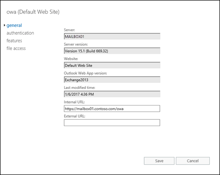
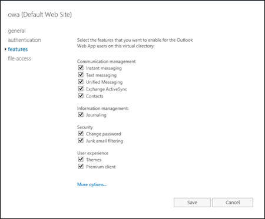
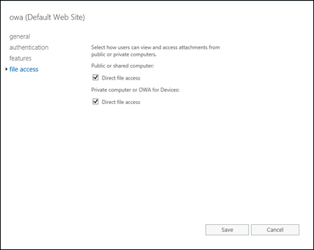

# View or configure Outlook on the web virtual directories in Exchange 2016

 **Summary**: Learn how to view and configure the properties of Outlook on the web virtual directories in Exchange 2016
  
You can use the Exchange admin center (EAC) or the Exchange Management Shell to view or modify the properties of an Outlook on the web (formerly known as Outlook Web App) virtual directory. Although the name has changed to Outlook on the web, the name of the virtual directory is still "owa".
  
## What do you need to know before you begin?

- Estimated time to complete each procedure: 10 minutes.
    
- For more information about the EAC, see .[Exchange admin center in Exchange 2016](../../architecture/client-access/exchange-admin-center.md). To learn how to open the Exchange Management Shell in your on-premises Exchange organization, see **Open the Exchange Management Shell**.
    
- Secure Sockets Layer (SSL) is being replaced by Transport Layer Security (TLS) as the protocol that's used to encrypt data sent between computer systems. They're so closely related that the terms "SSL" and "TLS" (without versions) are often used interchangeably. Because of this similarity, references to "SSL" in Exchange topics, the Exchange admin center, and the Exchange Management Shell have often been used to encompass both the SSL and TLS protocols. Typically, "SSL" refers to the actual SSL protocol only when a version is also provided (for example, SSL 3.0). To find out why you should disable the SSL protocol and switch to TLS, check out [Protecting you against the SSL 3.0 vulnerability](https://blogs.office.com/2014/10/29/protecting-ssl-3-0-vulnerability/).
    
- You need to be assigned permissions before you can perform this procedure or procedures. To see what permissions you need, see the "Outlook on the web virtual directories" entry in the [Clients and mobile devices permissions](../../permissions/feature-permissions/client-and-mobile-device-permissions.md) topic.
    
- For information about keyboard shortcuts that may apply to the procedures in this topic, see [Keyboard shortcuts in the Exchange admin center](../../about-documentation/exchange-admin-center-keyboard-shortcuts.md).
    
> [!TIP]
> Having problems? Ask for help in the Exchange forums. Visit the forums at: [Exchange Server](https://go.microsoft.com/fwlink/p/?linkId=60612), [Exchange Online](https://go.microsoft.com/fwlink/p/?linkId=267542), or [Exchange Online Protection](https://go.microsoft.com/fwlink/p/?linkId=285351).
  
## Use the EAC to view or configure Outlook on the web virtual directory properties

1. In the EAC, go to **Servers** \> **Virtual directories**.

    
  
2. Select the Outlook on the web virtual directory you want to view or configure.
    
  - You can use the **Select server** drop down list to filter the Exchange servers by name.
    
  - To only display Outlook on the web virtual directories, select **OWA** in the **Select type** drop down list.
    
    After you select the virtual directory, you can see the following properties and values in the feature pane:
    
  - **Website** (read-only): The default web site is named **Default Web Site**.
    
  - **Authentication**: The default authentication methods are **Basic** and **FBA** (forms-based authentication).
    
  - **Outlook on the web version**: The default version is `Exchange2013`.
    
  - **External URL**: The default value is blank (not configured).
    
3. To see more properties, or to modify the settings that aren't read only, click **Edit** (). The following tabs and settings are available:
    
  - **General** tab: 
    
  - **Internal URL**: The URL that's used to access Outlook on the web from the internal network. This value is configured automatically during Exchange 2016 setup, and the default value is https:// _\<Server FQDN\>_/owa (for example, https://mailbox01.contoso.com/owa).
    
  - **External URL**: The URL that's used to access Outlook on the web from the Internet. The default value is blank.
    
    For Internet-facing Exchange servers, this is the value that clients use to access Outlook on the web. To configure this setting, see the [Use the EAC to configure the external URL for Outlook on the web](virtual-directories.md#ExternalURL) section in this topic.
    
    For Exchange servers that don't have an Internet presence, the leave the **External URL** value blank.
    
    
  
  - **Authentication** tab: 
    
  - **Use one or more standard authentication methods**: Select this option to use one or more of the following authentication methods:
    
  - **Integrated Windows authentication**: This method requires that users have a valid Active Directory user account, and the client computer is a member of the same domain as the Exchange server (or a domain that's trusted by the Exchange server's domain). Users aren't prompted for their account names and passwords. Instead, the server negotiates with the Windows security packages that are installed on the client computer. No unencrypted information is transmitted over the network.
    
  - **Digest authentication for Windows domain servers**: This method requires that users have a valid Active Directory user account. Passwords are transmitted over the network as a hash value for additional security.
    
  - **Basic authentication (password is sent in clear text)**: This is the default value. When you use basic authentication, you should require TLS encrypted connections between client computers and the Exchange server.
    
  - **Use forms-based authentication**: Forms-based authentication provides enhanced security and allows you to configure the type of prompt that's used to sign-in. However, forms-based authentication won't provide a secure channel unless TLS is enabled.
    
    Select one of the following logon formats to use with forms-based authentication. The examples use the account for the user named Valeria Barrios in the contoso.com domain.
    
  - **Domain\user name** For example, CONTOSO\VBarrios. This is the default value.
    
  - **User principal name (UPN)** For example, vbarrios@contoso.com. Note that if the UPN doesn't match the email address, users can't access Outlook on the web by using this method.
    
  - **User name only** For example, VBarrios. This setting requires you to configure the default domain that's used with all user names. Click **Browse** in the **Logon Domain** property to select the default Active Directory domain. If the user isn't a member of the specified domain, they're required to enter the domain and user name when they sign in.
    
    
  
  - **Features** tab: 
    
    These settings affect all users who connect to the Outlook on the web virtual directory. You can configure custom Outlook on the web settings for specific users or groups of users by using Outlook on the web mailbox policies. For more information, see [Outlook Web App Mailbox Policies](http://technet.microsoft.com/library/213b8b7a-1c29-49ee-8c98-d0364ddf4f9d.aspx).
    
  - **Communication management**
    
  - **Instant messaging**
    
  - **Text messaging**
    
  - **Unified Messaging**
    
  - **Exchange ActiveSync**
    
  - **Contacts**
    
  - **All address lists**\*
    
  - **Information management**
    
  - **Journaling**
    
  - **Inbox rules**\*
    
  - **Recover deleted items**\*: Disabling this setting doesn't affect the deleted item retention for mailboxes; it prevents users from viewing or recovering deleted items in Outlook on the web.
    
  - **Security**
    
  - **Change password**
    
  - **Junk email-filtering**: This setting doesn't enable or disable the junk email rule in mailboxes; it controls the *availability* of the junk email settings for users in Outlook on the web. For more information about the junk email rule and junk email filtering in mailboxes, see [Configure Exchange antispam settings on mailboxes](../../antispam-and-antimalware/antispam-protection/configure-antispam-settings.md).
    
  - **User experience**
    
  - **Themes**
    
  - **Premium client**: If you uncheck this setting, The standard version of Outlook on the web (formerly known as the premium version of Outlook Web App) is disabled, and all clients are forced to use the light version of Outlook on the web.
    
  - **Email signature**\*
    
  - **Time management**\*
    
  - **Calendar**\*
    
  - **Tasks**\*
    
  - **Reminders and notifications**\*
    
    \* These settings are available after you click **More options**.

    
  
  - **File access** tab: 
    
    The direct file access settings on this page affect traditional file attachments that you click on to open or save, or MIME files (typically, image files) that are embedded directly in the message. Disabling direct file access doesn't affect file access in other email clients (for example, in Outlook), or by using other access methods in Outlook on the web (for example, web document access that's provided by Office Online Server, or links to files in the cloud).
    
    Note that users can select public or private computer access in Outlook on the web only when the virtual directory is configured for forms-based authentication. All other authentication methods automatically use private computer access.
    
  - **Direct file access** for public or shared computers.
    
  - **Direct file access** for private computers.
    
    
  
4. If you changed any of the virtual directory settings, click **Save**. If you're just browsing, click **Cancel**.
    
## Use the EAC to configure the external URL for Outlook on the web
<a name="ExternalURL"> </a>

1. In the EAC, go to **Servers** \> **Virtual directories**, select the Outlook on the web virtual directory you want to view or configure, and then click **Configure** ().
    
  - You can use the **Select server** drop down list to filter the Exchange servers by name.
    
  - To only display Outlook on the web virtual directories, select **OWA** in the **Select type** drop down list.
    
    
  
2. In the **Configure external access domain** page that opens, configure the following settings: 
    
  - **Select the servers to use with the external URL**: Click **Add** () and select one or more Exchange servers that external clients will use to connect to Outlook on the web (don't select internal only servers).
    
  - **Enter the domain name you will use with your external servers**: Enter the FQDN that external clients will use to connect to Outlook on the web (for example, mail.contoso.com). Note that this value needs to be configured and resolvable in your organization's public DNS.
    
    When you're finished, click **Save**.

    
  
## Reset an Outlook on the web virtual directory
<a name="ExternalURL"> </a>

If an Outlook on the web virtual directory isn't working the way you expect, you can reset it. The virtual directory is deleted and recreated with the default settings. Although any customized settings are lost, you're forced to select a location for a text document to backup the current settings.
  
1. In the EAC, go to **Servers** \> **Virtual directories**, select the Outlook on the web virtual directory you want to view or configure, and then click **Reset** ().
    
  - You can use the **Select server** drop down list to filter the Exchange servers by name.
    
  - To only display Outlook on the web virtual directories, select **OWA** in the **Select type** drop down list.
    
    
  
2. In the **Warning** page that opens, specify the UNC path of the file to save the current virtual directory settings (for example, \\ _\<Server\>_\ _\<Share\>_\owavdir.txt or \\ _\<LocalServerName_\>\c$\owavdir.txt).
    
    When you're finished, click **Reset**.

    
  
3. Restart IIS by using either of the following methods:
    
  - IIS Manager:
    
1. Open IIS Manager on the Exchange server. An easy way to do this in Windows Server 2012 or later is to press Windows key + Q, type inetmgr, and select **Internet Information Services (IIS) Manager** in the results.
    
2. In IIS Manager, select the server.
    
3. In the **Actions** pane, click **Restart**.
    
    
  
  - Command prompt:
    
    Open an elevated command prompt on the Exchange server (a Command Prompt window you open by selecting **Run as administrator**) and run the following command:
    
  ```
  iisreset /noforce
  ```

## Use the Exchange Management Shell to view Outlook on the web virtual directory properties
<a name="ExternalURL"> </a>

To use the Exchange Management Shell to view the properties of Outlook on the web virtual directories, use the following syntax:
  
```
Get-OWAVirtualDirectory [-Identity "<ExchangeServer>\owa <Website>"]
```

This example returns a summary list of all Outlook on the web virtual directories on all Exchange 2016 and Exchange 2013 in the organization.
  
```
Get-OWAVirtualDirectory
```

This example returns detailed information for the Outlook on the web virtual directory in the default website on the Exchange server named Mailbox01.
  
```
Get-OWAVirtualDirectory -Identity "Mailbox01\owa (Default Web Site)" | Format-List
```

This example returns the authentication methods and settings for the same virtual directory:
  
```
Get-OWAVirtualDirectory -Identity "Mailbox01\owa (Default Web Site)" | Format-List *Authentication*
```

 **Note**: Not every setting is applicable to Exchange 2016 (for example, **SpellCheckerEnabled**).
  
For detailed syntax and parameter information, see [Get-OWAVirtualDirectory](http://technet.microsoft.com/library/63c48908-1116-4bab-8e5a-6c4dccbf3574.aspx).
  
## Use the Exchange Management Shell to configure Outlook on the web virtual directory settings
<a name="ExternalURL"> </a>

There are many more configuration settings available for Outlook on the web virtual directories in the Exchange Management Shell (the **Set-OwaVirtualDirectory** cmdlet) than in the EAC. Hare are some of the Outlook on the web virtual directory settings that are only available in the Exchange Management Shell: 
  
****

|**Parameter**|**Function**|
|:-----|:-----|
| _AllowedFileTypes_ <br/> _BlockedFileTypes_ <br/> _ForceSaveFileTypes_ <br/> _AllowedMimeTypes_ <br/> _BlockedMimeTypes_ <br/> _ForceSaveMimeTypes_ <br/> _ActionForUnknownFileAndMIMETypes_ <br/> |Defines the file types for direct file access (traditional file attachments an embedded MIME files) in Outlook on the web (not in other email clients).  <br/> |
| _DefaultTheme_ <br/> |Specifies the default theme that's used in Outlook on the web.  <br/> |
| _LogonAndErrorLanguage_ <br/> _OutboundCharset_ <br/> _UseGB18030_ <br/> _UseISO885915_ <br/> |Configures the various language settings for Outlook on the web.  <br/> |
| _DisplayPhotosEnabled_ <br/> _SetPhotoEnabled_ <br/> _SetPhotoURL_ <br/> |Configures the user photo settings in Outlook on the web.  <br/> |
   
 **Note**: Not all of the available parameters apply to Exchange 2016 (for example, _SpellCheckerEnabled_).
  
To use the Exchange Management Shell to configure the properties of Outlook on the web virtual directories, use the following syntax:
  
```
Set-OWAVirtualDirectory -Identity "<ExchangeServer>\owa <Website>" <Settings>
```

This example enables configures direct file access in Outlook on the web to block file types that aren't specifically defined in the Allow list (the default action is allow).
  
```
Set-OwaVirtualDirectory -Identity "Contoso\owa (Default Web Site)" -ActionForUnknownFileAndMIMETypes Block
```

For detailed syntax and parameter information, see [Set-OwaVirtualDirectory](http://technet.microsoft.com/library/7fadcc2e-6339-48b1-b15c-c89e45d4e430.aspx).
  

