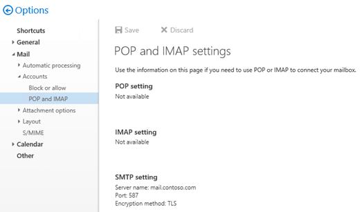
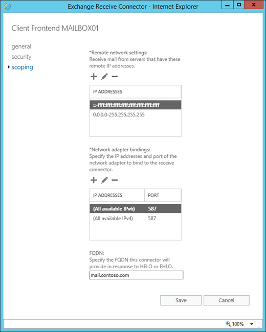

# Configure authenticated SMTP settings for POP3 and IMAP4 clients in Exchange 2016

 **Summary**: Learn how to configure the authenticated SMTP settings on an Exchange 2016 server that are required by POP3 or IMAP4 clients to send email messages.
  
After you enable and configure POP3 or IMAP4 on an Exchange 2016 server as described in [Enable and configure POP3 on an Exchange 2016 server](configure-pop3.md) and [Enable and configure IMAP4 on an Exchange 2016 server](configure-imap4.md), you need to configure the authenticated SMTP settings for POP3 and IMAP4 clients so they can send email messages.
  
The default Receive connector named "Client Frontend _\<Server name\>_" in the Client Access services on the Mailbox server listens for authenticated SMTP client submissions on port 587. By default, this connector uses the following settings for **internal and external** client (authenticated) SMTP connections: 
  
- **SMTP server**: `<ServerFQDN>`. For example, `mailbox01.contoso.com`.
    
- **TCP port**: 587
    
- **Encryption method**: TLS. Note that this is opportunistic TLS (**STARTTLS**) that results in an encrypted connection after the initial plain text protocol handshake.
    
For more information, see [Default Receive connectors created during setup](../../mail-flow/connectors/receive-connectors.md#DefaultConnectors) and [Client access protocol architecture](../../architecture/architecture.md#ClientAccessProtocol).
  
To configure the authenticated SMTP settings that are used by POP3 and IMAP4 clients, perform the following steps:
  
1. Configure the FQDN on the "Client Frontend _\<Server name\>_" Receive connector.
    
2. Specify the certificate that's used to encrypt authenticated SMTP client connections.
    
3. Configure Outlook on the web (formerly known as Outlook Web App) to display the SMTP settings for authenticated SMTP clients at **Settings** \> **Options** \> **Mail** \> **Accounts** \> **POP and IMAP**.

    
  
For more information about POP3 and IMAP4, see [POP3 and IMAP4 in Exchange 2016](pop3-and-imap4.md).
  
## What do you need to know before you begin?

- Estimated time to complete: 5 minutes.
    
- Secure Sockets Layer (SSL) is being replaced by Transport Layer Security (TLS) as the protocol that's used to encrypt data sent between computer systems. They're so closely related that the terms "SSL" and "TLS" (without versions) are often used interchangeably. Because of this similarity, references to "SSL" in Exchange topics, the Exchange admin center, and the Exchange Management Shell have often been used to encompass both the SSL and TLS protocols. Typically, "SSL" refers to the actual SSL protocol only when a version is also provided (for example, SSL 3.0). To find out why you should disable the SSL protocol and switch to TLS, check out [Protecting you against the SSL 3.0 vulnerability](https://blogs.office.com/2014/10/29/protecting-ssl-3-0-vulnerability/).
    
- If you have POP3 or IMAP4 clients that can only send SMTP email on port 25, you can configure port 25 on the "Client Frontend _\<Server name\>_" Receive connector to allow clients to send authenticated SMTP email. However, because port 25 is also configured on the "Client Frontend _\<Server name\>_" Receive connector for email from external SMTP servers, you'll need to modify the local IP addresses that are used to listen on port 25 on one or both of the connectors. For more information, see [Receive connector local address bindings](../../mail-flow/connectors/receive-connectors.md#Bindings).
    
- You need to be assigned permissions before you can perform this procedure or procedures. To see what permissions you need, see the "Receive connectors" entry in the [Mail flow permissions](../../permissions/feature-permissions/mail-flow-permissions.md) topic.
    
- For information about keyboard shortcuts that may apply to the procedures in this topic, see [Keyboard shortcuts in the Exchange admin center](../../about-documentation/exchange-admin-center-keyboard-shortcuts.md).
    
> [!TIP]
> Having problems? Ask for help in the Exchange forums. Visit the forums at: [Exchange Server](https://go.microsoft.com/fwlink/p/?linkId=60612), [Exchange Online](https://go.microsoft.com/fwlink/p/?linkId=267542), or [Exchange Online Protection](https://go.microsoft.com/fwlink/p/?linkId=285351)..
  
## Step 1: Configure the FQDN on the "Client Frontend \<Server name\>" Receive connector

You can skip this step if you want to keep the default server FQDN value (for example, mailbox01.contoso.com). Or, you can specify an FQDN value that's more compatible with your Internet naming convention or a TLS certificate that you want to use.
  
If you change the FQDN value, and you want internal POP3 or IMAP4 clients to use this connector to send email, the new FQDN needs to have a corresponding record in your internal DNS.
  
Regardless of the FQDN value, if you want external POP3 or IMAP4 clients to use this connector to send email, the FQDN needs to have a corresponding record in your public DNS, and the TCP port (587) needs to be allowed through your firewall to the Exchange server.
  
### Use the EAC to configure the FQDN for authenticated SMTP clients

1. In the EAC, go to **Mail flow** \> **Receive connectors**.
    
2. In the list of Receive connectors, select **Client Frontend \<Server name\>**, and then click **Edit** ().
    
3. In the **Exchange Receive Connector** page that opens, click **Scoping**.
    
4. In the **FQDN** field, enter the SMTP server FQDN that you want to use for authenticated SMTP client connections (for example, mail.contoso.com) and then click **Save**.
    
    
  
### Use the Exchange Management Shell to configure the FQDN for authenticated SMTP clients

To configure the FQDN for authenticated SMTP clients, use the following syntax:
  
```
Get-ReceiveConnector -Identity "Client Frontend*" | Set-ReceiveConnector -Fqdn <FQDN>
```

This example configures the FQDN value mail.contoso.com.
  
```
Get-ReceiveConnector -Identity "Client Frontend*" | Set-ReceiveConnector -Fqdn mail.contoso.com
```

### How do you know this step worked?

To verify that you've successfully the FQDN on the "Client Frontend *\<Server name\>* " Receive connector, use either of the following procedures: 
  
- the EAC, go to **Mail flow** \> **Receive connectors** \> select **Client Frontend \<Server name\>**, click **Edit** () \> **Scoping**, and verify the value in the **FQDN** field.
    
- In the Exchange Management Shell, run the following command:
    
  ```
  Get-ReceiveConnector -Identity "Client Frontend*" |  Format-List Name,Fqdn
  ```

## Step 2: Use the Exchange Management Shell to specify the certificate that's used to encrypt authenticated SMTP client connections

The certificate needs to match or contain the FQDN value that you specified in the previous step, and the POP3 and SMTP clients need to trust the certificate, which likely means a certificate from a commercial certification authority. For more information, see [Certificate requirements for Exchange services](../../architecture/client-access/certificates.md#CertRequirements).
  
Also, you need to assign the certificate to the Exchange SMTP service. For more information, see [Assign certificates to Exchange 2016 services](../../architecture/client-access/assign-certificates-to-services.md).
  
To specify the certificate that's used for authenticated SMTP client connections, use the following syntax:
  
```
$TLSCert = Get-ExchangeCertificate -Thumbprint <ThumbprintValue>
```

```
$TLSCertName = "<I>$($TLSCert.Issuer)<S>$($TLSCert.Subject)"
```

```
Get-ReceiveConnector -Identity "Client Frontend*" | Set-ReceiveConnector -TlsCertificateName $TLSCertName
```

This example uses the certificate that has the thumbprint value 434AC224C8459924B26521298CE8834C514856AB.
  
```
$TLSCert = Get-ExchangeCertificate -Thumbprint 434AC224C8459924B26521298CE8834C514856AB
```

```
$TLSCertName = "<I>$($TLSCert.Issuer)<S>$($TLSCert.Subject)"
```

```
Get-ReceiveConnector -Identity "Client Frontend*" | Set-ReceiveConnector -TlsCertificateName $TLSCertName
```

### How do you know this step worked?

To verify that you've specified the certificate that's used to encrypt authenticated SMTP client connections, perform the following steps:
  
1. Run the following command in the Exchange Management Shell:
    
  ```
  Get-ReceiveConnector -Identity "Client Frontend*" |  Format-List Name,Fqdn,TlsCertificateName
  ```

2. Run the following command in the Exchange Management Shell:
    
  ```
  Get-ExchangeCertificate | Format-List Thumbprint,Issuer,Subject,CertificateDomains,Services
  ```

3. Verify the **Subject** or **CertificateDomains** field of the certificate that you specified on the Receive connector contains the **Fqdn** value of the Receive connector (exact match or wildcard match).
    
## Step 3: Use the Exchange Management Shell to configure Outlook on the web to display the SMTP settings for authenticated SMTP clients

To configure Outlook on the web to display the SMTP settings server for authenticated SMTP clients, run the following command:
  
```
Get-ReceiveConnector -Identity "Client Frontend*" | Set-ReceiveConnector -AdvertiseClientSettings $true
```

 **Note**: To prevent the SMTP settings from being displayed in Outlook on the web, change the value from `$true` to `$false`.
  
### How do you know this step worked?

To verify that you've configured Outlook on the web to display the SMTP settings for authenticated SMTP clients, perform the following steps:
  
1. Open a mailbox in Outlook on the web, and then click **Settings** \> **Options**.

    
  
2. Click **Mail** \> **Accounts** \> **POP and IMAP** and verify the correct SMTP settings are displayed.

    
  
    **Note**: If the SMTP settings that you configured don't appear as expected in Outlook on the web, run the command `iisreset.exe /noforce` to restart Internet Information Services (IIS).
    
## How do you know this task worked?

To verify that you've configured the authenticated SMTP settings on the Exchange server, perform one or more following procedures:
  
- Use the **Test-PopConnectivity** or **Test-ImapConnectivity** cmdlets, which use authenticated SMTP to send test messages. For more information, see [Test-PopConnectivity](http://technet.microsoft.com/library/73f0ce87-e723-43e5-a32c-29cd2d899ff9.aspx) and [Test-ImapConnectivity](http://technet.microsoft.com/library/273690c8-4e0d-4f05-8786-11d71868dae0.aspx).
    
- Enable protocol logging on the "Client Frontend _\<Server name\>_" Receive connector, configure a POP3 or IMAP4 client to connect to a mailbox, send a test message from an internal network connection and/or an external Internet connection, and view the results in the protocol log. For more information, see [Protocol logging](../../mail-flow/connectors/protocol-logging.md).
    
    **Note**: You can't use POP3 or IMAP4 to connect to the Administrator mailbox. This limitation was intentionally included in Exchange 2016 to enhance the security of the Administrator mailbox.
    

