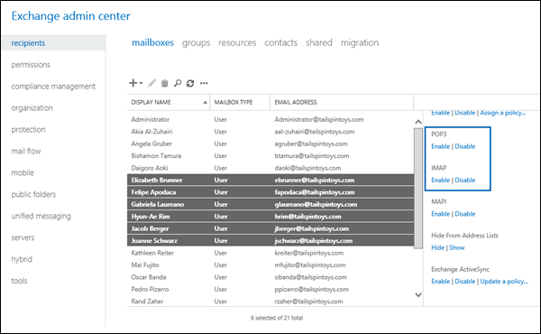

# Enable or disable POP3 or IMAP4 access to mailboxes in Exchange 2016

Learn how administrators can enable or disable POP3 and IMAP4 access to specific mailboxes in Exchange 2016.
  
After you enable and configure POP3 or IMAP4 on an Exchange 2016 server as described in [Enable and configure POP3 on an Exchange 2016 server](configure-pop3.md) and [Enable and configure IMAP4 on an Exchange 2016 server](configure-imap4.md), all user mailboxes (with the exception of the Administrator mailbox) can be accessed by using POP3 or IMAP4. You can use the procedures in this topic to disable POP3 and IMAP4 access to specific mailboxes.
  
For more information about POP3 and IMAP4, see [POP3 and IMAP4 in Exchange 2016](pop3-and-imap4.md).
  
## What do you need to know before you begin?

- Estimated time to complete: 5 minutes.
    
- The procedures in this topic don't apply to the Administrator mailbox, because you can't use POP3 or IMAP4 to connect to the Administrator mailbox. This limitation was intentionally included in Exchange 2016 to enhance the security of the Administrator mailbox.
    
- You need to be assigned permissions before you can perform this procedure or procedures. To see what permissions you need, see the "Recipient provisioning permissions" section in the [Recipients Permissions](../../permissions/feature-permissions/recipient-perms.md) topic. 
    
- For information about keyboard shortcuts that may apply to the procedures in this topic, see [Keyboard shortcuts in the Exchange admin center](../../about-documentation/eac-keyboard-shortcuts.md).
    
> [!TIP]
> Having problems? Ask for help in the Exchange forums. Visit the forums at: [Exchange Server](https://go.microsoft.com/fwlink/p/?linkId=60612), [Exchange Online](https://go.microsoft.com/fwlink/p/?linkId=267542), or [Exchange Online Protection](https://go.microsoft.com/fwlink/p/?linkId=285351).. 
  
## Enable or disable POP3 or IMAP4 access to a single mailbox

### Use the EAC to enable or disable POP3 or IMAP4 access to a mailbox

1. In the EAC, go to **Recipients** > **Mailboxes**.
    
2. In the list of mailboxes, find the mailbox that you want to modify. You can:
    
  - Scroll through the list of mailboxes.
    
  - Click **Search** ( ) and enter part of the user's name, email address, or alias.
    
  - Click **More options** ( ) > **Advanced search** to find the mailbox. 
    
    Once you've found the mailbox that you want to modify, select it, and then click **Edit** ( ).
    
3. In the mailbox properties window that opens, click **Mailbox Features**.
    
    In the **Email connectivity** section, configure one or more of the following settings: 
    
  - **POP3** To disable POP3 access to the mailbox, click **Disable**, and then click **Yes** in the warning message that appears. If POP3 is already disabled, click **Enable** to enable it. 
    
  - **IMAP** To disable IMAP4 access to the mailbox, click **Disable**, and then click **Yes** in the warning message that appears. If IMAP4 is already disabled, click **Enable** to enable it. 
    

  
    When you're finished, click **Save**.
    
### Use the Exchange Management Shell to enable or disable POP3 or IMAP4 access to a mailbox

To enable or disable POP3 or IMAP4 access to a single mailbox, use the following syntax:
  
```
Set-CasMailbox -Identity <MailboxIdentity> -PopEnabled <$true | $false> -ImapEnabled <$true | $false>
```

This example disables POP3 and IMAP4 access to the mailbox named John Smith.
  
```
Set-CasMailbox -Identity "John Smith" -PopEnabled $false -ImapEnabled $false
```

This example enables POP3and IMAP4 access to the mailbox named John Smith.
  
```
Set-CasMailbox -Identity "John Smith" -POPEnabled $true -ImapEnabled $true
```

For more information, see [Set-CASMailbox](http://technet.microsoft.com/library/ff7d4dc5-755e-4005-a0a3-631eed3f9b3b.aspx).
  
## Enable or disable POP3 or IMAP4 access to multiple mailboxes

### Use the EAC to enable or disable POP3 or IMAP4 access to multiple mailboxes

1. In the EAC, go to **Recipients** > **Mailboxes**.
    
2. In the list of mailboxes, find the mailboxes that you want to modify. You can:
    
  - Scroll through the list of mailboxes.
    
  - Click **Search** ( ) and enter part of the user's name, email address, or alias.
    
  - Click **More options** ( ) > **Advanced search** to find the mailbox. 
    
3. In the list of mailboxes, select multiple mailboxes of the same type (for example, **User**) from the list. For example:
    
  - Select a mailbox, hold down the Shift key, and select another mailbox that's farther down in the list.
    
  - Hold down the CTRL key as you select each mailbox.
    
    After you select multiple mailboxes of the same type, the title of the details pane changes to **Bulk Edit**.
    
4. In the details pane, go to **POP3** or **IMAP**, click **Enable** or **Disable**, and then click **OK** in the warning message that appears. 
    
  
### Use the Exchange Management Shell to enable or disable POP3 or IMAP4 access to multiple mailboxes

You can use the **Get-Mailbox**, **Get-User**, or **Get-Content** cmdlets to identify the mailboxes that you want to modify. For example: 
  
- Use the  _OrganizationalUnit_ parameter to filter the mailboxes by organizational unit (OU). 
    
- Use the  _Filter_ parameter to create OPATH filters that identify the mailboxes. For more information, see [Filterable Properties for the -Filter Parameter](http://technet.microsoft.com/library/b02b0005-2fb6-4bc2-8815-305259fa5432.aspx).
    
- Use a text file to specify the mailboxes. The text file contains one mailbox (email address, name, or other unique identifier) on each line like this:
    
  ```
  ebrunner@tailspintoys.com
  fapodaca@tailspintoys.com
  glaureano@tailspintoys.com
  hrim@tailspintoys.com
  ```

This example disables POP3 and IMAP4 access to all user mailboxes in the North America\Finance OU.
  
```
$NAFinance = Get-Mailbox -OrganizationalUnit "OU=Marketing,OU=North America,DC=contoso,DC=com" -Filter {RecipientTypeDetails -eq 'UserMailbox'} -ResultSize Unlimited; $NAFinance | foreach {Set-CasMailbox $_.Identity -PopEnabled $false -ImapEnabled $false}
```

This example disables POP3 and IMAP4 access to all mailboxes in the Engineering department in Washington state.
  
```
Get-User -Filter {RecipientType -eq 'UserMailbox' -and Department -like 'Engineering*' -and StateOrProvince -eq 'WA'} | Set-CasMailbox -PopEnabled $false -ImapEnabled $false
```

This example uses the text file C:\My Documents\Accounts.txt to disable POP3 or IMAP4 access to the specified mailboxes.
  
```
Get-Content "C:\My Documents\Accounts.txt" | foreach {Set-CASMailbox $_ -PopEnabled $false -ImapEnabled $false}
```

For more information, see [Get-Mailbox](http://technet.microsoft.com/library/8a5a6eb9-4a75-47f9-ae3b-a3ba251cf9a8.aspx) and [Get-User](http://technet.microsoft.com/library/2a33c9e6-33da-438c-912d-28ce3f4c9afb.aspx).
  
## Restart the POP3 or IMAP4 services

After you change the POP3 or IMAP4 access settings on a mailbox, you need to restart the POP3 and IMAP4 services on the server. You can do this by using the Windows Services console, or the Exchange Management Shell.
  
### Use the Windows Services console to restart the POP3 or IMAP4 services

1. On the Exchange server, open the Windows Services console. For example:
    
  - Run the command  `services.msc` from the **Run** dialog, a Command Prompt window, or the Exchange Management Shell. 
    
  - Open Server Manager, and then click **Tools** > **Services**.
    
2. In the list of services, perform one or both of the following actions:
    
  - **POP3**:
    
1. Select **Microsoft Exchange POP3**, and then click **Action** > **Restart**.
    
2. Select **Microsoft Exchange POP3 Backend**, and then click **Action** > **Restart**.
    
  - **IMAP4**:
    
1. Select **Microsoft Exchange IMAP4**, and then click **Action** > **Restart**.
    
2. Select **Microsoft Exchange IMAP4 Backend**, and then click **Action** > **Restart**.
    
### Use the Exchange Management Shell to restart the POP3 or IMAP4 services

To restart the POP3 services, run the following command:
  
```
Restart-Service MSExchangePOP3; Restart-Service MSExchangePOP3BE
```

To restart the IMAP4 services, run the following command:
  
```
Restart-Service MSExchangeIMAP4; Restart-Service MSExchangeIMAP4BE
```

For more information about this cmdlet, see [Restart-Service](https://go.microsoft.com/fwlink/p/?LinkID=113385).
  
To verify that you've successfully restarted the POP3 or IMAP4 services, run the following command:
  
```
Get-Service MSExchangePOP3; Get-Service MSExchangePOP3BE; Get-Service MSExchangeIMAP4; Get-Service MSExchangeIMAP4BE
```

## How do you know this worked?

To verify that you've enabled or disabled POP3 or IMAP4 access to a mailbox, use any of the following procedures:
  
- In the EAC, go to **Recipients** > **Mailboxes** > select the mailbox > click **Edit** > **Mailbox features** > **Email connectivity**.
    
  - If POP3 access is enabled for the mailbox, you'll see **POP3: Enabled** and the **Disable** link. If POP3 access is disabled, you'll see **POP3: Disabled** and the **Enable** link. 
    
  - If IMAP4 access is enabled for the mailbox, you'll see **IMAP4: Enabled** and a **Disable** link. If IMAP4 access is disabled, you'll see **IMAP4: Disabled** and the **Enable** link. 
    

  
- In the Exchange Management Shell, replace  _\<MailboxIdentity\>_ with the identity of the mailbox (for example, name, alias, or email address), and run the following command: 
    
  ```
  Get-CasMailbox - Identity <MailboxIdentity>
  ```

- Use the same filter that you used to identify the mailboxes, but use the **Get-CasMailbox** cmdlet instead of **Set-CasMailbox**. For example: 
    
  ```
  Get-User -Filter {RecipientType -eq 'UserMailbox' -and Department -like 'Engineering*' -and StateOrProvince -eq 'WA'} | Get-CasMailbox
  ```

- In the Exchange Management Shell, run this command to show all mailboxes where POP3 and IMAP4 access is disabled:
    
  ```
  Get-CasMailbox -ResultSize unlimited -Filter {PopEnabled -eq $false -and ImapEnabled -eq $false}
  ```


