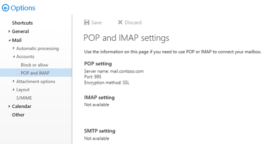

# Enable and configure POP3 on an Exchange 2016 server

 **Summary**: Learn how to enable and configure POP3 on an Exchange 2016 server for access by POP3 clients.
  
By default, POP3 client connectivity isn't enabled in Exchange. To enable POP3 client connectivity, you need to perform the following steps:
  
1. Start the POP3 services, and configure the services to start automatically:
    
  - **Microsoft Exchange POP3**: This is the Client Access (frontend) service that POP3 clients connect to.
    
  - **Microsoft Exchange POP3 Backend**: POP3 client connections from the Client Access service are proxied to the backend service on the server that hold the active copy of the user's mailbox. For more information, see [Client access protocol architecture](http://technet.microsoft.com/library/0dac9f83-efd2-4a2d-940a-c03310bf9c6a.aspx#ClientAccessProtocol).
    
2. Configure the POP3 settings for external clients.
    
    By default, Exchange uses the following settings for **internal** POP3 connections: 
    
  - **POP3 server FQDN**: `<ServerFQDN>`. For example, `mailbox01.contoso.com`.
    
  - **TCP port and encryption method**: 995 for always TLS encrypted connections, and 110 for unencrypted connections, or for opportunistic TLS (**STARTTLS** ) that results in an encrypted connection after the initial plain text protocol handshake. 
    
    To allow **external** POP3 clients to connect to mailboxes, you need to configure the POP3 server FQDN, TCP port, and encryption method for external connections. This step causes the external POP3 settings to be displayed in Outlook on the web (formerly known as Outlook Web App) at **Settings** \> **Options** \> **Mail** \> **Accounts** \> **POP and IMAP**.
    
  
3. Restart the POP3 services to save the changes.
    
4. Configure the authenticated SMTP settings for internal and external clients. For more information, see [Configure authenticated SMTP settings for POP3 and IMAP4 clients in Exchange 2016](configure-authenticated-smtp.md).
    
For more information about POP3, see [POP3 and IMAP4 in Exchange 2016](pop3-and-imap4.md).
  
## What do you need to know before you begin?

- Estimated time to complete each procedure: 5 minutes.
    
- Secure Sockets Layer (SSL) is being replaced by Transport Layer Security (TLS) as the protocol that's used to encrypt data sent between computer systems. They're so closely related that the terms "SSL" and "TLS" (without versions) are often used interchangeably. Because of this similarity, references to "SSL" in Exchange topics, the Exchange admin center, and the Exchange Management Shell have often been used to encompass both the SSL and TLS protocols. Typically, "SSL" refers to the actual SSL protocol only when a version is also provided (for example, SSL 3.0). To find out why you should disable the SSL protocol and switch to TLS, check out [Protecting you against the SSL 3.0 vulnerability](https://blogs.office.com/2014/10/29/protecting-ssl-3-0-vulnerability/).
    
- To learn how to open the Exchange Management Shell in your on-premises Exchange organization, see **Open the Exchange Management Shell**.
    
- You need to be assigned permissions before you can perform this procedure or procedures. To see what permissions you need, see the "POP3 and IMAP4 Permissions" section in the [Clients and mobile devices permissions](../../permissions/feature-permissions/client-and-mobile-device-permissions.md) topic. 
    
- For information about keyboard shortcuts that may apply to the procedures in this topic, see [Keyboard shortcuts in the Exchange admin center](../../about-documentation/exchange-admin-center-keyboard-shortcuts.md).
    
> [!TIP]
> Having problems? Ask for help in the Exchange forums. Visit the forums at: [Exchange Server](https://go.microsoft.com/fwlink/p/?linkId=60612), [Exchange Online](https://go.microsoft.com/fwlink/p/?linkId=267542), or [Exchange Online Protection](https://go.microsoft.com/fwlink/p/?linkId=285351).. 
  
## Step 1: Start the POP3 services, and configure the services to start automatically

You can perform this step by using the Windows Services console, or the Exchange Management Shell.
  
### Use the Windows Services console to start the POP3 services, and configure the services to start automatically

1. On the Exchange server, open the Windows Services console. For example:
    
  - Run the command `services.msc` from the **Run** dialog, a Command Prompt window, or the Exchange Management Shell. 
    
  - Open Server Manager, and then click **Tools** \> **Services**.
    
2. In the list of services, select **Microsoft Exchange POP3**, and then click **Action** \> **Properties**.
    
3. The **Microsoft Exchange POP3 Properties** window opens. On the **General** tab, configure the following settings: 
    
  - **Startup type**: Select **Automatic**.
    
  - **Service status**: Click **Start**.
    
    When you are finished, click **OK**.
    
4. In the list of services, select **Microsoft Exchange POP3 Backend**, and then click **Action** \> **Properties**.
    
5. The **Microsoft Exchange POP3 Backend Properties** window opens. On the **General** tab, configure the following settings: 
    
  - **Startup type**: Select **Automatic**.
    
  - **Service status**: Click **Start**.
    
    When you are finished, click **OK**.
    
### Use the Exchange Management Shell to start the POP3 services, and configure the services to start automatically

1. Run the following command to start the POP3 services:
    
  ```
  Start-Service MSExchangePOP3; Start-Service MSExchangePOP3BE
  ```

2. Run the following command to configure the POP3 services to start automatically:
    
  ```
  Set-Service MSExchangePOP3 -StartupType Automatic; Set-Service MSExchangePOP3BE -StartupType Automatic
  ```

For more information about these cmdlets, see [Start-Service](https://go.microsoft.com/fwlink/p/?LinkID=113406) and [Set-Service](https://go.microsoft.com/fwlink/p/?LinkID=113399).
  
### How do you know this step worked?

To verify that you've successfully started the POP3 services, use either of the following procedures:
  
- On the Exchange server, open Windows Task Manager. On the **Services** tab, verify that the **Status** value for the **MSExchangePOP3** and **MSExchangePOP3BE** services is **Running**.
    
- In the Exchange Management Shell, run the following command to verify that the POP3 services are running:
    
  ```
  Get-Service MSExchangePOP3; Get-Service MSExchangePOP3BE
  ```

## Step 2: Use the Exchange Management Shell to configure the POP3 settings for external clients

To configure the POP3 settings for external clients, use the following syntax:
  
```
Set-PopSettings -ExternalConnectionSettings "<FQDN1>:<TCPPort1>:<SSL | TLS | blank>", "<FQDN2>:<TCPPort2>:<SSL | TLS | blank>"...  -X509CertificateName <FQDN> [-SSLBindings "<IPv4Orv6Address1>:<TCPPort1>","<IPv4Orv6Address2>:<TCPPort2>"...] [-UnencryptedOrTLSBindings "<IPv4Orv6Address1>:<TCPPort1>","<IPv4Orv6Address2>:<TCPPort2>"...]
```

This example allows configures the following settings for external POP3 connections:
  
- **POP3 server FQDN**: mail.contoso.com
    
- **TCP port**: 995 for always TLS encrypted connections, and 110 for unencrypted connections or opportunistic TLS (STARTTLS) encrypted connections.
    
- **Internal Exchange server IP address and TCP port for always TLS encrypted connections**: All available IPv4 and IPv6 addresses on the server on port 995 (we aren't using the _SSLBindings_ parameter, and the default value is `[::]:995,0.0.0.0:995`).
    
- **Internal Exchange server IP address and TCP port for unencrypted or opportunistic TLS (STARTTLS) encrypted connections**: All available IPv4 and IPv6 addresses on the server on port 110 (we aren't using the _UnencryptedOrTLSBindings_ parameter, and the default value is `[::]:110,0.0.0.0:110`).
    
- **FQDN used for encryption**: mail.contoso.com. This value identifies the certificate that matches or contains the POP3 server FQDN.
    
```
Set-PopSettings -ExternalConnectionSettings "mail.contoso.com:995:SSL","mail.contoso.com:110:TLS" -X509CertificateName mail.contoso.com
```

 **Notes**:
  
- For detailed syntax and parameter information, see [Set-PopSettings](http://technet.microsoft.com/library/307a1dd0-3a4c-4431-bd9f-35aa5cb57aad.aspx).
    
- The external POP3 server FQDN that you configure needs to have a corresponding record in your public DNS, and the TCP port (110 or 995) needs to be allowed through your firewall to the Exchange server.
    
- The combination of encryption methods and TCP ports that you use for the _ExternalConnectionSettings_ parameter need to match the corresponding TCP ports and encryption methods that you use for the _SSLBindings_ or _UnencryptedOrTLSBindings_ parameters. 
    
- Although you can use a separate certificate for POP3, we recommend that you use the same certificate as the other Exchange IIS (HTTP) services, which is likely a wildcard certificate or a subject alternative name (SAN) certificate from a commercial certification authority that's automatically trusted by all clients. For more information, see [Certificate requirements for Exchange services](../../architecture/client-access/certificates.md#CertRequirements).
    
- If you use a single subject certificate, or a SAN certificate, you also need to assign the certificate to the Exchange POP service. You don't need to assign a wildcard certificate to the Exchange POP service. For more information, see [Assign certificates to Exchange 2016 services](../../architecture/client-access/assign-certificates-to-services.md).
    
### How you do know this step worked?

To verify that you've successfully configured the POP3 settings for external clients, run the following command in the Exchange Management Shell and verify the settings:
  
```
Get-PopSettings | Format-List *ConnectionSettings,*Bindings,X509CertificateName
```

For more information, see [Get-POPSettings](http://technet.microsoft.com/library/30bd001f-d923-4936-a997-f005a392302e.aspx).
  
## Step 3: Restart the POP3 services

After you enable and configure POP3, you need to restart the POP3 services on the server by using the Windows Services console, or the Exchange Management Shell.
  
### Use the Windows Services console to restart the POP3 services

1. On the Exchange server, open the Windows Services console.
    
2. In the list of services, select **Microsoft Exchange POP3**, and then click **Action** \> **Restart**.
    
3. In the list of services, select **Microsoft Exchange POP3 Backend**, and then click **Action** \> **Restart**.
    
### Use the Exchange Management Shell to restart the POP3 services

Run the following command to restart the POP3 services.
  
```
Restart-Service MSExchangePOP3; Restart-Service MSExchangePOP3BE
```

For more information about this cmdlet, see [Restart-Service](https://go.microsoft.com/fwlink/p/?LinkID=113385).
  
To verify that you've successfully restarted the POP3 services, run the following command:
  
```
Get-Service MSExchangePOP3; Get-Service MSExchangePOP3BE
```

## Step 4: Configure the authenticated SMTP settings for POP3 clients

Because POP3 isn't used to send email messages, you need to configure the authenticated SMTP settings that are used by internal and external POP3 clients. For more information, see [Configure authenticated SMTP settings for POP3 and IMAP4 clients in Exchange 2016](configure-authenticated-smtp.md).
  
## How do you know this task worked?

To verify that you have enabled and configured POP3 on the Exchange server, perform the following procedures:
  
1. Open a mailbox in Outlook on the web, and then click **Settings** \> **Options**.
    
  
2. Click **Mail** \> **Accounts** \> **POP and IMAP** and verify the correct POP3 settings are displayed. 
    
  
    **Note**: If you configured 995/SSL **and** 110/TLS values for the _ExternalConnectionSettings_ parameter on the **Set-PopSettings** cmdlet, only the 995/SSL value is displayed in Outlook on the web. Also, if the external POP3 settings that you configured don't appear as expected in Outlook on the web after you restart the POP3 services, run the command `iisreset.exe /noforce` to restart Internet Information Services (IIS). 
    
3. You can test POP3 client connectivity to the Exchange server by using the following methods:
    
  - **Internal clients**: Use the **Test-PopConnectivity** cmdlet. For example, `Test-PopConnectivity -ClientAccessServer <ServerName> -Lightmode -MailboxCredential (Get-Credential)`. For more information, see [Test-PopConnectivity](http://technet.microsoft.com/library/73f0ce87-e723-43e5-a32c-29cd2d899ff9.aspx).
    
    **Note**: The _Lightmode_ switch tells the command test POP3 logons to the server. To test sending (SMTP) and receiving (POP3) a message, you need to configure the authenticated SMTP settings as described in [Configure authenticated SMTP settings for POP3 and IMAP4 clients in Exchange 2016](configure-authenticated-smtp.md).
    
  - **External clients**: Use the **Exchange Server** \> **POP Email** test in the Microsoft Remote Connectivity Analyzer at [https://go.microsoft.com/fwlink/p/?LinkID=313839](https://go.microsoft.com/fwlink/p/?LinkID=313839).
    
    **Note**: You can't use POP3 to connect to the Administrator mailbox. This limitation was intentionally included in Exchange 2016 to enhance the security of the Administrator mailbox.
    
## Next steps

To enabled or disable POP3 access to individual mailboxes, see [Enable or disable POP3 or IMAP4 access to mailboxes in Exchange 2016](configure-mailbox-access.md).
  

