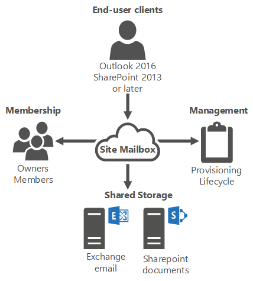

# Site mailboxes

 **Summary**: Learn about site mailboxes and how to use them.

Email and documents are traditionally kept in two unique and separate data repositories. Most organizations collaborate using both mediums. The challenge is that both email and documents are accessed using different clients. This usually results in a reduction in user productivity and a degraded user experience.

The *site mailbox*, first introduced in Exchange 2013, is a solution for this problem. Site mailboxes improve collaboration and user productivity by allowing access to both Microsoft SharePoint 2013 documents and Exchange email using the same client interface. A site mailbox is functionally comprised of SharePoint 2013 site membership (owners and members), shared storage through an Exchange 2016 mailbox for email messages and a SharePoint 2013 site for documents, and a management interface that addresses provisioning and lifecycle needs. 

Site mailboxes require Exchange 2016 and SharePoint Server 2013 integration and configuration. For more information about how to configure your Exchange 2016 organization to work with your SharePoint Server 2013 organization, see the following topics:

- [Configure site mailboxes in SharePoint Server 2013](https://go.microsoft.com/fwlink/p/?LinkId=258264).

- [Plan Exchange 2016 integration with SharePoint and Skype for Business](../plan-and-deploy/integration-with-sharepoint-and-skype/integration-with-sharepoint-and-skype.md)

For more information about collaboration features in Exchange Server 2016, see [Collaboration](collaboration.md).

## How do site mailboxes work?
<a name="howwork"> </a>

When one project member files mail or documents using the site mailbox, any project member can then access the content. Site mailboxes are surfaced in Outlook 2013 or later and give users easy access to the email and documents for the projects they care about. Additionally, the same set of content can be accessed directly from the SharePoint site itself. With site mailboxes, the content is kept where it belongs. Exchange stores the email, providing users with the same message view for email conversations that they use every day for their own mailboxes. Meanwhile, SharePoint stores the documents, bringing document coauthoring and versioning to the table. Exchange synchronizes just enough metadata from SharePoint to create the document view in Outlook (e.g. document title, last modified date, last modified author, size).



## Site mailbox provisioning policies
<a name="policies"> </a>

Site mailbox quotas can be set by using the **SiteMailboxProvisioningPolicy** cmdlets in the Exchange Management Shell. The Site mailbox provisioning policies only apply to the email that is sent to and from the site mailbox and the size of the site mailbox on the Exchange server. The document repository settings are configured in SharePoint. Although you can create multiple site mailbox provisioning policies using the **New-SiteMailboxProvisioningPolicy** cmdlet, only the default provisioning policy will be applied to all site mailboxes. You can't apply multiple policies within your organization. The provisioning policies allow you to set the following quotas: 

|**Quota**|**Description**|**Default setting**|
|:-----|:-----|:-----|
|IssueWarningQuota  <br/> |The _IssueWarningQuota_ parameter specifies the site mailbox size that triggers a warning message to the site mailbox  <br/> |4.5 GB  <br/> |
|MaxReceiveSize  <br/> |The _MaxReceiveSize_ parameter specifies the maximum size of email messages that can be received by the site mailbox.  <br/> |36 MB  <br/> |
|ProhibitSendReceiveQuota  <br/> |The _ProhibitSendReceiveQuota_ parameter specifies the size at which the site mailbox can no longer send or receive messages.  <br/> |5 GB  <br/> |
 
For more information about how to configure site mailbox provisioning policies, see [Manage site mailbox provisioning policies](http://technet.microsoft.com/library/2f160d1a-a031-461f-8d29-c9cd49ca1645.aspx).

## Lifecycle policy and retention
<a name="policies"> </a>

The lifecycle of a site mailbox is managed through a SharePoint. It is through SharePoint that you should perform all site mailbox tasks such as creating and removing site mailboxes. In addition, you can create a SharePoint Lifecycle policy to manage the lifecycle of a site mailbox. For example, you can create a lifecycle policy in SharePoint that automatically closes all site mailboxes after 6 months. If the user still requires the use of the site mailbox, the user can reactivate the site mailbox through SharePoint. We recommend that you use the Lifecycle application is in the farm. Manually deleting active site mailboxes from Exchange will result in orphaned site mailboxes. .

When the lifecycle application in SharePoint closes a site mailbox, the site mailbox is retained for the period stated in the lifecycle policy in the closed state. The mailbox can then be reactivated by an end-user or by an administrator from SharePoint. After the retention period, the Exchange site mailbox that is housed in the mailbox database will have its name prepended with **MDEL:** to indicate that it has been marked for deletion. You will need to manually remove these site mailboxes from the mailbox database in order to free storage space and the alias. If you don't have the SharePoint Lifecycle Policy enabled, you'll lose the ability to determine which site mailboxes are marked for deletion. Until the site mailbox has been removed by an administrator, the content of the mailbox is still recoverable. 

You can use the following command to search for and remove site mailboxes that have been marked for deletion.

```
Get-Mailbox MDEL:* | ?{$_.RecipientTypeDetails -eq "TeamMailbox"} | Remove-Mailbox -Confirm:$false
```

Site mailboxes don't support retention at the item-level. Retention works on a project-level for site mailboxes, so when the entire site mailbox is deleted, the retained items will be deleted.

## Compliance
<a name="policies"> </a>

Using the eDiscovery Console in SharePoint, site mailboxes can be part of the In-Place eDiscovery scope as you can do keyword searches against user mailboxes or site mailboxes. In addition, you can put a site mailbox on legal hold. For more info, see [In-Place eDiscovery in Exchange 2016](../policy-and-compliance/ediscovery/ediscovery.md).

## Backup and restore
<a name="policies"> </a>

Backup and Restore for the Exchange site mailboxes housed on the mailbox server will use the same backup and restore method that you use for all Exchange mailboxes. For more information, see [Database Availability Groups](http://technet.microsoft.com/library/ab9b88ce-2f44-4334-96ad-a666b95888a0.aspx).

For SharePoint documents, you should backup and restore into the same place. If you restore your SharePoint content to same URLs, then the site mailbox will continue to work and no additional configuration is needed. If you restore to a different URL, then you'll need to run **Set-SiteMailbox** cmdlet to update the _SharePointURL_ property. We recommend that you don't restore SharePoint to a new forest. 


