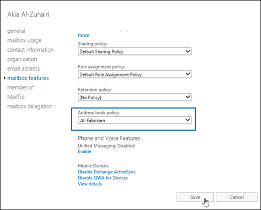
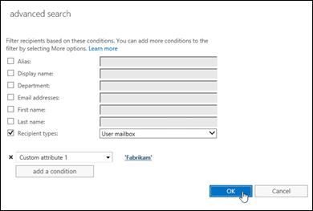

# Procedures for address book policies in Exchange 2016

Learn how to manage address book policies, how to assign address book policies to users, and how to install and enable the Address Book Policy Routing Agent in Exchange 2016.
  
Address book policies (ABPs) allow you to segment users into specific groups to give them customized global address lists (GALs) in Outlook and Outlook on the web (formerly known as Outlook Web App). For more information about ABPs, see [Address book policies in Exchange 2016](address-book-policies.md).
  
This topic describes how to perform the following procedures on ABPs:
  
- [Use the Exchange Management Shell to view address book policies](abp-procedures.md#ViewABP)
    
- [Use the Exchange Management Shell to create address book policies](abp-procedures.md#CreateABP)
    
- [Use the Exchange Management Shell to modify address book policies](abp-procedures.md#ModifyABP)
    
- [Use the Exchange Management Shell to remove address book policies](abp-procedures.md#RemoveABP)
    
- [Assign address book policies to mailboxes](abp-procedures.md#AssignABP)
    
- [Use the Exchange Management Shell to install and configure the Address Book Policy Routing Agent](abp-procedures.md#InstallABPRouting)
    
 **Note**: Implementing an ABP is a multi-step process that requires planning. For more information, see [Scenario: Deploying address book policies in Exchange 2016](abp-scenarios.md).
  
## What do you need to know before you begin?

- Estimated time to complete each procedure: Less than 5 minutes.
    
- You can assign ABPs to mailboxes in the Exchange admin center (EAC), but all other ABP procedures require the Exchange Management Shell. For more information about accessing and using the EAC, see [Exchange admin center in Exchange 2016](../../architecture/client-access/exchange-admin-center.md). To learn how to open the Exchange Management Shell in your on-premises Exchange organization, see **Open the Exchange Management Shell**.
    
- You need to be assigned permissions before you can perform this procedure or procedures. To see what permissions you need, see the "Address book policies" entry in the [Email address and address book permissions](../../permissions/feature-permissions/address-book-permissions.md) topic. 
    
- For information about keyboard shortcuts that may apply to the procedures in this topic, see [Keyboard shortcuts in the Exchange admin center](../../about-documentation/eac-keyboard-shortcuts.md).
    
- Having problems? Ask for help in the Exchange forums. Visit the forums at: [Exchange Server](https://go.microsoft.com/fwlink/p/?linkId=60612), [Exchange Online](https://go.microsoft.com/fwlink/p/?linkId=267542), or [Exchange Online Protection](https://go.microsoft.com/fwlink/p/?linkId=285351).
    
## Use the Exchange Management Shell to view address book policies
<a name="ViewABP"> </a>

To view ABPs, use this syntax:
  
```
Get-AddressBookPolicy [-Identity <ABPIdentity>]
```

This example returns a summary list of all ABPs in the organization:
  
```
Get-AddressBookPolicy
```

This example returns detailed information for the ABP named All Fabrikam ABP.
  
```
Get-AddressBookPolicy -Identity "All Fabrikam ABP" | Format-List
```

For detailed syntax and parameter information, see [Get-AddressBookPolicy](http://technet.microsoft.com/library/a5ec362f-a941-454f-ba93-cecada3411db.aspx).
  
## Use the Exchange Management Shell to create address book policies
<a name="CreateABP"> </a>

An ABP requires one global address list (GAL), one offline address book (OAB), one room list, and one or more address lists. To view the available objects, use the **Get-GlobalAddressList**, **Get-OfflineAddressBook**, and **Get-AddressList** cmdlets. 
  
 **Note**: The room list that's required for an ABP is an address list that specifies rooms (contains the filter  `RecipientDisplayType -eq 'ConferenceRoomMailbox'`). It's not a room finder distribution group that you create with the  _RoomList_ switch on the **New-DistributionGroup** or **Set-DistributionGroup** cmdlets. 
  
To create an ABP, use this syntax:
  
```
New-AddressBookPolicy -Name "<Unique Name>" -GlobalAddressList "<GAL>" -OfflineAddressBook "<OAB>" -RoomList "<RoomList>" -AddressLists  "<AddressList1>","<AddressList2>"...
```

This example creates an ABP named All Fabrikam ABP with the these settings:
  
- **GAL**: All Fabrikam
    
- **OAB**: Fabrikam-All-OAB
    
- **Room list**: All Fabrikam Rooms
    
- **Address lists**: All Fabrikam Mailboxes, All Fabrikam DLs, and All Fabrikam Contacts
    
```
New-AddressBookPolicy -Name "All Fabrikam ABP" -GlobalAddressList "\All Fabrikam" -OfflineAddressBook \Fabrikam-All-OAB -RoomList "\All Fabrikam Rooms" -AddressLists "\All Fabrikam Mailboxes","\All Fabrikam DLs","\All Fabrikam Contacts"
```

For detailed syntax and parameter information, see [New-AddressBookPolicy](http://technet.microsoft.com/library/07133bd2-ed6d-4a4b-8c3a-bd0c016f68eb.aspx).
  
### How do you know this worked?

To verify that you've successfully created an ABP, use either of these procedures:
  
- Run this command in the Exchange Management Shell to verify that the ABP is listed:
    
  ```
  Get-AddressBookPolicy
  ```

- Replace  _\<ABPIdentity\>_ with the name of the ABP, and run this command in the Exchange Management Shell to verify the property values: 
    
  ```
  Get-AddressBookPolicy -Identity "<ABPIdenity>" | Format-List
  ```

## Use the Exchange Management Shell to modify address book policies
<a name="ModifyABP"> </a>

You use the **Set-AddressBookPolicy** cmdlet to modify an existing ABP. The settings are identical to the settings that are available when you create an ABP. 
  
- The  _Name_,  _GlobalAddressList_,  _OfflineAddressBook_, and  _RoomList_ parameters all take single values, so the value you specify replaces the existing value. 
    
    This example modifies the ABP named "All Fabrikam ABP" by replacing the OAB with the specified OAB.
    
  ```
  Set-AddressBookPolicy -Identity "All Fabrikam ABP" -OfflineAddressBook \Fabrikam-OAB-2
  ```

- The  _AddressLists_ parameter takes multiple values, so you need to decide whether you want to  *replace*  the existing address lists in the ABP, or  *add and remove*  address lists without affecting the other address lists in the ABP. 
    
    This example replaces the existing address lists in the ABP named Government Agency A with the specified address lists.
    
  ```
  Set-AddressBookPolicy -Identity "Government Agency A" -AddressLists "GovernmentAgencyA-Atlanta","GovernmentAgencyA-Moscow"
  ```

    To add address lists to an ABP, you need to specify the new address lists  *and*  any existing address lists that you want to keep. 
    
    This example adds the address list named Contoso-Chicago to the ABP named ABP Contoso, which is already configured to use the address list named Contoso-Seattle.
    
  ```
  Set-AddressBookPolicy -Identity "ABP Contoso" -AddressLists "Contoso-Chicago","Contoso-Seattle"
  ```

    To remove address lists from an ABP, you need to specify the existing address lists that you want to keep, and omit the address lists that you want to remove.
    
    For example, the ABP named ABP Fabrikam uses the address lists named Fabrikam-HR and Fabrikam-Finance. To remove the Fabrikam-HR address list, specify only the Fabrikam-Finance address list.
    
  ```
  Set-AddressBookPolicy -Identity "ABP Fabrikam" -AddressLists Fabrikam-Finance
  ```

For detailed syntax and parameter information, see [Set-AddressBookPolicy](http://technet.microsoft.com/library/c0dc5fff-af06-4008-9173-629d1f901c69.aspx).
  
### How do you know this worked?

To verify that you've successfully modify an ABP, replace  _\<ABPIdentity\>_ with the name of the ABP, and run this command in the Exchange Management Shell to verify the property values: 
  
```
Get-AddressBookPolicy -Identity "<ABPIdenity>" | Format-List
```

## Use the Exchange Management Shell to remove address book policies
<a name="RemoveABP"> </a>

- You can't remove an ABP if it's assigned to a mailbox. To see if an ABP is assigned to a mailbox, replace  _\<ABPIdentity\>_ with the name of the ABP, and run this command in the Exchange Management Shell to get the **DistinguishedName** value: 
    
     `Get-AddressBookPolicy -Identity <ABPIdentity> | Format-List DistinguishedName`
    
    Then, use the **DistinguishedName** value of the ABP in this command to show all mailboxes where the ABP is assigned: 
    
     `Get-Mailbox -ResultSize unlimited -Filter {AddressBookPolicy -eq '<DistinguishedName>'}`
    
- To remove ABP assignments from mailboxes, see the [Assign address book policies to mailboxes](abp-procedures.md#AssignABP) section in this topic. 
    
To remove an ABP, use this syntax:
  
```
Remove-AddressBookPolicy -Identity <ABPIdentity>
```

This example removes the ABP named ABP_TailspinToys.
  
```
Remove-AddressBookPolicy -Identity "ABP_TailspinToys"
```

For detailed syntax and parameter information, see [Remove-AddressBookPolicy](http://technet.microsoft.com/library/57ff215a-cba5-46d1-a7f7-ab2512ce4b6f.aspx).
  
### How do you know this worked?

To verify that you've successfully removed an ABP, use either of these procedures:
  
- Run this command in the Exchange Management Shell to verify that the ABP isn't listed:
    
  ```
  Get-AddressBookPolicy
  ```

- Replace  _\<ABPIdentity\>_ with the name of the ABP, and run this command to confirm that an error is returned: 
    
  ```
  Get-AddressBookPolicy -Identity "<ABPIdenity>"
  ```

## Assign address book policies to mailboxes
<a name="AssignABP"> </a>

- Users aren't automatically assigned an ABP when you create mailboxes. If you don't assign an ABP to a mailbox, the GAL for your entire organization is visible to the user in Outlook and Outlook on the web.
    
- To identify your virtual organizations for ABPs, we recommend that you use the CustomAttribute1-15 attributes on mailboxes, contacts, and groups, because these attributes are the most widely available and manageable for all recipient types. For more information, see [Scenario: Deploying address book policies in Exchange 2016](abp-scenarios.md).
    
- The procedures to assign ABPs to mailboxes or remove the ABP assignments from mailboxes are the same:
    
  - To assign ABPs to mailboxes, you select the ABP in EAC, or specify the ABP in the Exchange Management Shell.
    
  - To remove the ABP assignments from mailboxes, you select the value **[No Policy]** in the EAC, or use the value  `$null` in the Exchange Management Shell. 
    
### Use the Exchange admin center (EAC) to assign an ABP to a single mailbox

1. In the EAC, go to **Recipients** > **Mailboxes**.
    
2. In the list of mailboxes, find the mailbox that you want to modify. You can:
    
  - Scroll through the list of mailboxes.
    
  - Click **Search** and enter part of the user's name, email address, or alias. 
    
  - Click **More options** > **Advanced search** to find the mailbox. 
    
    Once you've found the mailbox that you want to modify, select it, and then click **Edit**.
    
3. On the mailbox properties page that opens, click **Mailbox features**.
    
4. Click the drop down arrow in **Address book policy**, and select the ADP that you want to apply.
    
  
    When you're finished, click **Save**.
    
 **Note**: You can also assign an ABP when you create a user mailbox in the EAC by clicking **More options**, and clicking the drop down arrow in **Address book policy**.
  
### Use the Exchange Management Shell to assign an address book policy to a single mailbox

To assign an ABP to a mailbox, use this syntax:
  
```
Set-Mailbox -Identity <MailboxIdentity> -AddressBookPolicy <ABPIdentity> or $null
```

This example assigns the ABP named All Fabrikam to mailbox joe@fabrikam.com.
  
```
Set-Mailbox -Identity joe@fabrikam.com -AddressBookPolicy "All Fabrikam"
```

 **Note**: You can also assign an ABP when you create a user mailbox with the **New-Mailbox** cmdlet by using the  _AddressBookPolicy_ parameter. If you don't specify an ABP when you create the mailbox, no ABP is assigned (the default value is blank or  `$null`).
  
For detailed syntax and parameter information, see [Set-Mailbox](http://technet.microsoft.com/library/a0d413b9-d949-4df6-ba96-ac0906dedae2.aspx).
  
### Use the EAC to assign an address book policy to multiple mailboxes

1. In the EAC, go to **Recipients** > **Mailboxes**.
    
2. In the list of mailboxes, find the mailboxes that you want to modify. For example:
    
1. Click **More options** > **Advanced search**.
    
2.  In the **Advanced search** window that opens, select **Recipient types** and verify the default value **User mailbox**.
    
3. Click **More options**, and then click **Add a condition**.
    
4. In the **Select one** drop down box that appears, select the appropriate **Custom attribute 1** to **Custom attribute 15** values that defines your virtual organizations. 
    
5. In the **Specify words or phrases** dialog that appears, enter the value that you want to search for, and then click **OK**.
    
6. Back on the **Advanced search** window, click **OK**.
    
  
3. In the list of mailboxes, select multiple mailboxes of the same type (for example, **User**) from the list. For example:
    
  - Select a mailbox, hold down the Shift key, and select another mailbox that's farther down in the list.
    
  - Hold down the CTRL key as you select each mailbox.
    
    After you select multiple mailboxes of the same type, the title of the details pane changes to **Bulk Edit**.
    
4. In the details pane, scroll down and click **More options**, scroll down to **Address Book Policy**, and then click **Update**.
    
  
5. In the **Bulk assign address book policy** window that opens, select the ABP by clicking the drop down arrow in **Select Address Book Policy**, and then click **Save**.
    
### Use the Exchange Management Shell to assign an address book policy to multiple mailboxes

You can use the **Get-Mailbox** or **Get-Content** cmdlets to identify the user mailboxes that you want to assign the ABP to. For example: 
  
- Use the  _Filter_ parameter to create OPATH filters that identify the mailboxes. For more information, see [Filterable Properties for the -Filter Parameter](http://technet.microsoft.com/library/b02b0005-2fb6-4bc2-8815-305259fa5432.aspx).
    
- Use a text file to specify the mailboxes. The text file contains one mailbox (email address, name, or other unique identifier) on each line like this:
    
  ```
  ebrunner@tailspintoys.com
  fapodaca@tailspintoys.com
  glaureano@tailspintoys.com
  hrim@tailspintoys.com
  ```

This example assigns the ABP named ABP_EngineeringDepartment to all user mailboxes where the  `CustomAttribute11` attribute contains the value Engineering Department. 
  
```
Get-Mailbox -Filter {RecipientType -eq 'UserMailbox' -and CustomAttribute11 -like '*Engineering Department'} | Set-Mailbox -AddressBookPolicy "ABP_EngineeringDepartment"
```

This example uses the text file C:\My Documents\Accounts.txt to assign the same ABP to the specified user mailboxes.
  
```
Get-Content "C:\My Documents\Accounts.txt" | foreach {Set-Mailbox $_ -AddressBookPolicy "ABP_EngineeringDepartment"}
```

For detailed syntax and parameter information, see [Get-Mailbox](http://technet.microsoft.com/library/8a5a6eb9-4a75-47f9-ae3b-a3ba251cf9a8.aspx).
  
### How do you know this worked?

To verify that you've successfully assigned an ABP to a mailbox, do any of these steps:
  
- In the EAC, go to **Recipients** > **Mailboxes** > select the mailbox > click **Edit** > **Mailbox features** and verify the **Address Book Policy** value. 
    
  
- In the Exchange Management Shell, replace  _\<MailboxIdentity\>_ with the identity of the mailbox (for example, name, alias, or email address), and run this command: 
    
  ```
  Get-Mailbox -Identity "<MailboxIdentity>" | Format-List AddressBookPolicy
  ```

- In the Exchange Management Shell, use the same filter that you used to identify the mailboxes. For example:
    
  ```
  Get-Mailbox -Filter {RecipientType -eq 'UserMailbox' -and CustomAttribute11 -like '*Engineering Department'} | Format-Table -Auto Name,EmailAddress,AddressBookPolicy
  ```

- In the Exchange Management Shell, replace  _\<ABPIdentity\>_ with the name of the ABP, and run this command to get the **DistinguishedName** value: 
    
  ```
  Get-AddressBookPolicy -Identity <ABPIdentity> | Format-List DistinguishedName
  ```

    Then, use the **DistinguishedName** value of the ABP in this command to show all mailboxes where the ABP is assigned: 
    
  ```
  Get-Mailbox -ResultSize unlimited -Filter {AddressBookPolicy -eq '<DistinguishedName>'}
  ```

## Use the Exchange Management Shell to install and configure the Address Book Policy Routing Agent
<a name="InstallABPRouting"> </a>

Address Book Policy routing (ABP routing) controls how recipients are resolved in organizations that use ABPs. When ABP routing is enabled, users that are assigned different GALs appear as external recipients to each other.
  
ABP routing requires that you install and enable the Address Book Policy Routing Agent (ABP Routing Agent) on all Mailbox servers in your organization, and enable ABP routing globally in your organization. After you do this, it might take up to 30 minutes for messages to be processed by the ABP Routing Agent.
  
You need to be assigned permissions before you can perform this procedure or procedures. To see what permissions you need, see the "Transport Agents" entry in the [Mail flow permissions](../../permissions/feature-permissions/mail-flow-permissions.md) topic. 
  
### Step 1: Install the ABP Routing agent

To install the ABP Routing Agent on the local Mailbox server, run this command on every Mailbox server in the organization.
  
```
Install-TransportAgent -Name "ABP Routing Agent" -TransportAgentFactory "Microsoft.Exchange.Transport.Agent.AddressBookPolicyRoutingAgent.AddressBookPolicyRoutingAgentFactory" -AssemblyPath $env:ExchangeInstallPath\TransportRoles\agents\AddressBookPolicyRoutingAgent\Microsoft.Exchange.Transport.Agent.AddressBookPolicyRoutingAgent.dll
```

 **Note**: You'll get a warning that the Transport service needs to be restarted for the changes to take effect. But, don't restart the Transport service until you finish Step 2 (so you only have to restart the Transport service once).
  
For detailed syntax and parameter information, see [Install-TransportAgent](http://technet.microsoft.com/library/520bfa38-f51a-400c-9ff3-46fa50222092.aspx).
  
### Step 2: Enable the ABP Routing agent

To enable the ABP Routing Agent on the local Mailbox server, run this command on every Mailbox server in the organization.
  
```
Enable-TransportAgent "ABP Routing Agent"
```

For detailed syntax and parameter information, see [Enable-TransportAgent](http://technet.microsoft.com/library/e1022587-f9b6-4ff5-8970-73465e55a34d.aspx).
  
### Step 3: Restart the Transport service

To restart the Transport service, run this command on every Mailbox server in the organization.
  
```
Restart-Service MSExchangeTransport
```

For detailed syntax and parameter information, see [Get-TransportAgent](http://technet.microsoft.com/library/83417504-5d52-43b2-8cf5-e48acae72e3a.aspx).
  
### Step 4: Enable ABP routing globally in the Exchange organization

To enable ABP routing globally in the Exchange organization, run this command once on any Mailbox server:
  
```
Set-TransportConfig -AddressBookPolicyRoutingEnabled $true
```

For detailed syntax and parameter information, see [Set-TransportConfig](http://technet.microsoft.com/library/ad3910a5-2227-47a2-8ccc-a208ce6210bb.aspx).
  
 **Note**: To disable ABP routing after you've enabled it, do these steps:
  
1. Run this command once on any Mailbox server to globally disable ABP routing:
    
  ```
  Set-TransportConfig -AddressBookPolicyRoutingEnabled $false
  ```

2. Disable the ABP Routing Agent by running this command on every Mailbox server where the agent is installed:
    
  ```
  Disable-TransportAgent "ABP Routing Agent"
  ```

3. Run this command on every Mailbox server where the agent is installed:
    
  ```
  Restart-Service MSExchangeTransport
  ```

### How do you know this worked?

To verify that you've successfully installed and configured the ABP Routing Agent, use any of these steps:
  
- Run this command on a Mailbox server to verify that ABP routing is enabled for the organization:
    
  ```
  Get-TransportConfig | Format-List AddressBookPolicyRoutingEnabled
  ```

- Run this command on every Mailbox server to verify that the ABP Routing Agent is enabled:
    
  ```
  Get-TransportAgent "ABP Routing Agent"
  ```

- Have a user that's assigned an ABP send an email message to an user that's assigned a different ABP, and verify that the sender's email address doesn't resolve to their display name.
    

