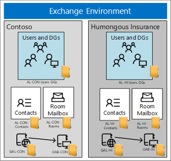
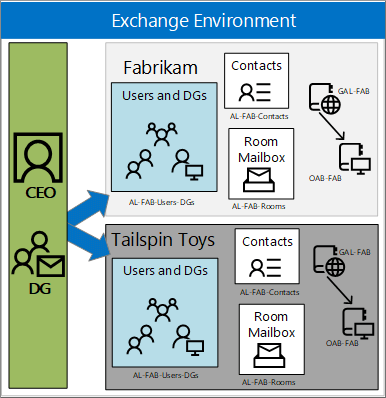

# Scenario: Deploying address book policies in Exchange 2016

Learn how to use address book polices to split single Exchange 2016 organizations into separate virtual organizations based on different requirements and scenarios.
  
The scenarios in this topic describe the deployment solutions for address book policies (ABPs) in three of the most common organization types where multiple entities (companies, government agencies, school classrooms, etc.) share a common Exchange environment. In all scenarios, a recipient filter divides recipients into separate virtual organizations, which then defines the ABPs that are applied to users in those virtual organizations. For more information recipient filters and virtual organizations, see the [Considerations and best practices for address book policies](address-book-policy-scenarios.md#BKMK_bestpractices) section later in this topic. 
  
For more information about ABPs, see [Address book policies in Exchange 2016](address-book-policies.md). For ABP procedures, see [Procedures for address book policies in Exchange 2016](address-book-policy-procedures.md).
  
## Scenario 1: Two separate companies in one Exchange organization

This scenario applies to companies or divisions that share the same Exchange environment, but have no common employees or management. In addition, the divisions have no special security or privacy concerns.
  
In this scenario, Contoso and Humongous Insurance are two separate companies that share the same Exchange environment. An ABP for each company lets employees in one company see only members of the same company in the global address list (GAL) in Outlook and Outlook on the web (formerly known as Outlook Web App). All distribution groups belong to one company or the other, and no distribution group contains members from both companies.
  

  
The GAL, offline address book (OAB), room list, and address lists that are required inn the ABPs for this scenario are described in the this table:
  
|**ABP element**|**Contoso**|**Humongous Insurance**|
|:-----|:-----|:-----|
|Global address list  <br/> |GAL_CON  <br/> |GAL_HI  <br/> |
|Offline address book  <br/> |OAB_CON  <br/> |OAB_HI  <br/> |
|Room list  <br/> |AL_CON_Rooms  <br/> |AL_HI_Rooms  <br/> |
|Address Lists  <br/> |AL_CON_Groups  <br/> AL_CON_Users  <br/> AL_CON_Contacts  <br/> |AL_HI_Groups  <br/> AL_HI_Users  <br/> AL_HI_Contacts  <br/> |
   
## Scenario 2: Two companies sharing a CEO in one Exchange organization
<a name="shareCEO"> </a>

This scenario applies to companies or divisions that share Exchange environment, and the only employees in common are in upper management.
  
In this scenario, Fabrikam and Tailspin Toys are separate companies in the same Exchange environment that share the same CEO, who is the only person in common between the two companies. This scenario uses three ABPs that have the following requirements:
  
- Employees in one company can only see recipients in their company when they browse the GAL, and employees in both companies can see the CEO in the GAL and in distribution groups.
    
- The CEO can see all recipients in both companies, is able to create distribution groups that span both companies, and the groups are visible in each company's GAL. However, group members only see other members from their respective company (group members from the other company are hidden).
    
- Employees who look at the CEO's group membership will only see groups in their company. They won't see groups in the other company.
    
- Each company has a distribution group named Senior Leadership that includes the management of that company and the CEO.
    
- The names of the three ABPs are: ABP_FAB, ABP_TAIL, and ABP_CEO.
    

  
The GAL, OAB, room list, and address lists that are required in the ABPs for this scenario are described in the this table:
  
|**ABP element**|**Fabrikam**|**Tailspin Toys**|**CEO**|
|:-----|:-----|:-----|:-----|
|Name  <br/> |ABP_FAB  <br/> |AB_TAIL  <br/> |ABP_CEO  <br/> |
|Global address list  <br/> |GAL_FAB  <br/> |GAL_TAIL  <br/> |Default Global Address Book  <br/> |
|Offline address book  <br/> |OAB_FAB  <br/> |OAB_TAIL  <br/> |Default Offline Address Book  <br/> |
|Room address list  <br/> |AL_FAB_Rooms  <br/> |AL_TAIL_Rooms  <br/> |All Rooms  <br/> |
|Address lists  <br/> |AL_FAB_Users_DGs  <br/> AL_FAB_Contacts  <br/> |AL_TAIL_Users_DGs  <br/> AL_TAIL_Contacts  <br/> |AL_FAB_Users_DGs  <br/> AL_FAB_Contacts  <br/> AL_TAIL_Users_DGs  <br/> AL_TAIL_Contacts  <br/> |
   
For a complete walkthrough of creating the required elements for this scenario, see the [Detailed deployment steps for Scenario 2: Two companies sharing a CEO in one Exchange organization](address-book-policy-scenarios.md#BKMK_generaldeploymentABP) section at the end of this topic. 
  
## Scenario 3: Education
<a name="shareCEO"> </a>

This scenario is applicable to schools or universities where a division of class rooms is necessary to ensure the privacy of the students, and has the following requirements:
  
- Students in each class can only see other students in their class, their teacher, and the principal.
    
- Teachers can only see students in their own classes.
    
- Teachers can see the principal and all other teachers.
    
- Distribution groups are created for the parents and faculty that are associated with each class.
    

  
The GAL, OAB, room list, and address lists that are required in the ABPs for this scenario are described in the this table:
  
|**ABP element**|**Students_ClassA**|**Teachers_ClassA**|**Principal**|
|:-----|:-----|:-----|:-----|
|Global address list  <br/> |GAL_StudentsClassA  <br/> |GAL_TeachersClassA  <br/> |GAL_Everyone  <br/> |
|Offline address book  <br/> |OAB_StudentsClassA  <br/> |OAB_TeachersClassA  <br/> |Default Offline Address Book  <br/> |
|Room address list  <br/> |AL_BlankRoom  <br/> |AL_BlankRoom  <br/> |All Rooms  <br/> |
|Address Lists  <br/> |AL_ClassAAL_Principal  <br/> |AL_ClassAAL_AllTeachersAL_AllGroupsAL_Principal  <br/> |AL_ClassA  <br/> AL_ClassB  <br/> AL_AllTeachers  <br/> AL_AllStudents  <br/> AL_AllGroups  <br/> |
   
## Considerations and best practices for address book policies
<a name="BKMK_bestpractices"> </a>

These are the important issues to consider when you use ABPs in your organization:
  
- You can't use hierarchical address books (HABs) and ABPs simultaneously. To learn more, see [Understanding Hierarchical Address Books](http://technet.microsoft.com/library/a1d277a0-5437-40af-aade-e4730a0d1308.aspx).
    
- A user that's assigned an ABP needs to exist in the GAL that's specified for the ABP.
    
- To divide recipients into virtual organizations, we recommend using the **CustomAttribute1** to **CustomAttribute15** attributes on recipients. These attributes work better than the other pre-canned conditional attributes such as **Company**, **Department**, or **StateOrProvince** because: 
    
  - Not all recipient types support the **Company**, **Department** or **StateOrProvince** attributes (for example, distribution groups, dynamic distribution groups, and mail-enabled public folders). 
    
  - The **CustomAttribute1** to **CustomAttribute15** attributes aren't configurable by users on their own mailboxes, and are entirely under the control of administrators. 
    
  - Even recipient types that support the **Company**, **Department** or **StateOrProvince** attributes require different cmdlets to configure them. 
    
     For example, to configure values for **Company**, **Department** or **StateOrProvince** on mailboxes, mail users, or mail contacts, you can't use the **Set-Mailbox**, **Set-MailUser**, or **Set-MailContact** cmdlets. Instead, you need to use the **Set-User** and **Set-Contact** cmdlets. In contrast, the  _CustomAttribute1_ to  _CustomAttribute15_ parameters are available on the corresponding **Set-\*** cmdlets for all recipient types. 
    
    For more information about recipient filtering, see [Recipient filtering on Edge Transport servers](../../spam-and-malware/antispam/recipient-filtering.md).
    
- Client applications that access Active Directory directly through LDAP will bypass the logic that's built into ABPs. Because Entourage and Outlook for Mac use direct LDAP queries to access Active Directory, those client applications won't function properly with ABPs if a domain controller or global catalog server is specified or provided to them by the Autodiscover service. Entourage and Outlook for Mac can use Exchange Web Services (EWS) or a local OAB to access directory information, but if they can directly access an LDAP service, they will attempt to do so.
    
- At a minimum, the GAL that's specified in an ABP must contain all address lists (including the room address list) that are specified in the ABP (it's OK if the ABP contains additional address lists). Don't create a GAL that contains fewer recipients than the address lists in the same ABP.
    
- We recommend against creating distribution groups that cross virtual organization boundaries. Groups that contain members of multiple virtual organizations lead to these issues:
    
  - A group member will see the email addresses of all group members if they request a delivery receipt or a read receipt when they send a message to the distribution group.
    
  - Encrypted messages that are sent to the distribution group can cause issues when some group members don't have valid digital IDs. For example, suppose a distribution group contains three members from Agency A, and two members from Agency B. Furthermore, one of the members from Agency A and two of the members in Agency B have invalid digital IDs. If a member from Agency A sends an encrypted messages to the distribution group, they'll receive a warning that there are three recipients without valid digital IDs. However, only the email address for the member in Agency A will appear in the warning message.
    
  - ABPs don't apply to all users or processes that use the **Get-Group** cmdlet, so these users will see all members of any group that they have access to. 
    
    Because if this issue, we recommend that you prevent users from managing their own groups in Outlook or Outlook on the web. To do this, remove the MyDistributionGroupMembership RBAC role assignment from the users. For more information, see [Manage role assignment policies](../../permissions/role-assignment-policies.md).
    
    If you allow users to use Outlook or Outlook on the web to manage groups, visibility to the full group membership list must be OK for the group owners.
    
- All ABPs must contain a room address list. However, if your organization doesn't use room address lists, you can create an empty room address list.
    
    **Note**: The room list that's required for an ABP is an address list that specifies rooms (contains the filter  `RecipientDisplayType -eq 'ConferenceRoomMailbox'`). It's not a room finder distribution group that you create with the  _RoomList_ switch on the **New-DistributionGroup** or **Set-DistributionGroup** cmdlets. For more information, see [Create and manage room mailboxes](../../recipients/room-mailboxes.md).
    
- Deploying ABPs doesn't prevent users in one virtual organization from sending email to users in another virtual organization. If you want to prevent users from sending email across virtual organizations, we recommend that you create a mail flow rule (also known as a transport rule) that looks for messages sent between the recipients. For example, to prevent Contoso users from receiving messages from Fabrikam users and vice-versa, but still allow Fabrikam's senior leadership team to send messages to Contoso users, you can create the following mail flow rule in the Exchange Management Shell:
    
  ```
  New-TransportRule -Name "Ethical Wall: Contoso-Fabrikam" -BetweenMemberOf1 "AllFabrikamEmployees" -BetweenMemberOf2 "AllContosoEmployees" -DeleteMessage -ExceptIfFrom seniorleadership@fabrikam.com
  ```

    For more information about mail flow rules, see [Mail flow rules in Exchange 2016](../../messaging-policy-and-compliance/mail-flow-rules/mail-flow-rules.md).
    
- To configure a feature that's similar to address book policies in the Skype for Business or Lync client, you can set the **msRTCSIP-GroupingID** attribute for specific users. For details, see [PartitionByOU Replaced with msRTCSIP-GroupingID](https://go.microsoft.com/fwlink/p/?LinkId=232306).
    
## Detailed deployment steps for Scenario 2: Two companies sharing a CEO in one Exchange organization
<a name="BKMK_generaldeploymentABP"> </a>

This section walks you through the deployment steps for [Scenario 2: Two companies sharing a CEO in one Exchange organization](address-book-policy-scenarios.md#shareCEO). If you recall, Fabrikam and Tailspin Toys are separate companies that share the same CEO.
  
To learn how to open the Exchange Management Shell in your on-premises Exchange organization, see **Open the Exchange Management Shell**.
  
### Step 1: Install and configure the Address Book Policy Routing Agent

The ABP Routing Agent makes users that are assigned different GALs appear as external recipients to each other. For detailed instructions, see [Use the Exchange Management Shell to install and configure the Address Book Policy Routing Agent](address-book-policy-procedures.md#InstallABPRouting).
  
### Step 2: Define your virtual organizations

In this scenario, the **CustomAttribute15** attribute defines the virtual organizations: the value  `FAB` for Fabrikam recipients, and the value  `TAIL` for Tailspin Toys recipients. For more information about recipient filtering, see [Recipient filtering on Edge Transport servers](../../spam-and-malware/antispam/recipient-filtering.md).
  
### Step 3: Create the required elements for the address book policies

#### Create address lists

This organization requires four custom address lists:
  
- AL_FAB_Users_DGs
    
- AL_FAB_Contacts
    
- AL_TAIL_Users_DGs
    
- AL_TAIL_Contacts
    
This example creates the address list named AL_FAB_Users_DGs that contains all Fabrikam users, distribution groups, and dynamic distribution groups.
  
```
New-AddressList -Name "AL_FAB_Users_DGs" -RecipientFilter {((RecipientType -eq 'UserMailbox') -or (RecipientType -eq 'MailUniversalDistributionGroup') -or (RecipientType -eq 'DynamicDistributionGroup')) -and (CustomAttribute15 -eq 'FAB')}
```

This example creates the address list named AL_FAB_Contacts that contains all Fabrikam mail contacts.
  
```
New-AddressList -Name "AL_FAB_Contacts" -RecipientFilter {(RecipientType -eq 'MailContact') -and (CustomAttribute15 -eq 'FAB')}
```

This example creates the address list named AL_TAIL_Users_DGs that contains all Tailspin Toys users, distribution groups, and dynamic distribution groups.
  
```
New-AddressList -Name "AL_TAIL_Users_DGs" -RecipientFilter {((RecipientType -eq 'UserMailbox') -or (RecipientType -eq 'MailUniversalDistributionGroup') -or (RecipientType -eq 'DynamicDistributionGroup')) -and (CustomAttribute15 -eq 'TAIL')}
```

This example creates the address list named AL_TAIL_Contacts that contains all Tailspin Toys mail contacts.
  
```
New-AddressList -Name "AL_TAIL_Contacts" -RecipientFilter {(RecipientType -eq 'MailContact') -and (CustomAttribute15 -eq 'TAIL')}
```

For more information, see [Create address lists](../../email-addresses-and-address-books/address-lists/address-list-procedures.md#CreateAddressList).
  
#### Create room lists

This organization requires two custom room lists:
  
- AL_FAB_Rooms
    
- AL_TAIL_Rooms
    
This example creates the room list named AL_FAB_Rooms for Fabrikam room mailboxes.
  
```
New-AddressList -Name AL_FAB_Rooms -RecipientFilter {(Alias -ne $null) -and (CustomAttribute15 -eq 'FAB') -and (RecipientDisplayType -eq 'ConferenceRoomMailbox') -or (RecipientDisplayType -eq 'SyncedConferenceRoomMailbox')}
```

This example creates a room list named AL_TAIL_Rooms for Tailspin Toys room mailboxes.
  
```
New-AddressList -Name AL_TAIL_Rooms -RecipientFilter {(Alias -ne $null) -and (CustomAttribute15 -eq 'TAIL')-and (RecipientDisplayType -eq 'ConferenceRoomMailbox') -or (RecipientDisplayType -eq 'SyncedConferenceRoomMailbox')}
```

 **Note**: This example creates a blank room list named AL_BlankRoom if the organization doesn't have any room mailboxes (an ABP requires a room list, even if it's empty):
  
 `New-AddressList -Name AL_BlankRoom -RecipientFilter {(Alias -ne $null) -and ((RecipientDisplayType -eq 'ConferenceRoomMailbox') -or (RecipientDisplayType -eq 'SyncedConferenceRoomMailbox'))}`
  
For more information about creating address lists, see [Create address lists](../../email-addresses-and-address-books/address-lists/address-list-procedures.md#CreateAddressList).
  
#### Create GALs

This organization requires two custom GALs:
  
- GAL_FAB
    
- GAL_TAIL
    
This example creates the GAL named GAL_FAB for Fabrikam that includes all Fabrikam recipients.
  
```
New-GlobalAddressList -Name "GAL_FAB" -RecipientFilter {(CustomAttribute15 -eq 'FAB')}
```

This example creates the GAL named GAL_TAIL for Tailspin Toys that includes all Tailspin Toys recipients.
  
```
New-GlobalAddressList -Name "GAL_TAIL" -RecipientFilter {(CustomAttribute15 -eq 'TAIL')}
```

 **Note**: Don't use a GAL in an ABP that contains recipients that are missing from address lists in the ABP. The combination of all address lists must match the recipients in the GAL.
  
For more information, see [Use the Exchange Management Shell to create global address lists](../../email-addresses-and-address-books/address-lists/address-list-procedures.md#CreateGAL).
  
#### Create OABs

This organization requires two custom GALs:
  
- OAB_FAB
    
- OAB_TAIL
    
This example creates the OAB named OAB_FAB for Fabrikam that includes the Fabrikam GAL.
  
```
New-OfflineAddressBook -Name "OAB_FAB" -AddressLists "GAL_FAB"
```

This example creates the OAB named OAB_TAIL for Tailspin Toys that includes the Tailspin Toys GAL.
  
```
New-OfflineAddressBook -Name "OAB_TAIL" -AddressLists "GAL_TAIL"
```

 **Note:** If you want users to see all recipients in the virtual organization, make sure that you include the GAL in OAB. Otherwise, you can reduce the download size of the OAB by specifying a reduced list of address lists that are included in the OAB. 
  
For more information, see [Use the Exchange Management Shell to create offline address books](../../email-addresses-and-address-books/oabs/oab-procedures.md#CreateOAB).
  
### Step 4: Create the address book policies

This organization requires three ABPs:
  
|**ABP element**|**Fabrikam**|**Tailspin Toys**|**CEO**|
|:-----|:-----|:-----|:-----|
|Name  <br/> |ABP_FAB  <br/> |ABP_TAIL  <br/> |ABP_CEO  <br/> |
|Global address list  <br/> |GAL_FAB  <br/> |GAL_TAIL  <br/> |Default Global Address Book  <br/> |
|Offline address book  <br/> |OAB_FAB  <br/> |OAB_TAIL  <br/> |Default Offline Address Book  <br/> |
|Room address list  <br/> |AL_FAB_Rooms  <br/> |AL_TAIL_Rooms  <br/> |All Rooms  <br/> |
|Address lists  <br/> |AL_FAB_Users_DGs  <br/> AL_FAB_Contacts  <br/> |AL_TAIL_Users_DGs  <br/> AL_TAIL_Contacts  <br/> |AL_FAB_Users_DGs  <br/> AL_FAB_Contacts  <br/> AL_TAIL_Users_DGs  <br/> AL_TAIL_Contacts  <br/> |
   
This example creates the ABP named ABP_FAB that contains the GAL, OAB, room list and address lists for Fabrikam.
  
```
New-AddressBookPolicy -Name "ABP_FAB" -AddressLists "AL_FAB_Users_DGs"," AL_FAB_Contacts" -OfflineAddressBook "\OAB_FAB" -GlobalAddressList "\GAL_FAB" -RoomList "\AL_FAB_Rooms"
```

This example creates the ABP named ABP_TAIL that contains the GAL, OAB, room list and address lists for Tailspin Toys.
  
```
New-AddressBookPolicy -Name "ABP_TAIL" -AddressLists "AL_TAIL_Users_DGs"," AL_TAIL_Contacts" -OfflineAddressBook "\OAB_TAIL" -GlobalAddressList "\GAL_TAIL" -RoomList "\AL_TAIL_Rooms"
```

This example creates the ABP named ABP_CEO that contains the GAL, OAB, room list and address lists for the CEO.
  
```
New-AddressBookPolicy -Name "ABP_CEO" -AddressLists "AL_FAB_Users_DGs"," AL_FAB_Contacts","AL_TAIL_Users_DGs"," AL_TAIL_Contacts" -OfflineAddressBook "\Default Offline Address Book" -GlobalAddressList "\Default Global Address List" -RoomList "\All Rooms"
```

For more information, see [Procedures for address book policies in Exchange 2016](address-book-policy-procedures.md).
  
### Step 5: Assign the address book policies to mailboxes

This example assigns the ABP named ABP_FAB to all Fabrikam mailboxes.
  
```
$Fab = Get-Mailbox -ResultSize unlimited | where {$_.CustomAttribute15 -eq 'FAB'}; $Fab | foreach {Set-Mailbox -AddressBookPolicy 'ABP_FAB'}
```

This example assigns the ABP named ABP_TAIL to all Tailspin Toys mailboxes.
  
```
$Tail = Get-Mailbox -ResultSize unlimited | where {$_.CustomAttribute15 -eq 'TAIL'}; $Tail | foreach {Set-Mailbox -AddressBookPolicy 'ABP_TAIL'}
```

This example assigns the ABP named ABP_CEO to the CEO named Gabriela Laureano.
  
```
Set-Mailbox -Identity "Gabriela Laureano" -AddressBookPolicy "ABP_CEO"
```

 **Note**: If the user is already connected to Outlook or Outlook on the web when the ABP is applied to their mailbox, they'll need to close and restart their client application before they can see the new address lists and GAL.
  
For more information, see [Assign address book policies to mailboxes](address-book-policy-procedures.md#AssignABP).
  

