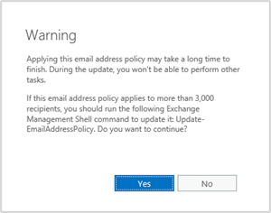

# Procedures for email address policies in Exchange 2016

 **Summary**: Learn how to create, modify, remove, and apply email address policies in Exchange 2016.
  
Email address policies assign email addresses to recipients in your Exchange organization. You use the Exchange admin center (EAC) or the Exchange Management Shell to configure email address policies in Exchange Server 2016.
  
For more information about email address policies, see [Email address policies in Exchange 2016](email-address-policies.md).
  
## What do you need to know before begin?

- Estimated time to complete each procedure: 5 minutes.
    
- You need to be assigned permissions before you can perform this procedure or procedures. To see what permissions you need, see the "Email address policies" entry in the [Email addresses and address books in Exchange 2016](../../email-addresses-and-address-books/email-addresses-and-address-books.md) topic. 
    
- The procedures in this topic primarily focus on SMTP email addresses in email address policies, but other address types are available. For more information, see .[Address types](email-address-policies.md#AddressType)
    
- Before you can use an SMTP domain in an email address policy, you need to configure the domain as an accepted domain (specifically, an authoritative domain or internal relay domain). For more information, see [Accepted domains in Exchange 2016](../../mail-flow/accepted-domains/accepted-domains.md).
    
- To learn how to open the Exchange Management Shell in your on-premises Exchange organization, see **Open the Exchange Management Shell**.
    
- For information about keyboard shortcuts that may apply to the procedures in this topic, see [Keyboard shortcuts in the Exchange admin center](../../about-documentation/eac-keyboard-shortcuts.md).
    
> [!CAUTION]
> Having problems? Ask for help in the Exchange forums. Visit the forums at: [Exchange Server](https://go.microsoft.com/fwlink/p/?linkId=60612), [Exchange Online](https://go.microsoft.com/fwlink/p/?linkId=267542), or [Exchange Online Protection](https://go.microsoft.com/fwlink/p/?linkId=285351). 
  
## Create email address policies
<a name="CreateEAP"> </a>

After you create an email address policy, you need to apply the policy to recipients. For more information, see the [Apply email address policies to recipients](eap-procedures.md#ApplyEAP) section in this topic. 
  
### Use the EAC to create email address policies

1. In the EAC, go to **Mail flow** \> **Email address policies**, and then click **Add**.
    
2. In **New Email address policy** windows that opens, configure the following settings: 
    
  - **Policy name**: Enter a unique, descriptive name for the policy.
    
  - **Email address format**: Click **Add** ( ) to configure an email address template. After you add the first template to define the primary SMTP email address, you can add additional templates for proxy email addresses (SMTP or otherwise), or you can click **Edit** ( ) to modify an existing template. For details about the settings that are available, see the [Email address format window in the EAC](eap-procedures.md#EAC_EmailAddressFormat) section in this topic. 
    
    You can also click **Remove** ( ) to delete existing templates.
    
    **Notes**:
    
  - The first SMTP email address template that you create here defines the primary ( **Reply-To:** ) SMTP email address. This template has the **Type** value **SMTP** (bold and uppercase), while other SMTP templates for proxy addresses have the **Type** value smtp (not bold and lowercase). 
    
  - You can't delete the email address template that defines the primary SMTP email address in the policy. Instead, you can add or modify another template, configure it to as the primary email address, and then delete the original template.
    
  - **Run this policy in this sequence with other policies**: The value that you can select here depends on how many other email address policies you've manually created. For example, for the first email address policy that you create, the only available value is 1. If you create another policy, you can select 1 or 2. Remember, the first email address policy that identifies a recipient configures the recipient's email addresses. All other policies are ignored, even if the first policy is unapplied and can't configure the recipient's email addresses.
    
  - For details about the recipient filters that are available here, see the [Recipient filters in the EAC](eap-procedures.md#EAC_RecipientFilters) section in this topic. 
    
3. When you're finished, click **Save**. You'll receive a warning message that tells you to click **Apply** in the details pane to apply the policy to recipients. For more information, see the [Apply email address policies to recipients](eap-procedures.md#ApplyEAP) section in this topic. 
    
### Use the Exchange Management Shell to create email address policies
<a name="Shell_CreateEAP"> </a>

An email address policy in the Exchange Management Shell requires a **recipient filter**, and one or more **email address templates**. For details about recipient filters, see the [Recipient filters in the Exchange Management Shell](eap-procedures.md#Shell_RecipientFilters) section in this topic. 
  
Email address templates use the syntax  `<Type>:<AddressFormat>`:
  
-  `<Type>`: A valid email address type as described in [Address types](email-address-policies.md#AddressType). For example,  `SMTP` for the primary email address, and  `smtp` for proxy addresses. 
    
-  `<AddressFormat>`: For SMTP email addresses, a domain or subdomain that's configured as accepted domain (authoritative or internal relay), and valid variables and ASCII text characters as described in [Address formats](email-address-policies.md#AddressFormat). For example:  `<alias>@contoso.com` requires the value  `%m@contoso.com`, and  `<firstname>.<lastname>@contoso.com` requires the value  `%g.%s@contoso.com`.
    
To create an email address policy, use the following syntax:
  
```
New-EmailAddressPolicy -Name "<Policy Name>" <Precanned recipient filter | Custom recipient filter> [-RecipientContainer <OrganizationalUnit>] [-Priority <AllowedInteger>] -EnabledEmailAddressTemplates "SMTP:<PrimaryEmailAddressFormat>","smtp:<ProxyEmailAddress1>","smtp:<ProxyEmailAddress2>"...
```

This example creates an email address policy with a precanned recipient filter:
  
- **Name**: Southeast Offices
    
- **Precanned recipient filter**: All users with mailboxes where the **State or province** value is GA, AL, or LA (Georgia, Alabama, or Louisiana). 
    
- **Primary SMTP email address**:  `<last name>.<first two letters of the first name>@contoso.com`
    
- **Additional proxy email addresses**:
    
- **Priority**:  _n_+1, where  _n_ is the number of manually created email address policies that already exist (we didn't use the  _Priority_ parameter, and the default value is  _n_+1). Remember, the first email address policy that identifies a recipient configures the recipient's email addresses. All other policies are ignored, even if the first policy is unapplied and can't configure the recipient's email addresses.
    
```
New-EmailAddressPolicy -Name "Southeast Offices" -IncludedRecipients MailboxUsers -ConditionalStateorProvince "GA","AL","LA" -EnabledEmailAddressTemplates "SMTP:%s%2g@southeast.contoso.com","smtp:%s%2g@southeast.contoso.net"
```

This example creates an email address policy with a custom recipient filter:
  
- **Name**: Northwest Executives
    
- **Custom recipient filter**: All users with mailboxes where the **Title** value contains Director or Manager, and the **State or province** value is WA, OR, or ID (Washington, Oregon, or Idaho). 
    
- **Primary SMTP email address**:  `<first two letters of the first name><last name>@contoso.com`
    
- **Additional proxy email addresses**: None
    
- **Priority**: 2
    
```
New-EmailAddressPolicy -Name "Northwest Executives" -RecipientFilter {(RecipientType -eq 'UserMailbox') -and (Title -like '*Director*' -or Title -like '*Manager*') -and (StateOrProvince -eq 'WA' -or StateOrProvince -eq 'OR' -or StateOrProvince -eq 'ID')} -EnabledEmailAddressTemplates "SMTP:%2g%s@contoso.com" -Priority 2
```

 **Notes**:
  
- Typically, you use the  _EnabledEmailAddressTemplates_ parameter to define the primary SMTP email address and one or more proxy addresses (SMTP or otherwise). However, if you're only going to define the primary SMTP email address and no additional proxy addresses, you can use the  _EnabledPrimarySMTPAddressTemplate_ parameter instead. This parameter doesn't require the  `SMTP:` prefix, and you can't use this parameter with the  _EnabledEmailAddressTemplates_ parameter. 
    
- The  _EnabledEmailAddressTemplates_ parameter requires at least one template with the  `<Type>` value  `SMTP` (to define the primary SMTP email address). After that, if you don't include a  `<Type>` prefix for a template, the value  `smtp` (an SMTP proxy address) is assumed. 
    
For detailed syntax and parameter information, see [New-EmailAddressPolicy](http://technet.microsoft.com/library/23b6e364-b56e-4c5a-bc71-ff5652d7e42b.aspx).
  
### How do you know this worked?
<a name="Shell_CreateEAP"> </a>

To verify that you've successfully created an email address policy, use either of the following procedures:
  
- In the EAC, go to **Mail flow** \> **Email address policies**, verify that the policy is listed, and the details are correct. Select the policy and click **Edit** ( ) to view details that aren't displayed in the list view.
    
- In the Exchange Management Shell, run the following command to verify the property values:
    
  ```
  Get-EmailAddressPolicy | Format-List Name,Priority,Enabled*,RecipientFilterType,RecipientContainer,RecipientFilter,IncludedRecipients,Conditional*
  ```

## Modify email address policies
<a name="ModifyEAP"> </a>

- For the default email address policy, you can't modify the name, priority, or recipient filter settings. You can only modify the email address templates.
    
- After you modify an email address policy, you need to apply the policy to recipients. For more information, see the [Apply email address policies to recipients](eap-procedures.md#ApplyEAP) section in this topic. 
    
- If you created an email address policy in the Exchange Management Shell that uses a custom recipient filter, you can't modify the recipient filter in the EAC. You need to use the Exchange Management Shell.
    
  
- You can't use the EAC or the Exchange Management Shell to replace a custom recipient filter with a precanned recipient filter or vice-versa in an existing email address policy.
    
### Modify email address policies in the EAC

 The same settings are available as when you created the policy, although the settings are now located on separate tabs. 
  
1. In the EAC, go to **Mail flow** \> **Email address policies**, select the policy from the list, and then click **Edit** ( ).
    
2. Configure the settings on the following tabs:
    
  - **General**
    
  - **Policy name**: A unique, descriptive name for the policy.
    
  - **Run this policy in this sequence with other policies**: Remember, the first email address policy that identifies a recipient configures the recipient's email addresses. All other policies are ignored, even if the first policy is unapplied and can't configure the recipient's email addresses.
    
  - **Email address format**: For details about the settings that are available when you click **Add** ( ) or **Edit** ( ), see the [Email address format window in the EAC](eap-procedures.md#EAC_EmailAddressFormat) section in this topic. 
    
    You can also click **Remove** ( ) to delete existing email address templates.
    
    **Notes**:
    
  - The **Type** value **SMTP** (bold and uppercase) indicates the primary SMTP email address, and the value smtp (not bold and lowercase) indicates a proxy address. 
    
  - You can't delete the email address template that defines the primary SMTP email address in the policy. Instead, you can add or modify another template, configure it to define the primary email address, and then delete the original template.
    
  - **Apply to**: For details about the recipient filters that are available here, see the [Recipient filters in the EAC](eap-procedures.md#EAC_RecipientFilters) section in this topic. 
    
    **Note**: Even if you configured a custom recipient filter in the Exchange Management Shell, you can still select **Preview recipients the policy applies to** here. 
    
3. When you're finished, click **Save**. You'll receive a warning message that tells you to click **Apply** in the details pane to apply the policy to recipients. For more information, see the [Apply email address policies to recipients](eap-procedures.md#ApplyEAP) section in this topic. 
    
### Modify email address policies in the Exchange Management Shell

The same basic settings are available as when you created the policy. For more information, see the [Use the Exchange Management Shell to create email address policies](eap-procedures.md#Shell_CreateEAP) section in this topic. 
  
To modify an existing email address template, use the following syntax:
  
```
Set-EmailAddressPolicy -Identity <EmailAdressPolicyIdentity> [-Name <Name>] [<Precanned recipient filter | Custom recipient filter>] [-RecipientContainer <OrganizationalUnit>] [-Priority <AllowedInteger>] [-EnabledEmailAddressTemplates <"Type1:AddressFormat1","Type2:AddressFormat2"...] [-DisabledEmailAddressTemplates <"Type1:AddressFormat1","Type2:AddressFormat2"... | $null>]
```

When you modify the  _Conditional_ parameter values, you can use the following syntax to add or remove values without affecting other existing values:  `@{Add="<Value1>","<Value2>"...; Remove="<Value1>","<Value2>"...}`.
  
This example modifies the existing email address policy named Southeast Executives by adding the **State or province** value TX (Texas) to the precanned recipient filter. 
  
```
Set-EmailAddressPolicy -Identity "Southeast Executives" -ConditionalStateOrProvince @{Add="TX"}
```

The  _DisabledEmailAddressTemplates_ parameter specifies inactive email address templates that are no longer used in the policy, and uses the same syntax as the  _EnabledEmailAddressTemplates_ parameter (except that  _DisabledEmailAddressTemplates_ can't contain a primary SMTP email address). Typically, this property is only populated if you've migrated from a previous version of Exchange. However, if a domain is specified in this property, you can't remove the corresponding accepted domain. 
  
This example clears the disabled email address templates from the email address policy named Contoso Executives.
  
```
Set-EmailAddressPolicy -Identity "Contoso Executives" -DisabledEmailAddressTemplates $null
```

For detailed syntax and parameter information, see [Set-EmailAddressPolicy](http://technet.microsoft.com/library/c5829edd-8b7d-4437-b17f-bae76ea237e8.aspx).
  
### How do you know this worked?

To verify that you've successfully modified an email address policy, use either of the following procedures:
  
- In the EAC, go to **Mail flow** \> **Email address policies**, and verify the properties are correct. Select the policy and click **Edit** ( ) to view properties that aren't displayed in the list view.
    
- In the Exchange Management Shell, run the following command to verify the property values:
    
  ```
  Get-EmailAddressPolicy | Format-List Name,Priority,*Template*,RecipientFilterType,RecipientContainer,RecipientFilter,IncludedRecipientsConditional*
  ```

## Apply email address policies to recipients
<a name="ApplyEAP"> </a>

After you create or modify an email address policy in the EAC or the Exchange Management Shell, you need to apply the policy to the affected recipients.
  
- If the policy affects more than 3000 recipients, we recommend that you use the Exchange Management Shell. The recipient updates will take a long time, and will prevent you from using the EAC session until the updates are finished.
    
- If the policy affects less than 3000 recipients, it's OK to use the EAC.
    
### Use the EAC to apply email address policies to recipients

1. In the EAC, go to **Mail flow** \> **Email address policies**.
    
2. Select the email address policy that you want to apply (a policy that has the **Status** value **Unapplied**).
    
3. In the details pane, click **Apply**.
    
  
4. After you click **Apply**, a warning message that appears. Click **Yes** to apply the policy by using the EAC. A progress bar allows you to monitor the recipient update process. When updates are complete, click **Close**.
    
  
### Use the Exchange Management Shell to apply email address policies to recipients

To apply an email address policy to recipients, use the following syntax:
  
```
Update-EmailAddressPolicy -Identity <EmailAddressPolicyIdentity> [-FixMissingAlias] -[UpdateSecondaryAddressesOnly]
```

This example applies the email address policy named Northwest Executives.
  
```
Update-EmailAddressPolicy -Identity "Northwest Executives"
```

For detailed syntax and parameter information, see [Update-EmailAddressPolicy](http://technet.microsoft.com/library/283081a2-14bb-46cd-918e-e2dd168c43ab.aspx).
  
### How do you know this worked?

To verify that you've successfully applied an email address policy, use either of the following procedures:
  
- In the EAC, go to **Mail flow** \> **Email address policies**, and verify that the **Status** value of the policy is **Applied**.
    
- In the Exchange Management Shell, run the following command to verify the **RecipientFilterApplied** property has the value  `True`:
    
  ```
  Get-EmailAddressPolicy | Format-Table -Auto Name,RecipientFilterApplied
  ```

## Remove email address policies
<a name="RemoveEAP"> </a>

- You can't delete the default email address policy.
    
- If the policy affects more than 3000 recipients, we recommend that you use the Exchange Management Shell to remove the policy. The recipient updates will take a long time, and will prevent you from using the EAC session until the updates are finished. If removing the policy affects less than 3000 recipients, it's OK to use the EAC.
    
### Use the EAC to remove email address policies

1. In the EAC, go to **Mail flow** \> **Email address policies**.
    
2. Select the email address policy that you want to delete, and then click **Remove**.
    
3. Click **Yes** in the warning message that appears. A progress bar allows you to monitor the recipient update process. When updates are complete, click **Close**.
    
### Use the Exchange Management Shell to remove email address policies

To remove an email address policy, use the following syntax:
  
```
Remove-EmailAddressPolicy -Identity <EmailAddressPolicyIdentity>
```

This example removes the email address policy named Southeast Offices.
  
```
Remove-EmailAddressPolicy -Identity "Southeast Offices"
```

For detailed syntax and parameter information, see [Remove-EmailAddressPolicy](http://technet.microsoft.com/library/c36aad43-ad3f-442f-9b52-316bb1f43e82.aspx).
  
### How do you know this worked?

To verify that you've successfully removed an email address policy, use either of the following procedures:
  
- In the EAC, go to **Mail flow** \> **Email address policies**, and verify that the policy is no longer listed.
    
- In the Exchange Management Shell, run the following command to verify that the email address policy isn't listed:
    
  ```
  Get-EmailAddressPolicy
  ```

## Reference
<a name="RemoveEAP"> </a>

### Email address format window in the EAC
<a name="EAC_EmailAddressFormat"> </a>

As you create or modify an email address policy in the EAC, in the **Email address format** section, an **Email address format** window appears when you click **Add** ( ) or **Edit** ( ). The following settings are available in this window:
  
- Precanned SMTP email addresses:
    
  - **Select an accepted domain**: Select an accepted domain (authoritative domain or internal relay domain) from the drop down list. Note that if you've configured an accepted domain for a domain and all subdomains (for example,  `*.contoso.com`), only the root domain ( `contoso.com`) is available in the drop down list.
    
    Or
    
  - **Specify a custom domain name for the email address**: Select this option when you need to enter a subdomain of a  `*.<domain>` accepted domain. For example, if  `*.contoso.com` is configured as an authoritative domain, you can type eu.contoso.com in this field. 
    
    And then:
    
  - **Email address format**: Select one of the available email address templates from the list.
    
- Custom SMTP or non-SMTP email addresses:
    
  - Click **More options** and then select **Enter a custom address type**.
    
  - **Enter a custom address type**: If this is the first email address template that you're configuring in the policy, type SMTP, and then continue to the **Email address parameters** field to define the primary SMTP email address format. 
    
    After you've configured a template in the policy to define the primary SMTP email address, you can type SMTP or another address type value to configure email address templates for additional proxy addresses. For more information about the type values that you can use, see [Address types](email-address-policies.md#AddressType).
    
  - **Email address parameters**: For SMTP email addresses, this value contains:
    
  - Valid variables and ASCII text characters as described in [Address formats](email-address-policies.md#AddressFormat).
    
  - A domain or subdomain that's configured as an accepted domain (authoritative or internal relay).
    
    An example value is  `%3g.%s@contoso.com` for  `<first three letters of the first name>.<last name>`@contoso.com.
    
- **Make this format the reply email address**: The first email address template in a policy is automatically configured as the primary (reply) email address (you can't uncheck the check box). When you add additional templates to the policy, you can select this check box to define the primary email address.
    
### Recipient filters in the EAC
<a name="EAC_RecipientFilters"> </a>

When you create or modify email address policies in the EAC, the following recipient filter settings are available:
  
- **Specify the types of recipients this email address policy will apply to**:
    
  - **All recipient types**
    
    Or
    
  - **Only the following recipient types**: Select one or more of the following values:
    
  - **Users with Exchange mailboxes**
    
  - **Mail users with external email addresses**
    
  - **Resource mailboxes**
    
  - **Mail contacts with external email addresses**
    
  - **Mail-enabled groups**
    
- **Create rules to further define the recipients that this email address policy applies to**:
    
1. Click **Add rule** and select one of the recipient properties from the drop down list: 
    
  - **Recipient container** (container or organization unit) 
    
  - **State or province**
    
  - **Company**
    
  - **Department**
    
  - Custom attribute 1 to 15
    
2. Enter a value for the property you selected:
    
  - If you selected **Recipient container**, a **Select an organizational unit** dialog box appears that allows you to select the container or OU in Active Directory. 
    
  - For other recipient properties, a **Specify words or phrases** dialog appears that allows you to add, edit and remove text values. 
    
  - Property values require an exact match. Wildcards and partial matches aren't supported. For example, the value "Sales" doesn't match "Sales and Marketing".
    
  - Multiple values of the same property use the **or** operator. For example, "Department equals Sales or Department equals Marketing" 
    
3. After you've selected a property and value, click **Add rule**.
    
4. Repeat the previous steps to configure more filters. Note that multiple properties use the **and** operator. For example, "Department equals Sales and Company equals Contoso". 
    
- **Preview recipients the policy applies to**: When you click this setting, a **Preview** dialog appears that shows you the recipients that are identified by the filters you configured. 
    
 **Notes**:
  
- You can't configure any recipient filter settings in the default email address policy ( **All recipient types** is selected). 
    
- If you configure too many recipient filter rules, you can restrict the policy to the point where it doesn't contain any recipients.
    
### Recipient filters in the Exchange Management Shell
<a name="Shell_RecipientFilters"> </a>

In the Exchange Management Shell, you can specify **precanned recipient filters**, or **custom recipient filters**, but not both at the same time. 
  
- **Precanned recipient filters**:
    
  - Uses the required  _IncludedRecipient_ parameter with the  `AllRecipients` value  *or*  one or more of the following values:  `MailboxUsers`,  `MailContacts`,  `MailGroups`,  `MailUsers`, or  `Resources`. You can specify multiple values separated by commas.
    
  - You can also use any of the optional  _Conditional_ filter parameters:  _ConditionalCompany_,  _ConditionalCustomAttribute[1to15]_,  _ConditionalDepartment_, and  _ConditionalStateOrProvince_.
    
    You specify multiple values for a  _Conditional_ parameter by using the syntax  `"<Value1>","<Value2>"...`. Multiple values of the same property implies the **or** operator. For example, "Department equals Sales or Marketing or Finance". 
    
- **Custom recipient filters**: Uses the required  _RecipientFilter_ parameter with an OPATH filter. 
    
  - The basic OPATH filter syntax is  `{<Property1> -<Operator> '<Value1>' <Property2> -<Operator> '<Value2>'...}`.
    
  - Braces  `{ }` are required around the whole OPATH filter. 
    
  - Hyphens ( `-`) are required before all operators. Here are some of the most frequently used operators:
    
  -  `and`,  `or`, and  `not`.
    
  -  `eq` and  `ne` (equals and does not equal; not case-sensitive). 
    
  -  `lt` and  `gt` (less than and greater than). 
    
  -  `like` and  `notlike` (string contains and does not contain; requires at least one wildcard in the string. For example,  `{Department -like 'Sales*'}`.
    
  - Use parentheses to group  `<Property> -<Operator> '<Value>'` statements together in complex filters. For example, {(Department -like 'Sales\*' -or Department -like 'Marketing\*') -and (Company -eq 'Contoso' -or Company -eq 'Fabrikam')}. Exchange stores the filter in the **RecipientFilter** property with each individual statement enclosed in parentheses, but you don't need to enter them that way. 
    
  - After you use the **New-EmailAddressPolicy** cmdlet to create a policy that uses custom recipient filters, you can't modify the recipient filters in the EAC. You need to use the **Set-EmailAddressPolicy** cmdlet with the  _RecipientFilter_ parameter in the Exchange Management Shell. 
    
 **Note**: The  _RecipientContainer_ (organizational unit) recipient filter parameter is available to both precanned recipient filters and custom recipient filters. 
  

