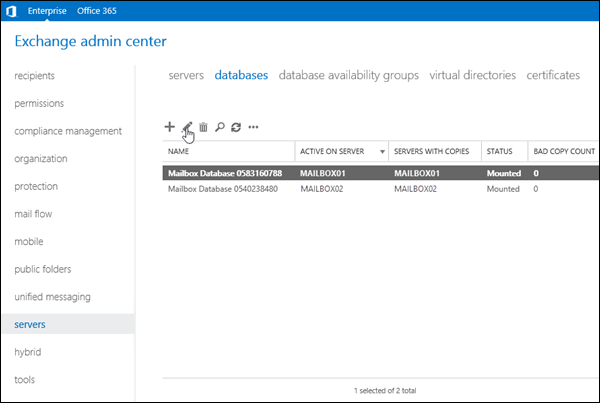
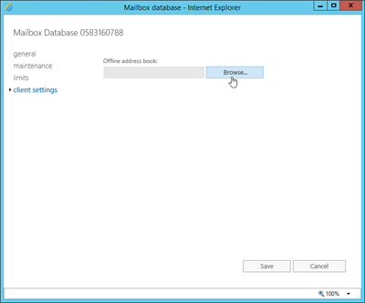

# Procedures for offline address books in Exchange 2016

 **Summary**: Learn the tasks that administrators need to know to manage offline address books in Exchange 2016.
  
An offline address book (OAB) in Exchange Server 2016 allows Outlook users in cached Exchange mode to access address list and global address list information while they're disconnected from the server. For more information, see [Offline address books in Exchange 2016](offline-address-books.md).
  
Here's a list of OAB procedures that are covered in this topic:
  
- [Use the Exchange Management Shell to view offline address books](oab-procedures.md#ViewOAB)
    
- [Use the Exchange Management Shell to create offline address books](oab-procedures.md#CreateOAB)
    
- Use the Exchange Management Shell to modify offline address books:
    
  - [Use the Exchange Management Shell to configure the default offline address book](oab-procedures.md#OABConfigDefault)
    
  - [Use the Exchange Management Shell to add and remove address lists from offline address books](oab-procedures.md#OABAddRemoveAddressLists)
    
  - [Use the Exchange Management Shell to change the organization mailbox that's responsible for generating an offline address book](oab-procedures.md#OABChangeOrgMailbox)
    
  - [Use the Exchange Management Shell to configure any virtual directory in the organization to accept download requests for the OAB](oab-procedures.md#OABAllVdirs)
    
  - [Use the Exchange Management Shell to enable shadow distribution for offline address books](oab-procedures.md#OABEnableShadow)
    
- [Use the Exchange Management Shell to update offline address books](oab-procedures.md#UpdateOAB)
    
- [Use the Exchange Management Shell to remove offline address books](oab-procedures.md#RemoveOAB)
    
- [Use the Exchange Management Shell to find organization mailboxes](oab-procedures.md#FindOrgMailboxes)
    
- [Use the Exchange Management Shell to create organization mailboxes](oab-procedures.md#CreateOrgMailboxes)
    
- [Assign offline address books to mailbox databases](oab-procedures.md#OABforDB)
    
- [Use the Exchange Management Shell to assign offline address books to mailboxes](oab-procedures.md#OABforMailboxes)
    
To change the OAB generation schedule, see [Change the offline address book generation schedule in Exchange 2016](../../plan-and-deploy/post-installation-tasks/change-oab-generation-schedule.md).
  
## What do you need to know before you begin?

- Estimated time to complete each procedure: 5 minutes
    
- You need to be assigned permissions before you can perform this procedure or procedures. To see what permissions you need, see the "Offline address books" entry in the [Email address and address book permissions](../../permissions/feature-permissions/address-book-permissions.md) topic. 
    
- You can't do most of these procedures in the Exchange admin center (EAC). You need to use the Exchange Management Shell. To learn how to open the Exchange Management Shell in your on-premises Exchange organization, see **Open the Exchange Management Shell**. For more information about the EAC, see [Exchange admin center in Exchange 2016](../../architecture/client-access/exchange-admin-center.md).
    
- For information about keyboard shortcuts that may apply to the procedures in this topic, see [Keyboard shortcuts in the Exchange admin center](../../about-documentation/exchange-admin-center-keyboard-shortcuts.md).
    
> [!TIP]
> Having problems? Ask for help in the Exchange forums. Visit the forums at: [Exchange Server](https://go.microsoft.com/fwlink/p/?linkId=60612), [Exchange Online](https://go.microsoft.com/fwlink/p/?linkId=267542), or [Exchange Online Protection](https://go.microsoft.com/fwlink/p/?linkId=285351). 
  
## Use the Exchange Management Shell to view offline address books
<a name="ViewOAB"> </a>

To view OABs, use the following syntax:
  
```
Get-OfflineAddressBook [-Identity <OABIdentity>]
```

This example returns a summary list of all OABs in your organization.
  
```
Get-OfflineAddressBook
```

This example returns detailed information about the OAB named Default Offline Address Book.
  
```
Get-OfflineAddressBook -Identity "Default Offline Address Book" | Format-List 
```

This example returns values for the specified properties on all OABs in your organization.
  
```
Get-OfflineAddressBook | Format-List Name,GUID,AddressLists,GeneratingMailbox,IsDefault,VirtualDirectories,GlobalWebDistributionEnabled,ShadowMailboxDistributionEnabled
```

For detailed syntax and parameter information, see [Get-OfflineAddressBook](http://technet.microsoft.com/library/4f865c2b-21c6-46cc-9c77-a3fc98538a40.aspx).
  
## Use the Exchange Management Shell to create offline address books
<a name="CreateOAB"> </a>

If you've created multiple address lists, you can use OABs to make the address lists available to users when they're offline.
  
To create new offline address books, use the following syntax:
  
```
New-OfflineAddressBook -Name "<Name>" -AddressLists "<GlobalAddressListOrAddressList1>","<GlobalAddressListOrAddressList2>,..." [-GlobalWebDistributionEnabled $true] [-GeneratingMailbox <OrganizationMailboxIdentity> ] [-IsDefault $true] [-ShadowMailboxDistributionEnabled $true]
```

This example creates a new OAB named Contoso Executives OAB with the following properties:
  
- The Default Global Address List and Contoso Executives Address List are included in the OAB.
    
- All OAB virtual directories in the organization can accept requests to download the OAB.
    
- The organization mailbox that's responsible for generating the OAB is  `SystemMailbox{bb558c35-97f1-4cb9-8ff7-d53741dc928c}` (we didn't use the  _GeneratingMailbox_ parameter to specify a different organization mailbox). 
    
- The OAB isn't used by mailboxes and mailbox databases that don't have an OAB specified (we didn't use the  _IsDefault_ parameter with the value  `$true`).
    
- Shadow distribution for the OAB is disabled (read-only copies of the OAB aren't copied to all other organization mailboxes, because we didn't use the  _ShadowMailboxDistributionEnabled_ parameter with the value  `$true`).
    
```
New-OfflineAddressBook -Name "Contoso Executives OAB" -AddressLists "Default Global Address List","Contoso Executives Address List" -GlobalWebDistributionEnabled $true
```

For detailed syntax and parameter information, see [New-OfflineAddressBook](http://technet.microsoft.com/library/8b9a3931-90c3-4b36-9dcb-5e2e65cd7e5e.aspx).
  
### How do you know this worked?

To verify that you've successfully created the OAB, run the following command to verify the property values:
  
```
Get-OfflineAddressBook | Format-List Name,AddressLists,GeneratingMailbox,IsDefault,VirtualDirectories,GlobalWebDistributionEnabled
```

## Use the Exchange Management Shell to modify offline address books
<a name="CreateOAB"> </a>

To modify OABs, use the following syntax:
  
```
Set-OfflineAddressBook -Identity "<OABIdentity>" [-Name <Name>] [-AddressLists "<GlobalAddressListOrAddressList1>","<GlobalAddressListOrAddressList2>,..."] [-VirtualDirectories $null] [-GlobalWebDistributionEnabled $true] [-GeneratingMailbox <OrganizationMailboxIdentity> ] [-IsDefault $true] [-ShadowMailboxDistributionEnabled <$true | $false>]
```

For detailed syntax and parameter information, see [Set-OfflineAddressBook](http://technet.microsoft.com/library/1221dda7-1923-4fec-a756-7540e18ae9f9.aspx).
  
### Use the Exchange Management Shell to configure the default offline address book
<a name="OABConfigDefault"> </a>

By default, the automatically-created OAB named Default Offline Address Book is the default OAB. The default OAB is used by:
  
- Mailboxes in mailbox databases where the database has no OAB assigned (by default, all databases)
    
- Mailboxes without an address book policy (ABP) assigned, or where the assigned ABP policy has no OAB defined (by default, there are no ABPs).
    
- Mailboxes without an OAB assigned (by default, all mailboxes)
    
This example configures the OAB named Contoso Executives OAB to be the default OAB.
  
```
Set-OfflineAddressBook -Identity "Contoso Executives OAB" -IsDefault $true
```

### Use the Exchange Management Shell to add and remove address lists from offline address books
<a name="OABAddRemoveAddressLists"> </a>

When you modify the address lists that are configured in an OAB, the values that you specify will  *replace*  any address lists in the OAB. To add address lists to the OAB, specify the current address lists plus the ones you want to add. To remove address lists from the OAB, specify the current address lists minus the ones you want to remove. 
  
In this example, the OAB named Marketing OAB is already configured with Address List 1 and Address List 2. To keeps those address lists and add Address List 3, run the following command:
  
```
Set-OfflineAddressBook -Identity "Marketing OAB" -Address Lists "Address List1","Address List 2","Address List 3"
```

Similarly, to keep the OAB configured with Address List 1 and Address 2, but remove Address List 3, run the following command:
  
```
Set-OfflineAddressBook -Identity "Marketing OAB" -AddressLists "Address List 1","Address List 2"
```

### Use the Exchange Management Shell to change the organization mailbox that's responsible for generating an offline address book
<a name="OABChangeOrgMailbox"> </a>

Typically, you only need to configure multiple organization mailboxes if you have Exchange servers in different Active Directory sites. You can configure multiple OABs to use the same organization mailbox, but you can't configure an OAB to use more than one organization mailbox. If you need multiple copies of the OAB in different locations, enable shadow distribution for the OAB. For more information, see [Use the Exchange Management Shell to enable shadow distribution for offline address books](oab-procedures.md#OABEnableShadow).
  
This example changes the organization mailbox that's responsible for generating the OAB named Default Offline Address Book.
  
```
Set-OfflineAddressBook -Identity "Default Offline Address Book" -GeneratingMailbox OABGen2
```

 **Note**: To configure an arbitration mailbox that you can use as an organization mailbox, see [Use the Exchange Management Shell to create organization mailboxes](oab-procedures.md#CreateOrgMailboxes).
  
### Use the Exchange Management Shell to configure any virtual directory in the organization to accept download requests for the OAB
<a name="OABAllVdirs"> </a>

The Client Access (frontend) services on any Mailbox server can proxy the OAB download request to the correct location. The OAB files are downloaded from the backend location  `%ExchangeInstallPath%ClientAccess\OAB\<OAB GUID>` on the Mailbox server that holds the active copy of the OAB's designated organization mailbox (or from the server that holds a shadow copy of the OAB). 
  
This example modifies the OAB named Default Offline Address Book to allow any virtual directory in the organization to accept requests to download the OAB.
  
1. Run the following command:
    
  ```
  Set-OfflineAddressBook -Identity "Default Offline Address Book" -VirtualDirectories $null
  ```

2. Run the following command:
    
  ```
  Set-OfflineAddressBook -Identity "Default Offline Address Book" -GlobalWebDistributionEnabled $true
  ```

### Use the Exchange Management Shell to enable shadow distribution for offline address books
<a name="OABEnableShadow"> </a>

Before you enable shadow distribution to distribute a read-only copy of the OAB to organization mailboxes in different Active Directory sites, verify that an organization mailbox exists in each site. To create organization mailboxes, see [Use the Exchange Management Shell to create organization mailboxes](oab-procedures.md#CreateOrgMailboxes).
  
This example enables shadow distribution for the OAB named Contoso Executives OAB.
  
```
Set-OfflineAddressBook -Identity "Contoso Executives OAB" -ShadowMailboxDistributionEnabled $true
```

### How do you know this worked?
<a name="OABEnableShadow"> </a>

To verify that you've successfully modified the OAB, run the following command to verify the property values:
  
```
Get-OfflineAddressBook | Format-List Name,AddressLists,GeneratingMailbox,IsDefault,VirtualDirectories,GlobalWebDistributionEnabled,
```

## Use the Exchange Management Shell to update offline address books
<a name="UpdateOAB"> </a>

Changes in an OAB aren't available to users until the scheduled OAB generation (by default, every 8 hours). If you don't want to wait, you can use the procedures in this topic to immediately update an OAB.
  
To change the OAB generation schedule, see [Change the offline address book generation schedule in Exchange 2016](../../plan-and-deploy/post-installation-tasks/change-oab-generation-schedule.md).
  
To update an OAB, use the following syntax:
  
```
Update-OfflineAddressBook -Identity <OABIdentity>
```

This example updates the OAB named Default Offline Address Book.
  
```
Update-OfflineAddressBook -Identity "Default Offline Address Book"
```

This example updates all OABs.
  
```
Get-OfflineAddressBook | Update-OfflineAddressBook
```

For detailed syntax and parameter information, see [Update-OfflineAddressBook](http://technet.microsoft.com/library/08ee5bd7-1c23-492e-8952-d37b2a61c022.aspx).
  
## Use the Exchange Management Shell to remove offline address books
<a name="RemoveOAB"> </a>

To remove OABs, use the following syntax:
  
```
Remove-OfflineAddressBook -Identity <OABIdentity>
```

This example removes the OAB named Contoso Executives OAB.
  
```
Remove-OfflineAddressBook -Identity "Contoso Executives OAB"
```

 **Note**: If the removed OAB is the default OAB, you need to create or configure another OAB as the default (the  _IsDefault_ parameter value is  `$true`).
  
### How do you know this worked?

To verify that you've successfully removed the OAB, run the following command to verify that the OAB is gone.
  
```
Get-OfflineAddressBook
```

## Use the Exchange Management Shell to find organization mailboxes
<a name="FindOrgMailboxes"> </a>

Only organization mailboxes can generate OABs. An organization mailbox is an arbitration mailbox that has the  `OrganizationCapabilityOABGen` value in the **PersistedCapability** property. To find the organization mailboxes in your organization, run the following command: 
  
```
Get-Mailbox -Arbitration | where {$_.PersistedCapabilities -like "*OAB*"} | Format-List Name,ServerName,PersistedCapabilities
```

To find the organization mailbox that's used to generate an OAB, run the following command:
  
```
Get-OfflineAddressBook | Format-List Name,AddressLists,GeneratingMailbox,IsDefault
```

## Use the Exchange Management Shell to create organization mailboxes
<a name="CreateOrgMailboxes"> </a>

Typically, you only need to create multiple arbitration mailbox mailboxes in multi-site Exchange organizations. You can have an organization mailbox in each site, and you can configure shadow distribution for an OAB (so a read only copy of the OAB is stored in all organization mailboxes). For more information, see [Use the Exchange Management Shell to enable shadow distribution for offline address books](oab-procedures.md#OABEnableShadow).
  
You need to be assigned permissions before you can perform this procedure or procedures. To see what permissions you need, see the "Recipient Provisioning Permissions" section in the [Recipients Permissions](../../permissions/feature-permissions/recipient-permissions.md) topic. 
  
1. Create an arbitration mailbox by using the following syntax:
    
  ```
  New-Mailbox -Arbitration -Name <UniqueName> -UserPrincipalName <UPN> [-Database <DBIdentity>] [-Alias <Alias>] [-DisplayName "<DisplayName>"] 
  ```

    This example creates a new arbitration mailbox named OAB Gen 2, with the UPN (account name) oabgen2@contoso.com, in the default database.
    
  ```
  New-Mailbox -Arbitration -Name "OAB Gen 2" -UserPrincipalName oabgen2@contoso.com
  ```

2. Turn the arbitration mailbox into an organization mailbox by using the following syntax:
    
  ```
  Set-Mailbox -Identity <MailboxIdentity> -Arbitration -OABGen $true -MaxSendSize 1GB
  ```

    This example turns the OAB Gen 2 arbitration mailbox into an organization mailbox.
    
  ```
  Set-Mailbox -Identity "OAB Gen 2" -Arbitration -OABGen $true -MaxSendSize 1GB
  ```

3. To activate the OAB generation capabilities of the new organization mailbox, run **Update-OfflineAddressBook** for  *any*  OAB in the organization. For example: 
    
  ```
  Update-OfflineAddressBook -Identity "Default Offline Address Book"
  ```

### How do you know this worked?

To verify that you've successfully created an organization mailbox, run the following command and verify the mailbox is returned:
  
```
Get-Mailbox -Arbitration | where {$_.PersistedCapabilities -like "*OAB*"} | Format-List Name,ServerName,PersistedCapabilities
```

## Assign offline address books to mailbox databases
<a name="OABforDB"> </a>

When you assign an OAB to a mailbox database, all mailboxes in the databases will use that OAB instead of the default OAB, unless the mailbox has an OAB assigned. By default, no OAB is assigned to a mailbox database.
  
You need to be assigned permissions before you can perform this procedure or procedures. To see what permissions you need, see the "Mailbox databases" entry in the [Recipients Permissions](../../permissions/feature-permissions/recipient-permissions.md) topic. 
  
### Use the EAC to assign an offline address book to a mailbox database

1. Open the EAC, and go to **Servers** \> **Databases**. Select the database from the list, and then click **Edit** ( ).
    
  
2. The **Mailbox Database** window opens. Click the **Client settings** tab, and then click **Browse** next to **Offline address book**.
    
  
3. In the **Select Offline Address Book** window that opens, select the OAB from the list, and click **OK**.
    
4. Back in the **Mailbox Database** window, click **Save**.
    
### Use the Exchange Management Shell to assign an offline address book to a mailbox database

Use the following syntax:
  
```
Set-MailboxDatabase -Identity <DatabaseIdentity> -OfflineAddressBook <OABIdentity>
```

This example assigns the OAB named Contoso Executives OAB to the mailbox database named MBX DB02.
  
```
Set-MailboxDatabase -Identity "MBX DB02" -OfflineAddressBook "Contoso Executives OAB"
```

### How do you know this worked?

To verify that you've successfully assigned an OAB to a mailbox database, use either of the following procedures:
  
- In the EAC, go to **Servers** \> **Databases**. Select the database from the list, and then click **Edit** ( ). In the **Mailbox database** window opens, click the **Client settings** tab, and verify that the OAB is listed in **Offline address book**.
    
- In the Exchange Management Shell, run the following command:
    
  ```
  Get-MailboxDatabase | Format-Table -Auto Name,OfflineAddressBook
  ```

## Use the Exchange Management Shell to assign offline address books to mailboxes
<a name="OABforMailboxes"> </a>

When you assign an OAB to a mailbox, the default OAB and the OAB that's assigned to the mailbox database (if any) aren't used by the mailbox. By default, no OAB is assigned to a mailbox.
  
 **Note**: If the mailbox has an address book policy (ABP) assigned, and the ABP has an OAB defined, the OAB that's directly assigned to the mailbox will take precedence over the ABP. For more information ABPs, see [Address book policies in Exchange 2016](../../email-addresses-and-address-books/address-book-policies/address-book-policies.md).
  
You need to be assigned permissions before you can perform this procedure or procedures. To see what permissions you need, see the "Recipient Provisioning Permissions" section in the [Recipients Permissions](../../permissions/feature-permissions/recipient-permissions.md) topic. 
  
To assign an OAB to a mailbox, use the following syntax:
  
```
Set-Mailbox -Identity <MailboxIdentity> -OfflineAddressBook <OABIdentity>
```

This example assigns the OAB named Contoso Executives to the mailbox laura@contoso.com.
  
```
Set-Mailbox -Identity laura@contoso.com -OfflineAddressBook "Contoso Executives OAB"
```

This example assigns the OAB named Contoso US to a filtered list of mailboxes.
  
```
$USContoso = Get-User -ResultSize Unlimited -Filter {RecipientType -eq "UserMailbox" -and Company -eq "Contoso" -and CountryOrRegion -eq "US"}; $USContoso | foreach {Set-Mailbox $_.Identity -OfflineAddressBook "Contoso United States"}
```

### How do you know this worked?

To verify that you've successfully assigned an OAB to a mailbox, replace  _\<MailboxIdentity\>_ with the identity of the mailbox, and run the following command: 
  
```
Get-Mailbox -Identity "<MailboxIdentity>" | Format-Table -Auto Name,OfflineAddressBook
```


