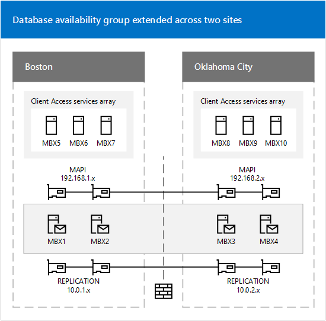
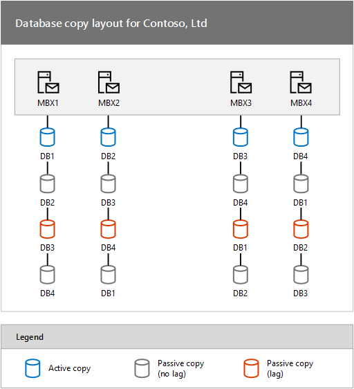

# Deploying high availability and site resilience

 **Summary**: How to deploy Exchange Server 2016 with high availability and site resilience.

Microsoft Exchange Server 2016 uses the concept known as *incremental deployment* for both high availability and site resilience. You simply install two or more Exchange 2016 Mailbox servers as stand-alone servers, and then incrementally configure them and mailbox databases for high availability and site resilience, as needed.

## Overview of the deployment process

While the actual steps used by each organization may vary slightly, the overall process for deploying Exchange 2016 in a highly available or site resilient configuration is generally the same. After performing the necessary planning and design tasks for building and deploying a database availability group (DAG) and creating mailbox database copies, you would:

1. Create a DAG. For detailed steps, see [Create a database availability group](manage-ha/create-dags.md). It's important to note that all servers within a DAG must be running the same version of Exchange. You can't mix Exchange 2013 and Exchange 2016 servers in the same DAG.

2. If necessary, pre-stage the cluster name object (CNO). Pre-staging the CNO is required when deploying a DAG with Mailbox servers running Windows Server 2012. If you're deploying a DAG without an administrative access point using Mailbox servers running Windows Server 2012 R2, then you do not need to pre-stage a CNO. Pre-staging is also required in environments where computer account creation is restricted or where computer accounts are created in a container other than the default computers container. For detailed steps, see [Pre-stage the cluster name object for a database availability group](manage-ha/pre-stage-dag-cnos.md).

3. Add two or more Mailbox servers to the DAG. For detailed steps, see [Manage database availability group membership](manage-ha/dag-memberships.md).

4. Configure the DAG properties as needed:

1. Optionally configure DAG encryption and compression, replication port, DAG IP addresses, and other DAG properties. For detailed steps, see [Configure database availability group properties](manage-ha/configure-dag-properties.md).

2. Enable Datacenter Activation Coordination (DAC) mode for the DAG. This protects the DAG from database-level split brain conditions during switchback to the primary datacenter after a datacenter switchover has been performed, and it enables the use of the built-in DAG recovery cmdlets. For more information, see [Datacenter Activation Coordination mode](database-availability-groups/dac-mode.md).

5. Add mailbox database copies across Mailbox servers in the DAG. For detailed steps, see [Add a mailbox database copy](manage-ha/add-db-copies.md).

## Example deployment: four-member DAG in two datacenters

This example details how an organization, Contoso, Ltd., is configuring and deploying a four-member DAG that will be extended across two physical locations: Boston and Oklahoma City.

### Base infrastructure

Each location contains the infrastructure elements that are necessary to operate a messaging infrastructure based on Exchange 2016, namely:

- Directory services (either Active Directory or Active Directory Domain Services (AD DS))

- Domain Name System (DNS) name resolution

- Multiple Exchange 2016 servers running Client Access services

- Multiple Exchange 2016 Mailbox servers

The following figure illustrates the Contoso configuration.



### Network configuration

As illustrated in the previous figure, the solution involves the use of multiple subnets and multiple networks. Each Mailbox server in the DAG has two network adapters on separate subnets. In each Mailbox server, one network adapter will be used for the MAPI network (192.168. _x_. _x_) and one network adapter will be used for the Replication network (10.0. _x_. _x_). Only the MAPI network provides connectivity to Active Directory, DNS services, other Exchange servers and clients. The adapter used for the Replication network in each member provides connectivity only to the Replication network adapters in the other members of the DAG.

The settings for each network adapter in each node are detailed in the following table.

|**Name**|**IPv4 address**|**Subnet mask**|**Default gateway**|
|:-----|:-----|:-----|:-----|
|MBX1 (MAPI)  <br/> |192.168.1.4  <br/> |255.255.255.0  <br/> |192.168.1.1  <br/> |
|MBX2 (MAPI)  <br/> |192.168.1.5  <br/> |255.255.255.0  <br/> |192.168.1.1  <br/> |
|MBX3 (MAPI)  <br/> |192.168.2.4  <br/> |255.255.255.0  <br/> |192.168.2.1  <br/> |
|MBX4 (MAPI)  <br/> |192.168.2.5  <br/> |255.255.255.0  <br/> |192.168.2.1  <br/> |
|MBX1 (Replication)  <br/> |10.0.1.4  <br/> |255.255.0.0  <br/> |None  <br/> |
|MBX2 (Replication)  <br/> |10.0.1.5  <br/> |255.255.0.0  <br/> |None  <br/> |
|MBX3 (Replication)  <br/> |10.0.2.4  <br/> |255.255.0.0  <br/> |None  <br/> |
|MBX4 (Replication)  <br/> |10.0.2.5  <br/> |255.255.0.0  <br/> |None  <br/> |
 
As shown in the preceding table, adapters used for Replication networks don't use default gateways. To provide network connectivity between each of the Replication network adapters, Contoso uses persistent static routes, which they configure by using the Netsh.exe tool.

To configure routing for the Replication network adapters on MBX1 and MBX2, the following command was run on each server.

```
netsh interface ipv4 add route 10.0.2.0/24 <NetworkName> 10.0.1.254
```

To configure routing for the Replication network adapters on MBX3 and MBX4, the following command was run on each server.

```
netsh interface ipv4 add route 10.0.1.0/24 <NetworkName> 10.0.2.254
```

The following additional network settings have also been configured:

- The **Register this connection's addresses in DNS** check box is selected for each DAG member's MAPI network adapter, and cleared for each Replication network adapter.

- At least one DNS server address is configured for each DAG member's MAPI network adapter, and none are configured for the Replication network adapters. For redundancy, Contoso is using multiple DNS server addresses for their MAPI network adapters.

- Contoso doesn't use the Windows Firewall and have turned it off on their servers.

After the network adapters have been configured, Contoso is ready to create a DAG and add the Mailbox servers to the DAG.

### Database availability group creation and configuration

The administrator has decided to create a Windows PowerShell command-line interface script that performs several tasks:

- It uses the [New-DatabaseAvailabilityGroup](http://technet.microsoft.com/library/c0cd98a9-eaaa-4cfb-845d-213e5d606d3b.aspx) cmdlet to create the DAG. Because BOSTON is considered to be the primary datacenter, Contoso has chosen to use a witness server in the same datacenter, namely, MBX5.

- It uses the [Set-DatabaseAvailabilityGroup](http://technet.microsoft.com/library/4353c3ab-75b7-485e-89ae-d4b09b44b646.aspx) cmdlet to preconfigure an alternate witness server and alternate witness directory in case a datacenter switchover is ever necessary.

- It uses the [Add-DatabaseAvailabilityGroupServer](http://technet.microsoft.com/library/6bd0a3fe-dec6-47c2-b9a3-8dffb60e4aad.aspx) cmdlet to add each of the four Mailbox servers to the DAG.

- It uses the [Set-DatabaseAvailabilityGroup](http://technet.microsoft.com/library/4353c3ab-75b7-485e-89ae-d4b09b44b646.aspx) cmdlet to configure the DAG for DAC mode. For more information about DAC mode, see [Datacenter Activation Coordination mode](database-availability-groups/dac-mode.md).

The following are the commands used in the script:

```
New-DatabaseAvailabilityGroup -Name DAG1 -WitnessServer MBX5 -WitnessDirectory C:\DAGWitness\DAG1.contoso.com -DatabaseAvailabilityGroupIPAddresses 192.168.1.8,192.168.2.8
```

The preceding command creates the DAG DAG1, configures MBX5 to act as the witness server, configures a specific witness directory (C:\DAGWitness\DAG1.contoso.com), and configures two IP addresses for the DAG (one for each subnet on the MAPI network).

```
Set-DatabaseAvailabilityGroup -Identity DAG1 -AlternateWitnessDirectory C:\DAGWitness\DAG1.contoso.com -AlternateWitnessServer MBX10
```

The preceding command configures DAG1 to use an alternate witness server of MBX10 and an alternate witness directory on MBX10 that uses the same path that was configured on MBX5.

> [!NOTE]
> Using the same path isn't required; Contoso has chosen to do this to standardize their configuration.

```
Add-DatabaseAvailabilityGroupServer -Identity DAG1 -MailboxServer MBX1
Add-DatabaseAvailabilityGroupServer -Identity DAG1 -MailboxServer MBX3
Add-DatabaseAvailabilityGroupServer -Identity DAG1 -MailboxServer MBX2
Add-DatabaseAvailabilityGroupServer -Identity DAG1 -MailboxServer MBX4
```

The preceding commands add each of the Mailbox servers, one at a time, to the DAG. The commands also install the Windows Failover Clustering component on each Mailbox server (if it isn't already installed), create a failover cluster, and join each Mailbox server to the newly created cluster.

```
Set-DatabaseAvailabilityGroup -Identity DAG1 -DatacenterActivationMode DagOnly
```

The preceding command enables DAC mode for the DAG.

### Mailbox databases and mailbox database copies

After creating the DAG and adding the Mailbox servers to the DAG, Contoso prepares to create mailbox databases and mailbox database copies. To meet their criteria for failure resistance, Contoso is planning to configure each mailbox database with three non-lagged database copies, and one lagged database copy. The lagged copy will have a configured log replay delay of three days.

This configuration provides a total of four copies for each database (one active, two non-lagged passives, and a lagged passive). Contoso plans on having four active databases per server. Therefore the Contoso solution contains 16 total database copies.

As shown in the following figure, Contoso is taking a balanced approach to their database layout.

 **Database copy layout for Contoso, Ltd**



Each Mailbox server hosts an active mailbox database copy, two non-lagged passive database copies, and one lagged passive database copy. The lagged copy of each active mailbox database is hosted on a Mailbox server in the other site.

To create this configuration, the administrator runs several commands.

On MBX1, run the following commands.

```
Add-MailboxDatabaseCopy -Identity DB1 -MailboxServer MBX2
Add-MailboxDatabaseCopy -Identity DB1 -MailboxServer MBX4
Add-MailboxDatabaseCopy -Identity DB1 -MailboxServer MBX3 -ReplayLagTime 3.00:00:00 -SeedingPostponed
Suspend-MailboxDatabaseCopy -Identity DB1\MBX3 -SuspendComment "Seed from MBX4" -Confirm:$False
Update-MailboxDatabaseCopy -Identity DB1\MBX3 -SourceServer MBX4
Suspend-MailboxDatabaseCopy -Identity DB1\MBX3 -ActivationOnly
```

On MBX2, run the following commands.

```
Add-MailboxDatabaseCopy -Identity DB2 -MailboxServer MBX1
Add-MailboxDatabaseCopy -Identity DB2 -MailboxServer MBX3
Add-MailboxDatabaseCopy -Identity DB2 -MailboxServer MBX4 -ReplayLagTime 3.00:00:00 -SeedingPostponed
Suspend-MailboxDatabaseCopy -Identity DB2\MBX4 -SuspendComment "Seed from MBX3" -Confirm:$False
Update-MailboxDatabaseCopy -Identity DB2\MBX4 -SourceServer MBX3
Suspend-MailboxDatabaseCopy -Identity DB2\MBX4 -ActivationOnly
```

On MBX3, run the following commands.

```
Add-MailboxDatabaseCopy -Identity DB3 -MailboxServer MBX4
Add-MailboxDatabaseCopy -Identity DB3 -MailboxServer MBX2
Add-MailboxDatabaseCopy -Identity DB3 -MailboxServer MBX1 -ReplayLagTime 3.00:00:00 -SeedingPostponed
Suspend-MailboxDatabaseCopy -Identity DB3\MBX1 -SuspendComment "Seed from MBX2" -Confirm:$False
Update-MailboxDatabaseCopy -Identity DB3\MBX1 -SourceServer MBX2
Suspend-MailboxDatabaseCopy -Identity DB3\MBX1 -ActivationOnly
```

On MBX4, run the following commands.

```
Add-MailboxDatabaseCopy -Identity DB4 -MailboxServer MBX3
Add-MailboxDatabaseCopy -Identity DB4 -MailboxServer MBX1
Add-MailboxDatabaseCopy -Identity DB4 -MailboxServer MBX2 -ReplayLagTime 3.00:00:00 -SeedingPostponed
Suspend-MailboxDatabaseCopy -Identity DB4\MBX2 -SuspendComment "Seed from MBX1" -Confirm:$False
Update-MailboxDatabaseCopy -Identity DB4\MBX2 -SourceServer MBX1
Suspend-MailboxDatabaseCopy -Identity DB4\MBX2 -ActivationOnly
```

In the preceding examples for the **Add-MailboxDatabaseCopy** cmdlet, the _ActivationPreference_ parameter wasn't specified. The task automatically increments the activation preference number with each copy that's added. The original database always has a preference number of 1. The first copy added with the **Add-MailboxDatabaseCopy** cmdlet is automatically assigned a preference number of 2. Assuming no copies are removed, the next copy added is automatically assigned a preference number of 3, and so forth. Thus, in the preceding examples, the passive copy in the same datacenter as the active copy has an activation preference number of 2; the non-lagged passive copy in the remote datacenter has an activation preference number of 3, and the lagged passive copy in the remote datacenter has an activation preference number of 4.

Although there are two copies of each active database across the WAN in the other location, seeding over the WAN was only performed once. This is because Contoso is leveraging the Exchange 2016 ability to use a passive copy of a database as the source for seeding. Using the [Add-MailboxDatabaseCopy](http://technet.microsoft.com/library/84198fa9-ac8e-44ea-bd7b-64fe1e83e709.aspx) cmdlet with the _SeedingPostponed_ parameter prevents the task from automatically seeding the new database copy being created. Then, the administrator can suspend the un-seeded copy, and by using the [Update-MailboxDatabaseCopy](http://technet.microsoft.com/library/37ebb66a-382e-4fd9-81f8-795f776a87b1.aspx) cmdlet with the _SourceServer_ parameter, the administrator can specify the local copy of the database as the source of the seeding operation. As a result, seeding of the second database copy added to each location happens locally and not over the WAN.

> [!NOTE]
> In the preceding example, the non-lagged database copy is seeded over the WAN, and that copy is then used to seed the lagged copy of the database that's in the same datacenter as the non-lagged copy.

Contoso has configured one of the passive copies of each mailbox database as a lagged database copy to provide protection against the extremely rare but catastrophic case of database logical corruption. As a result, the administrator is configuring the lagged copies as blocked for activation by using the [Suspend-MailboxDatabaseCopy](http://technet.microsoft.com/library/b6e03402-706e-40c6-b392-92e3da21b5c0.aspx) cmdlet with the _ActivationOnly_ parameter. This ensures that the lagged database copies won't be activated if a database or server failover occurs.

### Validating the solution

After the solution has been deployed and configured, the administrator performs several tasks that validate the solution's readiness prior to moving production mailboxes to the databases in the DAG. The solution should be tested and inspected using several methods, including failure simulations. To validate the solution, the administrator performs several tasks.

To verify the overall health of the DAG, the administrator runs the [Test-ReplicationHealth](http://technet.microsoft.com/library/da55fa0f-e100-44b1-b9b4-bf14e55a5b4d.aspx) cmdlet. This cmdlet checks several aspects of the replication and replay status to provide information about each Mailbox server and database copy in the DAG.

To verify replication and replay activity, the administrator runs the [Get-MailboxDatabaseCopyStatus](http://technet.microsoft.com/library/6ad690fb-3a23-41d4-b19d-666b34e62b26.aspx) cmdlet. This cmdlet can provide real-time status information about a specific mailbox database copy or for all mailbox database copies on a specific server. For more information about monitoring the health and status of replicated databases in a DAG, see [Monitor database availability groups](manage-ha/monitor-dags.md).

To verify that switchovers work as expected, the administrator uses the [Move-ActiveMailboxDatabase](http://technet.microsoft.com/library/755d1ecb-95d1-45e3-9a21-56df9f196f37.aspx) cmdlet to perform a series of database switchovers and server switchovers. When these tasks have completed successfully, the administrator uses the same cmdlet to move the active database copies back to their original locations.

To verify the expected behaviors in various failure scenarios, the administrator performs several tasks that either simulate failures or actually cause failures to occur. For example, the administrator might:

- Unplug the power cord on MBX1, thereby triggering a server failover. The administrator then verifies that DB1 becomes active on another server (preferably MBX2, based on the activation preference values).

- Unplug the network cable for the MAPI network adapter on MBX2, thereby triggering a server failover. The administrator then verifies that DB2 becomes active on another server (preferably MBX1, based on the activation preference values).

- Take the disk used by the active copy of DB3 offline, thereby triggering a database failover. The administrator then verifies that DB3 becomes active on another server (preferably MBX4, based on activation preference values).

There may be other failure scenarios that are tested by an organization, based on the business needs. After simulating a single failure (such as pulling the power plug), and verifying the solution's recovery behavior, the administrator may revert the solution back to its original configuration. In some cases, the solution may be tested for multiple concurrent failures. Ultimately, your solution test plan will dictate whether the solution is reverted back to its original configuration after each failure simulation has been completed.

In addition, an administrator may decide to disconnect the network connection between the two datacenters, thereby simulating a site failure. Performing a datacenter switchover is a much more involved and coordinated process; however, we recommend the process if the solution being deployed is intended to provide site resilience for the messaging services and data.

### Transitioning to operations

After the solution has been deployed, it can be extended further using incremental deployment. At this point, management of the solution would also transition to operation processes, in which the following tasks would be performed:

- Monitor the health and status of DAGs and mailbox database copies. For more information, see [Monitor database availability groups](manage-ha/monitor-dags.md).

- Perform database switchovers as needed. For detailed steps about how to perform a database switchover, see [Activate a mailbox database copy](manage-ha/activate-db-copies.md).

For more information about managing the solution, see [Managing high availability and site resilience](manage-ha/manage-ha.md).


