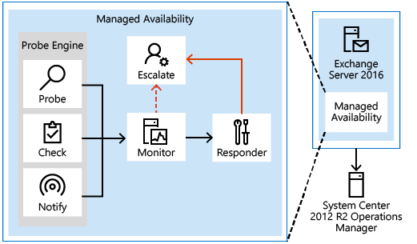

# Managed availability

 **Summary**: Learn about monitoring your Exchange 2016 organization to quickly resolve issues for greater availability and reliability.
  
Ensuring that users have a good email experience has always been the primary objective for messaging system administrators. In your Exchange Server 2016 organization, all aspects of the system must be actively monitored and any detected issues must be resolved quickly. To achieve this, a feature called *Managed Availability* provides built-in monitoring and recovery actions that preserve the end-user experience. 
  
## Managed Availability

Managed availability, also known as *Active Monitoring* or *Local Active Monitoring*, is the integration of built-in monitoring and recovery actions with the Exchange high availability platform. It's designed to detect and recover from problems as soon as they occur and are discovered by the system. Unlike previous external monitoring solutions and techniques for Exchange, managed availability doesn't try to identify or communicate the root cause of an issue. It's instead focused on recovery aspects that address three key areas of the user experience: 
  
- **Availability**: Can users access the service?
    
- **Latency**: How is the experience for users?
    
- **Errors**: Are users able to accomplish what they want?
    
Managed availability provides a native health monitoring and recovery solution. It moves away from monitoring individual separate slices of the system to monitoring the end-to-end user experience, and protecting the end user's experience through recovery-oriented actions.
  
Managed availability is an internal process that runs on every Exchange 2016 server. It polls and analyzes hundreds of health metrics every second. If something is found to be wrong, most of the time it will be fixed automatically. But there will always be issues that managed availability won't be able to fix on its own. In those cases, managed availability will escalate the issue to an administrator by means of event logging.
  
Managed availability is implemented in the form of two services:
  
- **Exchange Health Manager Service (MSExchangeHMHost.exe)**: This is a controller process used to manage worker processes. It's used to build, execute, and start and stop the worker process, as needed. It's also used to recover the worker process in case that process fails, to prevent the worker process from being a single point of failure.
    
- **Exchange Health Manager Worker process (MSExchangeHMWorker.exe)**: This is the worker process responsible for performing run-time tasks within the managed availability framework.
    
Managed availability uses persistent storage to perform its functions:
  
- XML files in the \bin\Monitoring\config folder are used to store configuration settings for some of the probe and monitor work items.
    
- Active Directory is used to store global overrides.
    
- The Windows registry is used to store run-time data, such as bookmarks, and local (server-specific) overrides.
    
- The Windows crimson channel event log infrastructure is used to store the work item results.
    
- Health mailboxes are used for probe activity. Multiple health mailboxes will be created on each mailbox database that exists on the server.
    
### Managed Availability Components

As illustrated in the following drawing, managed availability includes three main asynchronous components that are constantly doing work.
  
 **Managed Availability Components**
  

  
 **Probes**
  
The first component is called a *Probe* . Probes are responsible for taking measurements on the server and collecting data. 
  
There are three primary categories of probes: recurrent probes, notifications, and checks. Recurrent probes are synthetic transactions performed by the system to test the end-to-end user experience. Checks are the infrastructure that perform the collection of performance data, including user traffic. Checks also measure the collected data against thresholds that are set to determine spikes in user failures, which enable the checks infrastructure to become aware when users are experiencing issues. Finally, the notification logic enables the system to take action immediately, based on a critical event, and without having to wait for the results of the data collected by a probe. These are typically exceptions or conditions that can be detected and recognized without a large sample set.
  
Recurrent probes run every few minutes and evaluate some aspect of service health. These probes might transmit an email via Exchange ActiveSync to a monitoring mailbox, they might connect to an RPC endpoint, or they might verify Client Access-to-Mailbox connectivity.
  
All probes are defined on Health Manager service startup in the Microsoft.Exchange.ActiveMonitoring\ProbeDefinition crimson channel. Each probe definitions has many properties, but the most relevant properties are:
  
- **Name** The name of the probe, which begins with a _SampleMask_ of the probe's monitor. 
    
- **TypeName** The code object type of the probe that contains the probe's logic. 
    
- **ServiceName** The name of the health set that contains this probe. 
    
- **TargetResource** The object the probe is validating. This is appended to the name of the probe when it is executed to become a probe result _ResultName_
    
- **RecurrenceIntervalSeconds** How often the probe executes. 
    
- **TimeoutSeconds** How long the probe will wait before failing. 
    
There are hundreds of recurrent probes. Many of these probes are per-database, so as the number of databases increases, so does the number of probes. Most probes are defined in code and are therefore not directly discoverable.
  
The basics of a recurrent probe are as follows: start every _RecurrenceIntervalSeconds_ and check (or probe) some aspect of health. If the component is healthy, the probe passes and writes an informational event to the Microsoft.Exchange.ActiveMonitoring\ProbeResult channel with a _ResultType_ of 3. If the check fails or times out, the probe fails and writes an error event to the same channel. A _ResultType_ of 4 means the check failed and a _ResultType_ of 1 means that it timed out. Many probes will re-run if they timeout, up to the value of the _MaxRetryAttempts_ property. 
  
> [!NOTE]
> The ProbeResult crimson channel can get very busy with hundreds of probes running every few minutes and logging an event, so there can be a real impact on the performance of your Exchange server if you try expensive queries against the event logs in a production environment. 
  
Notifications are probes that are not run by the health manager framework, but by some other service on the server. These services perform their own monitoring, and then feed their data into the Managed Availability framework by directly writing probe results. You won't see these probes in the ProbeDefinition channel, as this channel only describes probes that will be run by the Managed Availability framework. For example, the ServerOneCopyMonitor Monitor is triggered by probe results written by the MSExchangeDAGMgmt service. This service performs its own monitoring, determines whether there is a problem, and logs a probe result. Most notification probes have the capability to log both a red event that turns the monitor unhealthy and a green event that makes the monitor healthy again.
  
Checks are probes that only log events when a performance counter passes above or below a defined threshold. They are really a special case of notification probes, as there is a service monitoring the performance counters on the server and logging events to the ProbeResult channel when the configured threshold is met.
  
To find the counter and threshold that is considered unhealthy, you can look at the monitor for this check. Monitors of the type _Microsoft.Office.Datacenter.ActiveMonitoring.OverallConsecutiveSampleValueAboveThresholdMonitor_ or _Microsoft.Office.Datacenter.ActiveMonitoring.OverallConsecutiveSampleValueBelowThresholdMonitor_ mean that the probe they watch is a check probe 
  
 **Monitor**
  
The results of the measurements collected by probes flow into the second component, the *Monitor* . The monitor contains all of the business logic used by the system on the data collected. Similar to a pattern recognition engine, the monitor looks for the various different patterns on all the collected measurements, and then it decides whether something is considered healthy. 
  
Monitors query the data to determine if action needs to be taken based on a predefined rule set. Depending on the rule or the nature of the issue, a monitor can either initiate a responder or escalate the issue to a human via an event log entry. In addition, monitors define how much time after a failure that a responder is executed, as well as the workflow of the recovery action. Monitors have various states. From a system state perspective, monitors have two states:
  
- **Healthy**: The monitor is operating properly and all collected metrics are within normal operating parameters.
    
- **Unhealthy**: The monitor isn't healthy and has either initiated recovery through a responder or notified an administrator through escalation.
    
From an administrative perspective, monitors have additional states that appear in the Exchange Management Shell:
  
- **Degraded**: When a monitor is in an unhealthy state from 0 through 60 seconds, it's considered Degraded. If a monitor is unhealthy for more than 60 seconds, it is considered Unhealthy.
    
- **Disabled**: The monitor has been explicitly disabled by an administrator.
    
- **Unavailable**: The Exchange Health service periodically queries each monitor for its state. If it doesn't get a response to the query, the monitor state becomes Unavailable.
    
- **Repairing**: An administrator sets the Repairing state to indicate to the system that corrective action is in process by a human, which allows the system and humans to differentiate between other failures that may occur at the same time corrective action is being taken (such as a database copy reseed operation).
    
Every monitor has a _SampleMask_ property in its definition. As the monitor executes, it looks for events in the ProbeResult channel that have a _ResultName_ that matches the monitor's _SampleMask_. These events could be from recurrent probes, notifications, or checks. If the monitor's thresholds are achieved, it becomes Unhealthy. From the monitor's perspective, all three probe types are the same as they each log to the ProbeResult channel.
  
It is worth noting that a single probe failure does not necessarily indicate that something is wrong with the server. It is the design of monitors to correctly identify when there is a real problem that needs fixing. This is why many monitors have thresholds of multiple probe failures before becoming Unhealthy. Even then, many of these problems can be fixed automatically by responders, so the best place to look for problems that require manual intervention is in the Microsoft.Exchange.ManagedAvailability\Monitoring crimson channel. This will include the most recent probe error.
  
 **Responders**
  
 Finally, there are *Responders*, which are responsible for recovery and escalation actions. As their name implies, responders execute some sort of response to an alert that was generated by a monitor. When something is unhealthy, the first action is to attempt to recover that component. This could include multi-stage recovery actions; for example, the first attempt may be to restart the application pool, the second may be to restart the service, the third attempt may be to restart the server, and the subsequent attempt may be to take the server offline so that it no longer accepts traffic. If the recovery actions are unsuccessful, the system escalates the issue to a human through event log notifications. 
  
Responders take a variety of recovery actions, such as resetting an application worker pool or restarting a server. There are several types of responders:
  
- **Restart Responder** Terminates and restarts a service. 
    
- **Reset AppPool Responder** Stops and restarts an application pool in Internet Information Services (IIS). 
    
- **Failover Responder** Initiates a database or server failover. 
    
- **Bugcheck Responder** Initiates a bugcheck of the server, thereby causing a server reboot. 
    
- **Offline Responder** Takes a protocol on a server out of service (rejects client requests). 
    
- **Online Responder** Places a protocol on a server back into production (accepts client requests). 
    
- **Escalate Responder** Escalates the issue to an administrator via event logging. 
    
In addition to the above listed responders, some components also have specialized responders that are unique to their component.
  
All responders include throttling behavior, which provide a built-in sequencing mechanism for controlling responder actions. The throttling behavior is designed to ensure that the system isn't compromised or made worse as a result of responder recovery actions. All responders are throttled in some fashion. When throttling occurs, the responder recovery action may be skipped or delayed, depending on the responder action. For example, when the Bugcheck Responder is throttled, its action is skipped, and not delayed.
  
## Health Sets

From a reporting perspective, managed availability has two views of health, one internal and one external.
  
The internal view uses *health sets* . Each component in Exchange 2016 (for example, Outlook on the web, Exchange ActiveSync, the Information Store service, content indexing, transport services, etc.) is monitored by managed availability using probes, monitors, and responders. A group of probes, monitors and responders for a given component is called a *health set* . A health set is a group of probes, monitors, and responders that determine if that component is healthy. The current state of a health set (e.g., whether it is healthy or unhealthy) is determined by using the state of the health set's monitors. If all of a health set's monitors are healthy, then the health set is in a healthy state. If any monitor is not in a healthy state, then the health set state will be determined by its least healthy monitor. 
  
For detailed steps to view server health or health sets state, see [Manage health sets and server health](health-sets.md).
  
## Health Groups

The external view of managed availability is composed of *health groups* . Health groups are exposed to System Center Operations Manager 2012 R2. 
  
There are four primary health groups:
  
- **Customer Touch Points** Components that affect real-time user interactions, such as protocols, or the Information Store. 
    
- **Service Components** Components without direct, real-time user interactions, such as the Microsoft Exchange Mailbox Replication service, or the offline address book generation process (OABGen). 
    
- **Server Components** The physical resources of the server, such as disk space, memory and networking. 
    
- **Dependency Availability** The server's ability to access necessary dependencies, such as Active Directory, DNS, etc. 
    
When the Exchange Management Pack is installed, System Center Operations Manager (SCOM) acts as a health portal for viewing information related to the Exchange environment. The SCOM dashboard includes three views of Exchange server health:
  
- **Active Alerts** Escalation Responders write events to the Windows event log that are consumed by the monitor within SCOM. These appear as alerts in the Active Alerts view. 
    
- **Organization Health** A roll up summary of the overall health of the Exchange organization health is displayed in this view. These rollups include displaying health for individual database availability groups, and health within specific Active Directory sites. 
    
- **Server Health** Related health sets are combined into health groups and summarized in this view. 
    
## Overrides

Overrides provide an administrator with the ability to configure some aspects of the managed availability probes, monitors, and responders. Overrides can be used to fine tune some of the thresholds used by managed availability. They can also be used to enable emergency actions for unexpected events that may require configuration settings that are different from the out-of-box defaults.
  
Overrides can be created and applied to a single server (this is known as a *server override*), or they can be applied to a group of servers (this is known as a *global override*). Server override configuration data is stored in the Windows registry on the server on which the override is applied. Global override configuration data is stored in Active Directory. 
  
Overrides can be configured to last indefinitely, or they can be configured for a specific duration. In addition, global overrides can be configured to apply to all servers, or only servers running a specific version of Exchange.
  
When you configure an override, it will not take effect immediately. The Microsoft Exchange Health Manager service checks for updated configuration data every 10 minutes. In addition, global overrides will be dependent on Active Directory replication latency.
  
For detailed steps to view or configure server or global overrides, see [Configure managed availability overrides](configure-overrides.md).
  
## Management Tasks and Cmdlets

There are three primary operational tasks that administrators will typically perform with respect to managed availability:
  
- Extracting or viewing system health
    
- Viewing health sets, and details about probes, monitors and responders
    
- Managing overrides
    
The two primary management tools for managed availability are the Windows Event Log and the Exchange Management Shell. Managed availability logs a large amount of information in the Exchange ActiveMonitoring and ManagedAvailability crimson channel event logs, such as:
  
- Probe, monitor, and responder definitions, which are logged in the respective \*Definition event logs.
    
- Probe, monitor, and responder results, which are logged in the respective \*Results event logs.
    
- Details about responder recovery actions, including when the recovery action is started, and it is considered complete (whether successful or not), which are logged in the RecoveryActionResults event log.
    
There are 12 cmdlets used for managed availability, which are described in the following table.
  
|**Cmdlet**|**Description**|
|:-----|:-----|
|[Get-ServerHealth](http://technet.microsoft.com/library/ca9cff3a-ecda-422d-abd7-b7d8da71a6c7.aspx)   |Used to get raw server health information, such as health sets and their current state (healthy or unhealthy), health set monitors, server components, target resources for probes, and timestamps related to probe or monitor start or stop times, and state transition times.    |
|[Get-HealthReport](http://technet.microsoft.com/library/f33fbed5-0e01-4d7e-a252-121b2afb6864.aspx)   |Used to get a summary health view that includes health sets and their current state.    |
|[Get-MonitoringItemIdentity](http://technet.microsoft.com/library/7a4da080-0fe6-4dd7-85a2-cceeb68f95e0.aspx)   |Used to view the probes, monitors, and responders associated with a specific health set.    |
|[Get-MonitoringItemHelp](http://technet.microsoft.com/library/4e0bfa98-4c3d-46a5-bb18-8f64a2108c0a.aspx)   |Used to view descriptions about some of the properties of probes, monitors, and responders.    |
|[Add-ServerMonitoringOverride](http://technet.microsoft.com/library/350eb7e0-3181-4de9-9934-6c8467b920c3.aspx)   |Used to create a local, server-specific override of a probe, monitor, or responder.    |
|[Get-ServerMonitoringOverride](http://technet.microsoft.com/library/77f630fb-6711-459c-b073-843615863322.aspx)   |Used to view a list of local overrides on the specified server.    |
|[Remove-ServerMonitoringOverride](http://technet.microsoft.com/library/dff63523-52a1-43c9-8ae2-beb93411b7e5.aspx)   |Used to remove a local override from a specific server.    |
|[Add-GlobalMonitoringOverride](http://technet.microsoft.com/library/9d5ec0ec-a7bc-4bea-a62e-6252407ed7e8.aspx)   |Used to create a global override for a group of servers.    |
|[Get-GlobalMonitoringOverride](http://technet.microsoft.com/library/34e6e29d-e10b-4ed0-8393-d9f89c78fd9c.aspx)   |Used to view a list of global overrides configured in the organization.    |
|[Remove-GlobalMonitoringOverride](http://technet.microsoft.com/library/8f8f902a-a279-484f-a25a-1986706c9dc2.aspx)   |Used to remove a global override.    |
|[Set-ServerComponentState](http://technet.microsoft.com/library/bf0a92ce-9bcf-476e-b92b-8279c141f361.aspx)   |Used to configure the state of one or more server components.    |
|[Get-ServerComponentState](http://technet.microsoft.com/library/da7214fe-c641-4c6a-a479-df95a4136929.aspx)   |Used to view the state of one or more server components.    |
   

