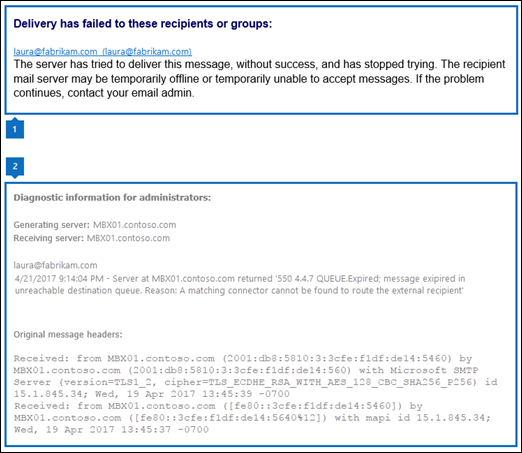

# DSNs and NDRs in Exchange 2016

 **Summary**: Administrators can learn about how to read and interpret delivery status notifications (also known as DSNs, non-delivery reports, NDRs or bounce messages) in Exchange 2016.
  
When there's a problem delivering a message, Exchange sends an NDR to the message sender that indicates there was a problem. NDRs include a code that indicates why the message wasn't delivered, and possible solutions to help get the message delivered.
  
The information that's included in NDRs is designed to be easy to read and helpful for both users and administrators. In some cases, senders can identify and fix their own problems (for example, when there's a typo in the recipient's email address). In other cases, an administrator may need to fix an issue in the Exchange environment, or notify the administrators in the destination domain about problems in their messaging environment.
  
For procedures related to NDRs in Exchange 2016, see [Procedures for DSNs and NDRs in Exchange 2016](ndr-procedures.md).
  
If you need help with NDRs in Office 365 or Exchange Online, see [Email non-delivery reports in Office 365](https://go.microsoft.com/fwlink/p/?LinkId=524931).
  
## Information in NDRs

This is an example of an NDR:
  

  
The information in an NDR is separated into two sections:
  
1. **User information section**: This section appears first and attempts to explain (in non-technical terms) why delivery of the message failed, and possible steps to successfully deliver the message.
    
  - The text that's displayed in this section is inserted by the Exchange server that generated the NDR.
    
  - When applicable, the fully qualified domain name (FQDN) of the server that rejected the message is included in the user information section (for example mbx01.contoso.com).
    
  - If delivery failed for multiple recipients, the email address and reason for failure is listed for each recipient is listed..
    
2. **Diagnostic information for administrators section**: This section provides deeper technical information to help administrators troubleshoot the issues that caused the delivery failure.
    
    A key piece of information in this section is the enhanced status code (for example, 4.4.7).
    
  - The enhanced status code is returned by the server that generated the NDR (the source server that couldn't deliver the message, or the destination server that rejected the message).
    
  - The enhanced status code determines the text that's displayed in the user information section (the code value isn't altered by Exchange).
    
    You can use the **New-SystemMessage** cmdlet in the Exchange Management Shell to modify the text that appears in user information section for a given enhanced status code (including different text in different languages). By creating custom explanations, you can provide specific content for your environment, such as contact information for your help desk, or links to your Intranet for self-service support. For more information, see [Procedures for DSNs and NDRs in Exchange 2016](ndr-procedures.md).
    
  - The [Common enhanced status codes](ndrs.md#Codes) section in this topic explains what the numbers mean, the codes that you're likely to encounter, and suggestions to fix the underlying problem that prevented the message from being delivered. 
    
    The following information is also available in this section:
    
  - **Generating server**: The messaging server that created the NDR. If a remote server isn't listed below the sender's email address, the generating server is also the server that rejected the original email message. If message delivery fails between senders and recipients in the Exchange organization, the same server typically rejects the original message and generates the NDR.
    
  - **The rejected recipients**: The recipient's email address in the original message that couldn't be delivered. If delivery fails for multiple recipients, the email address of each recipient is listed. This field also contains the following sub-fields for each email address:
    
  - **Remote server**: The FQDN of the server that rejected the original message during SMTP transmission (delivery failed after the message body was sent, but before the server acknowledged receiving the message). This field isn't present when:
    
  - The server that rejected the message also generated the NDR. This is typical for delivery failures between senders and recipients in the same Exchange organization.
    
  - The remote server acknowledged receiving the original message, but the message was rejected for other reasons (for example, content restrictions).
    
  - **Enhanced status code**
    
  - **SMTP response**: The US-ASCII text string that's returned by the messaging server that rejected the original message. This is typically a short explanation of the enhanced status code. This string is not rewritten by Exchange.
    
  - **Original message headers**: This area contains the message header of the rejected message. These header fields can provide useful diagnostic information (for example, server hops in the message routing path, or whether the **To** field matches the email address of the rejected recipient). 
    
## Common enhanced status codes

Enhanced status codes are defined in RFC 3463, and use the syntax  _\<class\>_. _\<subject\>_. _\<detail\>_:
  
-  _\<class\>_: **4** indicates a temporary delivery error. **5** indicates a permanent delivery error. 
    
-  _\<subject\>_: The RFC categorizes the values like this:
    
  - **1**: Addressing
    
  - **2**: Mailbox (the recipient)
    
  - **3**: Mail system (the destination mail system)
    
  - **4**: Network and routing
    
  - **5**: Mail delivery protocol
    
  - **7**: Security or policy
    
-  _\<detail\>_: A 1 to 3 digit number that further classifies the error.
    
The following tables contain the enhanced status codes that are returned in NDRs for the most common message delivery failures.
  
> [!NOTE]
> For information about enhanced status codes in Office 365 and hybrid environments, see [Email non-delivery reports in Office 365](https://go.microsoft.com/fwlink/p/?LinkId=524931). 
  
**Temporary delivery failures**

|**Enhanced status code**|**Description**|**Possible causes and solutions**|
|:-----|:-----|:-----|
|4.3.1    | `Insufficient system resources`   |Free disk space is low (for example, the disk that holds the queue database doesn't have the required amount of free space). For more information, see [Understanding back pressure](../../mail-flow/back-pressure.md). To move the queue database to different disk, see [Change the location of the queue database](../../mail-flow/queues/relocate-queue-database.md).    Available memory is low (for example, Exchange installed on a virtual machine that's configured to use dynamic memory). Always use static memory on Exchange virtual machines. For more information, see [Exchange memory requirements and recommendations](../../plan-and-deploy/virtualization.md#BKMK_ExchangeMemory).    |
|4.3.2    | `Service not available`   or     `Service not active`   |You've configured a custom Receive connector in the Transport (Hub) service on a Mailbox server that listens on port 25. Typically, custom Receive connectors that listen on port 25 belong in the Front End Transport service on the Mailbox server.    Important Exchange server components are inactive. You can confirm this by running the following command in the Exchange Management Shell:  `Get-ServerComponent -Identity <ServerName>`.    To restart all inactive components, run the following command:  `Set-ServerComponentState -Identity <ServerName> -Component ServerWideOffline -State Active -Requester Maintenance`.    Incompatible transport agents (in particular, after an Exchange update). After you identify the transport agent, disable it or uninstall it. For more information, see [Troubleshoot transport agents](http://technet.microsoft.com/library/e7389d63-3172-40d5-bf53-0d7cd7e78340.aspx#Trouble).    |
|4.4.1    | `Connection timed out`   |Transient network issues that might eventually correct themselves. The Exchange server periodically tries to connect to the destination server to deliver the message. After multiple failures, the message is returned to the sender in an NDR with a permanent failure code.     For more information about configuring the queue retry and failure intervals, see [Configure message retry, resubmit, and expiration intervals](../../mail-flow/queues/configure-message-intervals.md).    To manually retry a queue, see [Retry queues](../../mail-flow/queues/queue-procedures.md#Retry).    Firewall or Internet service provider (ISP) restrictions on TCP port 25.    |
|4.4.2    | `Connection dropped`   |Transient network issues or server problems that might eventually correct themselves. The sending server will retry delivery of the message, and will generate further status reports.    The message size limit for the connection has been reached, or the message submission rate for the source IP address has exceeded the configured limit. For more information, see [Message rate limits and throttling](../../mail-flow/message-rate-limits.md).    Antispam, SMTP proxy, or firewall configuration issues are blocking email from the Exchange server.    |
|4.4.7    | `Message delayed`   or     `Queue expired; Message expired`   |Send connector configuration issues. For example:    • The Send connector is configured to use DNS routing when it should be using smart host routing, or vice-versa. Use nslookup to verify that the destination domain is reachable from the Exchange server.    • The FQDN that the Send connector provides to HELO or EHLO requests doesn't match the host name in your MX record (for example, mail.contoso.com). Some messaging systems are configured to compare these value in an effort to reduce spam. The default value on a Send connector is blank, which means the FQDN of the Exchange server is used (for example, exchange01.contoso.com).    The Mailbox Transport Delivery service isn't started on the destination server (which prevents the delivery of the message to the mailbox).    The destination messaging system has issues with Transport Neutral Encryption Format (TNEF) messages (also known as rich text format or RTF in Outlook). For example, meeting requests or messages with images embedded in the message body.    If the destination domain uses the Sender Policy Framework (SPF) to check message sources, there may be SPF issues with your domain (for example, your SPF record doesn't include all email sources for your domain).    |
   
**Permanent delivery failures**

|**Enhanced status code**|**Description**|**Possible causes and solutions.**|
|:-----|:-----|:-----|
|5.1.0    | `Sender denied`   |Replying to old messages, or messages that were exported as files (important recipient attributes might have changed). Verify that the recipient's email address is correct.    Malformed or missing attributes in contact entries.    The sender is blocked by sender filtering (directly, or the sender is on a user's Blocked Senders list, and the Sender Filter agent is configured to use safelist aggregation. For more information, see [Sender filtering](../../antispam-and-antimalware/antispam/sender-filtering.md) and [Safelist aggregation](../../antispam-and-antimalware/antispam/safelist-aggregation.md).    |
|5.1.1    | `RESOLVER.ADR.ExRecipNotFound; not found`   or     `User unknown`   |The recipient's email address is incorrect (the recipient doesn't exist in the destination messaging system). Verify the recipient's email address.    You recreated a deleted mailbox, and internal users are addressing email messages in Outlook or Outlook on the web using old entries in their autocomplete cache (the X.500 values or **LegacyExchangeDN** values for the recipient are now different). Tell users to delete the entry from their autocomplete cache and select the recipient again.    |
|5.1.3    | `STOREDRV.Submit; invalid recipient address`   |The recipient's email address is incorrect (for example, it contains unsupported characters or invalid formatting).    |
|5.1.4    | `Recipient address reserved by RFC 2606`   |Receive connectors reject SMTP connections that contain the top level domains defined in RFC 2606 (.test, .example, .invalid, or .localhost), This behavior is controlled by the  _RejectReservedTopLevelRecipientDomains_ parameter on the [New-ReceiveConnector](http://technet.microsoft.com/library/eb527447-ed68-4a55-943b-aad8c8a94d01.aspx) and [Set-ReceiveConnector](http://technet.microsoft.com/library/eb7f8960-e772-4312-9d3f-47dd27d9545c.aspx) cmdlets.    |
|5.1.5    | `Recipient address reserved by RFC 2606`   |Receive connectors reject SMTP connections that contain the second level domains defined in RFC 2606 (example.com, example.net, or example.org). This behavior is controlled by the  _RejectReservedSecondLevelRecipientDomains_ parameter on the [New-ReceiveConnector](http://technet.microsoft.com/library/eb527447-ed68-4a55-943b-aad8c8a94d01.aspx) and [Set-ReceiveConnector](http://technet.microsoft.com/library/eb7f8960-e772-4312-9d3f-47dd27d9545c.aspx) cmdlets.    |
|5.1.6    | `Recipient addresses in single label domains not accepted`   |Receive connectors reject SMTP connections that contain single label domains (for example, chris@contoso instead of chris@contoso.com) This behavior is controlled by the  _RejectSingleLabelRecipientDomains_ parameter on the [New-ReceiveConnector](http://technet.microsoft.com/library/eb527447-ed68-4a55-943b-aad8c8a94d01.aspx) and [Set-ReceiveConnector](http://technet.microsoft.com/library/eb7f8960-e772-4312-9d3f-47dd27d9545c.aspx) cmdlets.    |
|5.1.7    | `Invalid address`   or     `Unknown sender address`   |There's a problem with the sender's email address. Verify the sender's email address.    |
|5.1.8    | `Access denied, bad outbound sender`   |The sender has exceeded a message rate limit (for example, an application server is configured to relay a large number of messages through Exchange. For more information, see [Message rate limits and throttling](../../mail-flow/message-rate-limits.md) and [Allow anonymous relay on Exchange servers](../../mail-flow/connectors/allow-anonymous-relay.md).    |
|5.2.1    | `Content Filter agent quarantined this message`   |The message was quarantined by content filtering. To configure exceptions to content filtering, see [Use the Exchange Management Shell to configure recipient and sender exceptions for content filtering](../../antispam-and-antimalware/antispam/content-filtering-procedures.md#ShellExceptions).    |
|5.2.2    | `Mailbox full`   |The recipient's mailbox has exceeded its storage quota and is no longer able to accept new messages. For more information about configuring mailbox quotas, see [Configure storage quotas for a mailbox](../../recipients/user-mailboxes/storage-quotas.md).    |
|5.2.3    | `RESOLVER.RST.RecipSizeLimit; message too large for this recipient`   |The message is too large. Send the message again without any attachments, or configure a larger message size limit for the recipient. For more information, see [Recipient limits](../../mail-flow/message-size-limits.md#User).    |
|5.3.0    | `Too many related errors`   |The message was determined to be malformed, and was moved to the poison message queue. For more information, see [Types of queues](../../mail-flow/queues/queues.md#QueueTypes).    |
|5.3.2    | `STOREDRV.Deliver: Missing or bad StoreDriver MDB properties`   |You're using the ABP Routing agent, and the recipient isn't a member of the global address list that's specified in their address book policy (ABP). For more information, see [Install and Configure the Address Book Policy Routing Agent](http://technet.microsoft.com/library/20e8a43d-4508-4388-a2c9-aa3073593cc2.aspx) and [Address book policies in Exchange 2016](../../email-addresses-and-address-books/address-book-policies/address-book-policies.md).    |
|5.3.3    | `Unrecognized command`   |Receive connectors that are used for internal mail flow are missing the required Exchange Server authentication mechanism. For more information about authentication on Receive connectors, see [Receive connector authentication mechanisms](../../mail-flow/connectors/receive-connectors.md#AuthMechanisms).    |
|5.3.4    | `Message size exceeds fixed maximum message size`   |The message is too large. This error can be generated by the source or destination messaging system. Send the message again without any attachments, or configure a larger message size limit. For more information, see [Message size limits in Exchange 2016](../../mail-flow/message-size-limits.md).    |
|5.3.5    | `System incorrectly configured`   |A mail loop was detected. Verify that the **FQDN** property on the Receive connector doesn't match the FQDN of another server, service, or device that's used in mail flow in your organization (by default, the Receive connector uses the FQDN of the Exchange server).    |
|5.4.4    | `SMTPSEND.DNS.NonExistentDomain; nonexistent domain`   |There's a DNS or network adapter configuration issue on the Exchange server.    • Verify the internal and external DNS lookup settings for the Exchange by running these commands in the Exchange Management Shell:     `Get-TransportService | Format-List Name,ExternalDNS*,InternalDNS*`    `Get-FrontEndTransportService | Format-List Name,ExternalDNS*,InternalDNS*`   You can configure these settings by using the  _InternalDNS\*_ and  _ExternalDNS\*_ parameters on the **Get-TransportService** and **Get-FrontEndTransportService** cmdlets.    By default, these settings are used by Send connectors (the default value of the  _UseExternalDNSServersEnabled_ parameter value is  `$false`).    • Check the priority (order) of the network adapters in the operating system of the Exchange server.    |
|5.4.6    | `Hop count exceeded - possible mail loop`   |A configuration error has caused an email loop. By default, after 20 iterations of an email loop, Exchange interrupts the loop and generates an NDR.    Verify that Inbox rules for the recipient and sender, or forwarding rules on the recipient 's mailbox aren't causing this (the message generates a message, which generates another message, and the process continues indefinitely).    Verify the mailbox doesn't have a **targetAddress** property value in Active Directory (this property corresponds to the  _ExternalEmailAddress_ parameter for mail users in Exchange).    If you remove Exchange servers, or modify settings related to mail routing an mail flow, be sure to restart the Microsoft Exchange Transport and Exchange Frontend Transport services.    |
|5.5.2    | `Send hello first`   |SMTP commands are sent out of sequence (for example, a server sends an SMTP command like AUTH or MAIL FROM before identifying itself with the EHLO command). After establishing a connection to a messaging server, the first SMTP command must always be EHLO or HELO.    |
|5.5.3    | `Too many recipients`   |The combined total of recipients on the To, Cc, and Bcc lines of the message exceeds the total number of recipients allowed in a single message for the organization, Receive connector, or sender. For more information, see [Message size limits in Exchange 2016](../../mail-flow/message-size-limits.md).    |
|5.7.1    | `Unable to relay`   or     `Client was not authenticated`   |You have an application server or device that's trying to relay messages through Exchange. For more information, see [Allow anonymous relay on Exchange servers](../../mail-flow/connectors/allow-anonymous-relay.md).    The recipient is configured to only accept messages from authenticated (typically, internal) senders. For more information, see [Configure message delivery restrictions for a mailbox](../../recipients/user-mailboxes/message-delivery-restrictions.md).    |
|5.7.3    | `Cannot achieve Exchange Server authentication`   or     `Not Authorized`   |A firewall or other device is blocking the Extended SMTP command that's required for Exchange Server authentication (X-EXPS).    Internal email traffic is flowing through connectors that aren't configured to use the Exchange Server authentication method . Verify the remote IP address ranges on any custom Receive connectors.    |
|5.7.900    to    5.7.999    | `Delivery not authorized, message refused`   |The message was rejected by a mail flow rule (also known as a transport rule). This enhanced status code range is available when the rule is configured to reject messages (otherwise, the default code that's used is 5.7.1). For more information, see [Mail flow rule actions in Exchange 2016](../../policy-and-compliance/mail-flow-rules/actions.md).    |
   

