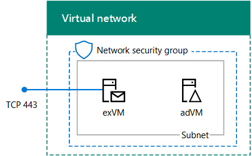
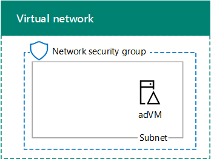

# Exchange 2016 dev/test environment in Azure

 **Summary:** Create a single-server Exchange 2016 dev/test environment in Microsoft Azure infrastructure services. 
  
This article steps you through creating an Exchange 2016 dev/test deployment in Microsoft Azure. Here is the resulting configuration.
  

  
This configuration consists of a single Exchange server and a Windows Server Active Directory (AD) domain controller in a subnet of an Azure virtual network. This provides a basis and common starting point from which you can demonstrate Exchange 2016 and develop Exchange Server applications. This configuration is only for internal email and application testing on the Exchange server. No external email flow is configured.
  
There are three major phases to setting up this dev/test environment:
  
1. Set up the virtual network and domain controller (adVM).
    
2. Add the Exchange 2016 server (exVM).
    
3. Configure Exchange 2016.
    
If you do not already have an Azure subscription, you can sign up for an [Azure Free Trial](https://azure.microsoft.com/pricing/free-trial/). If you have an MSDN or Visual Studio subscription, see [Monthly Azure credit for Visual Studio subscribers](https://azure.microsoft.com/pricing/member-offers/msdn-benefits-details/).
  
> [!NOTE]
> Because Exchange 2016 makes changes to the schema in Windows Server AD, this configuration cannot use Azure Active Directory Domain Services. 
  
## Phase 1: Deploy the virtual network and a domain controller

You can create a new Azure virtual network with a domain controller with Azure PowerShell. You can run the following PowerShell commands from a Windows PowerShell command prompt or in the PowerShell Integrated Script Environment (ISE). If you have not installed Azure PowerShell, see [Get started with Azure PowerShell cmdlets](https://docs.microsoft.com/powershell/azureps-cmdlets-docs/).
  
> [!NOTE]
> These commands are for Azure PowerShell 1.0.0 and later. For a text file that contains all the PowerShell commands in this article, click [here](https://gallery.technet.microsoft.com/scriptcenter/PowerShell-commands-for-5d0b899d). 
  
First, sign into your Azure account.
  
```
Login-AzureRMAccount
```

Get your subscription name using the following command.
  
```
Get-AzureRMSubscription | Sort SubscriptionName | Select SubscriptionName
```

Set your Azure subscription with the following commands. Set the **$subscr** variable by replacing everything within the quotes, including the \< and \> characters, with the correct name. 
  
```
$subscr="<subscription name>"
Get-AzureRmSubscription -SubscriptionName $subscr | Select-AzureRmSubscription
```

Next, create a new resource group. To determine a unique resource group name, use this command to list your existing resource groups.
  
```
Get-AzureRMResourceGroup | Sort ResourceGroupName | Select ResourceGroupName
```

Create your new resource group with these commands. Set the variables by replacing everything within the quotes, including the \< and \> characters, with the correct names.
  
```
$rgName="<resource group name>"
$locName="<location name, such as West US>"
New-AzureRMResourceGroup -Name $rgName -Location $locName
```

Resource Manager-based virtual machines require a Resource Manager-based storage account. You must pick a globally unique name for your storage account *that contains only lowercase letters and numbers* . You can use this command to list the existing storage accounts. 
  
```
Get-AzureRMStorageAccount | Sort StorageAccountName | Select StorageAccountName
```

Use this command to test whether a proposed storage account name is unique.
  
```
Get-AzureRmStorageAccountNameAvailability "<proposed name>"
```

Create a new storage account for your new test environment with these commands.
  
```
$rgName="<your new resource group name>"
$saName="<storage account name>"
$locName=(Get-AzureRmResourceGroup -Name $rgName).Location
New-AzureRMStorageAccount -Name $saName -ResourceGroupName $rgName -Type Standard_LRS -Location $locName
```

Next, you create the EX2016Vnet Azure Virtual Network that will host the EX2016Subnet subnet and protect it with a network security group.
  
```
$rgName="<name of your new resource group>"
$locName=(Get-AzureRmResourceGroup -Name $rgName).Location
$exSubnet=New-AzureRMVirtualNetworkSubnetConfig -Name EX2016Subnet -AddressPrefix 10.0.0.0/24
New-AzureRMVirtualNetwork -Name EX2016Vnet -ResourceGroupName $rgName -Location $locName -AddressPrefix 10.0.0.0/16 -Subnet $exSubnet -DNSServer 10.0.0.4
$rule1 = New-AzureRMNetworkSecurityRuleConfig -Name "RDPTraffic" -Description "Allow RDP to all VMs on the subnet" -Access Allow -Protocol Tcp -Direction Inbound -Priority 100 -SourceAddressPrefix Internet -SourcePortRange * -DestinationAddressPrefix * -DestinationPortRange 3389
$rule2 = New-AzureRMNetworkSecurityRuleConfig -Name "ExchangeSecureWebTraffic" -Description "Allow HTTPS to the Exchange server" -Access Allow -Protocol Tcp -Direction Inbound -Priority 101 -SourceAddressPrefix Internet -SourcePortRange * -DestinationAddressPrefix "10.0.0.5/32" -DestinationPortRange 443
New-AzureRMNetworkSecurityGroup -Name EX2016Subnet -ResourceGroupName $rgName -Location $locName -SecurityRules $rule1, $rule2
$vnet=Get-AzureRMVirtualNetwork -ResourceGroupName $rgName -Name EX2016Vnet
$nsg=Get-AzureRMNetworkSecurityGroup -Name EX2016Subnet -ResourceGroupName $rgName
Set-AzureRMVirtualNetworkSubnetConfig -VirtualNetwork $vnet -Name EX2016Subnet -AddressPrefix "10.0.0.0/24" -NetworkSecurityGroup $nsg
```

Next, we create the adVM virtual machine in Azure. adVM is a domain controller for the corp.contoso.com Windows Server AD domain and a DNS server for the virtual machines of the EX2016Vnet virtual network.
  
First, fill in the name of your resource group, Azure location, and storage account name and run these commands at the Azure PowerShell command prompt on your local computer to create an Azure virtual machine for adVM.
  
```
$rgName="<resource group name>"
# Create an availability set for domain controller virtual machines
New-AzureRMAvailabilitySet -ResourceGroupName $rgName -Name dcAvailabilitySet -Location $locName -Sku Aligned  -PlatformUpdateDomainCount 5 -PlatformFaultDomainCount 2
# Create the domain controller virtual machine
$vnet=Get-AzureRMVirtualNetwork -Name EX2016Vnet -ResourceGroupName $rgName
$pip = New-AzureRMPublicIpAddress -Name adVM-NIC -ResourceGroupName $rgName -Location $locName -AllocationMethod Dynamic
$nic = New-AzureRMNetworkInterface -Name adVM-NIC -ResourceGroupName $rgName -Location $locName -SubnetId $vnet.Subnets[0].Id -PublicIpAddressId $pip.Id -PrivateIpAddress 10.0.0.4
$avSet=Get-AzureRMAvailabilitySet -Name dcAvailabilitySet -ResourceGroupName $rgName 
$vm=New-AzureRMVMConfig -VMName adVM -VMSize Standard_D1_v2 -AvailabilitySetId $avSet.Id
$vm=Set-AzureRmVMOSDisk -VM $vm -Name adVM-OS -DiskSizeInGB 128 -CreateOption FromImage -StorageAccountType "StandardLRS"
$diskConfig=New-AzureRmDiskConfig -AccountType "StandardLRS" -Location $locName -CreateOption Empty -DiskSizeGB 20
$dataDisk1=New-AzureRmDisk -DiskName adVM-DataDisk1 -Disk $diskConfig -ResourceGroupName $rgName
$vm=Add-AzureRmVMDataDisk -VM $vm -Name adVM-DataDisk1 -CreateOption Attach -ManagedDiskId $dataDisk1.Id -Lun 1
$cred=Get-Credential -Message "Type the name and password of the local administrator account for adVM."
$vm=Set-AzureRMVMOperatingSystem -VM $vm -Windows -ComputerName adVM -Credential $cred -ProvisionVMAgent -EnableAutoUpdate
$vm=Set-AzureRMVMSourceImage -VM $vm -PublisherName MicrosoftWindowsServer -Offer WindowsServer -Skus 2012-R2-Datacenter -Version "latest"
$vm=Add-AzureRMVMNetworkInterface -VM $vm -Id $nic.Id
New-AzureRMVM -ResourceGroupName $rgName -Location $locName -VM $vm
```

You will be prompted for a user name and password. This article will refer to this user name as ADMIN_NAME. Use a strong password and record both in a secure location.
  
 **Note**: The password that you specify cannot be "pass@word1". It must be between 8-123 characters long and must satisfy at least 3 of the following password complexity requirements:
  
- Contains an uppercase letter
    
- Contains an lowercase letter
    
- Contains a numeric digit
    
- Contains a special character
    
It can take a few minutes for Azure to build the virtual machine.
  
### Connect to the domain controller virtual machine using local administrator account credentials

1. In the [Azure portal](https://portal.azure.com), click **Resource Groups \>** \<your resource group name\> **\> adVM \> Connect**.
    
2. Run the adVM.rdp file that is downloaded, and then click **Connect**.
    
3. In **Windows Security**, click **Use another account**. In **User name**, type **adVM\**\<ADMIN_NAME\>.
    
4. In **Password**, type the password of the ADMIN_NAME account, and then click **OK**.
    
5. When prompted, click **Yes**.
    
Next, add an extra data disk as a new volume with the drive letter F: with these commands at an administrator-level Windows PowerShell command prompt on adVM.
  
```
$disk=Get-Disk | where {$_.PartitionStyle -eq "RAW"}
$diskNumber=$disk.Number
Initialize-Disk -Number $diskNumber
New-Partition -DiskNumber $diskNumber -UseMaximumSize -AssignDriveLetter
Format-Volume -DriveLetter F
```

Next, configure adVM as a domain controller and DNS server for the corp.contoso.com domain. Run these commands at an administrator-level Windows PowerShell command prompt on adVM.
  
```
Install-WindowsFeature AD-Domain-Services -IncludeManagementTools
Install-ADDSForest -DomainName corp.contoso.com -DatabasePath "F:\NTDS" -SysvolPath "F:\SYSVOL" -LogPath "F:\Logs"

```

Note that these commands can take a few minutes to complete.
  
After adVM restarts, reconnect to the adVM virtual machine.
  
### Connect to the domain controller virtual machine using domain credentials

1. In the [Azure portal](https://portal.azure.com), click **Resource Groups \>** \<the name of your new resource group\> **\> adVM \> Connect**.
    
2. Run the adVM.rdp file that is downloaded, and then click **Connect**.
    
3. In **Windows Security**, click **Use another account**. In **User name**, type **CORP\**\<ADMIN_NAME\>.
    
4. In **Password**, type the password of the ADMIN_NAME account, and then click **OK**.
    
5. When prompted, click **Yes**.
    
From the desktop, open an administrator-level Windows PowerShell command prompt and run the following command:
  
```
Add-WindowsFeature RSAT-ADDS-Tools

```

Here is the result of Phase 1.
  

  
## Phase 2: Create the Exchange 2016 virtual machine

In this phase, you create an Exchange 2016 virtual machine in the EX2016VNet virtual network and make it a member of the CORP domain.
  
To create the Exchange 2016 virtual machine with Azure PowerShell, first log in to Azure with your Azure account from the Windows PowerShell command prompt (if needed).
  
```
Login-AzureRmAccount
```

You must determine a globally unique DNS name for the exVM virtual machine. You must pick a globally unique DNS name *that contains only lowercase letters and numbers* . You can do this with the following PowerShell commands: 
  
```
$vmDNSName="<DNS name to test>"
$rgName="<resource group name>"
$locName=(Get-AzureRmResourceGroup -Name $rgName).Location
Test-AzureRmDnsAvailability -DomainQualifiedName $vmDNSName -Location $locName
```

If you see "True", your proposed name is globally unique.
  
Next, fill in the variable values and run the resulting block at the PowerShell prompt.
  
```
# Set up key variables
$subscrName="<name of your Azure subscription>"
$rgName="<your resource group name>"
$vmDNSName="<unique, public DNS name for the Exchange server>"
# Set the Azure subscription
Get-AzureRmSubscription -SubscriptionName $subscrName | Select-AzureRmSubscription
# Get the Azure location and storage account names
$locName=(Get-AzureRmResourceGroup -Name $rgName).Location
$saName=(Get-AzureRMStorageaccount | Where {$_.ResourceGroupName -eq $rgName}).StorageAccountName
# Create an availability set for Exchange virtual machines
New-AzureRMAvailabilitySet -ResourceGroupName $rgName -Name exAvailabilitySet -Location $locName -Sku Aligned  -PlatformUpdateDomainCount 5 -PlatformFaultDomainCount 2
# Specify the virtual machine name and size
$vmName="exVM"
$vmSize="Standard_D3_v2"
$vnet=Get-AzureRMVirtualNetwork -Name "EX2016Vnet" -ResourceGroupName $rgName
$avSet=Get-AzureRMAvailabilitySet -Name exAvailabilitySet -ResourceGroupName $rgName 
$vm=New-AzureRMVMConfig -VMName $vmName -VMSize $vmSize -AvailabilitySetId $avSet.Id
# Create the NIC for the virtual machine
$nicName=$vmName + "-NIC"
$pipName=$vmName + "-PublicIP"
$pip=New-AzureRMPublicIpAddress -Name $pipName -ResourceGroupName $rgName -DomainNameLabel $vmDNSName -Location $locName -AllocationMethod Dynamic
$nic=New-AzureRMNetworkInterface -Name $nicName -ResourceGroupName $rgName -Location $locName -SubnetId $vnet.Subnets[0].Id -PublicIpAddressId $pip.Id -PrivateIpAddress "10.0.0.5"
# Create and configure the virtual machine
$cred=Get-Credential -Message "Type the name and password of the local administrator account for exVM."
$vm=Set-AzureRmVMOSDisk -VM $vm -Name ($vmName +"-OS") -DiskSizeInGB 128 -CreateOption FromImage -StorageAccountType "StandardLRS"
$vm=Set-AzureRMVMOperatingSystem -VM $vm -Windows -ComputerName $vmName -Credential $cred -ProvisionVMAgent -EnableAutoUpdate
$vm=Set-AzureRMVMSourceImage -VM $vm -PublisherName MicrosoftWindowsServer -Offer WindowsServer -Skus 2012-R2-Datacenter -Version "latest"
$vm=Add-AzureRMVMNetworkInterface -VM $vm -Id $nic.Id
New-AzureRMVM -ResourceGroupName $rgName -Location $locName -VM $vm

```

> [!NOTE]
> This command block uses a standard storage account created in phase 1 to reduce costs for this dev/test environment. For a production Exchange 2016 server, you must use a premium storage account. 
  
From the Azure portal, connect to the exVM virtual machine using the credentials of the local administrator account.
  
Next, join exVM to the Windows AD domain with these commands at a Windows PowerShell prompt.
  
```
Add-Computer -DomainName "corp.contoso.com"
Restart-Computer
```

Note that you must supply domain account credentials after entering the **Add-Computer** command. Use the CORP\\<ADMIN_NAME\> account and password. 
  
Here is the result of Phase 2.
  

  
## Phase 3: Configure Exchange 2016

In this phase, you configure Exchange 2016 on exVM and test mail delivery between two mailboxes.
  
### Prepare Windows Server AD

1. At the PowerShell command prompt on your local computer, run the following command:
    
  ```
  Write-Host (Get-AzureRMPublicIpaddress -Name "exVM-PublicIP" -ResourceGroup $rgName).DnsSettings.Fqdn
  ```

2. Note or copy the full DNS name from the display of the command. This is the Internet DNS name of the exVM virtual machine. You will need this value later.
    
3. If needed, connect to the adVM virtual machine with the Azure portal using the CORP\\<ADMIN_NAME\> account and password.
    
4. From the Start screen of adVM, type **Active Directory**, and then click **Active Directory Domains and Trusts**.
    
5. Right-click **Active Directory Domains and Trusts**, and then click **Properties**.
    
6. In **Alternative UPN suffixes**, type or copy the Internet DNS name of the exVM virtual machine from step 2, click **Add**, and then click **OK**.
    
7. Close the remote desktop session with adVM.
    
### Install Exchange 2016

1. Connect to the exVM virtual machine with the Azure portal using the CORP\\<ADMIN_NAME\> account and password.
    
2. From exVM, open an administrator-level Windows PowerShell command prompt and run the following commands.
    
  ```
  Install-WindowsFeature AS-HTTP-Activation, Desktop-Experience, NET-Framework-45-Features, RPC-over-HTTP-proxy, RSAT-Clustering, RSAT-Clustering-CmdInterface, RSAT-Clustering-Mgmt, RSAT-Clustering-PowerShell, Web-Mgmt-Console, WAS-Process-Model, Web-Asp-Net45, Web-Basic-Auth, Web-Client-Auth, Web-Digest-Auth, Web-Dir-Browsing, Web-Dyn-Compression, Web-Http-Errors, Web-Http-Logging, Web-Http-Redirect, Web-Http-Tracing, Web-ISAPI-Ext, Web-ISAPI-Filter, Web-Lgcy-Mgmt-Console, Web-Metabase, Web-Mgmt-Console, Web-Mgmt-Service, Web-Net-Ext45, Web-Request-Monitor, Web-Server, Web-Stat-Compression, Web-Static-Content, Web-Windows-Auth, Web-WMI, Windows-Identity-Foundation, RSAT-ADDS-Tools,
  Restart-Computer
  
  ```

3. Connect to the exVM virtual machine with the Azure portal using the CORP\\<ADMIN_NAME\> account and password.
    
4. From Server Manager, click **Local Server**. In the **Properties** for exVM, click **On** for **IE Enhanced Security Configuration**. In **Internet Explorer Enhanced Security Configuration**, click **Off** for both Administrators and Users, and then click **OK**.
    
5. From the Start screen, click **Internet Explorer**, and then download the Unified Communications Managed API 4.0 Runtime from [https://www.microsoft.com/download/details.aspx?id=34992](https://www.microsoft.com/download/details.aspx?id=34992). When prompted, click **Run**.
    
6. When prompted with the Microsoft Unified Communications Managed API 4.0, Runtime Setup, click **Next**.
    
7. Click **I have read and accept the license terms**, and then click **Install**. On the **Installation is Complete** page, click **Finish**.
    
8. From Internet Explorer, download the latest version of Exchange 2016 at [Updates for Exchange 2016](../../new-features/updates.md).
    
9. Click **Save** to store the ISO file in the Downloads folder. 
    
10. Click **Open Folder**, right-click the Exchange ISO file, and then click **Mount**.
    
11. From an administrator-level Windows PowerShell command prompt on exVM, run the following:
    
  ```
  e:
  .\setup.exe /mode:Install /role:Mailbox /OrganizationName:Contoso /IacceptExchangeServerLicenseTerms
  Restart-Computer
  ```

Wait until Exchange setup completes, which can take some time, and exVM restarts.
  
### Add two mailboxes to the Exchange server

1. Connect to the exVM virtual machine with the Azure portal using the CORP\\<ADMIN_NAME\> account and password.
    
2. From the Start screen, type **Exchange**, and then click **Exchange Management Shell**.
    
3. Copy the following commands to Notepad, insert the Internet DNS name of the exVM virtual machine for the **$dnsName** variable, and then copy and paste the resulting commands into the Exchange Management Shell. 
    
  ```
  $dnsName="<Internet DNS name of the exVM virtual machine>"
  $user1Name="chris@" + $dnsName
  $user2Name="janet@" + $dnsName
  $db=Get-MailboxDatabase
  $dbName=$db.Name
  $password = Read-Host "Enter password" -AsSecureString
  ```

4. Record the password specified in a safe place. Next, run these commands to create two mailboxes.
    
  ```
  New-Mailbox -UserPrincipalName $user1Name -Alias chris -Database $dbName -Name ChrisAshton -OrganizationalUnit Users -Password $password -FirstName Chris -LastName Ashton -DisplayName "Chris Ashton"
  New-Mailbox -UserPrincipalName $user2Name -Alias janet -Database $dbName -Name JanetSchorr -OrganizationalUnit Users -Password $password -FirstName Janet -LastName Schorr -DisplayName "Janet Schorr"
  ```

### Test email delivery between mailboxes

1. From the browser on your local computer, access the web site **https://**\<Internet DNS name of the exVM virtual machine\> **/owa**. When prompted with an error page for the website's security certificate, click **Continue to this website**. On the Outlook sign-in page, use the corp\chris account name with its password.
    
2. When prompted to specify the language and time zone, select the appropriate value for each, and then click **Save**.
    
3. From Chris Ashton's inbox, click **New**. In **To**, type **janet** and then click **Search Directory**. For **Subject**, type **Test message**, and then click **Send**.
    
4. Click the user icon in the upper right part of the Mail web page, and then click **Sign out**.
    
5. On the Outlook sign-in page, use the corp\janet account name with its password. When prompted to specify the language and time zone, select the appropriate value for each, and then click **Save**.
    
6. Verify that the inbox contains the test message from Chris Ashton. Click it, then click **Reply all**. In the body of the message, type **Replied**, and then click **Send**.
    
7. Click the user icon in the upper right part of the Mail web page, and then click **Sign out**.
    
8. On the Outlook sign-in page, use the corp\chris account name with its password. Verify that the reply email message sent from Janet is in the inbox.
    
You are now ready to test Exchange 2016 features or applications.
  
## Stop and start the virtual machines

Azure virtual machines incur an ongoing cost when they are running. To help minimize the cost of your Exchange 2016 dev/test environment, use these commands to stop the virtual machines:
  
```
$rgName="<your resource group name>"
Stop-AzureRMVM -Name exVM -ResourceGroupName $rgName -Force
Stop-AzureRMVM -Name adVM -ResourceGroupName $rgName -Force
```

To start them again, use these commands:
  
```
$rgName="<your resource group name>"
Start-AzureRMVM -Name adVM -ResourceGroupName $rgName
Start-AzureRMVM -Name exVM -ResourceGroupName $rgName
```

## See also

[Deploy a new installation of Exchange 2016](deploy-new-installations.md)
  
[Exchange 2016 system requirements](../../plan-and-deploy/system-requirements.md)
  
[Exchange Server 2016](../../exchange-server.md)
  
[What's new in Exchange 2016](../../new-features/new-features.md)

[Cloud adoption Test Lab Guides (TLGs)](https://technet.microsoft.com/library/dn635308.aspx)

