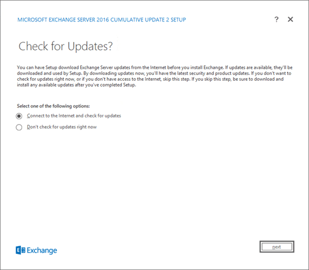
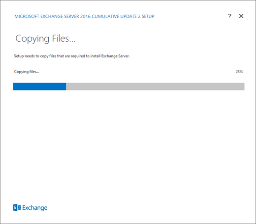
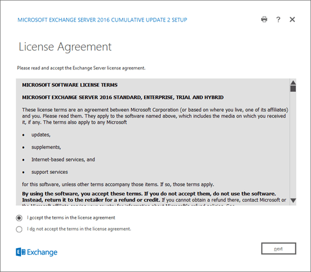
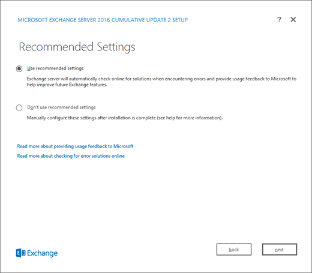
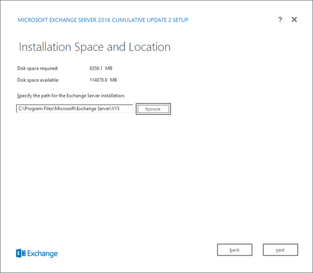
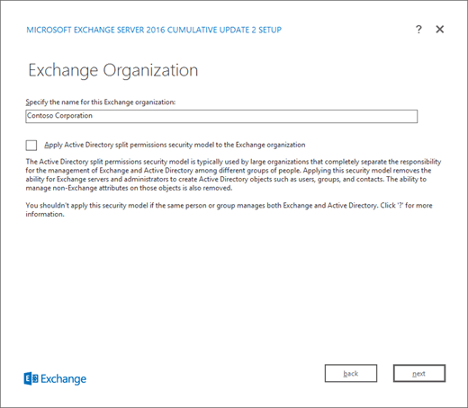
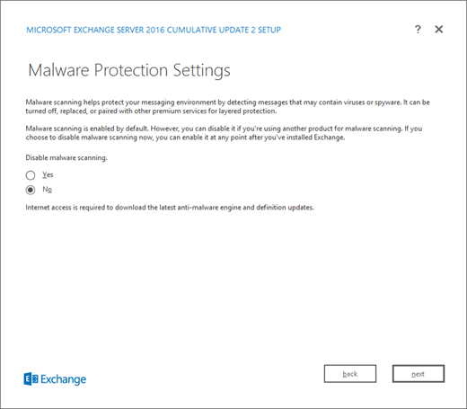
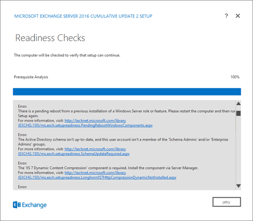
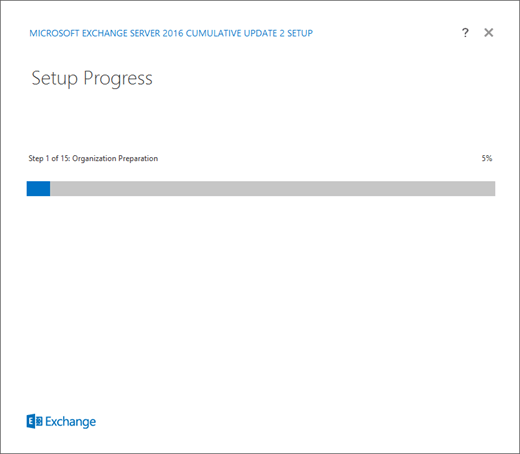
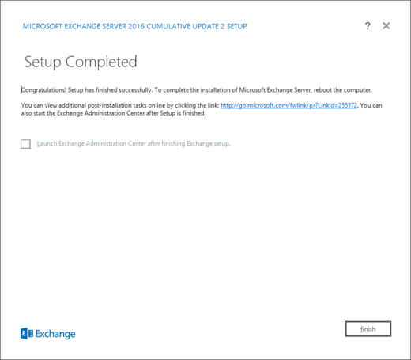

# Install the Exchange 2016 Mailbox role using the Setup wizard

 **Summary**: How to use the Exchange Server 2016 Setup wizard to install the Exchange 2016 Mailbox role on a computer
  
Before you install the Exchange Server 2016 Mailbox role, verify the following prerequisites:
  
- Verify the Active Directory, network, computer hardware, operating system, and software requirements at [Exchange 2016 system requirements](../../plan-and-deploy/system-requirements.md) and [Exchange 2016 prerequisites](../../plan-and-deploy/prerequisites.md).
    
- Verify the following permissions for the account that you're using to install Exchange 2016:
    
  - **Enterprise Admins group membership**: Required if this is the first Exchange 2016 server in the organization.
    
  - **Schema Admins group membership**: Required if you haven't previously prepared the Active Directory schema.
    
  - **Exchange Organization role group membership**: Required if you've already prepared the Active Directory schema, or if other Exchange 2016 servers already exist in the organization.
    
    Note that members of the Delegated Setup role group can also deploy Exchange 2016 servers that have already been provisioned by members of the Organization Management role group.
    
- Verify that you've read the release notes at [Release notes for Exchange 2016](../../release-notes.md).
    
For more information about planning for Exchange 2016, see [Planning and deployment](../../plan-and-deploy/plan-and-deploy.md).
  
To install the Exchange 2016 Edge Transport role on a computer, see [Install the Exchange 2016 Edge Transport role using the Setup wizard](install-edge-transport-role.md). Note that you can't install the Edge Transport role on a Mailbox server.
  
For information about tasks to do after you've installed Exchange 2016, see [Exchange 2016 post-installation tasks](../../plan-and-deploy/post-installation-tasks/post-installation-tasks.md).
  
## What do you need to know before you begin?

- Estimated time to complete: 60 minutes
    
- For information about keyboard shortcuts that may apply to the procedures in this topic, see [Keyboard shortcuts in the Exchange admin center](../../about-documentation/exchange-admin-center-keyboard-shortcuts.md).
    
> [!CAUTION]
> After you install Exchange 2016 on a server, you must not change the server name. Renaming a server after you have installed an Exchange 2016 server role is not supported. 
  
## Install Exchange Server 2016

1. Use the information in [Updates for Exchange 2016](../../new-features/updates.md) to download the latest version of Exchange 2016 on the computer where you want to install Exchange. 
    
2. In File Explorer, right-click on the Exchange ISO image file that you downloaded, and then select **Mount**. In the resulting virtual DVD drive that appears, start Exchange 2016 Setup by double-clicking  `Setup.exe`.
    
3. The Exchange Server 2016 Setup wizard opens. On the **Check for Updates?** page, choose one of the following options, and then click **Next** to continue: 
    
  - **Connect to the Internet and check for updates**: We recommend this option, which searches for updates to the version of Exchange 2016 that you're installing (it doesn't detect newer Exchange 2016 Cumulative Updates). This option takes you to the **Downloading Updates** page that searches for updates. Click **Next** to continue. 
    
  - **Don't check for updates right now**
    

  
4. The **Copying Files** page shows the progress of copying files to the local hard drive. Typically, the files are copied to  `%WinDir%\Temp\ExchangeSetup`, but you can confirm the location in the Exchange Setup log at  `C:\ExchangeSetupLogs\ExchangeSetup.log`.
    
  
5. On the **Introduction** page, we recommend that you visit the Exchange Server 2016 deployment planning links if you haven't already reviewed them. Click **Next** to continue. 
    
  
6. On the **License Agreement** page, review the software license terms, select **I accept the terms in the license agreement**, and then click **Next** to continue. 
    
  
7. On the **Recommended Settings** page, choose one of the following settings: 
    
  - **Use recommended settings**: Exchange automatically sends error reports and information about your computer hardware and how you use Exchange to Microsoft. For information about what's sent to Microsoft and how it's used, click **?** or the help links on the page. 
    
  - **Don't use recommended settings**: These settings are disabled, but you can enable them at any time after Setup completes.
    
    Click **Next** to continue. 
    
  
8. On the **Server Role Selection** page, configure the following options: 
    
  - **Mailbox role**: Select this option, which also automatically installs the **Management Tools**.
    
  - **Automatically install Windows Server roles and features that are required to install Exchange**: Select this option to have the Setup wizard install the required Windows prerequisites. You might need to reboot the computer to complete the installation of some Windows features. If you don't select this option, you need to install the Windows features manually.
    
    **Note**: Selecting this option installs only the Windows features that are required by Exchange. You need to install other prerequisites manually. For more information, see [Exchange 2016 prerequisites](../../plan-and-deploy/prerequisites.md).
    
    Click **Next** to continue. 
    
  
9. On the **Installation Space and Location** page, either accept the default installation location (  `C:\Program Files\Microsoft\Exchange Server\V15`), or click **Browse** to choose a new location. Make sure that you have enough disk space available in the location where you want to install Exchange. Click **Next** to continue. 
    
  
10. If this is the first Exchange server in your organization, you arrive on the **Exchange Organization** page. On this page, configure the following settings: 
    
  - **Specify the name for this Exchange organization**: The default value is **First Organization**, but you typically use the company name for this value. The organization name is used internally by Exchange, isn't typically seen by users, doesn't affect the functionality of Exchange, and doesn't determine what you can use for email addresses.
    
  - The organization name can't contain more than 64 characters, and can't be blank.
    
  - Valid characters are A to Z, a to z, 0 to 9, hyphen or dash (-), and space, but leading or trailing spaces aren't allowed.
    
  - You can't change the organization name after it's set.
    
  - **Apply Active Directory split permission security model to the Exchange organization**: Most organizations don't need to select this option. If you need to separate management of Active Directory security principals and the Exchange configuration, split permissions might work for you. For more information, click **?**.
    
    Click **Next** to continue. 
    
  
11. On the **Malware Protection Settings** page, choose whether you want disable malware scanning. Malware scanning is enabled by default (the value **No** is selected). If you disable malware scanning, you can enable it in the future. Click **Next** to continue. 
    
  
12. On the **Readiness Checks** page, verify that the organization and server role prerequisite checks completed successfully. If they haven't, the only option on the page is **Retry**, so you need to resolve the errors before you can continue.
    
  
    After you resolve the errors, click **Retry** to run the prerequisite checks again. You can fix some errors without exiting Setup, while the fix for other errors requires you to restart the computer. If you restart the computer, you need to start over at Step 1. 
    
    When no more errors are detected on the **Readiness Checks** page, the **Retry** button changes to **Install** so you can continue. Be sure to review any warnings, and then click **Install** to install Exchange 2016. 
    
  
13. On the **Setup Progress** page, a progress bar indicates how the installation is proceeding. 
    
  
14. On the **Setup Completed** page, click **Finish**, and then restart the computer.
    
  
## Next steps

- To verify that you've successfully installed Exchange 2016, see [Verify an Exchange 2016 installation](../../plan-and-deploy/post-installation-tasks/verify-installation.md).
    
    Having problems? Ask for help in the Exchange forums. Visit the forums at: [Exchange Server](https://go.microsoft.com/fwlink/p/?linkId=60612), [Exchange Online](https://go.microsoft.com/fwlink/p/?linkId=267542), or [Exchange Online Protection](https://go.microsoft.com/fwlink/p/?linkId=285351).
    
    Did you find what you're looking for? Please take a minute to [send us feedback](mailto:ExchangeHelpFeedback@microsoft.com&amp;subject=Exchange%202016%20help%20feedback&amp;Body=Thanks%20for%20taking%20the%20time%20to%20send%20us%20feedback!%20We%20strive%20to%20respond%20to%20every%20message%20we%20receive,%20even%20though%20it%20might%20take%20us%20a%20while.%20Let%20us%20know%20what%20you%20think%20about%20Exchange%20content:%20What%20are%20we%20doing%20right%3F%20How%20can%20we%20make%20help%20better%3F%0APlease%20note%20that%20we're%20unable%20to%20respond%20to%20requests%20for%20support%20submitted%20via%20this%20email%20address.%20If%20you%20need%20help,%20please%20contact%20Exchange%20Server%20support%20at%20http://go.microsoft.com/fwlink/p/%3FLinkId=402506.%0AThanks!%0AThe%20Exchange%20Server%20Content%20Publishing%20team) about the information you were hoping to find. 
    
- Complete your deployment by performing the tasks provided in [Exchange 2016 post-installation tasks](../../plan-and-deploy/post-installation-tasks/post-installation-tasks.md).
    

