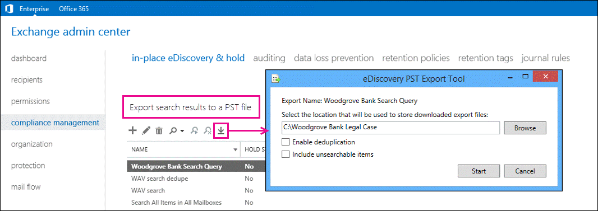

# Export eDiscovery search results to a PST file

 **Summary**: Learn how to export the results of In-Place eDiscovery searches to .PST files in Exchange 2016.
  
You can use the eDiscovery Export tool in the Exchange admin center (EAC) to export the results of an In-Place eDiscovery search to an Outlook Data File, which is also called a PST file. Search results will contain items from mailboxes and public folders, depending on the content sources from the eDiscovery search. This lets you distribute search results to other people within your organization, such as a human resources manager or records manager, or to opposing counsel in a legal case. After search results are exported to a PST file, you or other users can open them in Outlook to review or print messages returned in the search results. PST files can also be opened in third-party eDiscovery and reporting applications.
  
## What do you need to know before you begin?

- The amount of time it takes to export search results will vary based on the amount and size of the search results that will be exported.
    
- You need to be assigned permissions before you can perform this procedure or procedures. To see what permissions you need, see the "In-Place eDiscovery" entry in the [Messaging policy and compliance permissions in Exchange 2016](../../permissions/feature-permissions/policy-and-compliance-permissions.md) topic. 
    
- You'll need an active mail account attached to the account you wish to export.
    
- The computer you use to export search results to a PST file needs to meet the following system requirements:
    
  - 32- and 64-bit versions of Windows 7 and later versions
    
  - Microsoft .NET Framework 4.7
    
  - A supported browser:
    
  - Internet Explorer 8 and later versions
    
    OR
    
  - Mozilla Firefox or Google Chrome, with the ClickOnce add-in installed
    
## Use the EAC to export In-Place eDiscovery search results to a PST file

1. In the EAC, go to **Compliance management** \> **In-Place eDiscovery & Hold**.
    
2. In the list view, select the eDiscovery search you want to export the results of, and then click **Export to a PST file**.
    
  
3. In the **eDiscovery PST Export Tool** window, do the following: 
    
  - Click **Browse** to specify the location where you want to download the PST file. 
    
  - Click the **Enable deduplication** checkbox to exclude duplicate messages. Only a single instance of a message will be included in the PST file. 
    
  - Click the **Include unsearchable items** checkbox to include items that couldn't be searched (for example, messages with attachments of file types that couldn't be indexed by Exchange Search). Unsearchable items are exported to a separate PST file. 
    
    **Note**: Including unsearchable items when you export eDiscovery search results takes longer when mailboxes or public folders contain a lot of unsearchable items. To reduce the time it takes to export search results and prevent large PST export files, consider the following recommendations:
    
  - Create multiple eDiscovery searches that each search a fewer number of source mailboxes.
    
  - Create an eDiscovery search that only includes public folders.
    
  - If you're exporting all mailbox or public folder content within a specific date range (by not specifying any keywords in the search criteria), then all unsearchable items within that date range will be automatically included in the search results. Therefore, don't select the **Include unsearchable items** checkbox. 
    
4. Click **Start** to export the search results to a PST file. 
    
    A window is displayed that contains status information about the export process.
    
## More information

- Another way to reduce the size of PST export files is to export only the unsearchable items for an eDiscovery search. To do this, create or edit a search, specify a start date in the future, and then remove any keywords from the **Keywords** box. This will result in no search results being returned. When you copy or export the search results and select the **Include unsearchable items** checkbox, only the unsearchable items will be copied to the discovery mailbox or exported to a PST file. 
    
- If you enable deduplication, all search results are exported in a single PST file. If you don't enable deduplication, a separate PST file is exported for each mailbox (including public folder mailboxes if the search includes public folders) that contains search results. And as previously stated, unsearchable items are exported to a separate PST file.
    
- In addition to the PST files that contain the search results, two other files are also exported:
    
  - A configuration file (.txt file format) that contains information about the PST export request, such as the name of the eDiscovery search that was exported, the date and time of the export, whether de-duplication and unsearchable items were enabled, the search query, and the content sources that were searched.
    
  - A search results log (.csv file format) that contains an entry for each message returned in the search results. Each entry identifies the content source where the message is located. If you've enabled de-duplication, this helps you identify all mailboxes or public folders that contain a duplicate message.
    
- The name of the search is the first part of the filename for each file that is exported. Also, the date and time of the export request is appended to the filename of each PST file and the results log.
    

