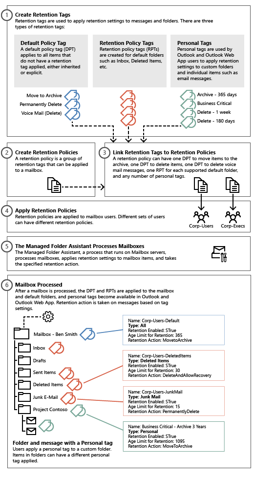
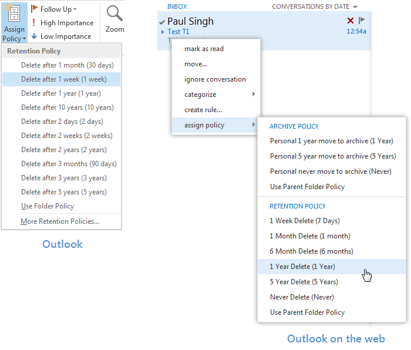

# Retention tags and retention policies in Exchange 2016

 **Summary**: Learn about how retention tags and retention policies in Exchange 2016 help manage the email life cycle.
  
Messaging records management (MRM) helps organizations to manage email lifecycle and reduce legal risks associated with email and other communications. MRM makes it easier to keep messages needed to comply with company policy, government regulations, or legal needs, and to remove content that has no legal or business value.
  
## Messaging records management strategy

MRM in Exchange 2016 is accomplished by using  *retention tags*  and  *retention policies*  . Before discussing the details about each of these retention features, let's learn how the features are used in the overall MRM strategy: 
  
- Assigning  *retention policy tags*  (RPTs) to default folders, such as the Inbox and Deleted Items. 
    
- Applying  *default policy tags*  (DPTs) to mailboxes to manage the retention of all untagged items. 
    
- Allowing the user to assign  *personal tags*  to custom folders and individual items. 
    
- Separating MRM functionality from users' Inbox management and filing habits. Users aren't required to file messages in managed folders based on retention requirements. Individual messages can have a different retention tag than the one applied to the folder in which they're located.
    
The following figure illustrates the tasks involved in implementing this strategy.
  

  
## Retention tags

As you can see, retention tags are used to apply retention settings to folders and individual items such as email messages and voice mail. These settings specify how long a message remains in a mailbox and the action to take when the message reaches the specified retention age. When a message reaches its retention age, it's moved to the user's In-Place Archive or deleted.
  

  
Retention tags allow users to tag their own mailbox folders and individual items for retention. Users no longer have to file items in managed folders provisioned by an administrator based on message retention requirements.
  
### Types of retention tags

Retention tags are classified into the following three types based on who can apply them and where in a mailbox they can be applied.
  
|**Type of retention tag**|**Applied...**|**Applied by...**|**Available actions…**|**Details**|
|:-----|:-----|:-----|:-----|:-----|
|Default policy tag (DPT)    |Automatically to entire mailbox    A DPT applies to  *untagged*  items, which are mailbox items that don't have a retention tag applied directly or by inheritance from the folder.    |Administrator    |Move to archive    Delete and allow recovery    Permanently delete    |Users can't change DPTs applied to a mailbox.    |
|Retention policy tag (RPT)    |Automatically to a default folder    Default folders are folders created automatically in all mailboxes, for example: **Inbox**, **Deleted Items**, and **Sent Items**. See the list of supported default folders in [Default folders that support Retention Policy Tags](http://technet.microsoft.com/library/d2e2064f-4102-4018-b688-504d09da6d39.aspx).    |Administrator    |Delete and allow recovery    Permanently delete    |Users can't change the RPT applied to a default folder.    |
|Personal tag    |Manually to items and folders    Users can automate tagging by using Inbox rules to either move a message to a folder that has a particular tag or to apply a personal tag to the message.    |Users    |Move to archive    Delete and allow recovery    Permanently delete    |Personal tags allow your users to determine how long an item should be retained. For example, the mailbox can have a DPT to delete items in seven years, but a user can create an exception for items such as newsletters and automated notifications by applying a personal tag to delete them in three days.    |
   
### More about personal tags

Personal tags are available to Outlook and Outlook on the web users as part of their retention policy. In Outlook and Outlook on the web, personal tags with the **Move to Archive** action appear as **Archive Policy**, and personal tags with the **Delete and Allow Recovery** or **Permanently Delete** actions appear as **Retention Policy**, as shown here:
  

  
Users can apply personal tags to folders they create or to individual items. Messages that have a personal tag applied are always processed based on the personal tag's settings. Users can apply a personal tag to a message so that it's moved or deleted sooner or later than the settings specified in the DPT or RPTs applied to that user's mailbox. You can also create personal tags with retention disabled. This allows users to tag items so they're never moved to an archive or never expire.
  
> [!NOTE]
> Users can apply archive policies to default folders, user-created folders or subfolders, and individual items. Users can apply a retention policy to user-created folders or subfolders and individual items (including subfolders and items in a default folder), but not to default folders. 
  
Users can also use the Exchange admin center (EAC) to select additional personal tags that aren't linked to their retention policy. The selected tags then become available in Outlook and Outlook on the web. To enable users to select additional tags from the EAC, you must add the [MyRetentionPolicies Role](http://technet.microsoft.com/library/65f49d19-cfb5-4142-8359-8368d5c48085.aspx) to the user's role assignment policy. To learn more about role assignment policies for users, see [Understanding Management Role Assignment Policies](http://technet.microsoft.com/library/25913e43-326a-4371-90b5-021a35f100fe.aspx). If you allow users to select additional personal tags, all personal tags in your Exchange organization become available to them.
  
> [!NOTE]
> Personal tags are a premium feature. Mailboxes with policies that contain these tags (or as a result of users adding the tags to their mailbox) require an Exchange Enterprise client access license (CAL). 
  
### Retention age

When you enable a retention tag, you must specify a retention age for the tag. This age indicates the number of days to retain a message after it arrives in the user's mailbox.
  
The retention age for non-recurring items (such as email messages) is calculated differently than items that have an end date or recurring items (such as meetings and tasks). To learn how retention age is calculated for different types of items, see [How retention age is calculated in Exchange 2016](retention-age.md).
  
You can also create retention tags with retention disabled or disable tags after they're created. Because messages that have a disabled tag applied aren't processed, no retention action is taken. As a result, users can use a disabled personal tag as a **Never Move** tag or a **Never Delete** tag to override a DPT or RPT that would otherwise apply to the message. 
  
### Retention actions

When creating or configuring a retention tag, you can select one of the following retention actions to be taken when an item reaches its retention age:
  
|**Retention action**|**Action taken…**|**Except…**|
|:-----|:-----|:-----|
|**Move to archive**   |Moves the message to the user's archive mailbox    Only available for DPTs and personal tags    For details about archiving, see [In-Place Archiving in Exchange 2016](../../policy-and-compliance/in-place-archiving/in-place-archiving.md).    |If the user doesn't have an archive mailbox, no action is taken.    |
|**Delete and allow recovery**:    |Emulates the behavior when the user empties the Deleted Items folder.    Items are moved to the [Recoverable Items folder in Exchange 2016](../../policy-and-compliance/recoverable-items-folder/recoverable-items-folder.md) in the mailbox and preserved until the  *deleted item retention*  period.    Provides the user a second chance to recover the item using the **Recover Deleted Items** dialog box in Outlook or Outlook on the web    |If you've set the deleted item retention period to zero days, items are permanently deleted. For details, see [Configure Deleted Item retention and Recoverable Items quotas](../../recipients/user-mailboxes/deleted-item-retention-and-recoverable-items-quotas.md).    |
|**Permanently delete**   |Permanently deletes messages.    You can't recover messages after they're permanently deleted.    |If mailbox is placed on [In-Place Hold and Litigation Hold in Exchange 2016](../../policy-and-compliance/holds/holds.md) or Litigation Hold, items are preserved in the Recoverable Items folder based on hold parameters. [In-Place eDiscovery in Exchange 2016](../../policy-and-compliance/ediscovery/ediscovery.md) will still return these items in search results.    |
|**Mark as past retention limit**   |Marks a message as expired. In Outlook, and Outlook on the web, expired items are displayed with the notification stating 'This item has expired' and 'This item will expire in 0 days'.    |N. A.    |
   
For details about how to create retention tags, see [Create a retention policy in Exchange 2016](create-retention-policies.md).
  
## Retention policies

To apply one or more retention tags to a mailbox, you need to add them to a retention policy and then apply the policy to mailboxes. A mailbox can't have more than one retention policy. Retention tags can be linked to or unlinked from a retention policy at any time, and the changes automatically take effect for all mailboxes that have the policy applied.
  
A retention policy can have the following retention tags:
  
|**Retention tag type**|**Tags in a policy**|
|:-----|:-----|
|Default policy tag (DPT)    |One DPT with the **Move to archive** action    One DPT with the **Delete and allow Rrecovery** or **Permanently delete** actions    One DPT for voice mail messages with the **Delete and allow recovery** or **Permanently delete** action    |
|Retention policy tags (RPTs)    |One RPT for each supported default folder    **Note**: You can't link more than one RPT for a particular default folder (such as **Deleted Items**) to the same retention policy.    |
|Personal tags    |Any number of personal tags    **Note**: Many personal tags in a policy can confuse users. We recommend adding no more than 10 personal tags to a retention policy.    |
   
> [!NOTE]
> Although a retention policy doesn't need to have any retention tags linked to it, we don't recommend using this scenario. If mailboxes with retention policies don't have retention tags linked to them, this may cause mailbox items to never expire. 
  
A retention policy can contain both archive tags (tags that move items to the personal archive mailbox) and deletion tags (tags that delete items). A mailbox item can also have both types of tags applied. Archive mailboxes don't have a separate retention policy. The same retention policy is applied to the primary and archive mailbox.
  
When planning to create retention policies, you must consider whether they'll include both archive and deletion tags. As mentioned earlier, a retention policy can have one DPT that uses the **Move to archive** action and one DPT that uses either the **Delete and allow recovery** or **Permanently delete** action. The DPT with the **Move to archive** action must have a lower retention age than the DPT with a deletion action. For example, you can use a DPT with the **Move to archive** action to move items to the archive mailbox in two years, and a DPT with a deletion action to remove items from the mailbox in seven years. Items in both primary and archive mailboxes will be deleted after seven years. 
  
### Default retention policy

Exchange Setup creates the retention policy **Default MRM Policy**. The policy is applied automatically if you create an archive for the new user and don't specify a retention policy
  
You can modify tags included in the Default MRM Policy, for example by changing the retention age or retention action, disable a tag or modify the policy by adding or removing tags from it. The updated policy is applied to mailboxes the next time they're processed by the [Managed Folder Assistant](retention-tags-and-retention-policies.md#MFA).
  
For more details, including a list of retention tags linked to the policy, see [Default Retention Policy](http://technet.microsoft.com/library/bcf31b2d-463b-4623-b488-c8ac40f14f62.aspx).
  
## Managed Folder Assistant

The Managed Folder Assistant, a mailbox assistant that runs on Mailbox servers, processes mailboxes that have a retention policy applied.
  
The Managed Folder Assistant applies the retention policy by inspecting items in the mailbox and determining whether they're subject to retention. It then stamps items subject to retention with the appropriate retention tags and takes the specified retention action on items past their retention age.
  
The Managed Folder Assistant is a throttle-based assistant. Throttle-based assistants are always running and don't need to be scheduled. The system resources they can consume are throttled. You can configure the Managed Folder Assistant to process all mailboxes on a Mailbox server within a certain period (known as a  *work cycle*  ). Additionally, at a specified interval (known as the  *work cycle checkpoint*  ), the assistant refreshes the list of mailboxes to be processed. During the refresh, the assistant adds newly created or moved mailboxes to the queue. It also reprioritizes existing mailboxes that haven't been processed successfully due to failures and moves them higher in the queue so they can be processed during the same work cycle. 
  
You can also use the [Start-ManagedFolderAssistant](http://technet.microsoft.com/library/75d840ea-5abc-44bb-b361-e81561fa1b04.aspx) cmdlet to manually trigger the assistant to process a specified mailbox. To learn more, see [Configure and run the Managed Folder Assistant in Exchange 2016](configure-managed-folder-assistant.md).
  
> [!NOTE]
> The Managed Folder Assistant doesn't take any action on messages that aren't subject to retention, specified by disabling the retention tag. You can also disable a retention tag to temporarily suspend items with that tag from being processed. 
  
### Moving items between folders

A mailbox item moved from one folder to another inherits any tags applied to the folder to which it's moved. If an item is moved to a folder that doesn't have a tag assigned, the DPT is applied to it. If the item has a tag explicitly assigned to it, the tag always takes precedence over any folder-level tags or the default tag.
  
### Applying a retention tag to a folder in the archive

When the user applies a personal tag to a folder in the archive, if a folder with the same name exists in the primary mailbox and has a different tag, the tag on that folder in the archive changes to match the one in the primary mailbox. This is by design to avoid any confusion about items in a folder in the archive having a different expiry behavior than the same folder in the user's primary mailbox. For example, the user has a folder named Project Contoso in the primary mailbox with a  *Delete - 3 years*  tag and a Project Contoso folder also exists in the archive mailbox. If the user applies a  *Delete - 1 year*  personal tag to delete items in the folder after 1 year. When the mailbox is processed again, the folder reverts to the Delete - 3 Years tag. 
  
### Removing or deleting a retention tag from a retention policy

When a retention tag is removed from the retention policy applied to a mailbox, the tag is no longer available to the user and can't be applied to items in the mailbox.
  
Existing items that have been stamped with that tag continue to be processed by the Managed Folder Assistant based on those settings and any retention action specified in the tag is applied to those messages.
  
However, if you delete the tag, the tag definition stored in Active Directory is removed. This causes the Managed Folder Assistant to process all items in a mailbox and restamp the ones that have the removed tag applied. Depending on the number of mailboxes and messages, this process may significantly consume resources on all Mailbox servers that contain mailboxes with retention policies that include the removed tag.
  
> [!IMPORTANT]
> If a retention tag is removed from a retention policy, any existing mailbox items with the tag applied will continue to expire based on the tag's settings. To prevent the tag's settings from being applied to any items, you should delete the tag. Deleting a tag removes it from any retention policies where it's included. 
  
### Disabling a retention tag

If you disable a retention tag, the Managed Folder Assistant ignores items that have that tag applied. Items that have a retention tag for which retention is disabled are either never moved or never deleted, depending on the specified retention action. Because these items are still considered tagged items, the DPT doesn't apply to them. For example, if you want to troubleshoot retention tag settings, you can temporarily disable a retention tag to stop the Managed Folder Assistant from processing messages with that tag.
  
> [!NOTE]
> The retention period for a disabled retention tag is displayed to the user as **Never**. If a user tags an item believing it will never be deleted, enabling the tag later may result in unintentional deletion of items the user didn't want to delete. The same is true for tags with the **Move to archive** action. 
  
## Retention hold

When users are temporarily away from work and don't have access to their email, retention settings can be applied to new messages before they return to work or access their email. Depending on the retention policy, messages may be deleted or moved to the user's personal archive. You can temporarily suspend retention policies from processing a mailbox for a specified period by placing the mailbox on retention hold. When you place a mailbox on retention hold, you can also specify a retention comment that informs the mailbox user (or another user authorized to access the mailbox) about the retention hold, including when the hold is scheduled to begin and end. Retention comments are displayed in supported Outlook clients. You can also localize the retention hold comment in the user's preferred language.
  
> [!NOTE]
> Placing a mailbox on retention hold doesn't affect how mailbox storage quotas are processed. Depending on the mailbox usage and applicable mailbox quotas, consider temporarily increasing the mailbox storage quota for users when they're on vacation or don't have access to email for an extended period. For more information about mailbox storage quotas, see [Configure storage quotas for a mailbox](../../recipients/user-mailboxes/storage-quotas.md). 
  
During long absences from work, users may accrue a large amount of email. Depending on the volume of email and the length of absence, it may take these users several weeks to sort through their messages. In these cases, consider the additional time it may take the users to catch up on their mail before removing them from retention hold.
  
If your organization has never implemented MRM, and your users aren't familiar with its features, you can also use retention holds during the initial  *warm up and training*  phase of your MRM deployment. You can create and deploy retention policies and educate users about the policies without the risk of having items moved or deleted before users can tag them. A few days before the warm up and training period ends, you should remind users of the warm-up deadline. After the deadline, you can remove the retention hold from user mailboxes, allowing the Managed Folder Assistant to process mailbox items and take the specified retention action. 
  
For details about how to place a mailbox on retention hold, see [Place a Mailbox on Retention Hold](http://technet.microsoft.com/library/2baac4a7-3402-4142-bfb3-1649a950e677.aspx).
  

