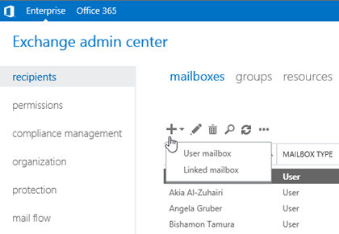

# Create user mailboxes in Exchange 2016

 **Summary**: Learn how to create mailboxes for users in Exchange 2016 .

User mailboxes are Exchange mailboxes that are associated with people, typically one mailbox per person. Each user mailbox has an associated Active Directory account that gives the person access to the mailbox to send and receive email messages, and create meetings and appointments.

When you create a new user mailbox in Exchange, you also create the corresponding Active Directory user at the same time. Or, you can create a new mailbox for an existing Active Directory account that doesn't have an associated mailbox. This is known as *mailbox-enabling* an existing user. 

You can create user mailboxes in Exchange Server 2016 by using the Exchange admin center (EAC) or the Exchange Management Shell. The following table describes some of the important properties for user mailboxes.

|**Property**|**Required or optional**|**Description**|
|:-----|:-----|:-----|
|Alias  <br/> |Optional  <br/> |The Exchange alias (also known as the *mail nickname*) for the mailbox. The maximum length is 64 characters. Valid characters are letters, numbers and ASCII text characters that are allowed in email addresses. For example, periods are allowed, but each period must be surrounded by other valid characters (for example, pilar.pinilla).  <br/>  The alias value is used to generate the primary email address (_\<alias\>_@ _\<domain\>_). If you don't specify an alias value, the user name part of the account name (user principal name) is used.  <br/> The alias value must be unique.  <br/> **Note**: Don't use apostrophes (') or quotation marks (") in the alias. Although these characters are allowed, they might cause problems later.  <br/> |
|Display name  <br/> |EAC: Required  <br/> Exchange Management Shell: Optional  <br/> |Identifies the mailbox in the EAC, and in address lists in Outlook and Outlook on the web (formerly known as Outlook Web App). The maximum length is 256 characters. Spaces and other text characters are allowed.  <br/> In the EAC, the display name is populated by the values that you enter for the first name, middle initial, and last name, but you can specify a custom value.  <br/> In the Exchange Management Shell, if you don't specify a value for the display name, the value of the **Name** property is used.  <br/> The display name value doesn't need to be unique, but having multiple mailboxes with the same display name would be confusing.  <br/> |
|Name  <br/> |Required  <br/> |Species the name of the object in Active Directory. Only administrators see this value in Exchange or Active Directory management tools. The maximum length is 64 characters. Spaces and other text characters are allowed.  <br/> The name value must be unique.  <br/> |
 
## What do you need to know before you begin?
<a name="introduction"> </a>

- Estimated time to complete each user mailbox task: 2 to 5 minutes.

- For more information about the EAC, see [Exchange admin center in Exchange 2016](../architecture/client-access/exchange-admin-center.md). To learn how to open the Exchange Management Shell in your on-premises Exchange organization, see **Open the Exchange Management Shell**.

- You need to be assigned permissions before you can perform this procedure or procedures. To see what permissions you need, see the "Recipient Provisioning Permissions" section in the [Recipients Permissions](../permissions/feature-permissions/recipient-permissions.md) topic. 

- For information about keyboard shortcuts that may apply to the procedures in this topic, see [Keyboard shortcuts in the Exchange admin center](../about-documentation/exchange-admin-center-keyboard-shortcuts.md).

> [!TIP]
> Having problems? Ask for help in the Exchange forums. Visit the forums at: [Exchange Server](https://go.microsoft.com/fwlink/p/?linkId=60612), [Exchange Online](https://go.microsoft.com/fwlink/p/?linkId=267542), or [Exchange Online Protection](https://go.microsoft.com/fwlink/p/?linkId=285351).. 

## Create user mailboxes
<a name="introduction"> </a>

The procedures in this section describe how to create a new mailbox and the associated Active Directory user account.

### Use the EAC to create user mailboxes

1. In the EAC, go to **Recipients** \> **Mailboxes**.

2. Click **New** ( ) and then select **User mailbox**.
    

    **Note**: A linked mailbox is a local mailbox that's associated with a user account in a different (trusted) Active Directory forest. For more information, see [Manage linked mailboxes](linked-mailboxes.md).

3. On the **New user mailbox** page, configure the following settings. Settings marked with an asterisk (\*) are required. 

  - **Alias**

  - **Existing user** or **New user**: Select **New user**.

  - **First name**

  - **Initials**

  - **Last name**

  - **\* Display name**: By default, this field is populated with the names you enter in the **First name**, **Initials**, and **Last name** fields, but you can override it. The maximum length is 256 characters. 

  - **\* Name**: By default, this field is populated with the names you enter in the **First name**, **Initials**, and **Last name** field, but you can override it. The maximum length is 64 characters, and the value must be unique in your organization. 

  - **Organizational unit**: Typically, the default location for the user account is the Users container. To change it, click **Browse** and select the OU or container where you want to create the account. 

  - **\* User logon name**: This is the Active Directory user account that's created and associated with the mailbox. 

    **Notes**:

  - Don't use apostrophes (') or quotation marks ("). Although these characters are allowed, they might cause problems later (for example, assigning access permissions to the mailbox).

  - If this value is different than the **Alias** value, the user's email address and account name will be different (important if the email domain and the Active Directory domain are the same). 

  - **\* New Password**: Verify the value complies with your organization's password length, complexity, and history requirements.

  - **\* Confirm password**

  - **Require password change on next logon**: Select this check box to force the user to change the initial password when they first sign in to the mailbox.

4. You can click **Save** to create the mailbox and the associated Active Directory user account, or you can click **More options** to configure the following additional settings: 

  - **Mailbox database**: Click **Browse** to select the mailbox database that holds the mailbox. 

  - **Create an on-premises archive mailbox for this user**: Select this check box to create an archive mailbox for the mailbox, and then click **Browse** to select the mailbox database that holds the archive mailbox. Items are automatically moved from the primary mailbox to the archive based on the retention policy settings. For more information, see [In-Place Archiving in Exchange 2016](../policy-and-compliance/in-place-archiving/in-place-archiving.md).

  - **Address book policy**: ABPs define a global address list (GAL), an offline address book (OAB), a room list, and a set of address lists. An ABP gives the user access to a customized GAL in Outlook and Outlook on the web. For more information, see [Address book policies in Exchange 2016](../email-addresses-and-address-books/address-book-policies/address-book-policies.md).

    When you're finished, click **Save**.

### Use the Exchange Management Shell to create user mailboxes
<a name="UseShellSingle"> </a>

To create a user mailbox in the Exchange Management Shell, use the following syntax:

```
New-Mailbox -Name <Name> -UserPrincipalName <UPN> -Password (ConvertTo-SecureString -String '<Password>' -AsPlainText -Force) [-Alias <Alias>] [-FirstName <FirstName>] [-LastName <LastName>] [-DisplayName <DisplayName>] -[OrganizationalUnit <OU>]
```

This example creates a new mailbox and Active Directory user account for Pilar Pinilla with the following settings:

- **Required parameters**:

  - _Name_: Pilar Pinilla. This value is also used for the display name, because we aren't using the _DisplayName_ parameter. 

  - _UserPrincipalName_: The Active Directory account name is `pilarp@contoso.com`.

  - _Password_: `Pa$$word1`

- **Optional parameters**:

  - _FirstName_: Pilar

  - _LastName_: Pinilla

  - The alias value is `pilarp` because we aren't using the _Alias_ parameter, and `pilarp` is taken from the _UserPrincipalName_ parameter value. 

```
New-Mailbox -Name "Pilar Pinilla" -UserPrincipalName pilarp@contoso.com -Password (ConvertTo-SecureString -String 'Pa$$word1' -AsPlainText -Force) -FirstName Pilar -LastName Pinilla 
```

For detailed syntax and parameter information, see [New-Mailbox](http://technet.microsoft.com/library/42dbb25a-0b23-4775-ae15-7af62c089565.aspx).

### How do you know this worked?
<a name="UseShellSingle"> </a>

To verify that you've successfully created a user mailbox, use either of the following procedures:

- In the EAC, go to **Recipients** \> **Mailboxes**, and verify the mailbox is displayed in the list.

- In the Exchange Management Shell, replace _\<Name\>_ with the _Name_ parameter value that you used, and run the following command: 

  ```
  Get-Mailbox -Identity <Name> | Format-List Name,DisplayName,Alias,PrimarySmtpAddress,Database
  ```

## Create mailboxes for existing user accounts
<a name="introduction"> </a>

When you mailbox-enable a user account, you can only select existing Active Directory users that aren't already mail-enabled (no mail users or accounts that already have an associated mailbox).

### Use the EAC to create mailboxes for existing user accounts

1. In the EAC, go to **Recipients** \> **Mailboxes**.

2. Click **New** ( ) and then select **User mailbox**.
    

3. On the **New user mailbox** page, configure the following settings. 

  - **Alias**: This setting is optional.

    **Notes**:

  - Don't use apostrophes (') or quotation marks ("). Although these characters are allowed, they might cause problems later.

  - If this value is different than the user name part of the user principal name, the user's email address and account name will be different (important if the email domain and the Active Directory domain are the same).

  - **Existing user** or **New user**: Verify **Existing user** is selected, and then click **Browse** to select an available account. 

4. You can click **Save** to create the mailbox, or you can click **More options** to configure the following additional settings: 

  - **Mailbox database**: Click **Browse** to select the mailbox database that holds the mailbox. 

  - **Create an on-premises archive mailbox for this user**: Select this check box to create an archive mailbox for the mailbox, and then click **Browse** to select the mailbox database that holds the archive mailbox. Items are automatically moved from the primary mailbox to the archive based on the retention policy settings. For more information, see [In-Place Archiving in Exchange 2016](../policy-and-compliance/in-place-archiving/in-place-archiving.md).

  - **Address book policy**: ABPs define a global address list (GAL), an offline address book (OAB), a room list, and a set of address lists. An ABP gives the user access to a customized GAL in Outlook and Outlook on the web. For more information, see [Address book policies in Exchange 2016](../email-addresses-and-address-books/address-book-policies/address-book-policies.md).

When you're finished, click **Save**.

### Use the Exchange Management Shell to create mailboxes for existing user accounts

To create a mailbox for an existing user account, use the following syntax:

```
Enable-Mailbox -Identity <Account> [-Alias <Alias>] [-DisplayName <DisplayName>] [-Database <Database>]
```

This example creates a mailbox in the mailbox database named UsersMailboxDatabase for the existing user named Kathleen Reiter, whose account name (user principal name) is kreiter@contoso.com.

- Because we aren't using the _Alias_ parameter, the alias value is `kreiter`.

- Because we aren't using the _DisplayName_ parameter, the value of the **name** attribute in Active Directory is used as the display name. 

```
Enable-Mailbox -Identity kreiter@contoso.com -Database UsersMailboxDatabase
```

This example finds all user accounts that aren't mail-enabled and that aren't system accounts (the **userPrincipalName** attribute isn't blank), and then creates mailboxes for those accounts. 

```
Get-User -RecipientTypeDetails User -Filter {UserPrincipalName -ne $null} -ResultSize unlimited | Enable-Mailbox
```

For detailed syntax and parameter information, see [Enable-Mailbox](http://technet.microsoft.com/library/58de5b3c-05c3-4a1f-84c6-f082d990f22b.aspx) and [Get-User](http://technet.microsoft.com/library/2a33c9e6-33da-438c-912d-28ce3f4c9afb.aspx).

### How do you know this worked?

To verify that you've successfully created a mailbox for an existing user, use either of the following procedures:

- In the EAC, go to **Recipients** \> **Mailboxes** and verify the mailbox is displayed in the list. 

- In the Exchange Management Shell, replace _\<Name\>_ with the name attribute of the user, and run the following command: 

  ```
  Get-Mailbox -Identity <Name> | Format-List Name,DisplayName,Alias,PrimarySmtpAddress,Database
  ```


