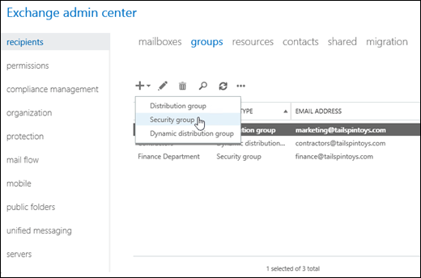
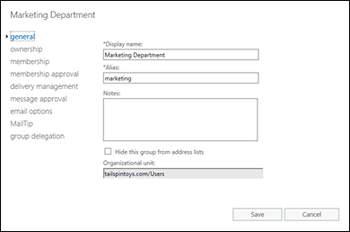

# Manage mail-enabled security groups in Exchange 2016

 **Summary**: Learn how to create and manage mail-enabled security groups in Exchange 2016.
  
You can use mail-enabled security groups to distribute messages as well as grant access permissions to resources in Exchange and Active Directory. You can create, modify, and remove mail-enabled security groups in the Exchange admin center (EAC) or in the Exchange Management Shell. For more information about mail-enabled security groups, see [Recipients](http://technet.microsoft.com/library/40300ed4-85a5-463d-bb3a-cf787bd44e9d.aspx).
  
## What do you need to know before you begin?

- Estimated time to complete each procedure: 5 minutes.
    
- For more information about accessing and using the EAC, see [Exchange admin center in Exchange 2016](../architecture/client-access/exchange-admin-center.md).
    
- To learn how to open the Exchange Management Shell in your on-premises Exchange organization, see **Open the Exchange Management Shell**.
    
- If you add users to or remove users from a mail-enabled security group, the users need to log out and log in for the permission changes to take effect.
    
- For mail-enabled security groups, users can't add or remove themselves from the group, nor can they send requests to the group owners to join or leave the group. A group owner needs to manually add and remove group members from a mail-enabled security group.
    
- You need to be assigned permissions before you can perform this procedure or procedures. To see what permissions you need, see the "Distribution groups" entry in the [Recipients Permissions](../permissions/feature-permissions/recipient-permissions.md) topic. 
    
- For information about keyboard shortcuts that may apply to the procedures in this topic, see [Keyboard shortcuts in the Exchange admin center](../about-documentation/eac-keyboard-shortcuts.md).
    
> [!TIP]
> Having problems? Ask for help in the Exchange forums. Visit the forums at: [Exchange Server](https://go.microsoft.com/fwlink/p/?linkId=60612), [Exchange Online](https://go.microsoft.com/fwlink/p/?linkId=267542), or [Exchange Online Protection](https://go.microsoft.com/fwlink/p/?linkId=285351).. 
  
## Create mail-enabled security groups

- When you create groups in the EAC, the value of the **Display name** property is used for the value of the unseen **Name** property (the unique identifier for the group object in the forest). Because the value of **Name** has a maximum length of 64 characters, the value of **Display name** also has a maximum length of 64 characters when you create groups in the EAC. 
    
- When you create groups in the Exchange Management Shell, the  _Name_ parameter is required, the value must be unique, and the value has a maximum length of 64 characters. The  _DisplayName_ parameter is optional (the value of  _Name_ is used if you don't use it), the value isn't required to be unique, and the value has a maximum length of 256 characters. 
    
- When you create groups in the EAC, the groups are automatically configured to only accept messages from authenticated (internal) senders. When you create groups in the Exchange Management Shell, you can use the  _RequireSenderAuthenticationEnabled_ parameter with the value  `$false` so the group can accept messages from authenticated an unauthenticated (internal and external) senders. After you create the group, you can use the EAC or the Exchange Management Shell to change this setting. 
    
### Use the EAC to create a mail-enabled security group

1. In the EAC, go to **Recipients** \> **Groups**.
    
2. Click **New** and then select **Security group** in the drop down list that appears. 
    
  
3. On the **New security group** page that opens, configure these settings (values marked with an **\*** are required): 
    
  - **\* Display name**: This value should help users immediately recognize what the group is used for. This name appears in the global address list, on the To: line when email is sent to this group, and in the **Groups** list in the EAC. The maximum length in the EAC is 64 characters, and the value must be unique. 
    
    > [!NOTE]
    > If a group naming policy is applied, you need to follow the naming constraints that are enforced for your organization. For more information, see [Create a Distribution Group Naming Policy](http://technet.microsoft.com/library/b2ffb654-345d-4be1-be8e-83d28901373e.aspx). If you want to override your organization's group naming policy, see [Override a Distribution Group Naming Policy](http://technet.microsoft.com/library/9eb23fc9-3f59-4d09-9077-85c89a051ee0.aspx). 
  
  - **\* Alias**: This value is used to generate the primary email address ( _\<alias\>_@ _\<domain_\>). This value can contain letters, numbers and the characters !, #, $, %, &amp;, ', \*, +, -, /, =, ?, ^, _, `, {, |, } and ~. Periods (.) are allowed, but each period must be surrounded by other valid characters (for example, help.desk). Unicode characters from U+00A1 to U+00FF are also allowed, but are mapped to best-fit US-ASCII text characters in the primary email address (for example, U+00F6 (ö) is changed to oe). The alias can't exceed 64 characters and must be unique in the forest. When a user types the alias on the To: line of an email message, it resolves to the group's display name.
    
  - **Notes**: Use this box to describe the purpose of the group. This description appears in the global address list and in the details pane in the EAC.
    
  - **Organizational unit**: The default location in Active Directory depends on the recipient scope that's configured:
    
  - If the recipient scope is the Active Directory forest, the default location is the Users container in the domain where the computer that's running the EAC is located.
    
  - If the recipient scope is a specific domain, the default location is the Users container in that domain.
    
  - If the recipient scope is a specific organizational unit (OU), the default location is that OU.
    
    To select a different OU, click **Browse**. The **Select an organizational unit** dialog box that opens shows all of the available OUs in the forest that are within the specified recipient scope. Select the desired OU, and then click **OK**.
    
  - **\* Owners**: By default, the person who creates the group is the owner. All groups must have at least one owner. Group owners can:
    
  - Modify the properties of the group
    
  - Add or remove group members
    
  - Delete the group
    
  - Approve messages sent to the group (if moderation is enabled)
    
    To add owners, click **Add**. In the **Select Owners** dialog that appears, select one or more owners, click **Add**, and then click **OK**.
    
    To remove owners, select the owner in the list, and then click **Remove**.
    
  - **Members**
    
    To add members to the group, click **Add**. In the **Select Members** dialog that appears, select one or more members, click **Add**, and then click **OK**.
    
    To remove members, select the member in the list, and then click **Remove**.
    
  - **Add group owners as members**: When this check box is selected, you don't need to manually include group owners in the list of members. If you don't want the group owners to be members of the group, clear this check box.
    
  - **Owner approval is required**: For mail-enabled security groups, user requests to join the group aren't sent to the group owners, regardless of the state of this check box (selected or not selected). A group owner needs to manually add and remove group members from a mail-enabled security group.
    
    When you've finished, click **Save**.
    
### Use the Exchange Management Shell to create a mail-enabled security group

To create a mail-enabled security group, use this syntax:
  
```
New-DistributionGroup -Type Security -Name <UniqueName> [-IgnoreNamingPolicy] [-Alias <Alias>] [-DisplayName "<DisplayName>"] [-Notes "<Description>"] [-OrganizationalUnit <OU>] [-ManagedBy "<owner1>","<owner2>"...] [-Members "<member1>","<member2>"...] [-CopyOwnerToMember] [-MemberJoinRestriction <Closed | ApprovalRequired>] [-RequireSenderAuthenticationEnabled <$true | $false>]
```

This example creates a security group with these settings:
  
- **Name**: File Server Managers. This value is also used for the display name because we aren't using the  _DisplayName_ parameter. If a group naming policy is applied, you can use the  _IgnoreNamingPolicy_ switch to override the policy. 
    
- **Alias**: fsadmin. If we didn't use the  _Alias_ parameter, the value of the  _Name_ parameter would be used, with spaces removed (FileServerManagers in this example). 
    
- **Description**: None, because we aren't using the  _Notes_ parameter. 
    
- **Organizational Unit**: The default location that's specified by the recipient scope, because we aren't using the  _OrganizationalUnit_ parameter. 
    
- **Owners**: The user account that's creating the group is the only owner, because we aren't using the  _ManagedBy_ parameter. 
    
- **Members**: Bishamon Tamura and Valeria Barrios. Because we're using the  _CopyOwnerToMember_ switch, the group owner is also a member. 
    
- **User requests to join the group**: For mail-enabled security groups, user requests to join the group aren't sent to the group owners, regardless of the  _MemberJoinRestriction_ parameter value (  `ApprovalRequired` or  `Closed`). A group owner needs to manually add and remove group members from a mail-enabled security group.
    
- **Accept messages from external senders**: No, because we're aren't using the  _RequireSenderAuthenticationEnabled_ parameter, and the default value is  `$true`.
    
```
New-DistributionGroup -Type Security -Name "File Server Managers" -Alias fsadmin -Members "Bishamon Tamura","Valeria Barrios" -CopyOwnerToMember
```

For detailed syntax and parameter information, see [New-DistributionGroup](http://technet.microsoft.com/library/7446962a-cf07-47a1-90d8-45df44057065.aspx).
  
### How do you know this worked?

To verify that you've successfully created a mail-enabled security group, do any of these steps:
  
- In the EAC, go to **Recipients** \> **Groups**. Verify that the group is listed, and the **Group Type** value is **Security group**.
    
- In the Exchange Management Shell, run this command and verify that the group is listed:
    
  ```
  Get-DistributionGroup -Filter {RecipientType -eq 'MailUniversalSecurityGroup'}
  ```

- In the Exchange Management Shell, replace  _\<GroupIdentity\>_ with the identity of the group (for example, name, alias, or email address), and run this command to verify the property values: 
    
  ```
  Get-DistributionGroup -Identity <GroupIdentity> | Format-List
  ```

## View or modify mail-enabled security groups

- When you modify groups in the EAC, the maximum length for the **Display name** property is now 256 characters, and the value doesn't need to be unique. This value no longer affects the value of the unseen **Name** property (the unique identifier for the group object in the forest). You can't use the EAC to modify the **Name** value of an existing group. 
    
- When you modify groups in the Exchange Management Shell, the maximum length for the  _Name_ parameter value is still 64 characters, and the value must be unique. The maximum length for the  _DisplayName_ parameter value is still 256 characters, and the value doesn't need to be unique. 
    
### Use the EAC to view or modify a mail-enabled security group

1. In the EAC, go to **Recipients** \> **Groups**.
    
2. In the list of groups, find the mail-enabled security group that you want to view or modify. You can:
    
  - Scroll through the list of groups.
    
  - Click **Search** and enter part of the group's name, email address, or alias. 
    
  - Click **More options** \> **Advanced search** to find the group. 
    
  - Click the **Group Type** column header to sort the groups by **Security group**.
    
    Once you've found the mail-enabled security group that you want to modify, select it, and then click **Edit**.
    
3. On the **Edit Security Group** page that opens, click one of the tabs to view or change the settings of the group: 
    
  - [General](#General.md)
    
  - [Ownership](#ownership.md)
    
  - [Membership](#membership.md)
    
  - [Membership approval](#membershipapproval.md)
    
  - [Delivery management](#deliverymanagement.md)
    
  - [Message approval](#messageapproval.md)
    
  - [Email options](#emailoptions.md)
    
  - [MailTip](#mailtip.md)
    
  - [Group delegation](#groupdelegation.md)
    

  
    When your finished, click **Save** or **Cancel**.
    
#### General
<a name="general"> </a>

Use this tab to view or change basic information about the group.
  
- **Display name**: This value should help users immediately recognize what the group is used for. This name appears in the global address list, on the To: line when email is sent to this group, and in the **Groups** list in the EAC. The maximum length is 256 characters, and the value doesn't need to be unique. 
    
- **Alias**: This value is used to generate the primary email address ( _\<alias\>_@ _\<domain_\>). This value can contain letters, numbers and the characters !, #, $, %, &amp;, ', \*, +, -, /, =, ?, ^, _, `, {, |, } and ~. Periods (.) are allowed, but each period must be surrounded by other valid characters (for example, help.desk). Unicode characters from U+00A1 to U+00FF are also allowed, but are mapped to best-fit US-ASCII text characters in the primary email address (for example, U+00F6 (ö) is changed to oe). The alias can't exceed 64 characters and must be unique in the forest. When a user types the alias on the To: line of an email message, it resolves to the group's display name.
    
    When you change the alias value, the previous primary email address is kept as a proxy address for the group.
    
- **Notes**: Use this box to describe the purpose of the group. This description appears in the global address list and in the details pane in the EAC.
    
- **Hide this group from address lists**: Select this check box if you don't want users to see the group in the global address list. If this check box is selected, a sender has to know and type the group's alias or email address to send messages to the group.
    
- **Organizational unit**: This read-only box displays the location of the group object in Active Directory. You need to use Active Directory Users and Computers to move the group to a different OU.
    
#### Ownership
<a name="Ownership"> </a>

Use this section to assign group owners. All groups must have at least one owner. Group owners can:
  
- Modify the properties of the group
    
- Add or remove group members
    
- Delete the group
    
- Approve member depart or join requests (if available)
    
- Approve messages sent to the group (if moderation is enabled)
    
To add owners, click **Add**. In the **Select Owners** dialog that appears, select one or more owners, click **Add**, and then click **OK**.
  
To remove owners, select the owner in the list, and then click **Remove**.
  
#### Membership
<a name="membership"> </a>

Use this tab to add or remove group members. Group owners aren't required to be members of the group.
  
To add members to the group, click **Add**. In the **Select Members** dialog that opens, select one or more members, click **Add**, and then click **OK**.
  
To remove members, select the member in the list, and then click **Remove**.
  
#### Membership approval
<a name="membershipapproval"> </a>

For mail-enabled security groups, user requests to join the group aren't sent to the group owners, regardless of the state of the **Owner approval is required** check box (selected or not selected). A group owner needs to manually add or remove group members from a mail-enabled security group. 
  
#### Delivery management
<a name="deliverymanagement"> </a>

Use this tab to control who's allowed to send messages to the group.
  
- **Only senders inside my organization**: The group only accepts messages from authenticated (internal) senders. This is the default setting.
    
- **Senders inside and outside of my organization**: The group accepts messages from authenticated and unauthenticated (internal and external) senders.
    
- Restrict the internal senders who can send messages to the group by clicking **Add**. In the **Select Allowed Senders** dialog that appears, select one or more senders, click **Add**, and then click **OK**. Only the specified senders can send messages to the group.
    
    To remove internal senders that are allowed to send messages to the group, select the sender in the list, and then click **Remove**.
    
> [!IMPORTANT]
> Mail contacts are always considered unauthenticated (external) senders. If you select **Only senders inside my organization** and add the mail contact to the list of approved internal senders, messages sent to the group by the mail contact will be rejected. 
  
#### Message approval
<a name="messageapproval"> </a>

Use this tab to configure the moderation settings for messages that are sent to the group.
  
- **Messages sent to this group have to be approved by a moderator**: This check box isn't selected by default. If you select this check box, messages that are sent to the group must be approved by the specified moderators before they're delivered to the group members. When you select this option, you can configure these additional settings:
    
  - **Group moderators**: For mail-enabled security groups, the group owners aren't automatically used as moderators. You need to specify at least one moderator here when moderation is enabled.
    
    To add moderators, click **Add**. In the **Select Group Moderators** dialog that appears, select one or more moderators (which can include any of the group owners), click **Add**, and then click **OK**.
    
    To remove moderators, select the moderator in the list, and then click **Remove**.
    
  - **Senders who don't require message approval**: To configure senders who can bypass moderation for the group (send messages directly to the group members), click **Add**. In the **Select Senders** dialog that appears, select one or more senders, click **Add**, and then click **OK**.
    
    To remove senders, select the sender in the list, and then click **Remove**.
    
    You don't need to include moderators in the list of senders who bypass moderation. Messages that are sent to the group by a moderator aren't moderated.
    
  - **Select moderation notifications**: This setting configures how message senders are notified when their messages aren't approved by a moderator:
    
  - **Notify all senders when their messages aren't approved**: Authenticated and unauthenticated (internal and external) senders are notified when their messages aren't approved by a group moderator. This is the default value.
    
  - **Notify senders in your organization when their messages aren't approved**: Only authenticated (internal) senders are notified when their messages aren't approved by a group moderator.
    
  - **Don't notify anyone when a message isn't approved**: Senders aren't notified when their messages aren't approved by a group moderator.
    
#### Email options
<a name="emailoptions"> </a>

Use this tab to view or change the email addresses that are configured for the group.
  
- **Email address**: By default, you use this setting to add additional email addresses for the group (also known as proxy addresses).
    
    By default, the primary email address (also known as the Reply To or reply address) is configured by the email address policy that's applied to the group. For more information about email address policies, see [Email address policies in Exchange 2016](../email-addresses-and-address-books/email-address-policies/email-address-policies.md). The primary email address that's shown here is bold, and has the uppercase **SMTP** value in the **Type** column. 
    
    To manually specify the group's primary email address here, you need to clear the check box **Automatically update email addresses based on the email address policy applied to this recipient**. Note that clearing this check box prevents automatic updates to the email addresses of the group by email address policies.
    
  - To add a new email address for the group, click ** Add **. In the **New email address** page that opens, select one of these options: 
    
  - **Email address type**: Select **SMTP**. In the **Email address** box, type the email address (for example, helpdesk@contoso.com). The domain must be an accepted domain that's configured for your organization. For more information, see [Accepted domains in Exchange 2016](../mail-flow/accepted-domains/accepted-domains.md).
    
  - On the previous page, if you left **Automatically update email addresses based on the email address policy applied to this recipient** check box selected, the email address is added to the group as a proxy address (there's no **Make this the reply address** check box on this page). 
    
  - On the previous page, if you cleared the **Automatically update email addresses based on the email address policy applied to this recipient** check box, you can select **Make this the reply address**. This setting adds the new email address as the primary email address, and the previous primary email address is kept as a proxy address. If you don't select **Make this the reply address**, the email address is added as a proxy address, and the primary email address is unaffected.
    
  - **Email address type**: Select **Enter a custom address type**. Type the custom email address type (for example, X400). In the **Email address** box, type the custom email address. 
    
    **Note**: With the exception of X.400 addresses, Exchange doesn't validate custom email addresses for correct formatting. You need to make sure that the custom email address complies with the format requirements for that address type.
    
    When you're finished, click **OK**.
    
  - To modify an existing email address for the group, select it in the list, and then click **Edit**. Note that you can't change the email address type, just the email address.
    
  - To remove an existing email address from the group, select it in the list, and then click **Remove**. Note that you can't remove the primary email address.
    
#### MailTip
<a name="mailtip"> </a>

Use this tab to add a custom MailTip for the group. MailTips alert users to potential issues before they send a message to the group. For more information about MailTips, see [Configure Custom MailTips for Recipients](http://technet.microsoft.com/library/df8ee7ae-2486-4890-b057-cda87b4cb1ec.aspx).
  
> [!NOTE]
> MailTips can include HTML tags, but scripts aren't allowed. The length of a custom MailTip can't exceed 175 displayed characters. HTML tags aren't counted in the limit. 
  
#### Group delegation
<a name="groupdelegation"> </a>

Use this tab to assign permissions to the group for a user (called a  *delegate*  ). 
  
- **Send As**: The specified users can send messages that appear to be sent by the group. The actual sender isn't revealed, and replies to these messages are delivered to the group.
    
- **Send on Behalf**: The specified users can send on behalf of the group. Although messages send on behalf of the group clearly show the sender in the From line ( _\<Sender\>_ on behalf of  _\<Group\>_), replies to these messages are delivered to the group, not the sender.
    
To add delegates, click **Add** for the appropriate permission. In the resulting dialog that appears, select one or more delegates, click **Add**, and then click **OK**.
  
After you assign one of these permissions, the delegate can select the group for the **From** line in Outlook or Outlook on the web (formerly known as Outlook Web App). 
  
To remove delegates, select the delegate in the appropriate list, and then click **Remove**.
  
### Use the Exchange Management Shell to modify a mail-enabled security group

You use the **Set-DistributionGroup** cmdlet to modify mail-enabled security groups. Here are some interesting settings that you can configure using the **Set-DistributionGroup** cmdlet that aren't available in the EAC or on the **New-DistributionGroup** cmdlet: 
  
- Configure values for the **CustomAttribute1** through **CustomAttribute15** properties (the  _CustomAttribute1_ through  _CustomAttribute15_ parameters). 
    
- Configure MailTips in different languages (the  _MailTipTranslations_ parameter). 
    
- Configure the maximum message size that can be sent to or sent from the group (the  _MaxReceiveSize_ and  _MaxSendSize_ parameters). 
    
- Instead of specifying the internal recipients who  *are*  allowed to send messages to the group, you can specify the internal recipients who  *aren't*  allowed to send messages to the group (the  _RejectMessagesFromSendersOrMembers_ parameter). 
    
For detailed syntax and parameter information, see [Set-DistributionGroup](http://technet.microsoft.com/library/e3a8c709-770a-4900-9a57-adcf0d98ff68.aspx).
  
This example configures the value DoNotMigrate for the **CustomAttribute5** property of the group named Experimental Project. 
  
```
Set-DistributionGroup -Identity "Experimental Project" -CustomAttribute5 DoNotMigrate
```

This example adds the Spanish translation for the existing English MailTip, "Please allow 4 business days for a response to messages sent to this group" that's configured on the mail-enabled security group events@contoso.com.
  
```
Set-DistributionGroup -Identity events@contoso.com -MailTipTranslations @{Add="ES:Espere 4 días hábiles para responder a los mensajes enviados a este grupo."}
```

### How do you know this worked?

To verify that you've successfully modified a mail-enabled security group, do any of these steps:
  
- In the EAC, go to **Recipients** \> **Groups** \> select the mail-enabled security group (the **Group Type** value is **Security group**) \> click **Edit** and verify the property values. 
    
- In the Exchange Management Shell, replace  _\<GroupIdentity\>_ with the identity of the group (for example, name, alias, or email address), and run this command to verify the property values: 
    
  ```
  Get-DistributionGroup -Identity <GroupIdentity> | Format-List
  ```

### Use the Exchange Management Shell to view mail-enabled security groups

You use the **Get-DistributionGroup** cmdlet to view mail-enabled security groups. 
  
This example returns a summary list of all security groups in the organization.
  
```
Get-DistributionGroup -ResultSize unlimited -Filter {(RecipientTypeDetails -eq 'MailUniversalSecurityGroup')}
```

This example returns detailed information for the mail-enabled security group named Help Desk.
  
```
Get-DistributionGroup -Identity "Help Desk" | Format-List
```

For detailed syntax and parameter information, see [Get-DistributionGroup](http://technet.microsoft.com/library/d84f5670-f3ac-4d63-a6ac-af9de67677c5.aspx).
  
## Remove mail-enabled security groups

### Use the EAC to remove a mail-enabled security group

1. In the EAC, go to **Recipients** \> **Groups**.
    
2. In the list of groups, find the security group that you want to remove. You can:
    
  - Scroll through the list of groups.
    
  - Click **Search** and enter part of the group's name, email address, or alias. 
    
  - Click **More options** \> **Advanced search** to find the group. 
    
  - Click the **Group Type** column header to sort the groups by **Security group**.
    
    Once you've found the security group that you want to remove, select it, click **Delete**, and then click **Yes** in the warning message that appears. 
    
### Use the Exchange Management Shell to remove a mail-enabled security group

To remove a mail-enabled security group, use this syntax:
  
```
Remove-DistributionGroup -Identity <GroupIdentity>
```

This example removes the mail-enabled security group that has the alias value contractors.
  
```
Remove-DistributionGroup -Identity contractors
```

### How do you know this worked?

To verify that you've successfully removed a mail-enabled security group, do any of these steps:
  
- In the EAC, go to **Recipients** \> **Groups**, and verify that the group isn't listed. Note that you might need to click **Refresh**.
    
- In the Exchange Management Shell, run this command and verify that the group isn't listed:
    
  ```
  Get-DistributionGroup -Filter {RecipientType -eq 'MailUniversalSecurityGroup'}
  ```

- In the Exchange Management Shell, replace  _\<GroupIdentity\>_ with the identity of the group (for example, name, alias, or email address), and run this command to verify that the group isn't returned: 
    
  ```
  Get-DistributionGroup -Identity <GroupIdentity> | Format-List
  ```

- In the Exchange Management Shell, run this command and verify that the group is listed:
    
  ```
  Get-Group -Filter {RecipientTypeDetails -eq 'UniversalSecurityGroup'}
  ```

## Mail-enable or mail-disable existing security groups

To mail-enable an existing universal security group that's not already mail-enabled, or to mail-disable an existing mail-enabled security group, you can't use the EAC. You can only use the Exchange Management Shell.
  
### Use the Exchange Management Shell to mail-enable an existing security group

To mail-enable an existing universal security group, use this syntax:
  
```
Enable-DistributionGroup -Identity <GroupIdentity> [-Alias <Alias>] [-DisplayName <DisplayName>] [-PrimarySMTPAddress <EmailAdddress>]
```

This example mail-enables the existing universal security group named Help Desk with the following settings:
  
- **Alias**: hdesk. If we didn't use the  _Alias_ parameter, the value of the  _Name_ parameter would be used, with spaces removed (HelpDesk in this example). 
    
- **Display name**: Because we aren't using the  _DisplayName_ parameter, the group's existing **Name** property value is used for the display name. 
    
- **Primary email address**: Because we're using the  _Alias_ parameter, the group's primary email address is  _\<alias\>_@ _\<domain\>_, where \<domain\> is specified by the email address policy that applies to the group. If we specified a value for the  _PrimarySMTPAddress_ parameter, the **EmailAddressPolicyEnabled** property would be set to the value  `$false`, which means the email addresses of the group aren't automatically updated by email address policies.
    
```
Enable-DistributionGroup -Identity "Help Desk" -Alias hdesk
```

After you mail-enable the security group, the group will be visible to all other **\*-DistributionGroup** cmdlets. 
  
For detailed syntax and parameter information, see [Enable-DistributionGroup](http://technet.microsoft.com/library/7a218aaf-5858-48d6-885d-5eed12885c44.aspx).
  
#### How do you know this worked?

To verify that you've successfully mail-enabled an existing security group, do any of these steps:
  
- In the EAC, go to **Recipients** \> **Groups**. Verify that the group is listed, and the **Group Type** value is **Security group**. Note that you might need to click **Refresh** if the EAC was already open. 
    
- In the Exchange Management Shell, run this command and verify that the group is listed:
    
  ```
  Get-DistributionGroup -Filter {RecipientType -eq 'MailUniversalSecurityGroup'}
  ```

- In the Exchange Management Shell, replace  _\<GroupIdentity\>_ with the identity of the group (for example, name, alias, or email address), and run this command to verify the property values: 
    
  ```
  Get-DistributionGroup -Identity <GroupIdentity> | Format-List
  ```

### Use the Exchange Management Shell to mail-disable an existing mail-enabled security group

To mail-disable an existing mail-enabled universal security group, use this syntax:
  
```
Disable-DistributionGroup -Identity <GroupIdentity> [-IgnoreDefaultScope]
```

This example mail-disables the mail-enabled security group named Human Resources.
  
```
Disable-DistributionGroup -Identity "Human Resources"
```

 **Notes**:
  
- If the distribution group isn't visible to you because of a restricted recipient scope, you'll need to use the  _IgnoreDefaultScope_ switch to see all groups in the Active Directory forest. But, when you use this switch, you'll need to identify the group by its distinguished name (DN). For example,  `"CN=<Group Name>,CN=North America,CN=Users,DC=contoso,DC=com"`.
    
- After you mail-disable the security group, the group will be invisible to all **\*-DistributionGroup** cmdlets except **Enable-DistributionGroup**. 
    
For detailed syntax and parameter information, see [Disable-DistributionGroup](http://technet.microsoft.com/library/4e042d49-0cec-4b7d-aa64-fc9605077714.aspx).
  
#### How do you know this worked?

To verify that you've successfully mail-disabled an existing mail-enabled universal security group, do any of these steps:
  
- In the EAC, go to **Recipients** \> **Groups**, and verify that the group isn't listed. Note that you might need to click **Refresh** if the EAC was already open. 
    
- In the Exchange Management Shell, run this command and verify that the group isn't listed:
    
  ```
  Get-DistributionGroup -Filter {RecipientType -eq 'MailUniversalSecurityGroup'}
  ```

- In the Exchange Management Shell, replace  _\<GroupIdentity\>_ with the name of the group, and run this command to verify that the group isn't returned: 
    
  ```
  Get-DistributionGroup -Identity <GroupIdentity> | Format-List
  ```

- In the Exchange Management Shell, run this command and verify that the group is listed:
    
  ```
  Get-Group -Filter {RecipientTypeDetails -eq 'UniversalSecurityGroup'}
  ```


