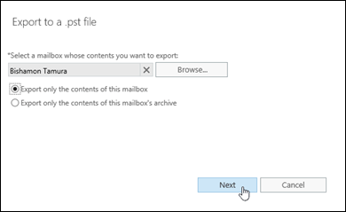
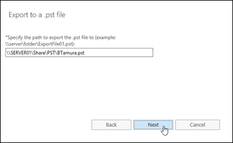

# Procedures for mailbox exports to .pst files in Exchange 2016

 **Summary**: Learn how administrators can view, create, modify, delete, suspend and resume requests to export mailboxes to .pst files in Exchange 2016.
  
Mailbox export requests use the Microsoft Exchange Mailbox Replication service (MRS) to export the contents of mailboxes to .pst files. For more information, see [Mailbox imports and exports in Exchange 2016](mailbox-import-and-export.md).
  
This topic shows you how to:
  
- Create mailbox export requests.
    
- View mailbox export requests.
    
- Modify mailbox export requests that haven't completed.
    
- Suspend mailbox export requests that haven't completed or failed.
    
- Resume suspended or failed mailbox export requests
    
- Remove mailbox export requests.
    
## What do you need to know before you begin?

> [!IMPORTANT]
> The procedures in this topic require the Mailbox Import Export role, which isn't assigned to any role groups by default. To assign the role to a role group that you belong to, see [Add a role to a role group](../../permissions/role-groups.md#AddRemoveRGRole). Note that changes in permission require you to log off and log on for the changes to take effect.
  
- Estimated time to complete each procedure: 5 minutes
    
- You need to export mailboxes to .pst files on a UNC network share (\\ _\<Server\>_\ _\<Share\>_\ or \\ _\<LocalServerName\>_\c$\). The Exchange Trusted Subsystem security group requires the Read/Write permission to the network share. If the share doesn't have this permission, you'll get errors when you try to export mailboxes to .pst files.
    
- You can create mailbox export requests in the Exchange admin center (EAC) or in the Exchange Management Shell. All other procedures can only be done in the Exchange Management Shell. For more information about accessing and using the EAC, see [Exchange admin center in Exchange 2016](../../architecture/client-access/exchange-admin-center.md). To learn how to open the Exchange Management Shell in your on-premises Exchange organization, see **Open the Exchange Management Shell**.
    
- For information about keyboard shortcuts that may apply to the procedures in this topic, see [Keyboard shortcuts in the Exchange admin center](../../about-documentation/exchange-admin-center-keyboard-shortcuts.md).
    
> [!TIP]
> Having problems? Ask for help in the Exchange forums. Visit the forums at: [Exchange Server](https://go.microsoft.com/fwlink/p/?linkId=60612), [Exchange Online](https://go.microsoft.com/fwlink/p/?linkId=267542), or [Exchange Online Protection](https://go.microsoft.com/fwlink/p/?linkId=285351).
  
## Create mailbox export requests

### Use the EAC to create a mailbox export request

1. In the EAC, go to **Recipients** \> **Mailboxes** \> click **More options** , and select **Export to a PST file**.

    
  
2. The **Export to a .pst file** wizard opens. On the first page, select the source mailbox, and then select one of these options: 
    
    - **Export only the contents of this mailbox**
    
    - **Export only the contents of this mailbox's archive**
    
    
  
    When you're finished, click **Next**.
    
3. On the next page, enter the UNC path and filename of the target .pst file.

    
  
    When you're finished, click **Next**.
    
4. On the last page, configure one of these settings:
    
    - Leave the **Send email to the mailbox below when the .pst file has been exported** check box selected. Click **Browse** to add or remove notification recipients.
    
    - Clear the **Send email to the mailbox below when the .pst file has been exported** check box.
    
    
  
    When you're finished, click **Finish**.
    
### Use the Exchange Management Shell to create a mailbox export request

To create a mailbox export request, use this syntax:
  
```
New-MailboxExportRequest  [-Name <UniqueName>] -Mailbox <TargetMailboxIdentity> -FilePath <UNCPathToPST> [-IsArchive] [-SourceRootFolder <MailboxFolder>] [-TargetRootFolder <PSTFolder>] [-IncludeFolders <MailboxFolder1>,<MailboxFolder2>...] [-ExcludeFolders <MailboxFolder1>,<MailboxFolder2>...] [-ContentFilter <Filter>] [-Priority <PriorityValue>]
```

This example creates a new mailbox export request with these settings:
  
- **Mailbox export request name**: The default value `MailboxExport` is used, because we aren't using the _Name_ parameter. The unique identity of the mailbox export request is `<MailboxIdentity>\MailboxExportX` (_X_ is either not present, or has the value 0 to 9).
    
- **Source mailbox**: Valeria Barrios
    
- **Target .pst file**: \\SERVER01\PSTFiles\Vbarrios.pst
    
- **Content and folders**: Content in all folder paths in the source mailbox is replicated in the target .pst file.
    
- **Priority**: `Normal`, because we aren't using the _Priority_ parameter.
    
```
New-MailboxExportRequest -Mailbox "Valeria Barrios" -FilePath \\SERVER01\PSTFiles\Vbarrios.pst
```

This example creates a new mailbox export request with these settings:
  
- **Mailbox export request name**: The custom name Kathleen Reiter Export is specified by the _Name_ parameter. Specifying a custom name allows more than 10 mailbox export requests for the mailbox. The unique identity value of the mailbox export request is `<MailboxIdentity>\<MailboxExportRequestName>` (for example, `kreiter\Kathleen Reiter Export`).
    
- **Source mailbox**: The archive mailbox for Kathleen Reiter (Kathleen's primary mailbox alias is kreiter).
    
- **Target .pst file**: \\SERVER01\PSTFiles\Archives\Kathleen Reiter.pst
    
- **Content and folders**: Only content in the Inbox folder of the mailbox is exported (regardless of the localized name of the folder).
    
- **Priority**: `High`
    
```
New-MailboxExportRequest -Name "Kathleen Reiter Export" -Mailbox kreiter -FilePath "\\SERVER01\PSTFiles\Kathleen Reiter.pst" -IsArchive -IncludeFolders "#Inbox#" -Priority Hight
```

For detailed syntax and parameter information, see [New-MailboxExportRequest](http://technet.microsoft.com/library/1625c25a-7cc9-459c-97ea-281ac421bbce.aspx).
  
### How do you know this worked?

To verify that you've successfully created a mailbox export request, do any of these steps:
  
- In the EAC, click the notification viewer  to view the status of the request.
    
- If you created the mailbox export request in the EAC, and selected the option to send notification email messages, check the notification messages. The sender is Microsoft Exchange. The first message has the subject `Your Export PST request has been received`. If the export request completed successfully, you'll receive another message with the subject `Export PST has finished`.
    
- Replace _\<MailboxIdentity\>_ with the name, email address, or alias of the source mailbox, and run this command in the Exchange Management Shell to verify the basic property values: 
    
  ```
  Get-MailboxExportRequest -Mailbox "<MailboxIdentity>" | Format-List Name,FilePath,Mailbox,Status
  ```

- Replace _\<MailboxIdentity\>_ and _\<MailboxExportRequestName\>_ with the appropriate values, and run this command in the Exchange Management Shell to verify the details: 
    
  ```
  Get-MailboxExportRequestStatistics -Identity "<MailboxIdentity>\<MailboxExportRequestName>"
  ```

## Use the Exchange Management Shell to view mailbox export requests

By default, the **Get-MailboxExportRequest** cmdlet returns the name, source mailbox, and status of mailbox export requests. If you pipeline the command to the **Format-List** cmdlet, you'll only get a limited number of additional useful details: 
  
- **FilePath**: The target .pst file.
    
- **RequestGUID**: The unique GUID value of the mailbox export request.
    
- **RequestQueue**: The mailbox database that the export request is being run on.
    
- **BatchName**: The optional batch name for the mailbox export request.
    
- **Identity**: The unique identity value of the mailbox export request (_\<MailboxIdentity\>_\ _\<MailboxExportRequestName\>_).
    
By default, the **Get-MailboxExportRequestStatistics** cmdlet returns the name, status, alias of the source mailbox, and the completion percentage of mailbox export requests. If you pipeline the command to the **Format-List** cmdlet, you'll see detailed information about the mailbox export request.
  
This example returns the summary list of all mailbox export requests.
  
```
Get-MailboxExportRequest
```

This example returns additional information for mailbox export requests from the mailbox Akia Al-Zuhairi.
  
```
Get-MailboxExportRequest -Mailbox "Akia Al-Zuhairi" | Format-List
```

This example returns the summary list of in-progress mailbox export requests for mailboxes that reside on the mailbox database named DB01.
  
```
Get-MailboxExportRequest -Status InProgress -Database DB01
```

This example returns the summary list of completed mailbox export requests in the batch named Export DB01 PSTs.
  
```
Get-MailboxExportRequest -Status Completed -BatchName "Export DB01 PSTs"
```

For detailed syntax and parameter information, see [Get-MailboxExportRequest](http://technet.microsoft.com/library/f9372840-f387-4e4e-bf56-cf9c4f49d4cb.aspx).
  
To view detailed information about a mailbox export request, use this syntax:
  
```
Get-MailboxExportRequestStatistics -Identity <MailboxExportRequestIdentity> [-IncludeReport] | Format-List
```

Where _\<MailboxExportRequestIdentity\>_ is the identity value of the mailbox export request (_\<MailboxIdentity\>_\ _\<MailboxExportRequestName\>_ or _\<RequestGUID\>_).
  
This example returns detailed information for the mailbox export request named MailboxExport for Akia Al-Zuhairi's mailbox, including the log of actions in the **Report** property.
  
```
Get-MailboxExportRequestStatistics -Identity "aal-zuhairi\MailboxExport" -IncludeReport | Format-List
```

For detailed syntax and parameter information, see [Get-MailboxExportRequestStatistics](http://technet.microsoft.com/library/73c79d8c-d8c0-4389-a5ad-520c2c94909e.aspx).
  
## Use the Exchange Management Shell to modify mailbox export requests

You can modify mailbox export requests that haven't completed. You can't modify the fundamental settings of an existing request (for example, the source mailbox, target .pst file, the source content in the mailbox, or the destination in the target .pst file).
  
To modify a mailbox export request, use this syntax:
  
```
Set-MailboxExportRequest -Identity <MailboxIdentity>\<MailboxExportRequestName> [-BadItemLimit <value>] [-LargeItemLimit <value>] [-AcceptLargeDataLoss]
```

This example modifies the failed mailbox export request for the mailbox of Valeria Barrios to accept up to five corrupted mailbox items.
  
```
Set-MailboxExportRequest -Identity "Valeria Barrios\MailboxExport" -BadItemLimit 5
```

For detailed syntax and parameter information, see [Set-MailboxExportRequest](http://technet.microsoft.com/library/5a064940-f8c1-4ee7-822a-a6cfe483081e.aspx).
  
 **Note**: After you modify a suspended or failed mailbox export request, you need to resume it by using the **Resume-MailboxExportRequest** cmdlet.
  
### How do you know this worked?

To verify that you've successfully modified a mailbox export request, replace _\<MailboxIdentity\>_ and _\<MailboxExportRequestName\>_ with the appropriate values, and run this command in the Exchange Management Shell to verify the details: 
  
```
Get-MailboxExportRequestStatistics -Identity "<MailboxIdentity>\<MailboxExportRequestName>" | Format-List
```

## Use theExchange Management Shell to suspend mailbox export requests

You can suspend mailbox export requests that are in progress. You can't suspend completed or failed mailbox export requests.
  
To suspend a mailbox export request, use this syntax:
  
```
Suspend-MailboxExportRequest -Identity <MailboxIdentity>\<MailboxExportRequestName> [-SuspendComment "<Descriptive Comment>"]
```

This example suspends the mailbox export request from Kathleen Reiter's mailbox that's named Kathleen Reiter Export.
  
```
Suspend-MailboxExportRequest -Identity "kreiter@contoso.com\Kathleen Reiter Export"
```

This example suspends all in-progress mailbox export requests with the comment "OK to resume after 10 P.M. on Monday 6/19"
  
```
Get-MailboxExportRequest -Status InProgress | Suspend-MailboxExportRequest -SuspendComment "OK to resume after 10 P.M. on Monday 6/19"
```

For detailed syntax and parameter information, see [Suspend-MailboxExportRequest](http://technet.microsoft.com/library/3779c7b2-a25d-4213-bd20-fb58ba9d6925.aspx).
  
 **Notes**:
  
- You can also use the **New-MailboxExportRequest** cmdlet with the _Suspend_ switch to create a suspended mailbox export request.
    
- You use the **Resume-MailboxExportRequest** parameter to resume suspended mailbox export requests.
    
### How do you know this worked?

To verify that you've successfully suspended a mailbox export request, do any of these steps:
  
- Replace _\<MailboxIdentity\>_ with the name, email address, or alias of the source mailbox, run this command in the Exchange Management Shell, and verify that the **Status** property has the value `Suspended`:
    
  ```
  Get-MailboxExportRequest -Mailbox "<MailboxIdentity>" | Format-List Name,FilePath,Mailbox,Status
  ```

- Run this command in the Exchange Management Shell, and verify that the suspended mailbox export request is listed:
    
  ```
  Get-MailboxExportRequest -Status Suspended
  ```

## Use the Exchange Management Shell to resume mailbox export requests

You can resume suspended or failed mailbox export requests.
  
To resume a mailbox export request, use this syntax:
  
```
Resume-MailboxExportRequest -Identity <MailboxIdentity>\<MailboxExportRequestName>
```

This example resumes the failed mailbox export request for Valeria Barrios' mailbox.
  
```
Resume-MailboxExportRequest -Identity vbarrios\MailboxExport
```

This example resumes all suspended mailbox export requests.
  
```
Get-MailboxExportRequest -Status Suspended | Resume-MailboxExportRequest
```

For detailed syntax and parameter information, see [Resume-MailboxExportRequest](http://technet.microsoft.com/library/dba2880f-ac7c-40d4-8792-1bf30262142e.aspx).
  
### How do you know this worked?

To verify that you've successfully resumed a mailbox export request, replace _\<MailboxIdentity\>_ with the name, email address, or alias of the source mailbox, run this command in the Exchange Management Shell, and verify that the **Status** property doesn't have the value `Suspended`:
  
```
Get-MailboxExportRequest -Mailbox <MailboxIdentity> | Format-List Name,FilePath,Mailbox,Status
```

## Use the Exchange Management Shell to remove mailbox export requests

You can remove fully or partially completed mailbox export requests.
  
- If you remove a partially completed mailbox export request, the request is removed from the MRS job queue. Any content that's already been exported from the source mailbox isn't removed from the target .pst file.
    
- By default, completed mailbox export request are removed after 30 days (you can override this value with the _CompletedRequestAgeLimit_ parameter), and failed requests aren't automatically removed. But, if you use the _RequestExpiryInterval_ parameter when you create or modify a mailbox export request, these results are available: 
    
  - **RequestExpiryInterval with a timespan value**: Completed and failed requests are automatically removed after the specified timespan.
    
  - **RequestExpiryInterval with the value unlimited**: Completed and failed requests aren't automatically removed.
    
This example removes the mailbox export request named MailboxExport for Akia Al-Zuhairi's mailbox.
  
```
Remove-MailboxExportRequest -Identity "aal-zuhairi\MailboxExport"
```

This example removes all completed mailbox export requests.
  
```
Get-MailboxExportRequest -Status Completed | Remove-MailboxExportRequest
```

For detailed syntax and parameter information, see [Remove-MailboxExportRequest](http://technet.microsoft.com/library/a5b99fcc-1f79-4a31-b04a-610ff020450d.aspx).
  
### How do you know this worked?

To verify that you've successfully removed a mailbox export request, replace _\<MailboxIdentity\>_ with the name, email address, or alias of the source mailbox, run this command in the Exchange Management Shell, and verify that the mailbox export request isn't listed: 
  
```
Get-MailboxExportRequest -Mailbox <MailboxIdentity> | Format-List Name,FilePath,Mailbox,Status
```


